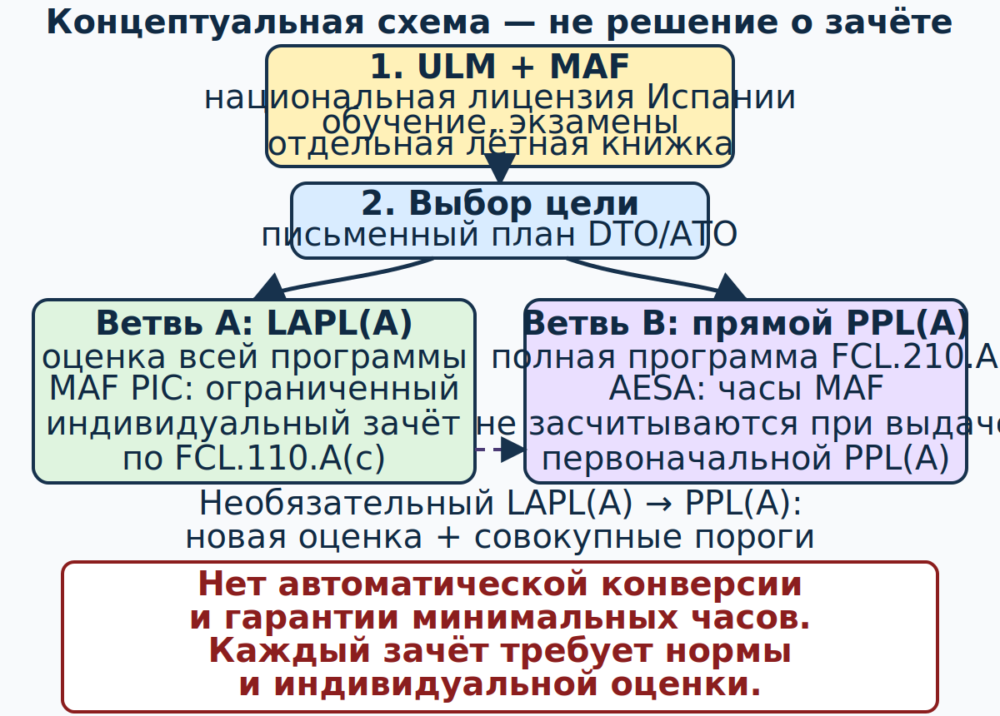

# Как учиться: сначала [MAF][maf] в Испании, затем выбранная лицензия [Part-FCL][part-fcl]

## Зачем нужна эта глава

Курс устроен не как справочник для чтения подряд, а как последовательность решений. Первая практическая цель — получить испанскую национальную лицензию пилота [ULM][ulm] с квалификационной отметкой [MAF][maf] и безопасно летать в Испании. Только после этого начинается отдельный официальный маршрут в [DTO][dto] или [ATO][ato]: [LAPL(A)][lapl] либо прямой [PPL(A)][ppl]. Возможный дальнейший переход [LAPL(A)][lapl] → [PPL(A)][ppl] — ещё один вариант, а не обязательная ступень.

Самостоятельный учебник помогает понять теорию, но не заменяет авторизованную школу, инструктора, медицинское освидетельствование, экзамен или текущие документы конкретного самолёта.

## Результаты обучения

После главы ученик сможет:

1. назвать три самостоятельных учебных этапа и не смешивать их документы;
2. отличить стабильное теоретическое знание от изменяемой предполётной информации;
3. вести журнал прогресса и журнал источников;
4. объяснить, почему сходство предметов [MAF][maf] и [Part-FCL][part-fcl] не является зачётом;
5. применять цикл «объяснить → решить → проверить → разобрать ошибку».

## Карта применимости

| Метка | Как использовать главу |
|---|---|
| [ULM — ОСНОВА][ulm] | Это первый учебный маршрут; завершайте его блоки до последующей дельты. |
| [ULM — ОСОБО ВАЖНО][ulm] | Не переносите числа и процедуры между разными самолётами. |
| [PART-FCL — ОБЩЕЕ][part-fcl] | После лицензии [ULM][ulm] изучите единый общий теоретический слой. |
| [LAPL — ПЕРЕХОД][lapl] | Отмечайте отдельные административные и лётные ворота [LAPL(A)][lapl]. |
| [PPL — РАСШИРЕНИЕ][ppl] | Отмечайте дополнительную глубину и прямой путь [PPL(A)][ppl]. |
| [ИСПАНИЯ] | Национальные правила проверяйте в BOE, [AESA][aesa] и [AIP][aip] España. |
| [БЕЗОПАСНОСТЬ] | Любое знание превращайте в решение, предел и действие при сомнении. |
| [ПРОВЕРИТЬ ПЕРЕД ПОЛЁТОМ] | Перепроверяйте динамические данные в день конкретного полёта. |

## Учебная последовательность {#norm-study-order}

1. **Этап A — [ULM][ulm]/[MAF][maf] в Испании.** Пройдите части 0–10 с приоритетом блоков [ULM — ОСНОВА][ulm], завершите официальный курс школы, национальную теорию и практическую проверку.
2. **Этап B — эксплуатационное закрепление.** Ведите отдельную лётную книжку [ULM][ulm], поддерживайте недавний опыт и учитесь принимать решения в реальных испанских условиях.
3. **Этап C — выбор.** Сравните [LAPL(A)][lapl] и прямой [PPL(A)][ppl] по медицинским требованиям, полномочиям, программе и дальнейшим целям.
4. **Этап D — официальный курс [Part-FCL][part-fcl].** Получите письменный план выбранной [DTO][dto]/[ATO][ato]. Повторите общую теорию, затем закройте лицензионную дельту.
5. **Необязательный этап E.** Если сначала выбран [LAPL(A)][lapl], позже возможен индивидуальный план [LAPL(A)][lapl] → [PPL(A)][ppl].

Это разделение следует национальному режиму RD 123/2015 и режиму [Part-FCL][part-fcl]; национальный экзамен не подменяет европейский. Источники: `SRC-BOE-RD-123-2015`, `SRC-EASA-AIRCREW-2026`, `SRC-AESA-LAPL-PPL-PROCEDURES` (проверено 13.07.2026).

## Метод одного занятия

### 1. Сформулировать вопрос

Не «прочитать воздушное право», а «смогу ли я по текущим документам доказать, что этот маршрут разрешён для моего самолёта, пилота и времени?» Один урок — один проверяемый результат.

### 2. Построить модель

Запишите своими словами причинную цепочку. Например: вид воздушного пространства → требуемое разрешение → оборудование → полномочия пилота → текущая информация. Если цепочка распадается, перечитайте объяснение, а не запоминайте ответ.

### 3. Решить без подсказки

Закройте текст и выполните вопрос или сценарий. Укажите не только вариант, но также правило, источник и безопасное действие. Ошибка, найденная дома, полезнее случайного правильного ответа.

### 4. Провести разбор

Для каждой ошибки запишите:

- что именно было перепутано;
- почему неверный вариант казался убедительным;
- где находится первичный источник;
- какой признак позволит распознать похожую ситуацию в полёте.

### 5. Повторить по интервалам

Повторяйте карточку через 1 день, 1 неделю и 1 месяц, но добавляйте новый контекст. Число без контекста быстро превращается в опасное правило «для всех случаев».

## Четыре раздельных журнала времени

С самого начала держите разные колонки:

| Колонка | Что записывать | Чего не делать |
|---|---|---|
| prior [ULM][ulm] [PIC][pic] | Время командиром в национальном режиме | Не переписывать как обучение [Part-FCL][part-fcl]. |
| обучение [Part-FCL][part-fcl] | Только время, принятое и оформленное [DTO][dto]/[ATO][ato] | Не создавать запись задним числом. |
| время после выдачи | Время после конкретной лицензии в соответствующем качестве | Не смешивать с prior experience. |
| опыт для поддержания полномочий | Только часы и события, допустимые применимым правилом | Не считать одну запись дважды без правового основания. |

Официальное разъяснение [AESA][aesa] требует отдельной лётной книжки [ULM][ulm] и запрещает одновременное дублирование одного полёта. Источник: `SRC-AESA-RD182-FAQ-2026` (проверено 13.07.2026).

## Как читать источник

### Слой 1: норма

Ищите применимый акт BOE или EUR-Lex, номер статьи и дату применимости. Консолидированный текст удобен, но акт изменения важен для проверки переходных положений.

### Слой 2: способ применения

AMC/GM [EASA][easa], процедуры [AESA][aesa] и официальные FAQ помогают понять процесс. FAQ не расширяет буквальный объём нормы.

### Слой 3: текущая эксплуатационная информация

[AIP][aip], [NOTAM][notam], погода, документы аэродрома, состояние борта и руководство конкретного самолёта проверяются заново. Учебный снимок от 13.07.2026 не является предполётным пакетом.

### Слой 4: решение

Если правило неясно, не достраивайте его по аналогии. Остановите планирование, задайте письменный вопрос школе, [DTO][dto]/[ATO][ato], [AESA][aesa] или соответствующему поставщику информации.

## Безопасность

!!! warning "Учебник не выдаёт полномочия"
    Знание ответа не разрешает самостоятельный полёт, вход в контролируемое пространство, использование радиосвязи или международный рейс. Нужны соответствующие документы, обучение, пригодный самолёт и текущая оперативная информация.

Для национальной лицензии [ULM][ulm]/[MAF][maf] этот курс рассматривает только полёты в Испании. За пределами Испании нельзя предполагать признание национальной лицензии; международные процедуры здесь намеренно не преподаются. Источник: `SRC-BOE-RD-765-2022` (проверено 13.07.2026).

## Типичные ошибки

1. Читать только ответы и не объяснять причинную цепочку.
2. Принимать минимальное число часов за гарантированную готовность.
3. Считать, что общая теория автоматически превращает национальный опыт в европейское обучение.
4. Хранить часы в одной таблице без статуса полёта.
5. Использовать старый скриншот карты или погоды как текущий документ.
6. Переходить к расширениям [PPL(A)][ppl], не закрыв основу [MAF][maf].

## Краткий конспект

- Первая цель — испанские [ULM][ulm]/[MAF][maf].
- Следующий выбор — [LAPL(A)][lapl] или прямой [PPL(A)][ppl].
- Каждый этап имеет собственные документы, экзамены и записи.
- Первичный источник важнее памяти и рекламного обещания.
- Вопрос считается освоенным только после объяснения правильного и опасного неверного решения.

## Контрольные вопросы

### Q-START-001 — Какой порядок соответствует цели курса?

A. Сначала [PPL(A)][ppl], затем обязательный [LAPL(A)][lapl], затем [MAF][maf]. 
B. Сначала [MAF][maf] в Испании, затем выбор [LAPL(A)][lapl] или прямого [PPL(A)][ppl]. 
C. Один экзамен [MAF][maf] одновременно выдаёт три лицензии. 
D. После самостоятельного чтения можно сразу выполнять полёты.

**Правильный ответ:** B.

**Почему:** Это утверждённая последовательность курса: национальный первый этап, затем отдельный выбор европейского маршрута.

**Почему главный отвлекающий вариант неверен:** A делает [LAPL(A)][lapl] обязательной ступенью, хотя прямой [PPL(A)][ppl] является самостоятельным выбором.

### Q-START-002 — Что делать с числом из учебной главы перед реальным полётом?

A. Считать неизменным для любого самолёта. 
B. Выбрать более удобное число из двух источников. 
C. Проверить применимость, текущую редакцию и документы конкретного борта. 
D. Округлить в пользу вылета.

**Правильный ответ:** C.

**Почему:** Правовое число требует актуальной редакции, а самолётное ограничение — текущего руководства конкретного борта.

**Почему главный отвлекающий вариант неверен:** A превращает контекстное значение в выдуманный универсальный предел.

### Q-START-003 — Как записывать один полёт [ULM][ulm]?

A. Одновременно продублировать в нескольких книжках. 
B. Внести в отдельную книжку [ULM][ulm] в правильном качестве полёта. 
C. Всегда считать обучением [Part-FCL][part-fcl]. 
D. Не записывать после выдачи лицензии.

**Правильный ответ:** B.

**Почему:** Раздельная и точная запись сохраняет доказуемость статуса времени и отвечает разъяснению [AESA][aesa].

**Почему главный отвлекающий вариант неверен:** A создаёт запрещённое одновременное дублирование и риск двойного счёта.

### Q-START-004 — Когда вопрос действительно разобран?

A. Когда угадан правильный вариант. 
B. Когда ученик может объяснить правило, источник, правильный ответ и ошибку главного отвлекающего варианта. 
C. Когда вопрос встречался дважды. 
D. Когда запомнилась буква ответа.

**Правильный ответ:** B.

**Почему:** Такой разбор переносит знание в новую ситуацию и выявляет ложную модель.

**Почему главный отвлекающий вариант неверен:** A не отличает знание от случайного угадывания.

## Источники

- `SRC-BOE-RD-123-2015` — национальное обучение и лицензия.
- `SRC-BOE-RD-765-2022` — эксплуатационная граница испанского режима.
- `SRC-AESA-RD182-FAQ-2026` — раздельная книжка и границы зачёта.
- `SRC-EASA-AIRCREW-2026` — действующая структура [Part-FCL][part-fcl].

[ulm]: ../reference/glossary.md#term-ulm
[maf]: ../reference/glossary.md#term-maf
[lapl]: ../reference/glossary.md#term-lapl-a
[ppl]: ../reference/glossary.md#term-ppl-a
[part-fcl]: ../reference/glossary.md#term-part-fcl
[dto]: ../reference/glossary.md#term-dto
[ato]: ../reference/glossary.md#term-ato
[pic]: ../reference/glossary.md#term-pic
[aip]: ../reference/glossary.md#term-aip
[notam]: ../reference/glossary.md#term-notam
[aesa]: ../reference/glossary.md#term-aesa
[easa]: ../reference/glossary.md#term-easa
