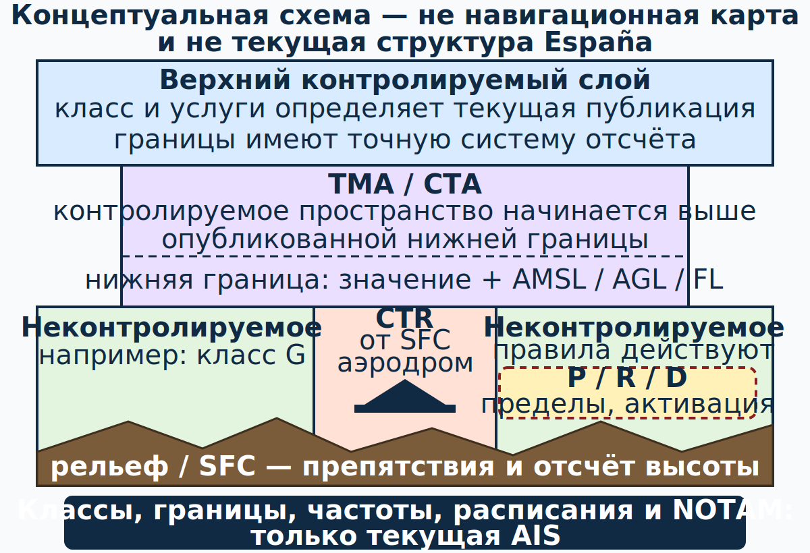

# Воздушное пространство Испании: классы, зоны и аэродромы {#airspace-spain}

## Зачем нужна эта глава {#purpose}

Цвет на электронной подвижной карте (moving map) не является разрешением. Пилот должен понимать вертикальные и горизонтальные границы, класс, обслуживающий орган, активность временной зоны и собственные полномочия. Схема этой главы концептуальна; текущую структуру даёт только официальная AIS. Источники: `SRC-EASA-SERA-2025`, `SRC-ENAIRE-AIP-ESPANA` (проверено 13.07.2026).

## Результаты обучения {#learning-outcomes}

Ученик сможет:

- описать классы A–G без принятия схемы за карту Испании;
- отличить контролируемое и неконтролируемое воздушное пространство;
- распознать CTR/TMA/CTA и вертикальную границу;
- объяснить запрещённые, ограниченные и опасные зоны;
- применить особое ограничение национальной лицензии [ULM][ulm].

## Карта применимости {#applicability}

| Метка | Как использовать главу |
|---|---|
| [ULM — ОСНОВА][ulm] | Планируйте первоначальные полёты вне [controlled airspace][controlled-airspace]. |
| [ULM — ОСОБО ВАЖНО][ulm] | Низкая масса не даёт исключения из границ или активных зон. |
| [PART-FCL — ОБЩЕЕ][part-fcl] | Классы и обслуживание ATS входят в общую последующую учебную программу. |
| [LAPL — ПЕРЕХОД][lapl] | Проверяйте вместе лицензию, радиосвязь, язык и возможности воздушного судна. |
| [PPL — РАСШИРЕНИЕ][ppl] | Общая теория LAPL/PPL охватывает диспетчерские разрешения, [flight plan][flight-plan] и процедуры контролируемого аэродрома; отдельно отмечайте только реальные различия выбранной ветви. |
| [ИСПАНИЯ] | Текущая структура публикуется в [AIP][aip] España ENR/AD. |
| [БЕЗОПАСНОСТЬ] | Ошибка на 100 ft или в единице высоты может привести к нарушению границы. |
| [ПРОВЕРИТЬ ПЕРЕД ПОЛЁТОМ] | Границы, часы активности и [NOTAM][notam] меняются. |

## Класс — это набор услуг и требований {#norm-airspace-classes}

Классы [SERA][sera] A–G концептуально задают допуск IFR/[VFR][vfr], требования [ATC clearance][atc-clearance], эшелонирование и информацию о движении:

| Класс | [VFR][vfr] | Общая идея обслуживания |
|---|---|---|
| A | не допускается | только IFR; все полёты под ATC и эшелонируются |
| B | допускается | IFR и [VFR][vfr] под ATC; все полёты эшелонируются |
| C | допускается | IFR эшелонируется от IFR/[VFR][vfr]; [VFR][vfr] — от IFR и получает информацию о движении [VFR][vfr] |
| D | допускается | IFR эшелонируется от IFR; [VFR][vfr] получает информацию о движении, эшелонирование от другого [VFR][vfr] не гарантируется |
| E | допускается | IFR под ATC и эшелонируется от IFR; [VFR][vfr] обычно не требует разрешения только в силу класса и получает информацию о движении насколько практически возможно |
| F | допускается | консультативное обслуживание IFR; полётно-информационное обслуживание по запросу |
| G | допускается | неконтролируемое пространство; полётно-информационное обслуживание по запросу |

Это учебное сравнение [SERA][sera], а не утверждение, что все классы используются в каждом районе Испании. Реальный класс и требования берутся из текущего [AIP][aip] и официальной карты. Источники: `SRC-EASA-SERA-2025`, `SRC-ENAIRE-AIP-ESPANA` (проверено 13.07.2026).

## Вертикальные и горизонтальные элементы {#airspace-spain-section-01}

- **CTR — диспетчерская зона (control zone):** [controlled airspace][controlled-airspace] от поверхности вокруг аэродрома.
- **CTA — диспетчерский район (control area):** [controlled airspace][controlled-airspace], начинающееся выше установленной нижней границы.
- **TMA — узловой диспетчерский район (terminal control area):** CTA для потоков к нескольким или крупным аэродромам.
- **Воздушная трасса (airway):** установленный коридор [controlled airspace][controlled-airspace].
- **FIR:** крупный район полётно-информационного и аварийного обслуживания; это не один класс от земли до верхней границы.

Читая подпись границы, всегда расшифруйте систему отсчёта: AMSL, AGL/SFC или эшелон полёта (flight level). Нарисуйте вертикальный профиль маршрута с рельефом, нижними/верхними границами и плановой высотой. Не сравнивайте FL с абсолютной высотой без учёта установки давления.

## [Controlled airspace][controlled-airspace] и национальный [ULM][ulm] {#norm-controlled-access}

Испанский [ULM][ulm] может входить в [controlled airspace][controlled-airspace] только при подходящем оборудовании воздушного судна, когда пилот имеет и реализует действующую эквивалентную лицензию [Part-FCL][part-fcl] нужной категории/класса. Национальные лицензия [ULM][ulm]/[MAF][maf] и [radiofonista (RTC)][rtc] без соответствующей лицензии [Part-FCL][part-fcl] недостаточны. Это национальное условие RD 765/2022 не означает, что [ATC clearance][atc-clearance] универсально требуется в каждом классе контролируемого пространства: по [SERA][sera].6001 полёт [VFR][vfr] в классе E сам по себе не требует диспетчерского разрешения. Радиосвязь, языковые полномочия, [flight plan][flight-plan] и диспетчерское разрешение выполняются, **когда это требуется классом, характером операции и текущим [AIP][aip]**. Источники: `SRC-BOE-RD-765-2022`, `SRC-BOE-RD-182-2026`, `SRC-EASA-SERA-2025` (RD 765/2022 art. 4.1(d); [SERA][sera].6001; проверено 13.07.2026).

Практическое правило первоначального этапа: планируйте маршрут в допустимом неконтролируемом воздушном пространстве и оставляйте навигационный буфер. Если маршрут требует входа в контролируемое пространство, это не задача обычных полномочий национального [MAF][maf].

## Контролируемый и неконтролируемый аэродром {#airspace-spain-section-02}

**Контролируемый аэродром (controlled aerodrome)** имеет аэродромное диспетчерское обслуживание для аэродромного движения. Пилот выполняет диспетчерские разрешения, указания и опубликованные процедуры. **Неконтролируемый аэродром (uncontrolled aerodrome)** не означает «без правил»: действуют опубликованная схема круга, местные процедуры, приоритеты, состояние ВПП, самоинформация и ответственность [PIC][pic] за предотвращение столкновения и решение.

Для использования конкретного аэродрома [ULM][ulm] проверьте:

1. допускает ли аэродром эту категорию;
2. требуется ли PPR;
3. часы работы и контакт;
4. полосу, поверхность, уклон и ограничения;
5. процедуры круга и снижения шума;
6. текущие [NOTAM][notam] и местные извещения;
7. топливо, стоянку и аварийное обеспечение.

Запись площадки в ENR 5.5 не является сама по себе разрешением её использовать. Источник: `SRC-ENAIRE-AIP-ESPANA` (ENR 5.5; состояние реестра проверено 13.07.2026, перед полётом перепроверить).

## Запрещённые, ограниченные и опасные зоны {#norm-special-use-airspace}

- **P — запрещённая зона (prohibited area):** полёт запрещён в опубликованных пределах, кроме прямо установленного исключения.
- **R — ограниченная зона (restricted area):** полёт ограничен условиями, временем или разрешением, опубликованными для зоны.
- **D — опасная зона (danger area):** в определённое время могут происходить опасные для полёта виды деятельности; статус, характер активности и безопасное решение проверяются по публикации.

Также встречаются временно выделенные или зарезервированные зоны, военные зоны, природоохранные и иные ограничения. Код зоны без вертикальных пределов и периода активности неполон. Источник: `SRC-ENAIRE-AIP-ESPANA` (ENR 5 и текущие дополнения/[NOTAM][notam]; проверено 13.07.2026).

### Алгоритм проверки зоны {#airspace-spain-section-03}

1. Запишите обозначение зоны.
2. Найдите боковые границы.
3. Расшифруйте нижнюю/верхнюю границы и систему отсчёта.
4. Определите расписание и способ активации.
5. Найдите контролирующий орган и контакт.
6. Проверьте [AIP][aip] [SUP][aip-sup], [AIC][aic] и [NOTAM][notam].
7. Нанесите безопасный боковой и вертикальный буфер.
8. Подготовьте уход на запасной маршрут, если статус нельзя подтвердить.

## Ошибка электронной подвижной карты {#airspace-spain-section-04}

База GNSS может быть просрочена, упрощать геометрию, скрывать вертикальную границу или неверно отображать временную активацию. Используйте её для осведомлённости и взаимной проверки, но не как источник [ATC clearance][atc-clearance]. Сравнивайте дату базы с действующим AIRAC и официальной предполётной информацией.

## Безопасность {#safety}

Плановая линия, касающаяся границы, не оставляет места для ветра, навигационной погрешности и нагрузки пилота. Буфер выбирается осознанно с учётом условий и не используется для уменьшения установленного эшелонирования или обязательного маршрута.

При сомнении в позиции: не продолжайте к предполагаемой границе, стабилизируйте полёт, определите положение несколькими средствами, запросите помощь при наличии возможности и выполните заранее подготовленный уход на запасной маршрут.

## Типичные ошибки {#common-errors}

1. Считать класс G «пространством без правил».
2. Читать только горизонтальную границу зоны.
3. Путать altitude, height и flight level.
4. Принимать [radiofonista (RTC)][rtc] за полномочие входа в контролируемое пространство.
5. Считать P/R/D тремя словами с одинаковым юридическим эффектом.
6. Использовать электронную карту вместо текущего официального пакета AIS.

## Краткий конспект {#summary}

- Класс определяет услуги и требования, а не только цвет.
- Реальную структуру даёт текущий [AIP][aip] España.
- Национальный [MAF][maf] сам по себе не допускает входа в контролируемое пространство.
- Неконтролируемый аэродром всё равно имеет правила и риски.
- Для любой зоны нужны боковые, вертикальные и временные пределы.
- Схема курса — концептуальная, не навигационная.

## Контрольные вопросы {#review-questions}

### Q-LAW-013 — Что означает класс G? {#q-law-013}

A. Пространство без правил полёта и ответственности пилота. 
B. Неконтролируемое воздушное пространство с применимыми правилами и полётно-информационным обслуживанием по запросу. 
C. Только IFR. 
D. Автоматически закрытая зона.

**Правильный ответ:** B.

**Почему:** Отсутствие диспетчерского эшелонирования не отменяет [SERA][sera], минимумы [VMC][vmc] и ответственность пилота.

**Почему главный отвлекающий вариант неверен:** A подменяет «неконтролируемое» словом «нерегулируемое».

### Q-LAW-014 — Достаточны ли национальная [MAF][maf] и RTC для входа в контролируемое пространство? {#q-law-014}

A. Да, если радиостанция исправна и включена. 
B. Нет; нужны подходящее воздушное судно, реализуемая эквивалентная лицензия [Part-FCL][part-fcl] и остальные применимые условия. 
C. Да, если граница зоны визуально различима. 
D. Да, если полёт выполняется ночью без диспетчерского разрешения.

**Правильный ответ:** B.

**Почему:** RD 765/2022 прямо связывает национальное условие с оборудованием воздушного судна и европейскими полномочиями.

**Почему главный отвлекающий вариант неверен:** A смешивает радиотелефонную квалификацию с лицензионными полномочиями и условиями пространства.

### Q-LAW-015 — Какие три измерения нужны для проверки зоны? {#q-law-015}

A. Тип пространства, позывной органа обслуживания и опубликованная частота. 
B. Горизонтальные, вертикальные и временные пределы. 
C. Только координата центра. 
D. Только верхняя граница.

**Правильный ответ:** B.

**Почему:** Воздушное судно может быть вне зоны только при одновременном соблюдении всех применимых измерений.

**Почему главный отвлекающий вариант неверен:** C ничего не говорит о форме, высоте и активности.

### Q-LAW-016 — Является ли схема в этой главе текущей картой Испании? {#q-law-016}

A. Да, для навигации. 
B. Нет, это концептуальная модель; нужен текущий официальный AIS. 
C. Да, если перед вылетом сверить только прогноз ветра. 
D. Да, но только для планирования ночного полёта.

**Правильный ответ:** B.

**Почему:** Схема намеренно не содержит реальных границ, частот или даты AIRAC.

**Почему главный отвлекающий вариант неверен:** A превращает объясняющую иллюстрацию в небезопасный навигационный документ.

## Источники {#sources}

- `SRC-EASA-SERA-2025` — классификация и контекст ATS.
- `SRC-BOE-RD-765-2022`, `SRC-BOE-RD-182-2026` — национальное условие доступа [ULM][ulm] к контролируемому пространству.
- `SRC-ENAIRE-AIP-ESPANA` — фактическая структура Испании и ENR/AD.

[ulm]: ../reference/glossary.md#term-ulm
[maf]: ../reference/glossary.md#term-maf
[lapl]: ../reference/glossary.md#term-lapl-a
[ppl]: ../reference/glossary.md#term-ppl-a
[part-fcl]: ../reference/glossary.md#term-part-fcl
[sera]: ../reference/glossary.md#term-sera
[vfr]: ../reference/glossary.md#term-vfr
[aip]: ../reference/glossary.md#term-aip
[notam]: ../reference/glossary.md#term-notam
[pic]: ../reference/glossary.md#term-pic
[rtc]: ../reference/glossary.md#term-radiofonista-rtc
[controlled-airspace]: ../reference/glossary.md#term-controlled-airspace
[atc-clearance]: ../reference/glossary.md#term-atc-clearance
[aip-sup]: ../reference/glossary.md#term-aip-sup
[aic]: ../reference/glossary.md#term-aic
[flight-plan]: ../reference/glossary.md#term-flight-plan
[vmc]: ../reference/glossary.md#term-vmc
