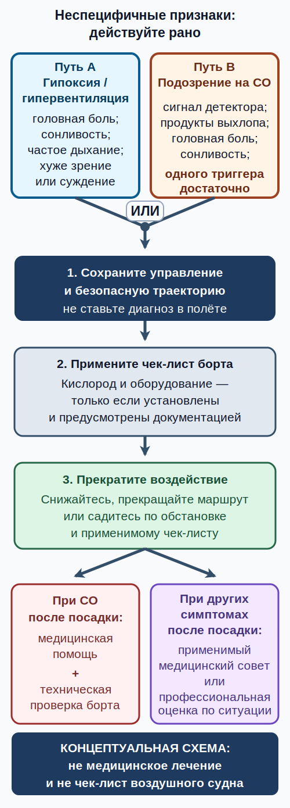

# Физиология пилота: дыхание, гипоксия и угарный газ {#human-performance-physiology}

## Зачем эта глава {#purpose}

Пилот управляет не только воздушным судном, но и собственным состоянием. Здесь физиология сведена к практической цепочке: понять механизм, заметить неспецифичные признаки, сохранить управление, прекратить воздействие и безопасно завершить полёт. Глава не учит ставить диагноз и не назначает лечение.

## Результаты обучения {#outcomes}

После главы вы сможете:

1. объяснить связь атмосферы, дыхания, кровообращения и работоспособности;
2. различить механизм гипоксии, гипервентиляции и воздействия угарного газа, не обещая различить их по ощущениям;
3. описать безопасную эксплуатационную реакцию без самолётно-неспецифичных команд;
4. применить испанское правило дополнительного кислорода к [ULM][ulm];
5. принять раннее [решение «лететь/не лететь» (go/no-go)][go-no-go] или [решение «продолжать/уходить» (continue/divert)][continue-divert] при неоднозначных признаках.

## Карта применимости {#applicability}

| Метка | Как использовать главу |
|---|---|
| [ULM — ОСНОВА][ulm] | Физиология входит в официальную программу [MAF][maf]. |
| [ULM — ОСОБО ВАЖНО][ulm] | Проверяйте фактическую герметичность, отопление, вентиляцию и установленное оборудование конкретного борта. |
| [PART-FCL — ОБЩЕЕ][part-fcl] | [LAPL(A)][lapl] и [PPL(A)][ppl] используют одинаковую теоретическую глубину по [возможностям человека (Human performance)][human-performance]: программа LAPL использует программу PPL. Источник: `SRC-EASA-AIRCREW-2026`. |
| [LAPL — ПЕРЕХОД][lapl] | После [MAF][maf] материал заново изучается и проверяется в отдельной программе [Part-FCL][part-fcl]. |
| [PPL — РАСШИРЕНИЕ][ppl] | Теоретическая глубина та же, что для LAPL; отличаются медицинский документ и последующие эксплуатационные примеры. |
| [ИСПАНИЯ] | Для [ULM][ulm] применяется art. 4.1(c) RD 765/2022. |
| [БЕЗОПАСНОСТЬ] | Неспецифичный признак требует консервативного решения, а не самодиагностики. |
| [ПРОВЕРИТЬ ПЕРЕД ПОЛЁТОМ] | Сверьте оборудование, ограничения и процедуры с текущими [AFM][afm]/[POH][poh] и школой. |

Карта разделяет испанскую норму и последующий учебный слой. Источники: `SRC-BOE-RD-765-2022`, `SRC-EASA-AIRCREW-2026`.

## Теория {#theory}

### Атмосфера, дыхание и кровообращение {#atmosphere-respiration-circulation}

Состав сухого воздуха меняется с высотой мало, но общее давление падает. Поэтому падает и парциальное давление кислорода: в лёгких уменьшается движущая сила его перехода в кровь. Дыхательная система переносит воздух к альвеолам, кровь переносит кислород к тканям, а сердце обеспечивает поток. Нарушение любого звена — доступного кислорода, вентиляции, переноса кровью или кровообращения — способно ухудшить работу мозга и органов чувств.

Организм не является точным датчиком. Мозг, зрение и суждение могут ухудшаться раньше, чем человек признает проблему. Ночная зрительная система чувствительна к нехватке кислорода; одновременно падает способность оценить собственную ошибку. Эти выводы входят в предмет «возможности человека» программы [MAF][maf] и в [Part-FCL][part-fcl] [syllabus][syllabus]; подробное описание индивидуальности и ранних признаков даёт официальный листок [EASA][easa]. Источники: `SRC-AESA-ULM-LEARNING-OBJECTIVES-GU09-ED01` (Actuaciones y Limitaciones Humanas, pp. 59–62), `SRC-EASA-AIRCREW-2026`, `SRC-EASA-HYPOXIA-2016`.

### Гипоксия {#hypoxia}

Недостаточное снабжение тканей кислородом называется гипоксией ([hypoxia][hypoxia]; español: *hipoxia*). Возможны головная боль, сонливость, необычная эйфория или раздражительность, учащённое дыхание, тошнота, невнятная речь, ухудшение мышления, координации и зрения. Ни один из этих признаков не уникален. Начало может быть постепенным, а выраженность зависит от высоты, времени, индивидуального состояния, болезни, лекарств, курения, усталости и других факторов.

Миф: «[ULM][ulm] летает низко, поэтому гипоксия не важна» — неверно. Горный маршрут, необычный профиль, длительность, состояние человека и ошибочное продолжение набора способны создать риск. Миф: «ниже 10 000 ft гипоксия невозможна» — неверно; это нормативная граница конкретного кислородного правила, а не биологическая гарантия. [EASA][easa] прямо предупреждает об индивидуальной чувствительности и ухудшении суждения до надёжного самоощущения. Источник: `SRC-EASA-HYPOXIA-2016`.

### Гипервентиляция {#hyperventilation}

Вентиляция лёгких сверх метаболической потребности называется гипервентиляцией ([hyperventilation][hyperventilation]; español: *hiperventilación*). Страх, боль, высокая рабочая нагрузка или сознательное слишком частое дыхание могут снизить содержание углекислого газа в крови. Возможны головокружение, покалывание, ощущение нехватки воздуха, нарушения зрения и мышечное напряжение. Технический источник механизма и признаков: Chapter 17, printed p. 17-4 в `SRC-FAA-PHAK-25C-CH17`; это педагогика FAA, а не медицинская или правовая норма ЕС/Испании.

Признаки пересекаются с гипоксией и иными состояниями. Миф: гипоксию легко отличить от гипервентиляции по ощущениям — неверно. Пилот не тратит ограниченную работоспособность на диагноз: сохраняет управление, использует одобренные кислородное оборудование и чек-лист, если они установлены и применимы, снижает воздействие и завершает полёт по обстановке. Учебный объём задаёт `SRC-AESA-ULM-LEARNING-OBJECTIVES-GU09-ED01` (Actuaciones y Limitaciones Humanas, pp. 59–62); механизм и распознавание поддерживают `SRC-EASA-HYPOXIA-2016` и `SRC-FAA-PHAK-25C-CH17`.

### Угарный газ {#carbon-monoxide}

Угарный газ ([carbon monoxide (CO)][co]; español: *monóxido de carbono*) образуется при неполном сгорании, не имеет цвета и запаха и связывается с гемоглобином, нарушая перенос кислорода. Для применимой конструкции путь в кабину может возникнуть через дефект выхлопной системы, отопителя, уплотнений или вентиляции. Головная боль, тошнота, сонливость, спутанность и ухудшение координации неспецифичны.

У CO нет полезного предупреждающего запаха. Активный сигнал CO-детектора, запах продуктов выхлопа или любой одиночный подозрительный признак запускает немедленную консервативную реакцию по применимому чек-листу: не ждите второго признака или подтверждения другим прибором. Активный CO-детектор помогает обнаружить CO в кабине, но не гарантирует безопасность и требует применения по документации конкретной установки. [EASA][easa] SIB является рекомендацией, не обязательным чек-листом, и его применимость к конкретному [ULM][ulm] зависит от конструкции. Источник: `SRC-EASA-SIB-2020-01R1`.

Пульсоксиметр может быть лишь вспомогательным средством осведомлённости о гипоксии. Обычный двухволновой пульсоксиметр не является CO-детектором и не исключает подозрение на CO: CDC указывает, что такой прибор неточен при наличии COHgb. Не используйте показание как основание продолжать воздействие. Источник узкого ограничения прибора: `SRC-CDC-CO-CLINICAL`; роль гипоксии и реакция на CO: `SRC-EASA-HYPOXIA-2016`, `SRC-EASA-SIB-2020-01R1`.

### Единая эксплуатационная реакция {#operational-response}

Порядок при любом подозрении строится от управления к прекращению воздействия:

1. **[Управляйте (AVIATE)][aviate-priority]:** сохраняйте безопасные скорость, положение и траекторию.
2. Используйте одобренный кислород, установленное оборудование и чек-лист именно этого борта, если они применимы.
3. Прекратите или уменьшите воздействие: не продолжайте набор; снижайтесь, прекращайте маршрут или выполняйте посадку по реальной обстановке.
4. При подозрении на CO выполняйте действия с вентиляцией/обогревом только так, как предписывает применимый чек-лист; универсальная команда может усилить риск на другой конструкции.
5. При подозрении на CO после посадки получите медицинскую помощь и обеспечьте техническую проверку воздушного судна до возврата в эксплуатацию (`SRC-EASA-SIB-2020-01R1`). При других симптомах следуйте применимым медицинским рекомендациям и обращайтесь за профессиональной оценкой по обстоятельствам; эта глава не устанавливает универсальный порог направления к врачу.

Это эксплуатационная рамка [EASA][easa] для осведомлённости, а не лечение и не чек-лист воздушного судна. Источники: `SRC-EASA-HYPOXIA-2016`, `SRC-EASA-SIB-2020-01R1`.

## Применение к [ULM][ulm] {#ulm-application}

### Испанское кислородное правило {#norm-ulm-oxygen}

Для испанского [ULM][ulm] дополнительный кислород требуется всем находящимся на борту при высоте кабины от 10 000 до 13 000 ft более 30 минут и непрерывно выше 13 000 ft. Норма использует **высоту кабины**, а не автоматически показание высотомера по [QNH][qnh]. Ограничения воздушного судна и установленной системы остаются обязательными. Источник: art. 4.1(c) RD 765/2022 в `SRC-BOE-RD-765-2022`.

Это число не превращается в «безопасную полку» ниже 10 000 ft. Планируйте запас раньше нормативного порога, если человек, длительность, ночь, рельеф или признаки повышают риск. Для открытого или недостаточно герметичного [ULM][ulm] холод и поток воздуха могут одновременно увеличить нагрузку, но такая конфигурация не универсальна: сверяйтесь с [AFM][afm]/[POH][poh] и процедурами школы.

### Сценарий HP-01 — продолжительное пребывание 10 000–13 000 ft {#scenario-hp-01}

**Решение «продолжать/уходить»:** расчёт показывает, что высота кабины останется в диапазоне более 30 минут, но кислородное оборудование не предусмотрено или не готово. Маршрут в таком виде не продолжается: измените высоту/маршрут до вылета либо не вылетайте. Не используйте «я хорошо себя чувствую» вместо выполнения art. 4.1(c).

### Сценарий HP-02 — жара в кабине, головная боль и сигнал CO {#scenario-hp-02}

**Решение «продолжать/уходить»:** сохраняйте управление, выполните применимый чек-лист установленного оборудования, прекратите воздействие и садитесь как только это безопасно. При подозрении на CO после посадки нужны медицинская помощь и техническая проверка воздушного судна (`SRC-EASA-SIB-2020-01R1`). Не продолжайте маршрут ради подтверждения показания другим прибором.

### Сценарий HP-03 — неоднозначные признаки {#scenario-hp-03}

**Решение «продолжать/уходить»:** учащённое дыхание, покалывание и ухудшение внимания могут иметь несколько причин. Не выбирайте «гипоксия или гипервентиляция» как экзаменационную загадку в полёте. Сохраняйте управление, используйте одобренные системы/чек-лист, снижайте воздействие и завершайте полёт.

## Расширение LAPL/PPL {#part-fcl-extension}

Для последующего [LAPL(A)][lapl] или [PPL(A)][ppl] та же физиология изучается в составе предмета «возможности человека»; учебный план [LAPL(A)][lapl] использует теоретическую программу [PPL(A)][ppl]. В слое [Part-FCL][part-fcl] связывайте высоту и длительность с индивидуальными факторами, ночным зрением, загрузкой задачами и планом ухода. Это не означает, что национальный экзамен [MAF][maf] автоматически засчитывается в [Part-FCL][part-fcl]. Источник: AMC1 FCL.210/FCL.215 в `SRC-EASA-AIRCREW-2026`.

Правила [Part-NCO](../reference/glossary.md#term-part-nco) и [Part-MED][part-med], встречающиеся в будущей подготовке, не переносятся автоматически на национальную эксплуатацию [ULM][ulm]. Здесь они служат консервативной подготовкой к следующей лицензии; применимое правило конкретного полёта устанавливается отдельно.

## Безопасность {#safety}

Никогда не тренируйте гипоксию самостоятельно. Не ставьте диагноз по одному признаку и не назначайте себе лечение по этой главе. Если состояние вызывает сомнение, управление и раннее прекращение воздействия важнее точного названия причины. После подозрения на CO получите медицинскую помощь и обеспечьте техническую проверку борта (`SRC-EASA-SIB-2020-01R1`). При других симптомах следуйте применимым медицинским рекомендациям и обращайтесь за профессиональной оценкой по обстоятельствам. Глава не устанавливает универсальный порог направления к врачу.

## Типичные ошибки {#common-errors}

1. Считать нормативную высоту границей возникновения гипоксии.
2. Пытаться отличить гипоксию от гипервентиляции по одному ощущению.
3. Ждать запаха CO.
4. Продолжать полёт, пока второй прибор «подтвердит» опасность.
5. Давать универсальную команду по обогреву или вентиляции без чек-листа борта.
6. Возвращать самолёт в полёт после сигнала CO без требуемой проверки.

## Краткий конспект {#summary}

- Падение парциального давления кислорода ухудшает работу мозга и зрения.
- Гипоксия, гипервентиляция и CO дают пересекающиеся неспецифичные признаки.
- Сначала управление; затем оборудование, снижение воздействия и посадка.
- Испанское правило [ULM][ulm] задаёт требования по высоте кабины и времени, но не гарантирует биологическую безопасность ниже порога.
- Детектор помогает принять раннее решение, но не заменяет действие и чек-лист.

## Контрольные вопросы {#review-questions}

### Q-HP-001 — Почему доля кислорода в воздухе не гарантирует неизменную работоспособность при наборе высоты? {#q-hp-001}

A. Общее давление и парциальное давление кислорода падают, поэтому его переход в кровь затрудняется. 
B. Доля кислорода заметно уменьшается, а общее давление остаётся неизменным. 
C. Более частое дыхание всегда полностью компенсирует снижение давления без ограничений. 
D. Высота влияет только на двигатель, но не на зрение и суждение человека.

**Правильный ответ:** A.

**Почему:** Физиологически важна доступность кислорода, зависящая от парциального давления, а не только его процентной доли; это объясняет ухудшение мозга и зрения с высотой (`SRC-EASA-HYPOXIA-2016`).

**Почему главный отвлекающий вариант неверен:** B меняет механизм местами: состав сухого воздуха меняется мало, а ключевым является падение общего и парциального давления.

### Q-HP-002 — Как безопаснее реагировать на признаки, похожие одновременно на гипоксию и гипервентиляцию? {#q-hp-002}

A. Продолжать набор, пока симптомы не станут специфичными. 
B. Сохранить управление, применить одобренные системы и чек-лист, уменьшить воздействие и завершить полёт. 
C. Поставить диагноз по частоте дыхания и выбрать самостоятельное лечение. 
D. Отключить все предупреждения, чтобы снизить рабочую нагрузку.

**Правильный ответ:** B.

**Почему:** Перекрывающиеся признаки не дают надёжной самодиагностики; безопасная цепочка начинается с управления и раннего прекращения воздействия (`SRC-EASA-HYPOXIA-2016`).

**Почему главный отвлекающий вариант неверен:** A расходует время полезной работоспособности и усиливает физиологическое воздействие вместо консервативного снижения риска (`SRC-EASA-HYPOXIA-2016`).

### Q-HP-003 — Почему отсутствие запаха не позволяет исключить угарный газ в кабине? {#q-hp-003}

A. CO имеет запах только на большой высоте. 
B. CO бесцветен и не имеет запаха, поэтому требуется иной способ обнаружения и ранняя реакция. 
C. Запах появляется только после выключения двигателя. 
D. Любой отопитель полностью нейтрализует CO до попадания в кабину.

**Правильный ответ:** B.

**Почему:** [EASA][easa] SIB описывает CO как бесцветный газ без запаха и связывает риск с выхлопом, отопителем и путями проникновения (`SRC-EASA-SIB-2020-01R1`).

**Почему главный отвлекающий вариант неверен:** A приписывает газу высотно-зависимый запах, которого у CO нет на любой высоте.

### Q-HP-004 — Что именно запускает кислородное требование art. 4.1(c) для испанского [ULM][ulm]? {#q-hp-004}

A. Любой полёт выше уровня моря независимо от длительности. 
B. Только показание высотомера по [QNH][qnh], даже в герметичной кабине. 
C. Высота кабины 10 000–13 000 ft более 30 минут либо нахождение выше 13 000 ft. 
D. Наличие ночного полёта без учёта высоты кабины.

**Правильный ответ:** C.

**Почему:** RD 765/2022 art. 4.1(c) использует высоту кабины, диапазон, длительность и отдельное условие выше 13 000 ft (`SRC-BOE-RD-765-2022`).

**Почему главный отвлекающий вариант неверен:** B подменяет высоту кабины настройкой высотомера и игнорирует время и конструкцию.

### Q-HP-005 — Какую роль должен играть CO-детектор в решении пилота? {#q-hp-005}

A. Это дополнительный ранний сигнал, после которого действуют по применимому чек-листу и прекращают воздействие. 
B. Это гарантия безопасности, позволяющая продолжать до второго сигнала. 
C. Это прибор для медицинской диагностики причины головной боли. 
D. Это замена технической проверке выхлопной и отопительной систем.

**Правильный ответ:** A.

**Почему:** Детектор поддерживает раннее обнаружение, но не отменяет управление, чек-лист, посадку, медицинскую оценку и техническую проверку (`SRC-EASA-SIB-2020-01R1`).

**Почему главный отвлекающий вариант неверен:** B превращает вспомогательный датчик в гарантию и поощряет опасное продолжение воздействия.

### Q-HP-006 — Какой первый приоритет при внезапном ухудшении мышления и координации в полёте? {#q-hp-006}

A. Записать все симптомы для последующей классификации. 
B. Немедленно сохранить управление и безопасную траекторию, затем применять оборудование и прекращать воздействие. 
C. Искать в учебнике точный диагноз до изменения маршрута. 
D. Продолжать к назначению, если нормативный порог кислорода ещё не достигнут.

**Правильный ответ:** B.

**Почему:** Приоритет управления защищает от немедленной потери контроля; физиологическая неопределённость не отменяет раннюю эксплуатационную реакцию (`SRC-EASA-HYPOXIA-2016`).

**Почему главный отвлекающий вариант неверен:** D путает нормативный порог с индивидуальной безопасностью и игнорирует уже возникшее ухудшение.

## Источники {#sources}

- `SRC-AESA-ULM-LEARNING-OBJECTIVES-GU09-ED01` — Actuaciones y Limitaciones Humanas, pp. 59–62 программы [MAF][maf].
- `SRC-EASA-AIRCREW-2026` — объём предмета «возможности человека» LAPL/PPL.
- `SRC-FAA-PHAK-25C-CH17` — гипервентиляция и пересечение физиологических признаков; техническая педагогика, не норма ЕС/Испании.
- `SRC-EASA-HYPOXIA-2016` — физиология, индивидуальность, признаки и эксплуатационная реакция.
- `SRC-EASA-SIB-2020-01R1` — свойства CO, пути воздействия и рекомендации.
- `SRC-CDC-CO-CLINICAL` — узкое ограничение обычного двухволнового пульсоксиметра при COHgb; не авиационная процедура и не лечение.
- `SRC-BOE-RD-765-2022` — испанское кислородное правило [ULM][ulm].

[ulm]: ../reference/glossary.md#term-ulm
[maf]: ../reference/glossary.md#term-maf
[lapl]: ../reference/glossary.md#term-lapl-a
[ppl]: ../reference/glossary.md#term-ppl-a
[part-fcl]: ../reference/glossary.md#term-part-fcl
[afm]: ../reference/glossary.md#term-afm
[poh]: ../reference/glossary.md#term-poh
[qnh]: ../reference/glossary.md#term-qnh
[easa]: ../reference/glossary.md#term-easa
[syllabus]: ../reference/glossary.md#term-syllabus
[hypoxia]: ../reference/glossary.md#term-hypoxia
[hyperventilation]: ../reference/glossary.md#term-hyperventilation
[co]: ../reference/glossary.md#term-carbon-monoxide-co
[part-med]: ../reference/glossary.md#term-part-med
[human-performance]: ../reference/glossary.md#term-human-performance
[go-no-go]: ../reference/glossary.md#term-go-no-go
[continue-divert]: ../reference/glossary.md#term-continue-divert
[aviate-priority]: ../reference/glossary.md#term-aviate-navigate-communicate
