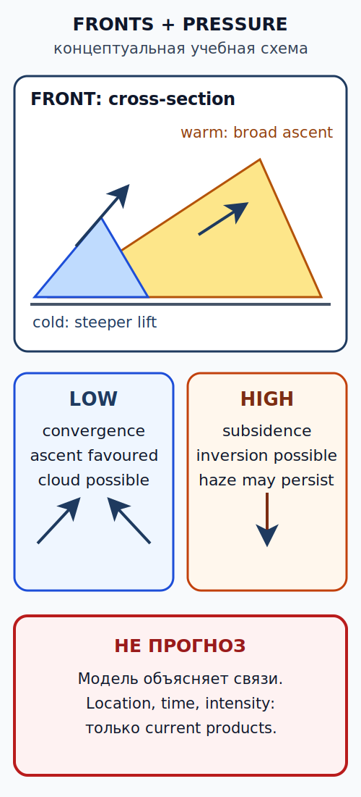

# Ветер, порывы, турбулентность, побережье и горы {#wind-turbulence-mountain-coast}

## Зачем эта глава {#purpose}

Для лёгкого самолёта опасен не ярлык «ветрено», а сочетание средней скорости, порывистости, направления, рельефа, устойчивости и запаса конкретного пилота/борта. Глава учит читать структуру потока и заранее выбирать путь отхода без выдуманного универсального лимита.

## Результаты обучения {#outcomes}

После главы вы сможете:

1. различать средний, мгновенный ветер и порыв;
2. объяснить трение, суточный ход, бризы и канализацию потока;
3. распознавать anabatic/katabatic flow, mountain wave, rotor и lee downdraft;
4. вычислить учебные headwind/crosswind components;
5. применить консервативное решение к испанским побережьям, горам и проливам.

## Карта применимости {#applicability}

| Метка | Как использовать главу |
|---|---|
| [ULM — ОСНОВА][ulm] | Основной слой для дневной эксплуатации [ULM][ulm] в Испании. |
| [ULM — ОСОБО ВАЖНО][ulm] | Порыв и вертикальный поток сравниваются с опытом на типе и [AFM][afm]/[POH][poh]. |
| [PART-FCL — ОБЩЕЕ][part-fcl] | Физика общая для будущих [LAPL(A)][lapl]/[PPL(A)][ppl]. |
| [LAPL — ПЕРЕХОД][lapl] | Добавится формализованное маршрутное планирование. |
| [PPL — РАСШИРЕНИЕ][ppl] | Применяется та же оценка компонентов и рельефа. |
| [ИСПАНИЯ] | Сценарии дают климатологическую ориентацию, не прогноз. |
| [БЕЗОПАСНОСТЬ] | Облака не обязательны для сильной волны, ротора или нисходящего потока. |
| [ПРОВЕРИТЬ ПЕРЕД ПОЛЁТОМ] | Фактический ветер/порывы, прогноз профиля, рельеф, аэродромные и личные пределы. |

## Теория {#theory}

### Средний ветер, мгновенное значение и порыв {#gusts}

Наблюдение сообщает усреднённый ветер за установленный интервал; мгновенная скорость постоянно колеблется, а значимый максимум может кодироваться как gust. Порывистость — не только разность двух чисел: важны частота, направление, препятствия и фаза полёта. Отсутствие G не означает отсутствия порывов или турбулентности между точками наблюдения. Кодирование и период осреднения проверяют по `SRC-AEMET-CODE-FORMS-2021` и `SRC-AEMET-GUIA-MET-2025` (проверено 2026-07-13).

### Трение и суточный ход {#friction-diurnal-cycle}

У земли трение замедляет поток и поворачивает его относительно свободной атмосферы. Дневное прогревание усиливает перемешивание: к поверхности может переноситься более сильный ветер сверху, одновременно развивается thermal turbulence. После охлаждения устойчивый приземный слой может ослабить surface wind, но над ним сохранится сильный поток и [сдвиг ветра (wind shear)][wind-shear]. Стабильная физика: `SRC-FAA-AWH-28B-2026` (проверено 2026-07-13).

### Морской и береговой бриз {#sea-land-breeze}

Днём суша часто нагревается быстрее моря, формируя sea-breeze circulation; ночью знак температурного контраста может измениться и поддержать land breeze. Сила и положение фронта зависят от синоптического ветра, береговой формы, устойчивости и времени. Морской бриз не всегда слабый и на линии сходимости может дать резкую смену направления, порывы, подъём и облака. Стабильная физика: `SRC-FAA-AWH-28B-2026`; испанские продукты: `SRC-AEMET-GUIA-MET-2025` (проверено 2026-07-13).

### Склоны, долины и канализация {#slope-valley-channeling}

Нагретый склон может поддерживать восходящий anabatic flow, охлаждённый — нисходящий katabatic flow. Долина, перевал или пролив способны направлять и ускорять поток. Эти названия описывают механизм, но не гарантируют силу: решают pressure gradient, устойчивость, геометрия и фоновые условия. Стабильная физика: `SRC-FAA-AWH-28B-2026` (проверено 2026-07-13).

### Горная волна, rotor и lee downdraft {#mountain-wave-rotor}

Устойчивый поток, пересекающий хребет, может колебаться за ним как mountain wave. Под волной возможен rotor с сильной турбулентностью; у подветренного склона — downdraft, превосходящий climb capability. Линзовидное облако не обязательно: сухой слой способен создать опасную волну без видимого маркера. Не планируйте «пробить» нисходящий поток мощностью; сохраните высоту, дистанцию и маршрут ухода согласно подготовке и данным борта. Стабильная физика: `SRC-FAA-AWH-28B-2026` (проверено 2026-07-13).

### Учебный расчёт MET-CALC-04 — компоненты ветра {#met-calc-04}

**Дано:** wind 20 kt; угол между направлением ВПП и направлением ветра 30°.

**Формула:** `headwind = V × cos θ`; `crosswind = V × sin θ`.

**Расчёт:** `20 × cos 30° ≈ 17 kt`; `20 × sin 30° = 10 kt`.

**Результат:** приближённо 17 kt встречной и 10 kt боковой составляющей.

**Решение пилота:** сравнить обе составляющие и gust case с применимым [AFM][afm]/[POH][poh], аэродромным/школьным пределом, личным минимумом и состоянием ВПП. Допущения — постоянные направление и скорость; это приближение не является прогнозом или значением [AFM][afm].

### Сценарий ESP-MET-01 — Средиземноморское побережье: бриз и конвергенция {#scenario-esp-met-01}

Утром surface wind слабый, днём прогнозируется sea-breeze front. Средиземноморский бриз и конвергенция могут переставить рабочую ВПП, усилить crosswind и дать локальный подъём. Это климатологически правдоподобная учебная схема, не прогноз: проверьте текущие observation, [TAF][taf]/area products и повторите решение перед вылетом. Источники продукта: `SRC-AEMET-GUIA-MET-2025`, `SRC-AEMET-AVIATION` (проверено 2026-07-13).

### Сценарий ESP-MET-04 — горный переход: волна и rotor {#scenario-esp-met-04}

Ветер поперёк хребта усиливается с высотой, воздух устойчив. Даже без облаков план допускает wave, rotor и lee downdraft. Не входите в узкий перевал без достаточного пути разворота; выбирайте более ранний маршрут обхода или отмену. Это учебная климатологическая ориентация, не прогноз. Источник физики: `SRC-FAA-AWH-28B-2026` (проверено 2026-07-13).

### Сценарий ESP-MET-05 — Эстречо-де-Гибралтар: канализация потока {#scenario-esp-met-05}

Pressure gradient между бассейнами способен канализировать поток через Эстречо-де-Гибралтар и создавать сильный ветер, порывы, rotor и резкие различия по сторонам рельефа. Не переносите один point report на весь пролив. Это климатологическая ориентация; текущий маршрут решается по AEMET/[AIP][aip] и локальному руководству. Источники: `SRC-AEMET-GUIA-MET-2025`, `SRC-ENAIRE-AIP-GEN-3-5-2026` (проверено 2026-07-13).

### Сценарий ESP-MET-06 — Канарские острова: пассат, орография и lee {#scenario-esp-met-06}

Канарский пассат, инверсия и орография способны создавать облачный наветренный слой, ускорение вокруг острова и турбулентную подветренную зону. Один аэродромный report не описывает lee side другого участка. Это климатологическая ориентация, не прогноз; аэродромная guía остаётся site-specific. Источники: `SRC-AEMET-AERODROME-GUIDES`, `SRC-AEMET-GUIA-MET-2025` (проверено 2026-07-13).

## Применение к [ULM][ulm] {#ulm-application}

Нет универсального лимита [ULM][ulm] по ветру, порыву, crosswind или турбулентности. Действует наиболее ограничивающее из применимого права/[VMC][vmc], [AFM][afm]/[POH][poh], ограничений аэродрома/школы и заранее установленных личных минимумов — с запасом на неопределённость и [TREND][trend]. Испанская граница эксплуатации: `SRC-BOE-RD-765-2022` (проверено 2026-07-13).

## Расширение LAPL/PPL {#part-fcl-extension}

В будущих [LAPL(A)][lapl]/[PPL(A)][ppl] route planning должно учитывать текущие reports, forecasts и возможность безопасного diversion. Обязанности Part-NCO относятся к будущему слою и не объявляются автоматически правилом национального [ULM][ulm]. Источник: `SRC-EASA-AIR-OPS-2026` (проверено 2026-07-13).

## Безопасность {#safety}

Cloudless не означает smooth. Если ветер перпендикулярен хребту, усиливается с высотой или сильно расходится между точками, считайте отсутствие визуальных маркеров слабым доказательством. Ранний DELAY/REROUTE/CANCEL сохраняет больше вариантов.

## Типичные ошибки {#common-errors}

1. Считать отсутствие G доказательством ровного потока.
2. Принимать морской бриз за всегда слабый ветер.
3. Искать mountain wave только по lenticular cloud.
4. Сравнивать только mean wind, забыв gust и направление.
5. Переносить report одного аэродрома на подветренный маршрут.

## Краткий конспект {#summary}

- Wind report — point/time sample, не весь поток.
- Рельеф способен ускорять, поворачивать и поднимать/опускать воздух.
- Mountain wave и rotor возможны без облаков.
- Components — вход в решение, а не универсальное разрешение.

## Контрольные вопросы {#review-questions}

### Q-MET-006 — Почему отсутствие группы G в аэродромной сводке не гарантирует спокойный маршрут? {#q-met-006}

A. Осреднение и point observation не исключают локальные порывы и турбулентность. 
B. Группа G применяется только к температуре. 
C. Любой ветер без G считается встречным. 
D. G публикуется только после завершения полёта.

**Правильный ответ:** A.

**Почему:** Report ограничен местом, временем и правилами кодирования; рельеф и перемешивание могут изменить поток вдали от датчика.

**Почему главный отвлекающий вариант неверен:** B неверно меняет смысл gust group, которая относится к скорости ветра (`SRC-AEMET-CODE-FORMS-2021`).

### Q-MET-007 — Что наиболее важно при оценке mountain wave на сухом воздухе? {#q-met-007}

A. Отсутствие lenticular cloud полностью снимает угрозу. 
B. Профиль ветра, устойчивость, ориентация хребта и возможный lee downdraft. 
C. Только температура на перроне. 
D. Только направление ближайшей ВПП.

**Правильный ответ:** B.

**Почему:** Волновой механизм зависит от потока и устойчивости; облако появляется лишь при достаточной влаге (`SRC-FAA-AWH-28B-2026`).

**Почему главный отвлекающий вариант неверен:** A принимает отсутствие конденсации за отсутствие движения воздуха.

### Q-MET-008 — Какой порядок применения вычисленной crosswind component безопасен для [ULM][ulm]? {#q-met-008}

A. Считать вычисление самостоятельным разрешением на посадку. 
B. Сравнить mean/gust cases с наиболее строгим применимым пределом и запасом. 
C. Игнорировать состояние ВПП после расчёта угла. 
D. Заменить этим значением текущий report.

**Правильный ответ:** B.

**Почему:** Component становится решением только вместе с [AFM][afm]/[POH][poh], аэродромом, подготовкой пилота и неопределённостью.

**Почему главный отвлекающий вариант неверен:** A превращает тригонометрию в несуществующий универсальный эксплуатационный допуск.

### Q-MET-009 — Почему sea-breeze front требует повторной оценки перед вылетом? {#q-met-009}

A. Он может смещаться и менять направление, порывы, облачность и рабочую ВПП. 
B. Он всегда прекращается ровно в полдень. 
C. Он влияет только на морские суда. 
D. Он автоматически запрещает любой дневной полёт.

**Правильный ответ:** A.

**Почему:** Бризовая циркуляция развивается во времени и взаимодействует с фоновым ветром и береговой геометрией (`SRC-FAA-AWH-28B-2026`).

**Почему главный отвлекающий вариант неверен:** D заменяет оценку конкретных условий безусловным правилом, которого физика не создаёт.

### Q-MET-010 — Что означает резкое ослабление surface wind вечером при сильном ветре выше? {#q-met-010}

A. Риск [wind shear][wind-shear] может увеличиться на границе устойчивого слоя. 
B. Весь профиль ветра обязательно стал слабым. 
C. Рельеф перестал влиять на поток. 
D. Порывы невозможны до следующего утра.

**Правильный ответ:** A.

**Почему:** Стабилизация приземного слоя может отделить слабый surface flow от более сильного потока выше (`SRC-FAA-AWH-28B-2026`).

**Почему главный отвлекающий вариант неверен:** B необоснованно распространяет одно surface observation на вертикальный профиль.

## Источники {#sources}

- `SRC-FAA-AWH-28B-2026` — стабильная физика ветра, бризов и горных волн; проверено 2026-07-13.
- `SRC-AEMET-GUIA-MET-2025`, `SRC-AEMET-CODE-FORMS-2021`, `SRC-AEMET-AERODROME-GUIDES` — испанские продукты и site-specific guides; проверено 2026-07-13.
- `SRC-ENAIRE-AIP-GEN-3-5-2026` — динамическое описание метеослужбы; проверено 2026-07-13.
- `SRC-BOE-RD-765-2022`, `SRC-EASA-AIR-OPS-2026` — раздельные эксплуатационные слои; проверено 2026-07-13.

[ulm]: ../reference/glossary.md#term-ulm
[lapl]: ../reference/glossary.md#term-lapl-a
[ppl]: ../reference/glossary.md#term-ppl-a
[part-fcl]: ../reference/glossary.md#term-part-fcl
[afm]: ../reference/glossary.md#term-afm
[poh]: ../reference/glossary.md#term-poh
[vmc]: ../reference/glossary.md#term-vmc
[wind-shear]: ../reference/glossary.md#term-wind-shear
[aip]: ../reference/glossary.md#term-aip
[taf]: ../reference/glossary.md#term-taf
[trend]: ../reference/glossary.md#term-trend
