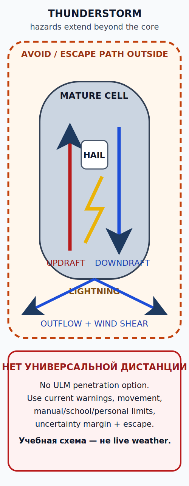

# Опасные явления: гроза, обледенение и потеря визуальных условий {#hazards-thunderstorm-icing}

## Зачем эта глава {#purpose}

Опасные явления редко приходят по одному: конвекция соединяет турбулентность, град, молнию, осадки, [сдвиг ветра (wind shear)][wind-shear] и нисходящий поток; холодная влага соединяет обледенение, видимость и потерю характеристик. Задача пилота [VFR][vfr] — заранее исключить попадание в опасность, а не доказывать, что самолёт выдержит.

## Результаты обучения {#outcomes}

После главы вы сможете:

1. описать жизненный цикл грозы и связанные опасности;
2. различить конструкционное, входное/карбюраторное обледенение и переохлаждённые осадки;
3. распознать закрытие гор облаками и [непреднамеренное ухудшение до VFR2IMC][vfr2imc];
4. связать [высоту по плотности (density altitude)][density-altitude] с запасом характеристик;
5. сформулировать раннее решение об обходе или уходе без универсальной дистанции.

## Карта применимости {#applicability}

| Метка | Как использовать главу |
|---|---|
| [ULM — ОСНОВА][ulm] | Для [ULM][ulm] в Испании базовой стратегией дневного [VFR][vfr] является обход опасного явления. |
| [ULM — ОСОБО ВАЖНО][ulm] | Не предполагается способность входить в грозу, обледенение или [IMC][imc]. |
| [PART-FCL — ОБЩЕЕ][part-fcl] | Опасные явления входят в последующую теорию [LAPL(A)][lapl]/[PPL(A)][ppl]. |
| [LAPL — ПЕРЕХОД][lapl] | Применимость Part-NCO определяется видом эксплуатации, а не одной лицензией. |
| [PPL — РАСШИРЕНИЕ][ppl] | [PPL(A)][ppl] сам по себе не является приборной квалификацией. |
| [ИСПАНИЯ] | Используются текущие предупреждения, карты, радар, спутник и данные о молниях AEMET. |
| [БЕЗОПАСНОСТЬ] | Для [ULM][ulm] нет варианта проникновения в грозу. |
| [ПРОВЕРИТЬ ПЕРЕД ПОЛЁТОМ] | Развитие, движение, пути отхода, уровни обледенения, рельеф и характеристики. |

## Теория {#theory}

### Жизненный цикл грозы {#thunderstorm}

На стадии развития преобладает восходящий поток; зрелая стадия сочетает восходящий и нисходящий потоки с осадками; на стадии распада преобладает нисходящий поток. Опасность не заканчивается вместе с ярким ядром облака: растекающийся поток, молния, град и турбулентность могут выходить за визуальную границу. Стабильная физика: FAA-H-8083-28B, глава 22, в `SRC-FAA-AWH-28B-2026` (проверено 2026-07-13).

### Град, молния, турбулентность и нисходящий порыв {#thunderstorm-hazards}

Глубокая конвекция создаёт сильные вертикальные потоки, град, молнию, интенсивные осадки, быстрые изменения давления/ветра, нисходящий порыв и [сдвиг ветра][wind-shear]. Цвет радара не измеряет турбулентность напрямую, а бортовая метеоинформация может поступать с задержкой. Обход строят по текущей официальной информации и видимому развитию, сохраняя путь отхода. Источники: `SRC-FAA-AWH-28B-2026`, `SRC-AEMET-GUIA-MET-2025` (проверено 2026-07-13).

Нет универсальной дистанции [ULM][ulm] от грозы, которую может создать учебный курс. Выберите наиболее консервативное из официальных предупреждений/процедур, [AFM][afm]/[POH][poh], ограничений школы/аэродрома, указаний инструктора и [личных минимумов (personal minima)][personal-minima], увеличив запас при росте, движении или неопределённости. Для [ULM][ulm] нет варианта проникновения в грозу. Источники метода: `SRC-AEMET-GUIA-MET-2025`, `SRC-FAA-AWH-28B-2026` (проверено 2026-07-13).

### Конструкционное и входное обледенение {#icing}

Конструкционное обледенение требует переохлаждённой жидкой воды и поверхности ниже температуры замерзания; форма и скорость зависят от капель, температуры, водности и воздушного судна. Даже небольшое нарастание меняет обтекание, массу и сопротивление, но курс не задаёт «допустимую толщину». Входное обледенение ограничивает поток воздуха; карбюраторное обледенение возможно при положительной наружной температуре из-за падения давления и испарения топлива. Признаки и действия всегда зависят от типа и берутся из [AFM][afm]/[POH][poh]. Стабильная физика: `SRC-FAA-AWH-28B-2026` (проверено 2026-07-13).

### Переохлаждённые осадки {#freezing-precipitation}

Переохлаждённый дождь или морось указывает на капли и температурную структуру, способные создавать быстрое обледенение. Для неподготовленного лёгкого воздушного судна [VFR][vfr] это условие обхода; никакая формула стандартного градиента не определяет фактический уровень замерзания. Используйте официальные прогнозы/предупреждения и не пытайтесь подтвердить явление входом. Источники: `SRC-FAA-AWH-28B-2026`, `SRC-AEMET-GUIA-MET-2025` (проверено 2026-07-13).

### Закрытие гор облаками {#mountain-obscuration}

Облака, осадки, дымка или переносимые частицы могут закрыть рельеф раньше, чем аэродромная сводка ухудшится. Перевал сужает безопасную геометрию выхода: растущий рельеф и снижающуюся облачность нельзя «усреднять». Планируйте точку разворота до входа и вариант маршрута вне ловушки рельефа. Источники: `SRC-AEMET-GUIA-MET-2025`, `SRC-EASA-VFR2IMC` (проверено 2026-07-13).

### [VFR2IMC][vfr2imc] {#vfr2imc}

[VFR2IMC][vfr2imc] — развитие, при котором пилот [VFR][vfr] теряет условия или ориентиры, необходимые для безопасного визуального полёта. Признаки: снижающиеся облака, исчезающий горизонт, завесы осадков, сужение прохода, повторные уступки по курсу/высоте и склонность продолжать. Действие планируют заранее: отложить, изменить маршрут, развернуться или сесть, пока сохраняются визуальные варианты. Это материал по безопасности, а не числовое правило: `SRC-EASA-VFR2IMC` (проверено 2026-07-13).

### [Высота по плотности][density-altitude] как множитель риска {#density-altitude}

Высокая [высота по плотности][density-altitude] уменьшает запас аэродинамических характеристик, двигателя, винта и скороподъёмности. Она особенно опасна вместе с горным нисходящим потоком, короткой ВПП, большой массой или растущим рельефом. Учебное приближение только отмечает риск; результат для вылета берут из [AFM][afm]/[POH][poh]. Стабильная физика: `SRC-FAA-AWH-28B-2026` (проверено 2026-07-13).

## Применение к [ULM][ulm] {#ulm-application}

Испанский [ULM][ulm] планируется так, чтобы не входить в грозу, обледенение или [IMC][imc]. Нет универсального лимита [ULM][ulm] по обледенению, турбулентности или расстоянию от грозы. Закон/[VMC][vmc] — только первый рубеж; далее действуют [AFM][afm]/[POH][poh], школа/аэродром, [личные минимумы (personal minima)][personal-minima] и запас. Источник испанской границы: `SRC-BOE-RD-765-2022` (проверено 2026-07-13).

## Расширение LAPL/PPL {#part-fcl-extension}

Для некоммерческой эксплуатации самолёта, подпадающей под Регламент (ЕС) 965/2012, Annex VII, Part-NCO применяется независимо от одного факта наличия [LAPL(A)][lapl] или [PPL(A)][ppl]. NCO.OP.160 регулирует решение о начале или продолжении, GM1 — перепланирование в полёте, а GM2 — осторожную оценку условий. Ни [LAPL(A)][lapl], ни [PPL(A)][ppl] автоматически не дают приборных прав или возможности проникать в грозу. Источники: `SRC-EASA-AIRCREW-2026`; Article 5(4), Annex VII, NCO.OP.160 и GM1/GM2 в `SRC-EASA-AIR-OPS-2026` (проверено 2026-07-13).

## Безопасность {#safety}

Отсутствие [SIGMET][sigmet] не означает отсутствия опасности: явление может быть локальным, не достигнуть критериев, ещё не обнаруживаться либо находиться вне указанного района или периода. Если путь отхода ухудшается, отсутствие предупреждения не является основанием продолжать. Значение продуктов: `SRC-AEMET-GUIA-MET-2025`, pp. 39–43 (проверено 2026-07-13).

## Типичные ошибки {#common-errors}

1. Искать одну универсальную дистанцию от грозы.
2. Считать распадающуюся ячейку безопасной из-за ослабления цвета осадков.
3. Использовать стандартный градиент для фактического уровня замерзания.
4. Считать карбюраторное обледенение только проблемой отрицательной температуры.
5. Продолжать к сужающемуся проходу при [VFR2IMC][vfr2imc].

## Краткий конспект {#summary}

- Опасность грозы выходит за видимое ядро.
- Виды обледенения имеют разные механизмы, а действия зависят от типа воздушного судна.
- Отсутствие предупреждения не равно отсутствию опасности.
- Ранний разворот сохраняет визуальные варианты.

## Контрольные вопросы {#review-questions}

### Q-MET-021 — Почему распадающаяся гроза всё ещё опасна для [ULM][ulm]? {#q-met-021}

A. Нисходящий и растекающийся потоки, молния и остаточная турбулентность могут сохраняться вне бледнеющего ядра. 
B. Ослабление цвета осадков означает, что нисходящий поток уже прекратился. 
C. После перехода к стадии распада можно сократить запас, если аэродромная сводка ещё благоприятна. 
D. Видимый край распадающейся ячейки точно совпадает с краем всех опасных явлений.

**Правильный ответ:** A.

**Почему:** Название стадии описывает преобладающий поток, но растекание и опасные явления имеют собственное пространственно-временное развитие.

**Почему главный отвлекающий вариант неверен:** B принимает уменьшение отражаемости осадков за доказательство прекращения нисходящего потока.

**Источник объяснения:** `SRC-FAA-AWH-28B-2026`, глава 22 (проверено 2026-07-13).

### Q-MET-022 — Какой смысл имеет отсутствие [SIGMET][sigmet] на планируемом маршруте? {#q-met-022}

A. Это один информационный слой; локальная или не достигшая критериев угроза всё равно возможна. 
B. Можно считать, что значимых явлений нет, пока [SIGMET][sigmet] не выпущен. 
C. Достаточно проверить [SIGMET][sigmet] один раз перед запуском, не учитывая период действия. 
D. Отсутствие [SIGMET][sigmet] позволяет не сопоставлять зональные прогнозы и наблюдения.

**Правильный ответ:** A.

**Почему:** Предупреждение имеет критерии, район, период действия и цикл выпуска; полная оценка включает другие продукты и наблюдения.

**Почему главный отвлекающий вариант неверен:** B приписывает отсутствию одного предупреждения доказательство полного отсутствия явлений.

**Источник объяснения:** `SRC-AEMET-GUIA-MET-2025`, pp. 39–43, и `SRC-ENAIRE-AIP-GEN-3-5-2026`, §8 (проверено 2026-07-13).

### Q-MET-023 — Почему карбюраторное обледенение возможно при температуре выше 0 °C? {#q-met-023}

A. Падение давления и испарение топлива могут охладить воздух в карбюраторе до условий замерзания. 
B. Положительная наружная температура исключает лёд, поэтому достаточно смотреть только OAT. 
C. Карбюраторное обледенение возможно только после появления конструкционного льда на крыле. 
D. Если двигатель работает ровно на земле, риск в полёте можно не оценивать.

**Правильный ответ:** A.

**Почему:** Локальное термодинамическое охлаждение отличается от наружной температуры, поэтому признаки и действия берутся из документации типа.

**Почему главный отвлекающий вариант неверен:** C ошибочно связывает входное обледенение с предварительным конструкционным нарастанием льда.

**Источник объяснения:** `SRC-FAA-AWH-28B-2026`, раздел об обледенении силовой установки (проверено 2026-07-13).

### Q-MET-024 — Какой ранний рубеж лучше защищает от [VFR2IMC][vfr2imc] в горах? {#q-met-024}

A. Предварительно заданный разворот до потери пространства и визуальных ориентиров. 
B. Продолжение до первого момента полной потери горизонта. 
C. Повторная оценка только после входа в сужающийся перевал. 
D. Решение по видимости другого воздушного судна, уже прошедшего участок.

**Правильный ответ:** A.

**Почему:** Ранний рубеж сохраняет геометрию и варианты; после сужения прохода нагрузка и риск выхода резко растут.

**Почему главный отвлекающий вариант неверен:** B откладывает решение до уже наступившей потери ключевых визуальных условий.

**Источник объяснения:** `SRC-EASA-VFR2IMC` (проверено 2026-07-13).

### Q-MET-025 — Как [высота по плотности][density-altitude] взаимодействует с подветренным нисходящим потоком? {#q-met-025}

A. Уменьшенный запас скороподъёмности снижает способность противодействовать нисходящему потоку. 
B. Если расчётная скороподъёмность положительна в спокойном воздухе, нисходящий поток можно не учитывать. 
C. Достаточно сравнить высоту по плотности с высотой маршрута без данных [AFM][afm]/[POH][poh]. 
D. Эти факторы можно оценивать раздельно и не проверять общий вертикальный запас.

**Правильный ответ:** A.

**Почему:** Ухудшенные характеристики и нисходящее движение воздуха расходуют один и тот же вертикальный запас; решение определяют [AFM][afm]/[POH][poh] и обход опасного участка.

**Почему главный отвлекающий вариант неверен:** B использует скороподъёмность в спокойном воздухе как защиту от отдельного нисходящего движения воздуха.

**Источник объяснения:** `SRC-FAA-AWH-28B-2026`, разделы о высоте по плотности и горном потоке (проверено 2026-07-13).

## Источники {#sources}

- `SRC-FAA-AWH-28B-2026` — стабильная физика гроз, обледенения и характеристик; проверено 2026-07-13.
- `SRC-AEMET-GUIA-MET-2025` — испанские предупреждения и продукты; проверено 2026-07-13.
- `SRC-EASA-VFR2IMC` — материал по безопасности, а не эксплуатационное правило; проверено 2026-07-13.
- `SRC-BOE-RD-765-2022`, `SRC-EASA-AIR-OPS-2026` — раздельные эксплуатационные режимы; проверено 2026-07-13.

[wind-shear]: ../reference/glossary.md#term-wind-shear
[density-altitude]: ../reference/glossary.md#term-density-altitude
[vfr2imc]: ../reference/glossary.md#term-vfr-into-imc-vfr2imc
[cavok]: ../reference/glossary.md#term-cavok
[ulm]: ../reference/glossary.md#term-ulm
[lapl]: ../reference/glossary.md#term-lapl-a
[ppl]: ../reference/glossary.md#term-ppl-a
[part-fcl]: ../reference/glossary.md#term-part-fcl
[afm]: ../reference/glossary.md#term-afm
[poh]: ../reference/glossary.md#term-poh
[vfr]: ../reference/glossary.md#term-vfr
[vmc]: ../reference/glossary.md#term-vmc
[imc]: ../reference/glossary.md#term-imc
[sigmet]: ../reference/glossary.md#term-sigmet
[personal-minima]: ../reference/glossary.md#term-personal-minima
