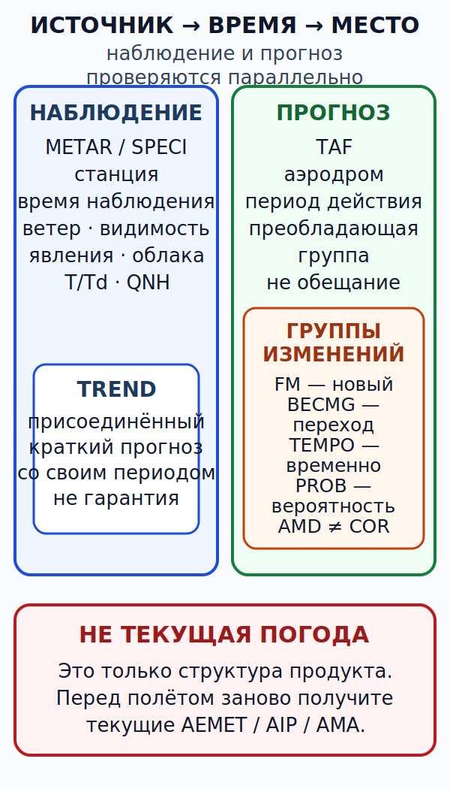

# Аэродромные сводки, прогнозы, предупреждения и карты Испании {#metar-taf-sigmet-charts}

## Зачем эта глава {#purpose}

Умение прочитать код ещё не означает умения применить продукт. Пилот сначала устанавливает источник, место, время, период действия и ограничения, затем декодирует группы и только после этого связывает сообщение с маршрутом, характеристиками воздушного судна и путём отхода.

До результатов обучения зафиксируйте четыре термина: [краткосрочный прогноз тенденции (English: trend forecast, TREND; español: pronóstico de tendencia)][trend], [информация о значимых метеорологических явлениях (English: significant meteorological information, SIGMET; español: información SIGMET sobre fenómenos meteorológicos significativos)][sigmet], [карта значимой погоды нижних уровней (English: significant weather chart for low-level flights, SWL; español: mapa de tiempo significativo para vuelos a baja altura)][swl] и [авиационный метеорологический сервис самообслуживания AEMET (English: Aeronautical Meteorological Self-service, AMA; español: Autoservicio Meteorológico Aeronáutico)][ama]. Полные определения доступны по ссылкам. Источники терминов: `SRC-AEMET-GUIA-MET-2025`, pp. 18–60, и `SRC-ENAIRE-AIP-GEN-3-5-2026` (проверено 2026-07-13).

## Результаты обучения {#outcomes}

После главы вы сможете:

1. отделить наблюдение от прогноза и предупреждения;
2. разобрать [METAR][metar], [SPECI][speci], [TREND][trend] и [TAF][taf];
3. применить группы BECMG, FM, TEMPO, PROB30/40, AMD и COR;
4. назвать роль [SIGMET][sigmet], [AIRMET][airmet], [GAMET][gamet], [SWL][swl], радара, спутника и данных о молниях;
5. собрать многослойную картину для испанского [ULM][ulm], не превращая один код в разрешение на вылет.

## Карта применимости {#applicability}

| Метка | Как использовать главу |
|---|---|
| [ULM — ОСНОВА][ulm] | Основной язык текущей погоды и прогноза для полётов в Испании. |
| [ULM — ОСОБО ВАЖНО][ulm] | Код всегда связывается с местом, временем, маршрутом и путём отхода. |
| [PART-FCL — ОБЩЕЕ][part-fcl] | Те же продукты входят в теорию [LAPL(A)][lapl]/[PPL(A)][ppl]. |
| [LAPL — ПЕРЕХОД][lapl] | Применимость [Part-NCO](../reference/glossary.md#term-part-nco) определяется видом эксплуатации, а не одной лицензией. |
| [PPL — РАСШИРЕНИЕ][ppl] | Дополняется эксплуатационная оценка групп изменений и повторное планирование. |
| [ИСПАНИЯ] | Оперативные источники — текущие AEMET, [AIP][aip] España и [AMA][ama]. |
| [БЕЗОПАСНОСТЬ] | Архивный пример никогда не является погодой для полёта. |
| [ПРОВЕРИТЬ ПЕРЕД ПОЛЁТОМ] | Источник, выпуск, наблюдение, период действия, район, поправки и пропуски данных. |

## Теория {#theory}

### Первое употребление основных продуктов {#product-first-use}

| Код | Русский эквивалент | English | Español |
|---|---|---|---|
| [METAR][metar] | регулярная аэродромная метеорологическая сводка | routine aerodrome meteorological report | informe meteorológico ordinario de aeródromo |
| [TAF][taf] | аэродромный прогноз | aerodrome forecast | pronóstico de aeródromo |
| [SPECI][speci] | специальная аэродромная метеорологическая сводка | selected special aerodrome meteorological report | informe meteorológico especial seleccionado de aeródromo |
| [AIRMET][airmet] | информация о заданных явлениях на малых высотах | airmen's meteorological information for specified lower-level phenomena | información [AIRMET][airmet] para fenómenos especificados a niveles bajos |
| [GAMET][gamet] | зональный прогноз для полётов на малых высотах | area forecast for low-level flights | pronóstico de área para vuelos a baja altura |
| [SWL][swl] | карта значимой погоды нижних уровней | significant weather chart for low-level flights | mapa de tiempo significativo para vuelos a baja altura |

Эти определения описывают тип продукта, а не его пригодность для конкретного маршрута. Источники терминов и форматов: `SRC-AEMET-GUIA-MET-2025`, pp. 18–48, и `SRC-AEMET-CODE-FORMS-2021`, pp. 1–14 (проверено 2026-07-13).

### Источник, время, место и применимость {#source-time-place-validity}

Сначала определите название продукта, станцию, FIR или район, время выпуска в UTC, время наблюдения либо период действия, а затем возраст к ожидаемому времени использования. [METAR][metar] и [SPECI][speci] сообщают наблюдавшиеся аэродромные условия; [TAF][taf] прогнозирует условия аэродрома на период действия. [METAR][metar] не описывает весь маршрут. [TAF][taf] не является обещанием: это прогноз с группами изменения и вероятности. Источники: `SRC-AEMET-GUIA-MET-2025`, pp. 18–31, и `SRC-ENAIRE-AIP-GEN-3-5-2026`, §§3.1–3.3 (проверено 2026-07-13).

### [METAR][metar], [SPECI][speci] и [TREND][trend] {#metar-speci-trend}

[METAR][metar] является регулярной сводкой, [SPECI][speci] — специальной сводкой после установленного значимого изменения, а [TREND][trend] — краткосрочным прогнозом тенденции для посадки, присоединяемым к сводке там, где он предоставляется. [SPECI][speci] не является исправлением [TAF][taf]: COR исправляет ошибку уже выпущенного сообщения, а [SPECI][speci] сообщает новые наблюдавшиеся условия. AUTO указывает на автоматическое наблюдение; пропущенные или ограниченные элементы требуют отдельной оценки. Источники: `SRC-AEMET-CODE-FORMS-2021`, pp. 1–4, и `SRC-ENAIRE-AIP-GEN-3-5-2026`, §§3.1–3.2 (проверено 2026-07-13).

### [TAF][taf] и группы изменений {#taf-change-groups}

- FM начинает новую преобладающую часть прогноза с указанного момента;
- BECMG описывает переход к новым преобладающим условиям в указанном интервале;
- TEMPO описывает временные колебания в пределах правил кода;
- PROB30/40 выражает вероятность указанных условий;
- AMD изменяет содержание прогноза, а COR исправляет ошибку выпуска.

TEMPO нельзя игнорировать как «не преобладающее». PROB30 нельзя считать пренебрежимо малой: в решение входят время, вероятность, последствия и путь отхода. AMC1 NCO.OP.160 содержит специальную планировочную трактовку некоторых групп TEMPO/PROB30/40, но не разрешает игнорировать их значение для безопасности. Источники: `SRC-AEMET-GUIA-MET-2025`, pp. 26–31; AMC1 NCO.OP.160 в `SRC-EASA-AIR-OPS-2026` (проверено 2026-07-13).

### [SIGMET][sigmet], [AIRMET][airmet], [GAMET][gamet] и [SWL][swl] {#sigmet-airmet-gamet}

[SIGMET][sigmet] сообщает об установленных значимых явлениях в указанном FIR, его части или другом определённом воздушном пространстве и в заданный период; это не индивидуальный прогноз маршрута. [AIRMET][airmet] относится к установленным явлениям на малых высотах для указанного района и периода. [GAMET][gamet] является зональным прогнозом для полётов на малых высотах, а [SWL][swl] визуализирует значимую погоду нижних уровней. У каждого продукта есть район, период действия, критерии и ограничения. Отсутствие [SIGMET][sigmet] не означает отсутствия опасности. Источники: `SRC-AEMET-GUIA-MET-2025`, pp. 39–57, и `SRC-ENAIRE-AIP-GEN-3-5-2026`, §§3.6, 8 (проверено 2026-07-13).

### Расхождение V1/V5 {#v1-v5-discrepancy}

Текущий [AIP][aip] España GEN 3.5 §3.6.2 определяет `V1` как видимость ниже 1000 м, а `V5` — 1000–5000 м. На p. 52 Guía MET имеется формулировка, которая, по-видимому, ошибочно меняет смысл `V1`; в курсе применяется текущий [AIP][aip], а расхождение записано в аудите источников. Источник: `SRC-ENAIRE-AIP-GEN-3-5-2026` (проверено 2026-07-13).

### Радар, спутник и молнии {#radar-satellite-lightning}

Радар показывает отражённую энергию, на которую влияют осадки и режим обработки; спутник измеряет излучение в выбранных диапазонах; сеть молниепеленгации определяет разряды в пределах собственной способности обнаружения. Время слоёв может различаться. Используйте последовательность кадров и отметки времени, но не считайте цветной пиксель прямым значением турбулентности или гарантией просвета. Источники: `SRC-AEMET-GUIA-MET-2025`, pp. 50–60, и `SRC-ENAIRE-AIP-GEN-3-5-2026`, §9.1 (проверено 2026-07-13).

### [AMA][ama] и динамические источники {#ama}

AEMET, [AIP][aip] и [AMA][ama] являются динамическими оперативными источниками. Перед полётом запишите время получения, время выпуска, период действия, ожидаемое следующее обновление и отсутствующие слои. Архивный снимок не является текущей погодой; иллюстрация из руководства не является данными для вылета. Источники: `SRC-AEMET-GUIA-MET-2025`, pp. 58–60, и `SRC-ENAIRE-AIP-GEN-3-5-2026` (проверено 2026-07-13).

## Десять синтетических разборов {#synthetic-decoding-exercises}

### Синтетический пример MET-DEC-01 — обычное наблюдение {#met-dec-01}

**СИНТЕТИЧЕСКИЙ УЧЕБНЫЙ ПРИМЕР — НЕ ДЛЯ ПОЛЁТА**

**Код:** `METAR LEZZ 131000Z 24008KT 9999 FEW030 22/12 Q1018 NOSIG=`

**Разбор:** вымышленная станция LEZZ; наблюдение 13-го числа в 10:00 UTC; ветер 240°/8 kt; видимость 10 км или более; FEW на 3000 ft над уровнем аэродрома; температура 22 °C, точка росы 12 °C; [QNH][qnh] 1018 hPa; значимого изменения в периоде [TREND][trend] не ожидается.

**Решение пилота:** проверить маршрутные продукты, ветер по высотам и возраст наблюдения к фактическому вылету; NOSIG не описывает весь маршрут.

**Источник:** формат [METAR][metar] и NOSIG — `SRC-AEMET-CODE-FORMS-2021`, pp. 1–4 (проверено 2026-07-13).

### Синтетический пример MET-DEC-02 — порыв {#met-dec-02}

**СИНТЕТИЧЕСКИЙ УЧЕБНЫЙ ПРИМЕР — НЕ ДЛЯ ПОЛЁТА**

**Код:** `METAR LEZZ 131030Z 29014G26KT 9999 SCT025 24/14 Q1014=`

**Разбор:** ветер 290° со средней скоростью 14 kt и порывом 26 kt; видимость 10 км или более; SCT на 2500 ft; температура/точка росы 24/14 °C; [QNH][qnh] 1014 hPa.

**Решение пилота:** рассчитать составляющие отдельно для средней скорости и порыва, затем применить наиболее строгий предел и запас.

**Источник:** группа ветра с G — `SRC-AEMET-GUIA-MET-2025`, p. 18; применение ограничений конкретного борта не выводится из кода (проверено 2026-07-13).

### Синтетический пример MET-DEC-03 — переменное направление {#met-dec-03}

**СИНТЕТИЧЕСКИЙ УЧЕБНЫЙ ПРИМЕР — НЕ ДЛЯ ПОЛЁТА**

**Код:** `METAR LEZZ 131100Z VRB04KT 8000 NSC 20/16 Q1016=`

**Разбор:** скорость 4 kt — не менее 3 kt. Поэтому VRB здесь не объясняется правилом для скорости менее 3 kt: он означает общий разброс направления не менее 180° либо невозможность сообщить одно направление. Далее: видимость 8 км; значимой облачности по критериям кода не сообщено; температура/точка росы 20/16 °C; [QNH][qnh] 1016 hPa.

**Решение пилота:** не считать слабую среднюю скорость гарантией постоянного направления; проверить актуальный ветер у ВПП, местную циркуляцию и тенденцию.

**Источник:** правило VRB — `SRC-AEMET-GUIA-MET-2025`, p. 18 (проверено 2026-07-13).

### Синтетический пример MET-DEC-04 — ловушка [CAVOK][cavok] {#met-dec-04}

**СИНТЕТИЧЕСКИЙ УЧЕБНЫЙ ПРИМЕР — НЕ ДЛЯ ПОЛЁТА**

**Код:** `METAR LEZZ 131130Z 08018KT CAVOK 30/09 Q1009=`

**Разбор:** ветер 080°/18 kt; [CAVOK][cavok] заменяет группы видимости, значимых явлений и облачности по кодовым критериям; температура/точка росы 30/09 °C; [QNH][qnh] 1009 hPa. Код ничего не говорит о волне по маршруту, влиянии порывов на характеристики или будущем изменении вне продукта.

**Решение пилота:** не приравнивать [CAVOK][cavok] к ясному и безопасному небу; проверить ветер, характеристики, рельеф и маршрутные продукты.

**Источник:** критерии [CAVOK][cavok] — `SRC-AEMET-CODE-FORMS-2021`, pp. 1–2 (проверено 2026-07-13).

### Синтетический пример MET-DEC-05 — низкая видимость, явления и облачность {#met-dec-05}

**СИНТЕТИЧЕСКИЙ УЧЕБНЫЙ ПРИМЕР — НЕ ДЛЯ ПОЛЁТА**

**Код:** `METAR LEZZ 131200Z 02006KT 1800 -RA BR BKN004 OVC009 12/11 Q1021=`

**Разбор:** ветер 020°/6 kt; видимость 1800 м; слабый дождь и дымка; BKN 400 ft и OVC 900 ft над уровнем аэродрома; температура/точка росы 12/11 °C; [QNH][qnh] 1021 hPa.

**Решение пилота:** условия убирают визуальный запас; одна аэродромная сводка не доказывает проходимость маршрута.

**Источник:** группы видимости, явлений и облачности — `SRC-AEMET-CODE-FORMS-2021`, pp. 1–2 (проверено 2026-07-13).

### Синтетический пример MET-DEC-06 — AUTO и отсутствующие данные {#met-dec-06}

**СИНТЕТИЧЕСКИЙ УЧЕБНЫЙ ПРИМЕР — НЕ ДЛЯ ПОЛЁТА**

**Код:** `METAR LEZZ 131230Z AUTO /////KT //// // ////// 18/17 Q////=`

**Разбор:** AUTO указывает автоматическое наблюдение; косые черты обозначают недоступные элементы ветра, видимости, явлений, облачности и давления; сообщены только температура/точка росы 18/17 °C.

**Решение пилота:** пропуск данных означает неизвестность, а не благоприятные условия; получить другие текущие официальные слои или отложить решение.

**Источник:** автоматические и отсутствующие группы — `SRC-AEMET-CODE-FORMS-2021`, pp. 3–4 (проверено 2026-07-13).

### Синтетический пример MET-DEC-07 — специальная сводка и [TREND][trend] {#met-dec-07}

**СИНТЕТИЧЕСКИЙ УЧЕБНЫЙ ПРИМЕР — НЕ ДЛЯ ПОЛЁТА**

**Код:** `SPECI LEZZ 131300Z 25020G32KT 3000 TSRA BKN012CB 19/17 Q1008 BECMG AT1330 9999 NSW SCT020=`

**Разбор:** [SPECI][speci] сообщает наблюдавшееся значимое ухудшение: грозовой дождь, CB, порыв 32 kt и видимость 3000 м. Присоединённый [TREND][trend] прогнозирует изменение около 13:30 UTC к видимости 10 км или более, отсутствию значимых явлений и SCT 2000 ft.

**Решение пилота:** [SPECI][speci] не является исправлением [TAF][taf], а [TREND][trend] не гарантирует исход; текущая гроза обосновывает DELAY.

**Источник:** [SPECI][speci] и [TREND][trend] — `SRC-AEMET-GUIA-MET-2025`, pp. 18–25 (проверено 2026-07-13).

### Синтетический пример MET-DEC-08 — BECMG и FM {#met-dec-08}

**СИНТЕТИЧЕСКИЙ УЧЕБНЫЙ ПРИМЕР — НЕ ДЛЯ ПОЛЁТА**

**Код:** `TAF LEZZ 131100Z 1312/1321 22008KT 9999 SCT030 BECMG 1314/1316 28015G25KT FM131800 32010KT CAVOK=`

**Разбор:** [TAF][taf] действует 12–21 UTC; сначала заданы преобладающие условия; с 14 до 16 UTC происходит переход к порывистому северо-западному ветру; с 18 UTC начинается новая преобладающая группа с [CAVOK][cavok].

**Решение пилота:** оценить каждое окно ожидаемого использования и неопределённость внутри BECMG; не применять финальную группу раньше времени.

**Источник:** BECMG и FM — `SRC-AEMET-GUIA-MET-2025`, pp. 26–31 (проверено 2026-07-13).

### Синтетический пример MET-DEC-09 — TEMPO {#met-dec-09}

**СИНТЕТИЧЕСКИЙ УЧЕБНЫЙ ПРИМЕР — НЕ ДЛЯ ПОЛЁТА**

**Код:** `TAF LEZZ 131100Z 1312/1320 18010KT 9999 SCT025 TEMPO 1314/1318 3000 SHRA BKN012TCU=`

**Разбор:** преобладающие условия лучше, но с 14 до 18 UTC временно прогнозируются видимость 3000 м, ливни и BKN TCU на 1200 ft.

**Решение пилота:** TEMPO нельзя игнорировать; сопоставить окно полёта, последствия, пути отхода и запас, а при недостаточном запасе выбрать DELAY, REROUTE или CANCEL.

**Источник:** TEMPO — `SRC-AEMET-GUIA-MET-2025`, pp. 26–31 (проверено 2026-07-13).

### Синтетический пример MET-DEC-10 — вероятность, изменение и исправление {#met-dec-10}

**СИНТЕТИЧЕСКИЙ УЧЕБНЫЙ ПРИМЕР — НЕ ДЛЯ ПОЛЁТА**

**Код:** `TAF AMD LEZZ 131200Z 1312/1321 09012KT 9999 SCT020 PROB30 TEMPO 1315/1318 2000 TSRA BKN008CB PROB40 1318/1320 4000 SHRA BKN012=`; `TAF COR` обозначал бы исправление ошибки выпущенного сообщения.

**Разбор:** AMD изменяет содержание прогноза; PROB30 относится к вероятности временного грозового ухудшения в одном окне, PROB40 — к вероятности указанного ухудшения позднее; COR имеет иную, редакционную цель.

**Решение пилота:** PROB30 нельзя считать пренебрежимо малой по определению; оценить время, последствия, запасные варианты и следующий выпуск.

**Источник:** PROB30/40, AMD и COR — `SRC-AEMET-GUIA-MET-2025`, pp. 26–31 (проверено 2026-07-13).

## Применение к [ULM][ulm] {#ulm-application}

Для испанского [ULM][ulm] соберите многослойную картину: текущие [METAR][metar]/[SPECI][speci], [TAF][taf]/[TREND][trend], [GAMET][gamet]/[SWL][swl], [AIRMET][airmet]/[SIGMET][sigmet], радар, спутник, данные о молниях и местную аэродромную информацию. Ни одно декодированное сообщение не создаёт универсального условия GO. Источники: `SRC-ENAIRE-AIP-GEN-3-5-2026`, `SRC-AEMET-GUIA-MET-2025` (проверено 2026-07-13).

## Расширение LAPL/PPL {#part-fcl-extension}

Для некоммерческой эксплуатации самолёта, подпадающей под Регламент (ЕС) 965/2012, Annex VII, применяется [Part-NCO](../reference/glossary.md#term-part-nco). Одно наличие [LAPL(A)][lapl] или [PPL(A)][ppl] не определяет применимость; национальный режим [ULM][ulm] Испании остаётся отдельным. NCO.OP.160 регулирует решение о начале или продолжении с последней доступной метеоинформацией, GM1 — перепланирование в полёте, GM2 — осторожную оценку, а AMC1 — отдельные группы изменений. Источники: применимость по виду эксплуатации — Article 5(4), Annex VII, NCO.OP.160, AMC1 и GM1/GM2 в `SRC-EASA-AIR-OPS-2026`; национальная граница испанского [ULM][ulm] — `SRC-BOE-RD-765-2022` (проверено 2026-07-13).

## Безопасность {#safety}

Перед каждым оперативным применением заново получите продукт, подтвердите источник/время/район/период действия и отметьте недоступные данные. Синтетические примеры выше и архивные снимки недействительны для полёта. Источники динамических продуктов: `SRC-AEMET-GUIA-MET-2025`, `SRC-ENAIRE-AIP-GEN-3-5-2026` (проверено 2026-07-13).

## Типичные ошибки {#common-errors}

1. Читать [METAR][metar] как погоду всего маршрута.
2. Считать [TAF][taf] обещанием.
3. Игнорировать TEMPO или PROB30.
4. Называть [SPECI][speci] исправлением [TAF][taf].
5. Считать отсутствие [SIGMET][sigmet] отсутствием опасности.

## Краткий конспект {#summary}

- Наблюдение, прогноз и предупреждение отвечают на разные вопросы.
- Группы изменений структурируют время и неопределённость.
- Динамический продукт должен быть актуален к ожидаемому времени использования.
- Декодированный код не является полным метеоинструктажем.

## Контрольные вопросы {#review-questions}

### Q-MET-026 — Что первым проверяют перед декодированием метеосообщения? {#q-met-026}

A. Источник/место, время выпуска или наблюдения, период действия и возраст к ожидаемому использованию. 
B. Сначала расшифровывают только давление, а источник и время проверяют после решения. 
C. Достаточно убедиться, что станция назначения совпадает с планом; район маршрута можно проверить позднее. 
D. Самое новое сообщение всегда применимо, даже если относится к другой станции или FIR.

**Правильный ответ:** A.

**Почему:** Смысл продукта зависит от того, кто, где и когда его выпустил; устаревшие или пространственно неприменимые данные можно расшифровать правильно, но применить ошибочно.

**Почему главный отвлекающий вариант неверен:** B игнорирует пространственную и временную применимость, без которой одно давление не поддерживает решение о вылете.

**Источник объяснения:** `SRC-AEMET-GUIA-MET-2025`, pp. 18–31 (проверено 2026-07-13).

### Q-MET-027 — Чем [SPECI][speci] отличается от COR? {#q-met-027}

A. [SPECI][speci] сообщает выбранное значимое наблюдавшееся изменение; COR исправляет ошибку выпущенного сообщения. 
B. [SPECI][speci] выпускается только после поправки [TAF][taf], а COR начинает новое наблюдение. 
C. Обозначения взаимозаменяемы, если время выпуска совпадает. 
D. COR всегда заменяет содержание предыдущего наблюдения новым фактическим изменением.

**Правильный ответ:** A.

**Почему:** Формы кода разделяют специальное наблюдение и редакционное исправление.

**Почему главный отвлекающий вариант неверен:** C ошибочно делает [SPECI][speci] и COR взаимозаменяемыми, стирая различие между новым наблюдением и исправлением ошибки.

**Источник объяснения:** `SRC-AEMET-CODE-FORMS-2021`, pp. 1–6 (проверено 2026-07-13).

### Q-MET-028 — Почему TEMPO нельзя автоматически игнорировать? {#q-met-028}

A. Временное ухудшение может совпасть с полётом и иметь серьёзные последствия, даже не будучи преобладающим. 
B. Если TEMPO короче всего периода [TAF][taf], его условия не могут попасть в окно использования. 
C. TEMPO учитывают только после того, как фактическое наблюдение уже подтвердило ухудшение. 
D. При наличии запасного аэродрома последствия TEMPO можно не оценивать.

**Правильный ответ:** A.

**Почему:** Планирование сопоставляет окно времени, применимую трактовку вероятности, последствия и путь отхода; нюанс [AMC][amc] не является общим разрешением игнорировать группу.

**Почему главный отвлекающий вариант неверен:** B смешивает долю периода с совпадением конкретного окна полёта и последствиями.

**Источник объяснения:** `SRC-AEMET-GUIA-MET-2025`, pp. 26–31; AMC1 NCO.OP.160 в `SRC-EASA-AIR-OPS-2026` (проверено 2026-07-13).

### Q-MET-029 — Что означает `V1` на текущей испанской карте малых высот? {#q-met-029}

A. Видимость ниже 1000 м. 
B. Видимость от 1000 до 5000 м. 
C. Преобладающую видимость ровно 1000 м. 
D. Базу облаков ниже 1000 ft.

**Правильный ответ:** A.

**Почему:** [AIP][aip] España GEN 3.5 §3.6.2 определяет `V1 < 1000 м`; его текущая формулировка имеет приоритет над видимой опечаткой руководства.

**Почему главный отвлекающий вариант неверен:** Диапазон 1000–5000 м обозначается `V5`, тогда как `V1` относится к видимости ниже 1000 м.

**Источник объяснения:** `SRC-ENAIRE-AIP-GEN-3-5-2026`, §3.6.2 (проверено 2026-07-13).

### Q-MET-030 — Как использовать архивный снимок [AMA][ama] из урока? {#q-met-030}

A. Только для изучения интерфейса и структуры; для полёта заново получить текущие действующие данные. 
B. Считать его действующим, если маршрут и время суток похожи на учебный пример. 
C. Обновить только аэродромную сводку, а остальные слои оставить из снимка. 
D. Использовать цветовую картину как замену времени выпуска и периода действия.

**Правильный ответ:** A.

**Почему:** [AMA][ama] является динамическим каналом; историческая отметка времени не даёт снимку оперативной актуальности.

**Почему главный отвлекающий вариант неверен:** B игнорирует время выпуска и период действия и может применить устаревшую опасность или улучшение.

**Источник объяснения:** `SRC-AEMET-GUIA-MET-2025`, pp. 58–60 (проверено 2026-07-13).

## Источники {#sources}

- `SRC-AEMET-GUIA-MET-2025` — pp. 18–60: объяснение продуктов; примеры не являются текущей погодой; проверено 2026-07-13.
- `SRC-AEMET-CODE-FORMS-2021` — официальные формы кода, сверенные с текущим [AIP][aip]; проверено 2026-07-13.
- `SRC-ENAIRE-AIP-GEN-3-5-2026` — текущие испанские продукты и определения V1/V5; динамический источник; проверено 2026-07-13.
- `SRC-EASA-AIR-OPS-2026` — Article 5(4), Annex VII, NCO.OP.160, AMC1 и GM1/GM2; проверено 2026-07-13.
- `SRC-ICAO-ANNEX3-2025` — только метаданные 21st Edition, August 2025; не используется для вывода о непроверенной реализации в Испании; проверено 2026-07-13.

[metar]: ../reference/glossary.md#term-metar
[taf]: ../reference/glossary.md#term-taf
[speci]: ../reference/glossary.md#term-speci
[trend]: ../reference/glossary.md#term-trend
[sigmet]: ../reference/glossary.md#term-sigmet
[airmet]: ../reference/glossary.md#term-airmet
[gamet]: ../reference/glossary.md#term-gamet
[ama]: ../reference/glossary.md#term-aeronautical-meteorological-self-service-ama
[cavok]: ../reference/glossary.md#term-cavok
[qnh]: ../reference/glossary.md#term-qnh
[ulm]: ../reference/glossary.md#term-ulm
[lapl]: ../reference/glossary.md#term-lapl-a
[ppl]: ../reference/glossary.md#term-ppl-a
[part-fcl]: ../reference/glossary.md#term-part-fcl
[aip]: ../reference/glossary.md#term-aip
[amc]: ../reference/glossary.md#term-amc
[swl]: ../reference/glossary.md#term-significant-weather-chart-low-level-swl
