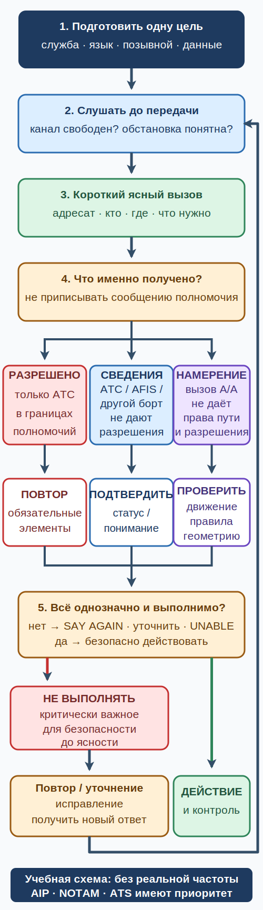

# Структура сообщения и контроль понимания {#message-control}

## Назначение {#purpose}

Глава учит строить короткое сообщение, различать подтверждение и обязательный повтор, а при неопределённости останавливать критичное для безопасности действие. Для [ULM](../reference/glossary.md#term-ulm) в Испании это прежде всего навык работы вне [контролируемого воздушного пространства](../reference/glossary.md#term-controlled-airspace); контролируемые примеры заранее готовят к последующему [LAPL(A)](../reference/glossary.md#term-lapl-a)/[PPL(A)](../reference/glossary.md#term-ppl-a).

## Результаты обучения {#outcomes}

Вы сможете выбрать нужные поля сообщения, повторить обязательные элементы, корректно использовать `ROGER`, `WILCO`, `AFFIRM`, `NEGATIVE`, `SAY AGAIN`, исправить ошибку и перейти к ясной нестандартной речи без выдуманной фразы.

## Карта применимости {#applicability}

| Метка | Как использовать главу |
|---|---|
| [ULM — ОСНОВА][ulm] | Точность сообщения и контроль понимания. |
| [ULM — ОСОБО ВАЖНО][ulm] | Не считать передачу разрешением пространства. |
| [PART-FCL — ОБЩЕЕ][part-fcl] | Правила [SERA](../reference/glossary.md#term-sera) об [обязательном повторе](../reference/glossary.md#term-readback) применимы по контексту. |
| [LAPL — ПЕРЕХОД] | Практиковать с [DTO](../reference/glossary.md#term-dto) на фактическом языке R/T. |
| [PPL — РАСШИРЕНИЕ] | Добавить более сложные обмены с ATS без потери структуры. |
| [ИСПАНИЯ] | Испанские пары проверять по RCA/[AIP](../reference/glossary.md#term-aip). |
| [БЕЗОПАСНОСТЬ] | Неясное сообщение о ВПП или уровне не исполняется. |
| [ПРОВЕРИТЬ ПЕРЕД ПОЛЁТОМ] | Тип обслуживания, [позывной](../reference/glossary.md#term-callsign), маршрут, уровень и ожидаемые точки. |

## Теория {#theory}

### Каркас сообщения {#message-structure}

Сначала слушайте. Начальный вызов обычно содержит адресата, полный позывной, при необходимости тип/позицию/уровень, намерение и релевантную информацию. Последующие сообщения короче. Каждое сообщение не обязано иметь одинаковые поля: передают только нужное для текущей цели, не скрывая критичный контекст.

Это шаблон мышления, а не универсальный сценарий:

1. **Кому:** правильная станция или воздушное движение.
2. **Кто:** полный/разрешённо сокращённый позывной.
3. **Где/на каком уровне:** когда это нужно для идентификации и конфликта.
4. **Что происходит:** факт, запрос или намерение.
5. **Что нужно:** одна ясная цель.

### Подтверждение и обязательный повтор {#mandatory-readback}

[Обязательный повтор принятого элемента (English: readback; español: colación)][readback] позволяет диспетчеру проверить точность. [Подтверждение приёма (English: acknowledgement; español: acuse de recibo)][acknowledgement] лишь показывает, что сообщение принято. `ROGER` не является полным обязательным повтором; `WILCO` означает «будет выполнено», но не заменяет повтор элементов, которые [SERA](../reference/glossary.md#term-sera) требует вернуть.

По [SERA](../reference/glossary.md#term-sera).8015(e) экипаж повторяет переданные голосом части разрешений и указаний ATC, связанные с безопасностью. Всегда повторяются: маршрутные разрешения ATC; разрешения и указания войти на ВПП, приземлиться, взлететь, остановиться перед ВПП, пересечь её, рулить и выполнить обратное руление по ВПП; используемая ВПП; установки высотомера; коды SSR; указания по уровню, курсу и скорости; переходные уровни, когда их выдал диспетчер или они содержатся в ATIS. Остальные разрешения и указания подтверждают так, чтобы показать понимание. Диспетчер слушает повтор и немедленно исправляет расхождение. Источник: `SRC-EASA-SERA-2025`, [SERA](../reference/glossary.md#term-sera).8015(e) и GM (проверено 2026-07-13).

### Слова управления диалогом {#standard-words}

| Слово | Смысл | Не означает |
|---|---|---|
| `ROGER / RECIBIDO` | сообщение принято | обязательные элементы повторены |
| `WILCO / CUMPLIRÉ` | сообщение понято и будет выполнено | автоматическое право на действие на ВПП |
| `AFFIRM / AFIRMO` | да | согласие с неясной формулировкой |
| `NEGATIVE / NEGATIVO` | нет либо разрешение не выдано | «я не понял» |
| `SAY AGAIN / REPITA` | повторите всё/указанную часть | «разрешение можно угадать» |
| `STANDBY / ESPERE` | ждите следующего вызова | одобрение или разрешение |

`TAKE-OFF` используют только в формуле разрешения на взлёт или его отмены; в других контекстах — `DEPARTURE`, чтобы не создавать ложное распознавание разрешения. Источники: `SRC-BOE-RD-1180-2018`, Annex V; `SRC-EASA-SERA-2025` (проверено 2026-07-13).

### Исправление, повтор и ясная речь {#plain-language}

Если пилот оговорился: `CORRECTION / CORRECCIÓN`, затем правильный элемент. Если непонятна часть: `SAY AGAIN [ITEM] / REPITA [ELEMENTO]`. [Ясная нестандартная речь (English: plain language; español: lenguaje claro)][plain-language] используется, когда стандартной фразеологии недостаточно: коротко опишите факт и нужную помощь. Нельзя смешивать английский и испанский как импровизированный гибрид; лучше объявить, что не поняли, замедлить обмен и использовать один поддерживаемый язык. [SERA](../reference/glossary.md#term-sera).14001 предписывает стандартную фразеологию, когда она существует, и ясную речь, когда её недостаточно; [SERA](../reference/glossary.md#term-sera).14075 требует краткости, однозначности и правильного подтверждения. Источник: `SRC-EASA-SERA-2025`, [SERA](../reference/glossary.md#term-sera).14001 и [SERA](../reference/glossary.md#term-sera).14075(a–d) (проверено 2026-07-13).

## Применение для [ULM](../reference/glossary.md#term-ulm) {#ulm-application}

Национальный [ULM](../reference/glossary.md#term-ulm)/[MAF](../reference/glossary.md#term-maf)+RTC в Испании не получает через правильную фразеологию доступ в [контролируемое воздушное пространство](../reference/glossary.md#term-controlled-airspace). Пока не выполнено отдельное условие [Part-FCL](../reference/glossary.md#term-part-fcl) из статьи 4.1(d) RD 765/2022, контролируемые обмены здесь остаются учебной подготовкой, а первичная практика выполняется в разрешённой школе или операции. Источники: `SRC-BOE-RD-765-2022`, `SRC-AESA-ULM-RTC-PROGRAM` (проверено 2026-07-13).

## Расширение [Part-FCL](../reference/glossary.md#term-part-fcl) {#part-fcl-extension}

Для [LAPL(A)](../reference/glossary.md#term-lapl-a)/[PPL(A)](../reference/glossary.md#term-ppl-a) экзамен по связи проверяет знания; отметка R/T для испанского или английского требует соответствующего экзамена и двусторонней связи на [проверке навыков](../reference/glossary.md#term-skill-test) или проверке квалификации; языковая оценка FCL.055 остаётся отдельной. Эти три условия не превращаются одно в другое. Источники: `SRC-EASA-AIRCREW-2026`; `SRC-BOE-FOM-1146-2019`, статьи 2–4 и 7–9 (проверено 2026-07-13).

## Учебные сценарии {#training-scenarios}

### Сценарий RTC-03 — Первый вызов контролируемой станции {#scenario-rtc-03}

СИНТЕТИЧЕСКИЙ УЧЕБНЫЙ СЦЕНАРИЙ — НЕ ДЛЯ ПОЛЁТА

**Тип обслуживания:** контролируемое ATS; подготовка к последующему обучению [Part-FCL](../reference/glossary.md#term-part-fcl). 
**Контекст:** воздушное судно находится вне площади маневрирования; станция и поддерживаемый язык заранее известны. 
**English:** Pilot: `[STATION], [FULL CALLSIGN]`; station: `[FULL CALLSIGN], [STATION]`; pilot: `[FULL CALLSIGN], [TYPE], AT [POSITION], REQUEST [INTENTION]`. 
**Español:** Piloto: `[STATION], [FULL CALLSIGN]`; estación: `[FULL CALLSIGN], [STATION]`; piloto: `[FULL CALLSIGN], [TYPE], EN [POSITION], SOLICITO [INTENTION]`. 
**Пояснение:** первый вариант показывает отдельные вызов и ответ. [SERA](../reference/glossary.md#term-sera) допускает и второй вариант — сразу передать полное сообщение, если достоверно известно, что вызываемая станция его примет. Смешивать варианты нельзя: ответ `PASS YOUR MESSAGE` после уже переданного полного сообщения создаёт нелогичный обмен. 
**[Readback][readback]/[acknowledgement][acknowledgement]:** ответ с полным позывным вызывающей станции и названием отвечающей станции приглашает продолжить передачу; обязательных элементов ВПП пока нет. 
**Решение при сомнении:** если название станции или ответ неясны, запросите повтор и не начинайте движение. 
Источник: `SRC-EASA-SERA-2025`, [SERA](../reference/glossary.md#term-sera).14055(b)(1–3) и GM1 [SERA](../reference/glossary.md#term-sera).14055(b) (проверено 2026-07-13).

### Сценарий RTC-04 — Непонятное критичное указание {#scenario-rtc-04}

СИНТЕТИЧЕСКИЙ УЧЕБНЫЙ СЦЕНАРИЙ — НЕ ДЛЯ ПОЛЁТА

**Тип обслуживания:** контролируемое ATS. 
**Контекст:** получена неразборчивая часть указания по ВПП. 
**English:** Pilot: `[CALLSIGN], SAY AGAIN RUNWAY INSTRUCTION`; station: `[CALLSIGN], HOLD SHORT OF RUNWAY [RUNWAY]`; pilot: `HOLDING SHORT OF RUNWAY [RUNWAY], [CALLSIGN]`. 
**Español:** Piloto: `[CALLSIGN], REPITA INSTRUCCIÓN DE PISTA`; estación: `[CALLSIGN], MANTENGA FUERA DE PISTA [RUNWAY]`; piloto: `MANTENGO FUERA DE PISTA [RUNWAY], [CALLSIGN]`. 
**Пояснение:** пилот не достраивает потерянное слово и получает однозначное ограничение. 
**[Readback][readback]/[acknowledgement][acknowledgement]:** указание остановиться перед ВПП повторяется полностью с обозначением ВПП. 
**Решение при сомнении:** остановитесь до точки ожидания; если повтор снова неясен, сообщите `UNABLE TO UNDERSTAND / NO COMPRENDO` и ждите. 
Источник: `SRC-EASA-SERA-2025`, [SERA](../reference/glossary.md#term-sera).8015(e); `SRC-BOE-RD-1180-2018`, Annex V 1.4.9(d–f) (проверено 2026-07-13).

## Безопасность {#safety}

Неосторожная работа с PTT, зажатая кнопка микрофона и одновременные передачи могут создать «правдоподобный» обрыв. Неразборчивое разрешение по ВПП нельзя дополнять по ожиданию. `STANDBY` не является одобрением. Информация о движении не является [разрешением ATC](../reference/glossary.md#term-atc-clearance).

## Типичные ошибки {#common-errors}

1. Отвечать `ROGER` на разрешение, требующее полного повтора.
2. Повторять только цифры, но терять действие, единицу или контекст.
3. Считать каждое сообщение пятистрочным докладом.
4. Исправлять оговорку длинным объяснением вместо `CORRECTION`.
5. Угадывать слово из ожидаемой процедуры.

## Конспект {#summary}

- Структура зависит от цели сообщения.
- Критичные элементы ATC повторяются точно.
- `ROGER` подтверждает приём, а не содержание обязательного повтора.
- Неясность требует `SAY AGAIN`, уточнения и остановки действия.
- Стандартная фразеология дополняется ясной речью, когда это необходимо.

## Контрольные вопросы {#review-questions}

### Q-RTC-006 — Какой ответ достаточен на указание остановиться перед конкретной ВПП? {#q-rtc-006}

A. `ROGER` без других элементов. 
B. Полный повтор действия и обозначения ВПП с позывным. 
C. Только собственный позывной. 
D. Повторить только номер ВПП, опустив указание остановиться перед ней.

**Правильный ответ:** B.

**Почему:** [SERA](../reference/glossary.md#term-sera).8015(e) включает указание остановиться перед ВПП в связанные с безопасностью элементы обязательного повтора.

**Почему главный отвлекающий вариант неверен:** По [SERA](../reference/glossary.md#term-sera).8015(e) один `ROGER` подтверждает приём, но не показывает, какая ВПП и какое ограничение поняты.

### Q-RTC-007 — Что пилот делает, если потерял одно слово указания по ВПП? {#q-rtc-007}

A. Восстанавливает его из привычной процедуры. 
B. Просит повторить конкретный элемент и не выполняет действие до ясности. 
C. Выполняет наиболее вероятный вариант на малой скорости. 
D. Переключает язык внутри фразы без уведомления станции.

**Правильный ответ:** B.

**Почему:** Уточнение до начала движения устраняет риск несанкционированного занятия ВПП и сохраняет однозначный контекст.

**Почему главный отвлекающий вариант неверен:** A превращает ожидание пилота в выдуманное разрешение, которого станция могла не выдавать.

### Q-RTC-008 — Каково точное значение `STANDBY`? {#q-rtc-008}

A. Запрос одобрен, начинайте действие. 
B. Ждите следующего вызова; разрешение ещё не выдано. 
C. Можно занять ВПП, если ответ станции задерживается. 
D. Воздушное судно получило приоритет.

**Правильный ответ:** B.

**Почему:** `STANDBY` управляет очередностью связи и не содержит эксплуатационного одобрения.

**Почему главный отвлекающий вариант неверен:** A ошибочно превращает `STANDBY`, то есть ожидание ответа, в положительное разрешение.

### Q-RTC-009 — Когда уместна ясная нестандартная речь? {#q-rtc-009}

A. Всегда вместо известной стандартной фразеологии. 
B. Когда стандартной формулы недостаточно, чтобы однозначно описать факт или нужную помощь. 
C. Только для сообщений без позывного. 
D. Для свободного смешивания двух языков в одном предложении.

**Правильный ответ:** B.

**Почему:** [Ясная нестандартная речь](../reference/glossary.md#term-plain-language) закрывает смысловой пробел, сохраняя краткость и один поддерживаемый язык.

**Почему главный отвлекающий вариант неверен:** A убирает общую предсказуемую структуру даже там, где стандартная фразеология точна.

### Q-RTC-010 — Какие поля нужно передавать в каждом радиосообщении? {#q-rtc-010}

A. Всегда адресат, тип, маршрут, топливо, пассажиров и погоду. 
B. Только поля, нужные для текущей цели и однозначного понимания, сохраняя обязательные элементы. 
C. Одни и те же пять полей независимо от этапа полёта. 
D. Только позывной, потому что станция знает остальное.

**Правильный ответ:** B.

**Почему:** Структура сообщения меняется по контексту: первый вызов обычно полнее, а последующий обмен короче.

**Почему главный отвлекающий вариант неверен:** C перегружает канал и не учитывает различие между первым вызовом, повтором и коротким докладом.

## Источники {#sources}

- `SRC-EASA-SERA-2025` — [SERA](../reference/glossary.md#term-sera).8015(e), [SERA](../reference/glossary.md#term-sera).14045–14075.
- `SRC-BOE-RD-1180-2018` — приложение V, открытые пары фраз на испанском и английском языках.
- `SRC-ENAIRE-AIP-GEN-3-4-2026` — испанский контекст связи и языка.
- `SRC-BOE-RD-765-2022` — условие входа [ULM](../reference/glossary.md#term-ulm) в контролируемое пространство.
- `SRC-EASA-AIRCREW-2026`, `SRC-BOE-FOM-1146-2019` — последующие различия требований [Part-FCL](../reference/glossary.md#term-part-fcl).

[readback]: ../reference/glossary.md#term-readback
[acknowledgement]: ../reference/glossary.md#term-acknowledgement
[plain-language]: ../reference/glossary.md#term-plain-language
[ulm]: ../reference/glossary.md#term-ulm
[part-fcl]: ../reference/glossary.md#term-part-fcl
