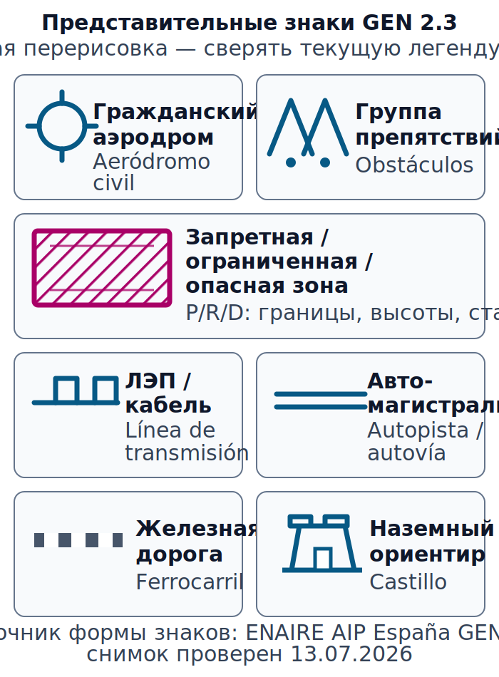

# Карты, аэронавигационные данные и пространство {#charts-airspace}

## Назначение {#purpose}

Глава учит читать карту как датированный слой информации, а не как разрешение на полёт. Основной порядок работы предназначен для [ULM](../reference/glossary.md#term-ulm)/[MAF](../reference/glossary.md#term-maf) внутри Испании; все реальные границы, активности и частоты обновляются перед каждым вылетом.

> **Проверено 13.07.2026; перед полётом проверить [AIP](../reference/glossary.md#term-aip)/SUP/[AIC](../reference/glossary.md#term-aic)/[NOTAM](../reference/glossary.md#term-notam) и текущий [AIRAC][airac].**

## Результаты обучения {#outcomes}

После главы вы сможете:

1. преобразовать длину на карте в расстояние на местности;
2. прочитать условный знак, отметку высоты, препятствие и вертикальные границы;
3. построить цепочку [AIP](../reference/glossary.md#term-aip) → SUP/[AIC](../reference/glossary.md#term-aic) → [NOTAM](../reference/glossary.md#term-notam) → [AIRAC][airac];
4. различить дату публикации и дату вступления данных в силу;
5. обновить нужный лист VFR500 без ложной уверенности.

## Карта применимости {#applicability}

| Метка | Как использовать главу |
|---|---|
| [ULM — ОСНОВА][ulm] | Визуальное планирование [ULM](../reference/glossary.md#term-ulm) внутри Испании. |
| [ULM — ОСОБО ВАЖНО][ulm] | Контролируемое пространство требует отдельной правовой проверки. |
| [PART-FCL — ОБЩЕЕ][part-fcl] | Порядок работы с картами и AIS сохраняется при будущем LAPL/PPL. |
| [LAPL — ПЕРЕХОД] | Позже применяется полная программа [DTO](../reference/glossary.md#term-dto)/[ATO](../reference/glossary.md#term-ato). |
| [PPL — РАСШИРЕНИЕ] | В теории навигации применяется та же общая программа, что и для LAPL; отдельного «PPL-добавления» в этом предмете нет. |
| [ИСПАНИЯ] | Используются [AIP](../reference/glossary.md#term-aip) España, VFR500 и InsigniaVFR. |
| [БЕЗОПАСНОСТЬ] | Электронная движущаяся карта (English: moving map; español: mapa móvil) не разрешает вход в пространство и не доказывает, что зона активна. |
| [ПРОВЕРИТЬ ПЕРЕД ПОЛЁТОМ] | Редакция, дата вступления в силу (English: with effect from, WEF), исправления, SUP/[AIC](../reference/glossary.md#term-aic)/[NOTAM](../reference/glossary.md#term-notam) и [AIRAC][airac]. |

## Теория {#theory}

### Масштаб, проекция и измерение {#chart-scale}

Масштаб `1:500 000` означает: одна единица на карте равна 500 000 тех же единиц на земле. Удобный вывод: `1 cm = 5 km`. Измеряют вдоль намеченной линии, а не по случайной дороге; затем переводят единицы и округляют только в конце. Назначение и проекция испанской VFR500 опубликованы в GEN 3.2 (`SRC-ENAIRE-AIP-NAVIGATION-2026`, проверено 13.07.2026).

### CALC-NAV-01 — Масштаб VFR500 {#calc-nav-01}

**Дано:** на учебном фрагменте `3.6 cm`, масштаб `1:500 000`.

**Формула:** `расстояние = длина на карте × 500 000 / 100 000` для результата в km.

**Расчёт:** `3.6 cm × 500 000 / 100 000 = 18.0 km`.

**Результат:** `18.0 km` (приблизительно `9.7 NM`).

**Решение пилота:** перенести `9.7 NM` в лог, затем независимо проверить линейкой/программой и корректность масштаба выбранного листа.

<!-- recompute-result: 18.0 -->

### Проекции, ортодромия и локсодромия {#route-projections}

Проекция переносит кривую поверхность Земли на плоскость и неизбежно сохраняет одни свойства ценой искажения других. **Цилиндрическая проекция (English: cylindrical projection; español: proyección cilíndrica)** и **равноугольная коническая проекция Ламберта (English: Lambert conformal conic projection; español: proyección cónica conforme de Lambert)** строятся по разной геометрии. У цилиндрического семейства масштаб и искажения зависят от конкретного варианта и широты; проекция Ламберта сохраняет локальные углы и применяется для испанской VFR500, но прямая на ней не является универсально точной дугой большого круга.

**Ортодромия (English: great-circle route; español: ruta ortodrómica)** — кратчайшая дуга большого круга; **локсодромия (English: rhumb line; español: ruta loxodrómica)** — линия постоянного курса относительно истинного севера. Их вид зависит от проекции. Для короткого [VFR](../reference/glossary.md#term-vfr)-маршрута измеряют направление и расстояние способом, указанным для актуальной карты, а не выбирают линию по внешней «прямоте». Предмет документа: GU09, Navegación, pp. 28–32; точные пункты 5.1–5.5 находятся на pp. 30–31 в `SRC-AESA-ULM-LEARNING-OBJECTIVES-GU09-ED01` (проверено 13.07.2026).

### Символы, рельеф и препятствия {#chart-symbols-terrain}

Легенда карты важнее «похожести значка». GEN 2.3 задаёт условные обозначения, GEN 3.2 — серии карт. **Нормализованные условные знаки [VFR](../reference/glossary.md#term-vfr)/OACI (English: [ICAO](../reference/glossary.md#term-icao) chart symbols; español: símbolos cartográficos OACI)** читают по легенде именно текущей серии. Эти OACI-символы объединены в семейства; для GU09 нужно уметь их распознавать, а не рисовать по памяти:

- **аэродромы** — гражданские, военные и совместного использования; знак не заменяет проверку статуса и данных AD;
- **препятствия** — отдельные и групповые мачты, башни, ветрогенераторы и другие вертикальные объекты; различают абсолютную отметку и относительную высоту;
- **зоны P/R/D** — запрещённые (English: prohibited, P; español: prohibidas), ограниченные (English: restricted, R; español: restringidas) и опасные (English: danger, D; español: peligrosas), для которых отдельно читают границы, высоты, время и условия;
- **ЛЭП, или линии электропередач**, канатные дороги и другие протяжённые препятствия;
- **инфраструктура** — дороги, железные дороги, мосты, трубопроводы и застроенные районы;
- **наземные ориентиры и географические объекты** — берег, реки, озёра, рельеф и заметные сооружения, подтверждаемые несколькими признаками.

*Учебная векторная перерисовка представительных форм из [ENAIRE](../reference/glossary.md#term-enaire) [AIP](../reference/glossary.md#term-aip) España [GEN 2.3](https://aip.enaire.es/AIP/contenido_AIP/GEN/LE_GEN_2_3_es.html), снимок проверен 13.07.2026. Цвет и отдельная форма могут зависеть от серии карты; перед полётом открывают текущую GEN 2.3 и легенду конкретного листа. Источник контроля: `SRC-ENAIRE-AIP-NAVIGATION-2026`.*

**Абсолютная отметка (English: elevation; español: elevación)** относится к точке или поверхности над средним уровнем моря (English: mean sea level, MSL; español: nivel medio del mar). Высота препятствия может иметь несколько подписей, смысл которых проверяется по легенде. Контур рельефа не гарантирует безопасный запас: учитываются высота полёта, неопределённость, ветер, облачность, характеристики самолёта и путь отхода. Один заметный ориентир подтверждают формой рельефа, направлением и временем. Предмет документа: GU09, Navegación, pp. 28–32, пункт 5.6 в `SRC-AESA-ULM-LEARNING-OBJECTIVES-GU09-ED01`; испанские символы: `SRC-ENAIRE-AIP-NAVIGATION-2026`, GEN 2.3 и GEN 3.2 (проверено 13.07.2026).

### Семь листов VFR500 и процесс коррекции {#vfr500-workflow}

На 13.07.2026 это не единый вечный «набор 2026». Семь печатных листов имеют разные редакции и даты данных:

| Лист | Редакция / дата данных на дату аудита |
|---|---|
| GC 2025 | data 20.03.2025 |
| LE1 2025 | data 02.10.2025 |
| LE2 2025 | data 20.03.2025 |
| LE3–LE6 2026 | data 19.03.2026 |

`VFR500_Changes` датирован 28.05.2026 и перечисляет существенные изменения после печати; [ENAIRE](../reference/glossary.md#term-enaire) указывает InsigniaVFR как постоянно обновляемое веб-представление. Практический порядок: выбрать нужный лист → прочитать редакцию и дату данных → применить `VFR500_Changes` → проверить текущие [AIP](../reference/glossary.md#term-aip)/SUP/[AIC](../reference/glossary.md#term-aic)/[NOTAM](../reference/glossary.md#term-notam) и [AIRAC][airac] → сверить InsigniaVFR → записать дату источника в лог. Источники: `SRC-ENAIRE-VFR500-2026`; `SRC-ENAIRE-AIP-NAVIGATION-2026`, GEN 3.2 §§4.2, 5, 8 (проверено 13.07.2026).

### [AIP](../reference/glossary.md#term-aip), SUP, [AIC](../reference/glossary.md#term-aic), [NOTAM](../reference/glossary.md#term-notam) и [AIRAC][airac] {#aip-sup-aic-notam-airac}

- **[AIP](../reference/glossary.md#term-aip) España** содержит постоянную и долгосрочную информацию;
- **SUP к [AIP](../reference/glossary.md#term-aip)** (English: Supplement to [AIP](../reference/glossary.md#term-aip); español: suplemento de [AIP](../reference/glossary.md#term-aip)) дополняет [AIP](../reference/glossary.md#term-aip) обычно временной информацией значительной продолжительности или объёма;
- **[AIC](../reference/glossary.md#term-aic)** сообщает пояснительную/административную информацию подходящего характера;
- **[NOTAM](../reference/glossary.md#term-notam)** оперативно распространяет существенные сведения;
- **[AIRAC][airac]** отделяет дату публикации от заранее установленной даты вступления в силу.

На 13.07.2026 использовалась версия **VIGOR**: [AIRAC][airac] 06/26 и AMDT 408/26, вступившие в силу 09.07.2026. [AIRAC][airac] 07/26 уже был опубликован, но оставался будущим и не действовал до 06.08.2026. Опубликованный будущий [AIRAC][airac] ещё не в силе. Нижний колонтитул (English: footer) отдельной страницы показывает историю её поправок, а не дату редакции всего [AIP](../reference/glossary.md#term-aip). Источник: `SRC-ENAIRE-AIP-NAVIGATION-2026`, GEN 3.1 §4 и ENR 1.10 (проверено 13.07.2026).

### Пространство как объём {#airspace-volume}

Для каждой зоны вместе читают: боковую границу, нижний и верхний пределы, класс и тип, ответственный орган, часы и условия активности, примечания. Точка на карте не «находится в зоне», пока не проверены высота и время. ENR 2.1 публикует воздушное пространство [обслуживания воздушного движения (English: air traffic services, ATS; español: servicios de tránsito aéreo)][ats], ENR 6 — связанные карты, ENR 5.5 — зоны [ULM](../reference/glossary.md#term-ulm) и другой спортивной авиационной деятельности. Запись ENR 5.5 сама по себе не разрешает использовать площадку или зону: проверяются условия, владелец/оператор, активности и [NOTAM](../reference/glossary.md#term-notam). Источник: `SRC-ENAIRE-AIP-NAVIGATION-2026` (проверено 13.07.2026).

Электронная движущаяся карта не разрешает вход в воздушное пространство. Изображение может быть устаревшим, отфильтрованным или неверно понятым по вертикали. Для [ULM](../reference/glossary.md#term-ulm) в [контролируемом воздушном пространстве](../reference/glossary.md#term-controlled-airspace) с 01.04.2026 применяются отдельные требования RD 765/2022 art. 4.1(d), включая подходящее оборудование и действующую эквивалентную лицензию [Part-FCL](../reference/glossary.md#term-part-fcl); [ULM](../reference/glossary.md#term-ulm)/[MAF](../reference/glossary.md#term-maf)/RTC сами недостаточны. Источник: `SRC-BOE-RD-765-2022` (проверено 13.07.2026).

### Ориентирование карты и наблюдаемая навигация {#pilotage-map-orientation}

В наблюдаемой навигации (English: pilotage; español: navegación observada) карту ориентируют по направлению маршрута или по северу так, чтобы связь «карта — местность» оставалась однозначной. Сначала находят крупную структуру: берег, хребет, долину, водохранилище или длинную дорогу; затем подтверждают положение формой, взаимным расположением и ожидаемым временем. Один похожий объект не считается достаточным подтверждением. Линейный ориентир пересекают под понятным углом, заранее зная, что должно появиться до и после него; если последовательность не совпала, положение считают неопределённым. Предмет документа: GU09, Navegación, pp. 28–32; точный пункт 7.3 на pp. 31–32 включает ориентирование карты, узнавание элементов местности и методы подтверждения маршрута в `SRC-AESA-ULM-LEARNING-OBJECTIVES-GU09-ED01` (проверено 13.07.2026).

## Применение для [ULM](../reference/glossary.md#term-ulm) {#ulm-application}

Маршрут [ULM](../reference/glossary.md#term-ulm) внутри Испании строят так, чтобы каждый участок имел понятные боковые и вертикальные запасы, логику безопасного пролёта рельефа и заранее заданное условие отхода. Если результат зависит от входа в контролируемое пространство, пилот отдельно проверяет лицензию, оборудование, разрешение и процедуру, а также текущую публикацию; красивая пурпурная линия на экране этого не решает.

## Расширение [Part-FCL](../reference/glossary.md#term-part-fcl) {#part-fcl-extension}

При последующем [LAPL(A)](../reference/glossary.md#term-lapl-a)/[PPL(A)](../reference/glossary.md#term-ppl-a) картографическая дисциплина остаётся общей. Для полёта, к которому применима Part-NCO, NCO.GEN.135(a)(10)/AMC1 и NCO.OP.135 относятся к доступным актуальным картам, данным и предполётной информации; применимость определяется видом эксплуатации и воздушным судном, а не самим наличием лицензии. Источник: `SRC-EASA-AIR-OPS-2026` (проверено 13.07.2026).

## Безопасность {#safety}

Минимальная перекрёстная проверка перед вылетом: выбран правильный лист и масштаб; карта и исправления актуальны; линия маршрута не пересекает неизвестный объём; вертикальная система отсчёта понятна; действующий и будущий статусы разделены; рельеф, препятствия и пути отхода проверены; места неопределённости отмечены как точки принятия решения.

## Типичные ошибки {#common-errors}

- считать старую печатную карту текущей без изменений;
- принять опубликованный [AIRAC][airac] за уже вступивший в силу;
- считать нижний колонтитул датой всего [AIP](../reference/glossary.md#term-aip);
- читать только боковой контур зоны;
- принять запись ENR 5.5 за разрешение;
- считать электронную карту авторизацией входа.

Старая печатная карта не остаётся актуальной без исправлений и текущих данных AIS, даже если её физическое состояние идеально. Электронная движущаяся карта не разрешает вход в пространство и не заменяет диспетчерское разрешение.

## Краткий конспект {#summary}

- Масштаб, легенда и проекция проверяются до измерения.
- Листы VFR500 имеют разные редакции и даты данных.
- Текущие и будущие данные разделяются.
- Воздушное пространство — трёхмерный и временной объём.

## Контрольные вопросы {#review-questions}

### Q-NAV-006 — Что означает масштаб 1:500 000? {#q-nav-006}

A. Один сантиметр на карте равен пяти километрам на земле. 
B. Один сантиметр на карте равен пятистам километрам. 
C. Пять сантиметров всегда равны одной морской миле. 
D. Масштаб автоматически исправляет искажения любой проекции.

**Правильный ответ:** A.

**Почему:** В масштабе 1:500 000 один сантиметр представляет 500 000 cm, то есть 5 km на земле.

**Почему главный отвлекающий вариант неверен:** B ошибочно переводит сантиметры в километры и завышает расстояние в сто раз.

### Q-NAV-007 — Почему [AIRAC][airac] 07/26 нельзя было использовать как действующий 13.07.2026? {#q-nav-007}

A. Цикл [AIRAC][airac] считают действующим с даты публикации, не проверяя установленную дату вступления в силу. 
B. [AIRAC][airac] 07/26 был опубликован, но дата вступления в силу наступала 06.08.2026. 
C. [AIRAC][airac] применяется только к IFR и никогда к картам [VFR](../reference/glossary.md#term-vfr). 
D. Последний опубликованный [AIRAC][airac] сразу заменяет текущий, даже если его дата вступления в силу ещё не наступила.

**Правильный ответ:** B.

**Почему:** Опубликованный [AIRAC][airac] 07/26 оставался будущим до установленной даты 06.08.2026, поэтому 13.07.2026 применялась версия VIGOR.

**Почему главный отвлекающий вариант неверен:** C неверно исключает [VFR](../reference/glossary.md#term-vfr): [AIRAC][airac] может менять существенную для эксплуатации аэронавигационную информацию маршрута.

### Q-NAV-008 — Что доказывает нижний колонтитул отдельной страницы [AIP](../reference/glossary.md#term-aip)? {#q-nav-008}

A. Дату выпуска всего [AIP](../reference/glossary.md#term-aip) España. 
B. Историю поправок этой страницы, но не редакцию всего [AIP](../reference/glossary.md#term-aip). 
C. Что все [NOTAM](../reference/glossary.md#term-notam) уже встроены в страницу. 
D. Что будущий [AIRAC][airac] уже вступил в силу.

**Правильный ответ:** B.

**Почему:** Нижний колонтитул относится к конкретной странице и истории её поправок; состав всего [AIP](../reference/glossary.md#term-aip) и текущий статус проверяют отдельно.

**Почему главный отвлекающий вариант неверен:** A переносит дату одной страницы на весь [AIP](../reference/glossary.md#term-aip), хотя его разделы обновляются неодновременно.

### Q-NAV-009 — Какие данные нужны, чтобы решить, пересекает ли маршрут воздушное пространство? {#q-nav-009}

A. Только цвет боковой границы. 
B. Боковая граница, нижний и верхний пределы, класс и тип, время и статус активности. 
C. Только высота ближайшего препятствия. 
D. Только пурпурная линия электронной карты.

**Правильный ответ:** B.

**Почему:** Воздушное пространство является боковым, вертикальным и временным объёмом, поэтому нужны границы, уровни, тип и статус.

**Почему главный отвлекающий вариант неверен:** A игнорирует вертикальные пределы, время и активность, из-за чего одинаковый боковой контур читается неверно.

### Q-NAV-010 — Как работать с печатной VFR500 перед полётом? {#q-nav-010}

A. Достаточно увидеть год 2026 на любом листе. 
B. Проверить редакцию и дату данных листа, VFR500_Changes, InsigniaVFR и текущий комплект AIS. 
C. Использовать печатный лист без исправлений до следующего календарного года. 
D. Заменить [AIP](../reference/glossary.md#term-aip)/SUP/[AIC](../reference/glossary.md#term-aic)/[NOTAM](../reference/glossary.md#term-notam) фотографией карты.

**Правильный ответ:** B.

**Почему:** Печатная VFR500 обновляется с учётом статуса конкретного листа, VFR500_Changes и текущих [AIP](../reference/glossary.md#term-aip)/SUP/[AIC](../reference/glossary.md#term-aic)/[NOTAM](../reference/glossary.md#term-notam)/[AIRAC][airac]; InsigniaVFR даёт дополнительную перекрёстную проверку.

**Почему главный отвлекающий вариант неверен:** A проверяет только год 2026 на печатной VFR500 и скрывает разные редакции GC/LE1/LE2/LE3–LE6.

## Источники {#sources}

- `SRC-AESA-ULM-LEARNING-OBJECTIVES-GU09-ED01` — Navegación, pp. 28–32; неконтролируемая копия, сверять текущий сайт [AESA](../reference/glossary.md#term-aesa); проверено 13.07.2026.
- `SRC-ENAIRE-AIP-ESPANA` — snapshot 09.07.2026, [AIRAC][airac] 06/26 и AMDT 408/26; проверено 13.07.2026.
- `SRC-ENAIRE-AIP-NAVIGATION-2026` — GEN 3.1, GEN 3.2, GEN 2.3, ENR 1.10, ENR 2.1, ENR 5.5 и ENR 6; проверено 13.07.2026.
- `SRC-ENAIRE-VFR500-2026` — corrections 28.05.2026 и неоднородные sheets; проверено 13.07.2026.
- `SRC-EASA-SERA-2025` — [SERA](../reference/glossary.md#term-sera).2010(b) pre-flight information; проверено 13.07.2026.
- `SRC-EASA-AIR-OPS-2026` — NCO.GEN.135/NCO.OP.135 только для applicable operation; проверено 13.07.2026.
- `SRC-BOE-RD-765-2022` — art. 4.1(d) и art. 4.2; проверено 13.07.2026.

[ulm]: ../reference/glossary.md#term-ulm
[part-fcl]: ../reference/glossary.md#term-part-fcl
[ats]: ../reference/glossary.md#term-air-traffic-services-ats
[airac]: ../reference/glossary.md#term-aeronautical-information-regulation-control-airac
