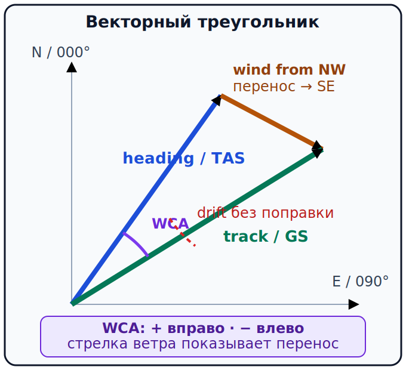

# Курс, линия пути и ветер {#heading-track-wind}

## Назначение {#purpose}

Глава показывает, почему направление носа не равно линии движения над землёй, и превращает прогноз ветра в проверяемые курс носа, время участка, [угол поправки на ветер (English: wind correction angle, WCA; español: ángulo de corrección de viento)][wca] и [путевую скорость (English: groundspeed, GS; español: velocidad respecto al suelo)][gs] для [ULM](../reference/glossary.md#term-ulm) внутри Испании.

> **Проверено 13.07.2026; перед полётом проверить [AIP](../reference/glossary.md#term-aip)/SUP/[AIC](../reference/glossary.md#term-aic)/[NOTAM](../reference/glossary.md#term-notam) и текущий [AIRAC][airac].**

## Результаты обучения {#outcomes}

После главы вы сможете:

1. различить курс носа, заданную и фактическую линию пути;
2. прочитать ветер как направление, откуда он приходит;
3. построить треугольник скоростей, определить угол поправки на ветер (WCA) и его знак;
4. оценить путевую скорость (GS) и выполнить независимую проверку правдоподобия;
5. перенести результат в навигационный лог.

## Карта применимости {#applicability}

| Метка | Как использовать главу |
|---|---|
| [ULM — ОСНОВА][ulm] | Основной расчёт ветра и счисления пути для [ULM](../reference/glossary.md#term-ulm) в Испании. |
| [ULM — ОСОБО ВАЖНО][ulm] | Ошибка курса носа или модели ветра выявляется сравнением линии пути, времени и наземных ориентиров, а не предположением о «типичном» поведении всех [ULM](../reference/glossary.md#term-ulm). |
| [PART-FCL — ОБЩЕЕ][part-fcl] | Общая теория навигации для будущего LAPL/PPL. |
| [LAPL — ПЕРЕХОД] | Позже расчёт повторяется в [DTO](../reference/glossary.md#term-dto)/[ATO](../reference/glossary.md#term-ato) и в воздухе. |
| [PPL — РАСШИРЕНИЕ] | Теоретическая программа навигации здесь общая с LAPL; различие лицензий не создаёт иной модели треугольника скоростей. |
| [ИСПАНИЯ] | Ветер и магнитное склонение берутся из текущих испанских предполётных данных. |
| [БЕЗОПАСНОСТЬ] | Расчёт не заменяет контроль фактической линии пути и GS. |
| [ПРОВЕРИТЬ ПЕРЕД ПОЛЁТОМ] | Уровень ветра, единицы, истинная или магнитная система отсчёта и время. |

## Теория {#theory}

### Курс носа, линия пути и снос {#heading-track-drift}

**Курс носа (English: heading; español: rumbo)** — направление продольной оси. [Истинный курс носа (English: true heading, TH; español: rumbo verdadero)][th] отсчитывается от истинного севера. **Заданная линия пути (English: intended track; español: derrota prevista)** — линия, которую хотим получить над землёй. **Фактическая линия пути (English: track made good; español: derrota realmente seguida)** — наблюдаемый путь. **Снос (English: drift; español: deriva)** — угловое различие, вызванное ветром и ошибками выдерживания. Курс носа не равен линии пути при боковом ветре.

[**Истинная воздушная скорость (English: true airspeed, TAS; español: velocidad verdadera)**][tas] — скорость относительно воздушной массы. [Путевая скорость (English: groundspeed, GS; español: velocidad respecto al suelo)][gs] — скорость относительно земли. Вектор TAS направлен по курсу носа; вектор ветра перемещает воздушную массу; их сумма даёт путевой вектор по линии пути. Стабильная физика: `SRC-FAA-PHAK-25C-CH16`, печатные страницы 16-8 и 16-11–16-16 (проверено 13.07.2026).

### Откуда дует ветер {#wind-convention}

В авиационной сводке направление ветра означает, **откуда** ветер приходит, а не куда он идёт. Ветер `360°/20 kt` приходит с севера, а вектор переноса направлен на юг. До расчёта также проверяют, дано ли направление относительно истинного или магнитного севера и для какого уровня и периода. Системы отсчёта нельзя смешивать: истинное направление ветра и магнитный курс без преобразования создают скрытую ошибку.

### Векторный треугольник {#wind-triangle}

Порядок:

1. начертить требуемую линию пути от общей точки;
2. добавить вектор ветра в направлении, **куда** движется воздушная масса;
3. подобрать воздушный вектор длиной TAS так, чтобы сумма легла на путевой вектор;
4. определить курс носа, [угол поправки на ветер (English: wind correction angle, WCA; español: ángulo de corrección de viento)][wca] и GS;
5. проверить знак и величину независимо.

### Знак WCA {#wca-sign}

В этом курсе `WCA = курс носа − линия пути`: положительный `+` означает повернуть курс носа вправо (число увеличивается), отрицательный `−` — влево (число уменьшается). Поправка направлена **в сторону, откуда приходит боковой ветер**. Снос без поправки направлен по ветру и имеет противоположный практический смысл. Всегда подписывайте принятую знаковую схему: разные вычислители могут отображать знак иначе.

### CALC-NAV-22 — Боковой ветер слева, поправка влево {#calc-nav-22}

**Дано:** `TC 090°`, `TAS 100 kt`, истинный ветер `360°/20 kt`; учебная плоская модель, весь ветер поперечный.

**Формула:** `WCA = arcsin(боковая составляющая/TAS)` со знаком в сторону ветра; `GS = √(TAS² − боковая составляющая²)`.

**Расчёт:** `arcsin(20/100) = 11.5°`; для целых градусов сначала округляем поправку в сторону ветра до `WCA = −12°`, затем `TH = 090° + (−12°) = 078°`; `GS = √(10000−400) = 98.0 kt`. Неокруглённая геометрия даёт `TH 078.5°`, поэтому способ округления записан явно.

**Результат:** для принятого целоградусного лога `TH = 078°`, `WCA = −12°`, `GS = 98 kt`.

**Решение пилота:** поправка влево согласуется с ветром слева; GS чуть меньше TAS из-за части воздушной скорости, потраченной на компенсацию.

### CALC-NAV-23 — Боковой ветер справа, поправка вправо {#calc-nav-23}

**Дано:** `TC 090°`, `TAS 100 kt`, истинный ветер `180°/20 kt`; учебная плоская модель.

**Формула:** та же векторная схема; справа положительный WCA.

**Расчёт:** `arcsin(20/100) = 11.5°`; `курс носа = 090° + 11.5° = 101.5°`; `GS ≈ 98.0 kt`.

**Результат:** округлённо `TH 102°`, `WCA +12°`, `GS 98 kt`.

**Решение пилота:** поправка вправо против ветра справа; обратный знак означал бы усиление сноса.

### Независимая оценка {#wind-reasonableness}

Грубая проверка не повторяет ту же арифметику:

- встречная составляющая должна уменьшить GS, попутная — увеличить;
- чистая боковая составляющая при компенсации обычно даёт GS немного ниже TAS;
- WCA должен быть направлен к источнику бокового ветра;
- требуемая поперечная составляющая не может превышать TAS в принятой модели;
- если рассчитанная GS делает [расчётное время прибытия (English: estimated time of arrival, ETA; español: hora estimada de llegada)][eta] несовместимым с наблюдаемым временем контрольной точки, лог пересчитывают.

### CALC-NAV-03 — Фактическая GS по контрольной точке {#calc-nav-03}

**Дано:** пройдено `44 NM` за `2.0 h`.

**Формула:** `GS = расстояние / время`.

**Расчёт:** `44 NM / 2.0 h = 22 kt`.

**Результат:** фактическая `GS = 22 kt`.

**Решение пилота:** такое сильное расхождение с типичной плановой GS требует проверить единицы, часы, опознание точки, ветер и возможность раннего ухода на запасной вариант; не продолжать по старой [ETA][eta].

<!-- recompute-result: 22.0 -->

## Применение для [ULM](../reference/glossary.md#term-ulm) {#ulm-application}

На [ULM](../reference/glossary.md#term-ulm) расчёт записывают коротко: `TC → W/V → WCA → TH → V → MH → D → CH → GS`. В полёте сравнивают курс носа, прошедшее время и линейный ориентир или контрольную точку. Если фактический ветер отличается, изменяют модель прогноза и лог, а не «подгоняют» наблюдение.

## Расширение [Part-FCL](../reference/glossary.md#term-part-fcl) {#part-fcl-extension}

Треугольник скоростей, курс носа, линия пути, снос и TAS/GS входят и в общую теорию [LAPL(A)](../reference/glossary.md#term-lapl-a)/[PPL(A)](../reference/glossary.md#term-ppl-a). Последующая программа [DTO](../reference/glossary.md#term-dto)/[ATO](../reference/glossary.md#term-ato) учит выполнять расчёт утверждённым учебной организацией методом и применять его в лётной подготовке; изучение [ULM](../reference/glossary.md#term-ulm) не заменяет эту программу. Источники: `SRC-EASA-AIRCREW-2026`, [AMC](../reference/glossary.md#term-amc) §§9.1–9.2; `SRC-AESA-ULM-LEARNING-OBJECTIVES-GU09-ED01`, Navegación, pp. 28–32 (проверено 13.07.2026).

## Безопасность {#safety}

До взлёта проверяют систему отсчёта и единицы всех стрелок. В полёте при расхождении сначала сохраняют управление и безопасную траекторию, затем наблюдают время, наземные ориентиры и курс носа, после чего пересчитывают. Одна линия пути GPS не подтверждает правильность воздушного пространства, базы или прогноза.

## Типичные ошибки {#common-errors}

- рисовать стрелку переноса туда, откуда ветер приходит;
- считать курс носа равным линии пути;
- менять знак WCA дважды;
- прибавлять встречный ветер к GS;
- округлять до вычисления;
- использовать одну и ту же формулу как «независимую» перекрёстную проверку.

Курс носа не равен линии пути при боковом ветре: курс задаёт направление носа, а линия пути описывает движение относительно земли.

## Краткий конспект {#summary}

- Ветер сообщается направлением, **откуда** он дует; вектор переноса направлен **куда** движется масса воздуха.
- `WCA = курс носа − линия пути` только при явно принятой здесь знаковой схеме.
- GS — результат векторной суммы, не просто TAS ± весь ветер.
- Время контрольной точки обновляет модель ветра и [ETA][eta].

## Контрольные вопросы {#review-questions}

### Q-NAV-011 — Куда направлен перенос воздушной массы при ветре 360°? {#q-nav-011}

A. На север, потому что 360° — направление стрелки переноса. 
B. На юг, потому что ветер приходит с севера. 
C. На юг только тогда, когда скорость ветра больше путевой скорости воздушного судна. 
D. Направление переноса нельзя определить без курса носа, даже если направление ветра уже дано.

**Правильный ответ:** B.

**Почему:** Ветер 360° задан направлением, откуда он дует: он приходит с севера, поэтому перенос воздушной массы идёт на юг.

**Почему главный отвлекающий вариант неверен:** A путает сообщаемое направление ветра с направлением вектора переноса.

### Q-NAV-012 — Что показывает WCA в принятой схеме? {#q-nav-012}

A. Разность «курс носа − линия пути», положительную вправо и отрицательную влево. 
B. Разность `GS − TAS` в градусах. 
C. Магнитное склонение карты. 
D. Девиацию компаса на всех курсах носа.

**Правильный ответ:** A.

**Почему:** WCA — угловая разность со знаком между курсом носа и заданной линией пути; знак задаёт направление поправки против сноса.

**Почему главный отвлекающий вариант неверен:** B определяет WCA через разность GS − TAS и смешивает линейную скорость с угловой поправкой.

### Q-NAV-013 — Почему курс носа обычно не равен линии пути при боковом ветре? {#q-nav-013}

A. Боковой ветер меняет линию пути, но его компенсируют изменением магнитного склонения, а не курса носа. 
B. Вектор ветра сносит воздушную массу, поэтому курс носа направляют против сноса. 
C. Курс носа выбирают равным линии пути, а боковой снос исправляют только после контрольной точки. 
D. Разность курса носа и линии пути создаёт девиация компаса; при нулевой девиации они совпадают.

**Правильный ответ:** B.

**Почему:** Боковой вектор ветра добавляется к вектору TAS и меняет линию пути над землёй; курс носа компенсирует этот снос.

**Почему главный отвлекающий вариант неверен:** D ошибочно приписывает девиации разность курса носа и линии пути, хотя при боковом ветре её создаёт поправка против сноса.

### Q-NAV-014 — Как независимо проверить рассчитанную GS при встречном ветре? {#q-nav-014}

A. GS должна быть меньше TAS при чистой встречной составляющей. 
B. GS всегда равна TAS, если WCA нулевой. 
C. GS должна увеличиться на величину встречного ветра. 
D. При встречной составляющей сравнивают только WCA, а GS с TAS не сопоставляют.

**Правильный ответ:** A.

**Почему:** Встречный ветер против движения над землёй уменьшает GS относительно TAS; противоположный результат указывает на ошибку знака или понимания направления ветра.

**Почему главный отвлекающий вариант неверен:** B игнорирует продольную составляющую: нулевой WCA не означает отсутствие встречного ветра.

### Q-NAV-015 — Что делать, если время контрольной точки даёт GS намного ниже плановой? {#q-nav-015}

A. Сохранить старую [ETA][eta], чтобы лог оставался согласованным с планом. 
B. Проверить точку, единицы и время, затем обновить ветер, GS, [ETA][eta] и решение по топливу. 
C. Пересчитать GS по новой контрольной точке, но оставить [ETA][eta] и прогноз топлива прежними. 
D. Сдвинуть [ETA][eta] на наблюдаемое опоздание без проверки идентификации точки, единиц и оставшегося расстояния.

**Правильный ответ:** B.

**Почему:** Неожиданная GS на контрольной точке требует проверить наблюдение и пересчитать ветер, [ETA][eta] и решение по топливу до продолжения маршрута.

**Почему главный отвлекающий вариант неверен:** A сохраняет заведомо устаревшую [ETA][eta] и скрывает нарастающую ошибку времени и топлива.

## Источники {#sources}

- `SRC-AESA-ULM-LEARNING-OBJECTIVES-GU09-ED01` — Navegación, pp. 28–32; проверено 13.07.2026.
- `SRC-FAA-PHAK-25C-CH16` — printed pp. 16-8, 16-11–16-18; stable physics only; проверено 13.07.2026.
- `SRC-NZ-CAA-VISUAL-NAV-V1` — pp. 4–10, time-based DR and gross-error checks; не новозеландская процедура для Испании; проверено 13.07.2026.
- `SRC-ENAIRE-AIP-NAVIGATION-2026` — current chart/data reference на дату снимка; проверено 13.07.2026.
- `SRC-EASA-AIRCREW-2026` — общая LAPL/PPL Navigation theory; проверено 13.07.2026.
- `SRC-BOE-RD-765-2022` — область эксплуатации [ULM](../reference/glossary.md#term-ulm) внутри Испании; проверено 13.07.2026.

[gs]: ../reference/glossary.md#term-groundspeed-gs
[wca]: ../reference/glossary.md#term-wind-correction-angle-wca
[eta]: ../reference/glossary.md#term-estimated-time-arrival-eta
[tas]: ../reference/glossary.md#term-true-airspeed-tas
[th]: ../reference/glossary.md#term-true-heading-th
[airac]: ../reference/glossary.md#term-aeronautical-information-regulation-control-airac
[ulm]: ../reference/glossary.md#term-ulm
[part-fcl]: ../reference/glossary.md#term-part-fcl
