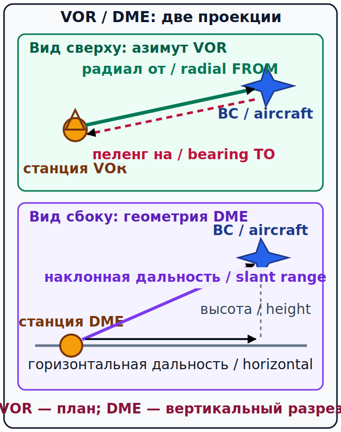

# VOR, DME и ADF: будущий слой [Part-FCL](../reference/glossary.md#term-part-fcl) {#vor-dme-adf-ppl}

## Назначение {#purpose}

Эта глава явно отделена как **[PART-FCL — ОБЩЕЕ][part-fcl]**. Текущая GU09 для [ULM](../reference/glossary.md#term-ulm) на pp. 28–32 включает принципы GPS/оборудования, но не задаёт подробную глубину VOR/DME/ADF. Она добавлена для будущего перехода к [LAPL(A)](../reference/glossary.md#term-lapl-a)/[PPL(A)](../reference/glossary.md#term-ppl-a), не как право применять радиосредство без подготовки и исправного оборудования.

> **Проверено 13.07.2026; перед полётом проверить [AIP](../reference/glossary.md#term-aip)/SUP/[AIC](../reference/glossary.md#term-aic)/[NOTAM](../reference/glossary.md#term-notam) и текущий AIRAC.**

## Результаты обучения {#outcomes}

После главы вы сможете:

1. отличить радиал VOR от станции (FROM) от пеленга на станцию (TO);
2. объяснить идентификацию, TO/FROM и ограничения зоны неопределённых показаний над станцией;
3. различить наклонную дальность DME и горизонтальное расстояние;
4. описать осведомлённость об ошибках ADF/NDB;
5. назвать порядок работы с текущими источниками без заучивания частот.

## Карта применимости {#applicability}

| Метка | Как использовать главу |
|---|---|
| [ULM — ОСНОВА][ulm] | Это не обязательная глубина текущей основы; нужно понимать границу и приоритет GNSS в GU09. |
| [ULM — ОСОБО ВАЖНО][ulm] | Не переносить теорию [Part-FCL](../reference/glossary.md#term-part-fcl) на неустановленное или непригодное оборудование. |
| [PART-FCL — ОБЩЕЕ][part-fcl] | Слой радионавигации общей теоретической [программы](../reference/glossary.md#term-syllabus) LAPL/PPL. |
| [LAPL — ПЕРЕХОД] | [LAPL(A)](../reference/glossary.md#term-lapl-a) использует общую [PPL(A)](../reference/glossary.md#term-ppl-a) теоретическую программу. |
| [PPL — РАСШИРЕНИЕ] | Полный [AMC](../reference/glossary.md#term-amc) §§9.1–9.2 и утверждённая подготовка. |
| [ИСПАНИЯ] | Статус радиосредства берётся из текущих ENR 4.1/AD 2/[NOTAM](../reference/glossary.md#term-notam). |
| [БЕЗОПАСНОСТЬ] | Показание без идентификации и подтверждения пригодности не используется как надёжная линия положения. |
| [ПРОВЕРИТЬ ПЕРЕД ПОЛЁТОМ] | Идентификатор, статус, зона действия, оборудование/[AFM](../reference/glossary.md#term-afm) и [NOTAM](../reference/glossary.md#term-notam). |

## Теория {#theory}

### VOR: радиал FROM и пеленг TO {#vor-radial-bearing}

[Всенаправленный VHF-радиомаяк (English: VHF omnidirectional range, VOR; español: radiofaro omnidireccional VHF)][vor] позволяет совместимому приёмнику определить положение относительно магнитных радиалов станции. **Радиал (English: radial; español: radial)** — направление **от станции (FROM station)**. Самолёт на радиале `060` находится на магнитной линии от станции примерно `060°`; прямой пеленг на станцию (TO station) приблизительно равен обратному направлению `240°`, если не учитывать локальные и установочные детали. Радиал VOR не указывает к станции.

До использования сигнал идентифицируют предусмотренным способом, проверяют флаг, статус и правдоподобие. Указатель TO/FROM описывает геометрию выбранной линии пути относительно станции, но не командует автоматически курсом носа и может вводить в заблуждение при неверном выборе. В конусе над станцией показания становятся непригодными для точной боковой интерпретации; приём VHF обычно ограничен прямой радиовидимостью, рельефом, высотой и зоной действия. Общая теоретическая область: `SRC-EASA-AIRCREW-2026`, [AMC](../reference/glossary.md#term-amc) §§9.1–9.2 (проверено 13.07.2026).

### CALC-NAV-25 — Радиал и обратный пеленг на станцию {#calc-nav-25}

**Дано:** положение на радиале VOR `060°` от станции.

**Формула:** `пеленг TO ≈ радиал ± 180°`, приведённый к `000–359°`.

**Расчёт:** `060° + 180° = 240°`.

**Результат:** геометрический пеленг на станцию `240°`.

**Решение пилота:** не превращать обратное направление в команду текущего курса носа; сначала учесть показание оборудования, ветер, выбранную линию и пригодность станции.

### CALC-NAV-20 — Расстояние за время наблюдения пеленга {#calc-nav-20}

**Дано:** `GS 60 kt`, интервал `2 min`.

**Формула:** `расстояние = GS × время/60`.

**Расчёт:** `60 NM/h × 2 min / 60 = 2 NM`.

**Результат:** за интервал наблюдения пройдено `2 NM`.

**Решение пилота:** при интерпретации изменения пеленга помнить, что воздушное судно переместилось; не считать две индикации одновременными линиями положения.

<!-- recompute-result: 2.0 -->

### DME и наклонная дальность {#dme-slant-range}

[Дальномерное оборудование (English: distance measuring equipment, DME; español: equipo medidor de distancia)][dme] показывает **наклонную дальность (English: slant range; español: distancia oblicua)** между бортовым и наземным оборудованием. Она равна `√(горизонталь² + вертикаль²)`. Поэтому DME не всегда равна горизонтальному расстоянию; различие особенно заметно высоко и близко к станции. Сопряжение канала, связь с конкретной станцией и эксплуатационный статус проверяются по документации оборудования и текущим данным AIS.

### CALC-NAV-21 — Из наклонной дальности в горизонтальное расстояние {#calc-nav-21}

**Дано:** наклонная дальность DME `13 NM`, вертикальное разделение `5 NM`; это только наглядный треугольник `5–12–13`, а не реалистичный сценарий высоты для лёгкого полёта [VFR](../reference/glossary.md#term-vfr)/[ULM](../reference/glossary.md#term-ulm).

**Формула:** `горизонталь = √(наклонная² − вертикаль²)`.

**Расчёт:** `√(13² − 5²) = √144 = 12 NM`.

**Результат:** горизонтальное расстояние `12 NM`, а не `13 NM`.

**Решение пилота:** рядом со станцией не подменять наклонную дальность горизонтальной дальностью до точки на карте.

<!-- recompute-result: 12.0 -->

### ADF/NDB и ограничения {#adf-ndb-limitations}

[Автоматический радиокомпас (English: automatic direction finder, ADF; español: radiogoniómetro automático)][adf] принимает совместимый сигнал NDB и показывает относительный или магнитный пеленг в зависимости от установки и индикатора. Перед использованием идентифицируют станцию и понимают индикацию. Возможные ошибки включают ночной эффект, грозу и статику, береговую рефракцию, рельеф, крен и ограничения станции или приёма. Стрелка «на станцию» не доказывает, что сигнал пригоден или что воздушное судно следует безопасной линии пути.

### Текущие данные, а не учебные частоты {#radio-nav-current-data}

В этой главе нет действующих частот. Частоты и идентификаторы берутся из текущих **ENR 4.1** или **AD 2** перед применением вместе с координатами, часами и статусом, примечаниями и [NOTAM](../reference/glossary.md#term-notam). Запомненная статическая частота быстро превращается в опасную память. Источник: `SRC-ENAIRE-AIP-NAVIGATION-2026`, ENR 4.1 и GEN 3.4 §3.1 (проверено 13.07.2026).

## Применение для [ULM](../reference/glossary.md#term-ulm) {#ulm-application}

Ученик, начинающий с [ULM](../reference/glossary.md#term-ulm), понимает геометрические ловушки и порядок проверки текущих данных, но основной маршрут курса остаётся визуальной навигацией, DR и перекрёстной проверкой GNSS внутри Испании. Наличие теоретической главы не подтверждает установку, одобрение и исправность оборудования или компетентность пилота.

## Расширение [Part-FCL](../reference/glossary.md#term-part-fcl) {#part-fcl-extension}

[LAPL(A)](../reference/glossary.md#term-lapl-a) использует общую с [PPL(A)](../reference/glossary.md#term-ppl-a) теоретическую [программу](../reference/glossary.md#term-syllabus); AMC1 FCL.115/FCL.120 и AMC1 FCL.210/FCL.215 §§9.1–9.2 включают радионавигацию. Этот слой **[PART-FCL — ОБЩЕЕ][part-fcl]** изучается позже в полном курсе [DTO](../reference/glossary.md#term-dto)/[ATO](../reference/glossary.md#term-ato). Область GPS в GU09 [ULM](../reference/glossary.md#term-ulm) не заменяет подробную подготовку VOR/DME/ADF. Источник: `SRC-EASA-AIRCREW-2026` (проверено 13.07.2026).

## Безопасность {#safety}

Минимальная логика: правильная станция → достоверная идентификация → пригодное показание без предупреждающего флага → правдоподобная геометрия → перекрёстная проверка другим источником → текущий статус. Одного радиосредства или источника GNSS без перекрёстной проверки недостаточно для уверенной [ситуационной осведомлённости](../reference/glossary.md#term-situational-awareness).

## Типичные ошибки {#common-errors}

- читать радиал как стрелку TO station;
- поворачивать курс носа за стрелкой без понимания выбранной линии;
- везде считать DME горизонтальным расстоянием;
- использовать неидентифицированный сигнал;
- переносить старую частоту;
- доверять одному источнику радионавигации или GNSS.

Радиал FROM не является направлением TO станции. DME не всегда показывает горизонтальное расстояние: это наклонная дальность. Одного GNSS или одного радионавигационного источника недостаточно без перекрёстной проверки.

## Краткий конспект {#summary}

- Радиал VOR направлен FROM station.
- Пеленг TO приблизительно обратен радиалу.
- DME измеряет наклонную дальность.
- ADF/NDB чувствителен к нескольким источникам ошибок.
- Текущие ENR 4.1/AD 2/[NOTAM](../reference/glossary.md#term-notam) важнее памяти.

## Контрольные вопросы {#review-questions}

### Q-NAV-021 — Где находится воздушное судно на радиале VOR 060? {#q-nav-021}

A. На линии от станции в направлении 060°. 
B. На линии к станции в направлении 060° независимо от положения. 
C. Ровно 60 NM от станции. 
D. На магнитном курсе носа 060°.

**Правильный ответ:** A.

**Почему:** Радиал VOR 060 определяется магнитным направлением от станции; он не задаёт расстояние или курс носа.

**Почему главный отвлекающий вариант неверен:** B обращает радиал к станции и путает его с обратным пеленгом TO.

### Q-NAV-022 — Что нужно сделать, прежде чем доверять показанию VOR? {#q-nav-022}

A. Идентифицировать станцию, проверить флаг, статус и правдоподобную геометрию. 
B. Использовать любой слышимый сигнал без идентификатора. 
C. Выбрать частоту из старого учебника. 
D. Считать TO/FROM автоматическим [ATC clearance](../reference/glossary.md#term-atc-clearance).

**Правильный ответ:** A.

**Почему:** Правильное применение VOR начинается с достоверной идентификации станции, проверки статуса показания и геометрической перекрёстной проверки.

**Почему главный отвлекающий вариант неверен:** B использует любой слышимый сигнал без идентификатора и допускает выбор неверной или неработоспособной станции.

### Q-NAV-023 — Когда наклонная дальность DME сильнее отличается от горизонтального расстояния? {#q-nav-023}

A. Высоко и близко к наземной станции. 
B. Только далеко на малой высоте. 
C. Никогда: DME всегда показывает горизонталь. 
D. Только при штиле.

**Правильный ответ:** A.

**Почему:** При большом вертикальном разделении и малом горизонтальном расстоянии вертикальная часть существенно влияет на наклонную дальность DME.

**Почему главный отвлекающий вариант неверен:** C игнорирует треугольник наклонной, горизонтальной и вертикальной составляющих и даёт наибольшую ошибку вблизи станции.

### Q-NAV-024 — Какие влияния нужно учитывать при работе с ADF/NDB? {#q-nav-024}

A. Ночь, гроза и статика, берег и рельеф могут ухудшать пеленг. 
B. ADF всегда выдаёт спутниковое предупреждение о целостности. 
C. Радиал NDB определяется только наклонной дальностью DME. 
D. ADF автоматически проверяет разрешение на вход в воздушное пространство.

**Правильный ответ:** A.

**Почему:** Пеленг ADF/NDB подвержен влияниям распространения и приёма, включая ночь, статику, берег и рельеф.

**Почему главный отвлекающий вариант неверен:** B приписывает ADF спутниковую функцию контроля целостности, которой это средство не даёт.

### Q-NAV-025 — Откуда брать текущие сведения VOR/DME в Испании? {#q-nav-025}

A. Из памяти инструктора пятилетней давности. 
B. Из текущих ENR 4.1/AD 2 и [NOTAM](../reference/glossary.md#term-notam) для времени операции. 
C. Из любой учебной частоты в вопроснике. 
D. Только из таблицы девиации компаса.

**Правильный ответ:** B.

**Почему:** Текущие ENR 4.1/AD 2/[NOTAM](../reference/glossary.md#term-notam) публикуют применимые сведения о станции, канале и статусе, которые могут меняться.

**Почему главный отвлекающий вариант неверен:** C берёт учебную частоту из вопросника вместо текущих ENR 4.1/AD 2/[NOTAM](../reference/glossary.md#term-notam).

## Источники {#sources}

- `SRC-EASA-AIRCREW-2026` — AMC1 FCL.115/FCL.120 and AMC1 FCL.210/FCL.215 §§9.1–9.2; проверено 13.07.2026.
- `SRC-AESA-ULM-LEARNING-OBJECTIVES-GU09-ED01` — Navegación, pp. 28–32: GPS/equipment principles, не detailed VOR/DME/ADF; проверено 13.07.2026.
- `SRC-ENAIRE-AIP-NAVIGATION-2026` — ENR 4.1, GEN 3.4 §3.1; current details before use; проверено 13.07.2026.
- `SRC-FAA-PHAK-25C-CH16` — technical geometry as stable pedagogy; U.S. procedures excluded; проверено 13.07.2026.
- `SRC-EASA-SERA-2025` — general pre-flight information boundary; проверено 13.07.2026.
- `SRC-BOE-RD-765-2022` — эксплуатационная область [ULM](../reference/glossary.md#term-ulm) остаётся национальной; проверено 13.07.2026.

[vor]: ../reference/glossary.md#term-vhf-omnidirectional-range-vor
[dme]: ../reference/glossary.md#term-distance-measuring-equipment-dme
[adf]: ../reference/glossary.md#term-automatic-direction-finder-adf
[ulm]: ../reference/glossary.md#term-ulm
[part-fcl]: ../reference/glossary.md#term-part-fcl
