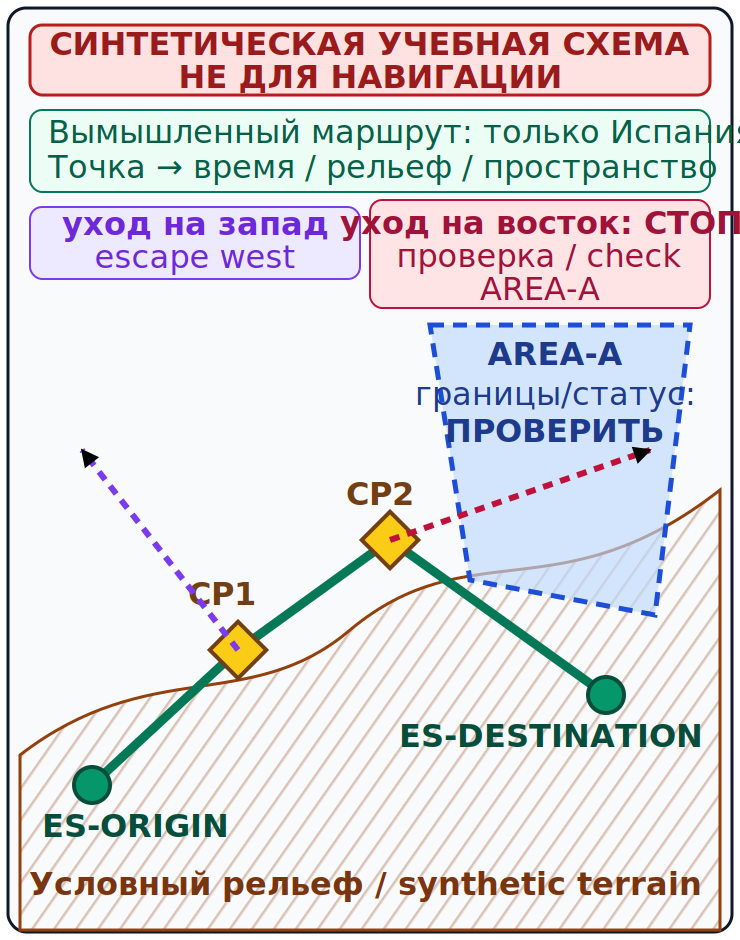

# Потеря ориентировки, уход и граница курса {#lost-diversion-border}

## Назначение {#purpose}

Глава задаёт безопасную последовательность при расхождении плана и реальности: **[AVIATE–NAVIGATE–COMMUNICATE](../reference/glossary.md#term-aviate-navigate-communicate)**, ранняя оценка неопределённости и уход только на вариант внутри Испании. При необходимости помощь запрашивают у [обслуживания воздушного движения (English: air traffic services, ATS; español: servicios de tránsito aéreo)][ats]. [План полёта (English: flight plan, FPL; español: plan de vuelo)][flight-plan] передаёт планируемые сведения, но не является разрешением на иностранную эксплуатацию [ULM](../reference/glossary.md#term-ulm). Международная граница является жёстким пределом планирования этого курса, а не задачей «долететь и разобраться».

> **Проверено 13.07.2026; перед полётом проверить [AIP](../reference/glossary.md#term-aip)/SUP/[AIC](../reference/glossary.md#term-aic)/[NOTAM](../reference/glossary.md#term-notam) и текущий [AIRAC][airac].**

## Результаты обучения {#outcomes}

После главы вы сможете:

1. отличить неуверенность в позиции от подтверждённой потери ориентировки;
2. применить 1-in-60 с оговоркой малых углов;
3. рассчитать угол возврата и обновить план ухода внутри Испании;
4. выбрать возврат, ожидание, уход, посадку или помощь [ATS][ats] по запасу времени и топлива;
5. объяснить, почему [FPL][flight-plan]/LAPL/PPL автоматически не разрешают иностранную эксплуатацию [ULM](../reference/glossary.md#term-ulm).

## Карта применимости {#applicability}

| Метка | Как использовать главу |
|---|---|
| [ULM — ОСНОВА][ulm] | Порядок действий при потере ориентировки и уходе для [ULM](../reference/glossary.md#term-ulm) внутри Испании. |
| [ULM — ОСОБО ВАЖНО][ulm] | Уменьшать неопределённость раньше, чем закончится запас топлива, светлого времени или [VMC](../reference/glossary.md#term-vmc). |
| [PART-FCL — ОБЩЕЕ][part-fcl] | Общая безопасная последовательность сохраняется позже для LAPL/PPL. |
| [LAPL — ПЕРЕХОД] | Международное планирование [Part-FCL](../reference/glossary.md#term-part-fcl) изучается отдельно в [DTO](../reference/glossary.md#term-dto)/[ATO](../reference/glossary.md#term-ato). |
| [PPL — РАСШИРЕНИЕ] | Навигационная теория общая с LAPL; [Part-NCO](../reference/glossary.md#term-part-nco) и пересечение границы проверяются отдельно по применимой операции, а не добавляются самой лицензией. |
| [ИСПАНИЯ] | Все плановые точки маршрута и ухода этой главы находятся внутри Испании. |
| [БЕЗОПАСНОСТЬ] | Поиск ошибки никогда не опережает управление и сохранение [VMC](../reference/glossary.md#term-vmc) и запаса над рельефом. |
| [ПРОВЕРИТЬ ПЕРЕД ПОЛЁТОМ] | Погода, рельеф, пространство, светлое время, топливо, запасные варианты и данные [ATS][ats]. |

## Теория {#theory}

### Приоритеты при неопределённости {#lost-priorities}

1. **[AVIATE][anc]:** сохранять управление, безопасные скорость и пространственное положение, [VMC](../reference/glossary.md#term-vmc), запас над рельефом и препятствиями, учитывать топливо.
2. **[NAVIGATE][anc]:** прекратить накопление ошибки; ожидать, повернуть, вернуться или уйти только при понятной и безопасной геометрии; сравнить время, курс носа, рельеф, карту и независимые средства.
3. **[COMMUNICATE][anc]:** рано уведомить [ATS][ats] или другую подходящую службу, честно сообщить неопределённость и запросить помощь; приоритет [urgency](../reference/glossary.md#term-urgency)/[distress](../reference/glossary.md#term-distress) зависит от фактического риска.

Действия при потере ориентировки не означают продолжать по старому курсу носа, пока пилот ищет ошибку. Если положение не подтверждается, не принимают новые обязательства: меньший запас над рельефом, вход в контролируемое пространство, приближение к берегу или границе, ухудшение погоды. Возможные решения: вернуться вдоль известного ориентира, остаться в безопасном знакомом районе, уйти на подходящее испанское место посадки, получить помощь [ATS][ats] или сесть до исчерпания запасов. Общая методика: `SRC-NZ-CAA-VISUAL-NAV-V1`, pp. 18–22 и 27–28 (проверено 13.07.2026; это не новозеландская процедура для Испании).

### Правило 1-in-60 {#one-in-sixty}

Для небольших углов `ошибка линии пути в градусах ≈ боковое отклонение NM / пройденное расстояние NM × 60`. Это приближение для малых углов. Правило 1-in-60 не является точным при каждом угле, на очень короткой базе, при неверно определённой точке или криволинейном пути. Первое число оценивает угол расхождения; чтобы вернуться к заданной линии за выбранное расстояние, добавляют угол возврата `боковое отклонение/расстояние возврата×60` в противоположную сторону.

### CALC-NAV-16 — Ошибка линии пути по 1-in-60 {#calc-nav-16}

**Дано:** после `60 NM` воздушное судно находится `4 NM` справа от заданной линии пути; угол мал, точка подтверждена.

**Формула:** `ошибка линии пути ≈ боковое отклонение / пройденное расстояние × 60`.

**Расчёт:** `4 / 60 × 60 = 4°`.

**Результат:** фактическая линия пути примерно на `4°` вправо от заданной.

**Решение пилота:** для параллельной поправки изменить курс носа приблизительно на `4°` влево; до поправки проверить влияние ветра и компаса.

<!-- recompute-result: 4.0 -->

### CALC-NAV-17 — Угол расхождения плюс угол возврата {#calc-nav-17}

**Дано:** угол расхождения `4°` вправо; боковое отклонение `4 NM`; вернуться за `30 NM`.

**Формула:** `угол возврата ≈ 4/30×60 = 8°`; полная поправка равна сумме углов расхождения и возврата.

**Расчёт:** `4° + 8° = 12°` влево от текущего курса носа.

**Результат:** начальная поправка приблизительно `12°` влево; после выхода на линию снять составляющую возврата.

**Решение пилота:** назначить контрольную точку и время пересечения и не держать 12° после возврата на линию.

<!-- recompute-result: 12.0 -->

### Уход только внутри Испании {#diversion}

**СИНТЕТИЧЕСКАЯ УЧЕБНАЯ СХЕМА — НЕ ДЛЯ НАВИГАЦИИ.** Маршрут `ES-ORIGIN → CP1 → CP2 → ES-DESTINATION`, запасные варианты и стрелки отхода вымышлены и остаются внутри Испании. Порядок ухода:

1. сохранить управление и отметить фактическое время и подтверждённую позицию;
2. выбрать по текущим данным подходящее **испанское** место назначения или посадки;
3. оценить линию пути, расстояние, рельеф, пространство, погоду и ветер;
4. рассчитать курс носа, время и топливо;
5. назначить условие отхода или прекращения и при необходимости установить связь;
6. обновить лог после первой достоверной контрольной точки.

### CALC-NAV-18 — Время ухода {#calc-nav-18}

**Дано:** от подтверждённой позиции до испанской точки ухода `16 NM`; оценочная `GS 120 kt = 2 NM/min`.

**Формула:** `время = расстояние / скорость`.

**Расчёт:** `16 NM / 2 NM/min = 8 min`.

**Результат:** оценочное время ухода `8 min`.

**Решение пилота:** назначить промежуточную проверку раньше 8 min; проверить пространство, рельеф и погоду и не считать оценку гарантией посадки.

<!-- recompute-result: 8.0 -->

### CALC-NAV-19 — Обновление топлива при уходе {#calc-nav-19}

**Дано:** проверенный плановый расход синтетического примера `18 L/h`; интервал ухода и захода `0.5 h`.

**Формула:** `количество = расход × время`.

**Расчёт:** `18 × 0.5 = 9 L`.

**Результат:** арифметическая потребность `9 L` до проверки применимого резерва и используемого топлива.

**Решение пилота:** сравнить с фактическим используемым топливом и полным планом по документам самолёта и применимому правилу; при неопределённом запасе выбрать более раннюю подходящую посадку, а не оптимистичное продолжение.

<!-- recompute-result: 9.0 -->

### Международная граница курса {#international-boundary}

Для испанского [ULM](../reference/glossary.md#term-ulm) RD 765/2022 art. 4.2 указывает: за пределами испанского воздушного пространства применяются закон и специальные требования каждого государства пролёта. Иностранная эксплуатация [ULM](../reference/glossary.md#term-ulm) здесь не преподаётся. Это не утверждение, что [ULM](../reference/glossary.md#term-ulm) никогда не может лететь за рубеж; это означает, что признание, разрешения, документы, пространство и процедуры каждой страны нужно исследовать отдельно.

Короткая проверка границы: закон государства пролёта определяет его требования. Маршрут только внутри Испании — обязательная граница всех сценариев этого модуля.

[SERA](../reference/glossary.md#term-sera).4001 предусматривает случаи подачи [плана полёта](../reference/glossary.md#term-flight-plan), включая пересечение международных границ, но план полёта не разрешает иностранную эксплуатацию [ULM](../reference/glossary.md#term-ulm). [FPL][flight-plan] сообщает [ATS][ats] планируемые сведения; он не заменяет разрешение или признание государства. Наличие [LAPL(A)](../reference/glossary.md#term-lapl-a) или [PPL(A)](../reference/glossary.md#term-ppl-a) не превращает национальный [ULM](../reference/glossary.md#term-ulm) в самолёт Part-21 и автоматически не решает иностранное признание. Источники: `SRC-BOE-RD-765-2022`, art. 4.2; `SRC-EASA-SERA-2025`, [SERA](../reference/glossary.md#term-sera).4001 (проверено 13.07.2026).

### Будущий слой [Part-NCO](../reference/glossary.md#term-part-nco) {#future-part-nco-border}

При будущем полёте на воздушном судне и при эксплуатации, входящих в Regulation (EU) No 965/2012 Annex VII, анализируется [Part-NCO](../reference/glossary.md#term-part-nco), включая NCO.GEN.135/NCO.OP.135. [Part-NCO](../reference/glossary.md#term-part-nco) применяется по виду эксплуатации и воздушному судну, а не потому, что у пилота появилась LAPL/PPL. Планирование пересечения границы по [Part-FCL](../reference/glossary.md#term-part-fcl)/[Part-NCO](../reference/glossary.md#term-part-nco) — отдельный модуль и не даёт разрешения для иностранного [ULM](../reference/glossary.md#term-ulm). Источник: `SRC-EASA-AIR-OPS-2026`, Article 5(4), Annex VII (проверено 13.07.2026).

Иначе говоря, [Part-NCO](../reference/glossary.md#term-part-nco) применяется по операции и воздушному судну, а не по наличию лицензии как единственному условию.

## Применение для [ULM](../reference/glossary.md#term-ulm) {#ulm-application}

В текущем курсе с приоритетом [ULM](../reference/glossary.md#term-ulm) плановый маршрут, запасной вариант и уход остаются внутри Испании. Перед взлётом выбирают жёсткие пределы по границе, берегу, рельефу и пространству и точное условие: «если CP2 не подтверждён к [ВРЕМЯ], вернуться или уйти на [ИСПАНСКИЙ ВАРИАНТ]». Это заменяет расплывчатое намерение измеримым решением.

## Расширение [Part-FCL](../reference/glossary.md#term-part-fcl) {#part-fcl-extension}

После [ULM](../reference/glossary.md#term-ulm) ученик проходит самостоятельную программу подготовки [LAPL(A)](../reference/glossary.md#term-lapl-a) или [PPL(A)](../reference/glossary.md#term-ppl-a). Знания о границе, [FPL][flight-plan] и [Part-NCO](../reference/glossary.md#term-part-nco) расширяются в применимой программе, но лицензия [Part-FCL](../reference/glossary.md#term-part-fcl) не создаёт автоматическую конверсию или признание национального [ULM](../reference/glossary.md#term-ulm). Источники: `SRC-EASA-AIRCREW-2026`, `SRC-EASA-SERA-2025`, `SRC-EASA-AIR-OPS-2026` (проверено 13.07.2026).

## Безопасность {#safety}

Приоритет запроса помощи повышают до [urgency](../reference/glossary.md#term-urgency)/[distress](../reference/glossary.md#term-distress), когда неопределённость соединяется с уменьшающимся топливом, потерей [VMC](../reference/glossary.md#term-vmc), угрозой рельефа, медицинской или технической проблемой либо невозможностью безопасно сесть. Не нужно ждать «полной уверенности, что потерялся»: ранний честный вызов оставляет больше вариантов.

## Типичные ошибки {#common-errors}

- продолжать поиск неисправности вместо управления;
- применять 1-in-60 как точную формулу при любом угле;
- исправить угол расхождения, но забыть угол возврата;
- не снять составляющую возврата на заданной линии;
- считать [FPL][flight-plan] иностранным разрешением;
- считать LAPL/PPL автоматическим решением признания [ULM](../reference/glossary.md#term-ulm);
- планировать учебный сценарий через границу Испании.

## Краткий конспект {#summary}

- Управление предшествует навигационному поиску ошибки и связи.
- 1-in-60 — оценка для малых углов с геометрическими ограничениями.
- Уход обновляет курс носа, время, топливо и условия решений.
- Все текущие примеры остаются внутри Испании.
- [FPL][flight-plan] на пересечение границы не является иностранным разрешением [ULM](../reference/glossary.md#term-ulm).

## Контрольные вопросы {#review-questions}

### Q-NAV-031 — Каков первый приоритет при неопределённости положения? {#q-nav-031}

A. Продолжить настройку приложений до подтверждения точки. 
B. [AVIATE][anc]: сохранить управление, [VMC](../reference/glossary.md#term-vmc) и запас над рельефом и препятствиями. 
C. Немедленно пересечь ближайшую границу пространства. 
D. Продолжить прежним курсом до плановой [ETA][eta], не меняя модель положения.

**Правильный ответ:** B.

**Почему:** При неопределённости сначала [AVIATE][anc] — управление воздушным судном, [VMC](../reference/glossary.md#term-vmc) и запас над рельефом; навигационный поиск ошибки следует после обеспечения безопасной траектории.

**Почему главный отвлекающий вариант неверен:** A продолжает настройку приложений до подтверждения точки и создаёт риск длительного отвлечения взгляда в кабину вместо [AVIATE][anc].

### Q-NAV-032 — Когда приближение 1-in-60 наиболее пригодно? {#q-nav-032}

A. При небольшом угле, подтверждённой точке и достаточной базе. 
B. При любом угле вплоть до 180° как точное тождество. 
C. Без знания пройденного расстояния. 
D. Когда боковое отклонение равно пройденному расстоянию, независимо от величины угла.

**Правильный ответ:** A.

**Почему:** 1-in-60 приближённо описывает геометрию малых углов и требует надёжных наблюдений бокового отклонения и расстояния.

**Почему главный отвлекающий вариант неверен:** B превращает приближение в точную формулу, которая неприменима при больших углах.

### Q-NAV-033 — Зачем к углу расхождения добавляют угол возврата? {#q-nav-033}

A. Чтобы сначала остановить расхождение и затем вернуться к заданной линии пути за выбранное расстояние. 
B. Чтобы увеличить снос в сторону ошибки. 
C. Чтобы заменить магнитное склонение. 
D. Чтобы сразу получить новый магнитный курс без учёта склонения и ветра.

**Правильный ответ:** A.

**Почему:** Поправка на расхождение делает путь параллельным, а дополнительный угол возврата создаёт пересечение заданной линии за выбранное расстояние.

**Почему главный отвлекающий вариант неверен:** B добавляет угол возврата в сторону ошибки и увеличивает снос вместо возвращения к заданной линии.

### Q-NAV-034 — Что даёт [план полёта](../reference/glossary.md#term-flight-plan) при пересечении международной границы? {#q-nav-034}

A. Автоматическое признание испанского [ULM](../reference/glossary.md#term-ulm) каждой страной. 
B. Передачу [ATS][ats] планируемых сведений в требуемом случае, но не иностранное разрешение [ULM](../reference/glossary.md#term-ulm). 
C. Подтверждение от [ATS][ats] автоматически означает, что национальный [ULM](../reference/glossary.md#term-ulm) признан государством пролёта. 
D. Наличие у пилота PPL вместе с [FPL][flight-plan] автоматически разрешает эксплуатацию национального [ULM](../reference/glossary.md#term-ulm) за границей.

**Правильный ответ:** B.

**Почему:** [План полёта](../reference/glossary.md#term-flight-plan) передаёт [ATS][ats] сведения; признание и разрешения иностранного [ULM](../reference/glossary.md#term-ulm) определяют закон и требования государства пролёта.

**Почему главный отвлекающий вариант неверен:** A обещает автоматическое признание испанского [ULM](../reference/glossary.md#term-ulm) каждой страной только из-за [плана полёта](../reference/glossary.md#term-flight-plan).

### Q-NAV-035 — От чего зависит применимость [Part-NCO](../reference/glossary.md#term-part-nco)? {#q-nav-035}

A. От наличия PPL независимо от типа воздушного судна и вида операции [Part-NCO](../reference/glossary.md#term-part-nco). 
B. От воздушного судна и вида эксплуатации в нормативной области, а не одной лицензии. 
C. От регистрации воздушного судна в государстве [EASA](../reference/glossary.md#term-easa) независимо от вида эксплуатации [Part-NCO](../reference/glossary.md#term-part-nco). 
D. От подачи [FPL][flight-plan], которая сама якобы включает режим [Part-NCO](../reference/glossary.md#term-part-nco) для всей операции.

**Правильный ответ:** B.

**Почему:** Область [Part-NCO](../reference/glossary.md#term-part-nco) определяется применимыми воздушным судном и видом эксплуатации по Air Ops; одна лицензия не включает Annex VII для любой ситуации.

**Почему главный отвлекающий вариант неверен:** A делает наличие PPL единственным условием [Part-NCO](../reference/glossary.md#term-part-nco) и стирает область воздушного судна и эксплуатации.

## Источники {#sources}

- `SRC-AESA-ULM-LEARNING-OBJECTIVES-GU09-ED01` — Navegación, pp. 28–32, область потери ориентировки и ухода; проверено 13.07.2026.
- `SRC-NZ-CAA-VISUAL-NAV-V1` — pp. 18–22, 27–28; universal pedagogy only, not NZ national procedure in Spain; проверено 13.07.2026.
- `SRC-ENAIRE-AIP-ESPANA` и `SRC-ENAIRE-AIP-NAVIGATION-2026` — current Spanish route/[ATS][ats]/airspace sources; проверено 13.07.2026.
- `SRC-EASA-SERA-2025` — [SERA](../reference/glossary.md#term-sera).2010(b), [SERA](../reference/glossary.md#term-sera).4001; [FPL][flight-plan] does not authorise foreign [ULM](../reference/glossary.md#term-ulm); проверено 13.07.2026.
- `SRC-BOE-RD-765-2022` — art. 4.2, закон и специальные требования государства пролёта; проверено 13.07.2026.
- `SRC-EASA-AIR-OPS-2026` — Article 5(4), Annex VII, область [Part-NCO](../reference/glossary.md#term-part-nco) по виду эксплуатации; проверено 13.07.2026.
- `SRC-EASA-AIRCREW-2026` — future LAPL/PPL Navigation theory; проверено 13.07.2026.

[ulm]: ../reference/glossary.md#term-ulm
[part-fcl]: ../reference/glossary.md#term-part-fcl
[anc]: ../reference/glossary.md#term-aviate-navigate-communicate
[eta]: ../reference/glossary.md#term-estimated-time-arrival-eta
[ats]: ../reference/glossary.md#term-air-traffic-services-ats
[flight-plan]: ../reference/glossary.md#term-flight-plan
[airac]: ../reference/glossary.md#term-aeronautical-information-regulation-control-airac
