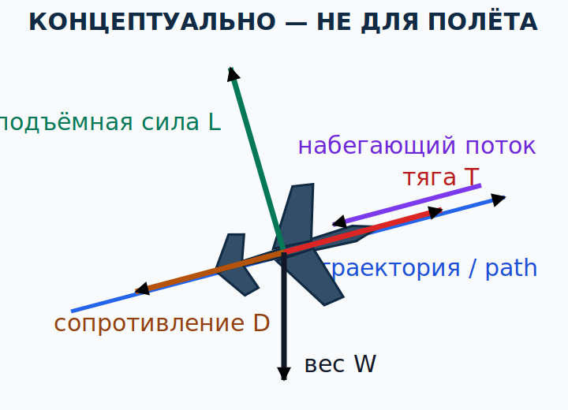

# Поток, силы и моменты {#flow-forces-moments}

## Назначение {#purpose}

Эта глава строит физическую основу для пилота испанского [ULM](../reference/glossary.md#term-ulm) с квалификационной отметкой [MAF](../reference/glossary.md#term-maf): что именно означает «воздух обтекает самолёт», как из распределения давления и касательных напряжений возникает результирующая сила и почему равенство сил не гарантирует равенства моментов. Те же основы входят в общий теоретический предмет 081 будущих [LAPL(A)](../reference/glossary.md#term-lapl-a) и [PPL(A)](../reference/glossary.md#term-ppl-a).

> **Граница главы.** Текущий [AFM](../reference/glossary.md#term-afm)/[POH](../reference/glossary.md#term-poh) и инструктор определяют применимые ограничения, органы управления и практические упражнения. Чтение теории не разрешает самостоятельную тренировку [stall](../reference/glossary.md#term-stall), spin, крутых разворотов или полёта у пределов.

## Результаты обучения {#outcomes}

После главы вы сможете:

1. определить набегающий поток относительно самолёта и не путать его с ветром над землёй;
2. связать линии тока, локальные скорость и давление без «правила равного времени»;
3. совместить объяснения Бернулли и Ньютона в одной картине потока;
4. описать пограничный слой, вязкость и отделение потока на уровне [VFR](../reference/glossary.md#term-vfr)-пилота;
5. разложить аэродинамическую силу на подъёмную силу и сопротивление относительно потока;
6. различить силу, точку приложения, плечо и момент относительно центра тяжести.

## Карта применимости {#applicability}

| Метка | Как использовать главу |
|---|---|
| [ULM — ОСНОВА][ulm] | Базовая аэродинамика для начального курса [ULM](../reference/glossary.md#term-ulm)/[MAF](../reference/glossary.md#term-maf) в Испании. |
| [ULM — ОСОБО ВАЖНО][ulm] | Малые изменения потока и момента могут быстро менять ощущение лёгкого самолёта. |
| [PART-FCL — ОБЩЕЕ][part-fcl] | Общая теория предмета 081 для будущего [LAPL(A)](../reference/glossary.md#term-lapl-a)/[PPL(A)](../reference/glossary.md#term-ppl-a). |
| [LAPL — ПЕРЕХОД] | Позже [DTO](../reference/glossary.md#term-dto)/[ATO](../reference/glossary.md#term-ato) требует пройти применимую полную программу [Part-FCL](../reference/glossary.md#term-part-fcl); эта глава не даёт зачёта. |
| [PPL — РАСШИРЕНИЕ] | Для [LAPL(A)](../reference/glossary.md#term-lapl-a) и [PPL(A)](../reference/glossary.md#term-ppl-a) теоретическая глубина одинакова: общий предмет 081; отдельного слоя только для PPL здесь нет. |
| [ИСПАНИЯ] | Сyllabus [ULM](../reference/glossary.md#term-ulm) задаёт текущий GU09; эксплуатационные данные берутся с конкретного испанского борта. |
| [БЕЗОПАСНОСТЬ] | Физическая модель помогает распознать риск, но не заменяет [AFM](../reference/glossary.md#term-afm)/[POH](../reference/glossary.md#term-poh) и инструктора. |
| [ПРОВЕРИТЬ ПЕРЕД ПОЛЁТОМ] | Чистоту поверхностей, свободный ход органов, загрузку/CG и применимые ограничения. |

## Теория {#theory}

### Система отсчёта и набегающий поток {#relative-airflow}

**Набегающий поток относительно самолёта (English: [relative airflow](../reference/glossary.md#term-relative-airflow); español: viento relativo)** — локальное движение воздуха относительно выбранной части самолёта. В простой модели прямолинейного движения он направлен противоположно траектории самолёта через воздушную массу. Он не равен метеорологическому ветру: равномерный ветер изменяет движение над землёй, но самолёт и окружающая его воздушная масса перемещаются вместе. У крыла, хвоста и винта локальный поток может различаться из-за винтовой струи, downwash, вращения самолёта и порыва. См. [глоссарий](../reference/glossary.md#term-relative-airflow).

**Линия тока (English: streamline; español: línea de corriente)** в установившейся картине касается локального вектора скорости потока в каждой точке. Это средство изображения поля скорости, а не материальная трубка. Две линии тока в одной точке не пересекаются: иначе у потока там было бы два направления. Но отдельные порции воздуха не обязаны сохранять одну нарисованную линию в неустановившемся потоке.

Давление действует по нормали к поверхности; вязкое касательное напряжение — вдоль неё. Их сумма по всей поверхности создаёт единую результирующую аэродинамическую силу. Деление этой силы на [подъёмную силу](../reference/glossary.md#term-lift) и [сопротивление](../reference/glossary.md#term-drag) зависит от направления невозмущённого потока, а не от горизонта. Источники стабильной физики: `SRC-FAA-PHAK-25C-CH4`, pp. 4-1–4-3 и 4-5–4-10; `SRC-NASA-GRC-LIFT-2024` (проверено 13.07.2026).

### Давление, скорость и изменение импульса {#pressure-momentum}

Вдоль применимой линии тока в упрощённом невязком несжимаемом потоке без добавления энергии уравнение Бернулли связывает статическое давление, скорость и высоту. Это **связь между уже существующими полями**, а не причина, заставляющая воздух выбирать скорость. Чтобы узнать реальное поле вокруг крыла, одновременно учитывают сохранение массы, энергии и импульса, геометрию, угол атаки и вязкость.

В представлении через давление интегрируют локальное давление по поверхности: получается результирующая сила. В представлении через импульс рассматривают изменение скорости и направления проходящего воздуха: крыло отклоняет поток, а реакция действует на крыло. Бернулли и Ньютон не конкурируют и не являются взаимоисключающими объяснениями; они описывают согласованные стороны одного поля течения. NASA Glenn подчёркивает, что неправильны именно упрощённые применения, а не законы: `SRC-NASA-GRC-BERNOULLI-NEWTON-2024` (updated 13.11.2024).

**Миф равного времени.** Порции воздуха, разделившиеся у передней кромки сверху и снизу, не обязаны встретиться у задней кромки одновременно. Геометрическая длина верхней поверхности не задаёт скорость через требование «успеть вместе». Измеренное поле скорости на несущем крыле этому правилу не подчиняется. Неверна и противоположная крайность «подъёмную силу создаёт только удар воздуха о нижнюю поверхность»: верхняя поверхность также участвует в распределении давления и повороте потока. Источник прямого опровержения: `SRC-NASA-GRC-BERNOULLI-NEWTON-2024`.

На учебном уровне полезна последовательность:

1. форма, положение и движение крыла задают граничные условия для потока;
2. поток перестраивается с распределением скорости и давления вокруг обеих поверхностей;
3. давление и вязкие напряжения, суммированные по поверхности, дают силу и момент;
4. то же взаимодействие проявляется в изменении импульса воздуха в следе.

### Вязкость, пограничный слой и отделение {#boundary-layer-separation}

Воздух обладает вязкостью. У неподвижной поверхности выполняется условие **прилипания (English: no-slip condition; español: condición de no deslizamiento)**: скорость воздуха относительно поверхности стремится к нулю. В тонкой области от поверхности до внешнего потока скорость растёт — это **пограничный слой (English: [boundary layer](../reference/glossary.md#term-boundary-layer); español: capa límite)**. См. [определение](../reference/glossary.md#term-boundary-layer).

Пограничный слой бывает преимущественно ламинарным или турбулентным. Ламинарный слой обычно даёт меньшее трение, но может раньше потерять способность двигаться против неблагоприятного градиента давления. Турбулентный слой имеет большее перемешивание и трение, зато иногда дольше остаётся присоединённым. Загрязнение, дождь, насекомые, лёд, повреждение и шероховатость способны менять переход и отделение; направление и размер эффекта нельзя превращать в универсальное число.

**Отделение потока (English: flow separation; español: separación del flujo)** возникает, когда низкоэнергетическая часть пограничного слоя не преодолевает рост давления по потоку и отходит от поверхности. Область обратного/неустойчивого течения увеличивается, распределение давления меняется, подъёмная сила и момент перестраиваются, сопротивление растёт. Это центральный механизм high-AoA [stall](../reference/glossary.md#term-stall), но конкретный характер зависит от крыла, числа Рейнольдса, поверхности и конфигурации. Источник: `SRC-NASA-GRC-BOUNDARY-LAYER-2024`, updated 17.07.2024; зависимость данных профиля от Reynolds, поверхности и high-[lift](../reference/glossary.md#term-lift) device подтверждает `SRC-NACA-TR-824`.

### Четыре силы и правильные направления {#four-forces-moments}

Для базовой схемы используют четыре внешние силы:

- **подъёмная сила (English: [lift](../reference/glossary.md#term-lift); español: sustentación), `L`** — перпендикулярно невозмущённому относительному потоку;
- **аэродинамическое сопротивление (English: [drag](../reference/glossary.md#term-drag); español: resistencia aerodinámica), `D`** — параллельно потоку и против относительного движения;
- **тяга (English: thrust; español: empuje), `T`** — результирующая силовой установки; её направление не обязано точно совпадать с траекторией или продольной осью;
- **вес (English: weight; español: peso), `W`** — к центру Земли через центр тяжести.

В установившемся горизонтальном прямолинейном полёте упрощённо `L = W` и `T = D`. В наборе, снижении, разгоне, торможении или развороте эти попарные равенства обычно не выполняются: анализируют компоненты вдоль выбранных осей. Рисовать `L` всегда вертикально — ошибка, особенно в крене. `SRC-FAA-PHAK-25C-CH4`, pp. 4-5–4-10, используется только как техническая педагогика, не как испанская норма.

### Центр давления, центр тяжести и момент {#centre-pressure-gravity-moment}

**Центр давления (English: centre of pressure; español: centro de presiones)** — удобная точка приложения результирующей аэродинамической силы для данного состояния. При изменении угла атаки и конфигурации распределение давления и эта точка могут смещаться. Инженерные модели часто заменяют перемещающуюся силу силой в выбранной аэродинамической точке плюс момент; пилоту важно не считать центр давления фиксированной меткой на крыле.

[Центр тяжести (English: centre of gravity, CG; español: centro de gravedad)](../reference/glossary.md#term-centre-of-gravity) — точка приложения результирующего веса в модели твёрдого самолёта. Его положение зависит от фактической загрузки и топлива. Расстояние от линии действия силы до CG создаёт **момент (English: moment; español: momento)**: `M = F × d⊥`, где `d⊥` — перпендикулярное плечо. Сумма сил определяет поступательное ускорение; сумма моментов относительно CG — угловое ускорение. Поэтому нулевая сумма сил при ненулевой сумме моментов всё ещё приводит к вращению.

Стабилизатор, крыло, фюзеляж, тяга и органы управления образуют общий баланс моментов. Нельзя из одного положения CG вывести универсальную тенденцию без геометрии конкретного самолёта. Разрешённый диапазон CG, метод загрузки и связанные ограничения берут только из текущего [AFM](../reference/glossary.md#term-afm)/[POH](../reference/glossary.md#term-poh).

### CALC-PF-01 — Баланс вертикальных сил {#calc-pf-01}

**КОНЦЕПТУАЛЬНО — НЕ ДЛЯ ПОЛЁТА.**

**Дано:** в условной мгновенной плоской модели `L = 4,80 kN` вверх, `W = 4,80 kN` вниз; остальные вертикальные компоненты приняты равными нулю.

**Формула:** `ΣFvertical = L − W`.

**Расчёт:** `4,80 kN − 4,80 kN = 0,00 kN`.

**Результат:** результирующая вертикальная сила `0,00 kN`; в этой модели вертикальное ускорение равно нулю.

**Решение пилота:** не переносить равенство `L = W` на разворот, набор или порыв; в реальном полёте определить режим и использовать показания/процедуры конкретного самолёта.

<!-- recompute-result: 0.000 -->

### CALC-PF-02 — Момент силы относительно CG {#calc-pf-02}

**КОНЦЕПТУАЛЬНО — НЕ ДЛЯ ПОЛЁТА.**

**Дано:** условная сила хвоста `F = 0,18 kN`; перпендикулярное плечо до CG `d = 0,40 m`.

**Формула:** модуль момента `M = F × d`.

**Расчёт:** `0,18 kN × 0,40 m = 0,072 kN·m`.

**Результат:** модуль момента `0,072 kN·m`; знак определяется заранее выбранным направлением вращения.

**Решение пилота:** не использовать условную силу или плечо как данные своего [ULM](../reference/glossary.md#term-ulm); положение CG и пределы загрузки определить по текущему [AFM](../reference/glossary.md#term-afm)/[POH](../reference/glossary.md#term-poh).

<!-- recompute-result: 0.072 -->

## Применение к [ULM](../reference/glossary.md#term-ulm)/[MAF](../reference/glossary.md#term-maf) {#ulm-application}

Для [ULM](../reference/glossary.md#term-ulm)/[MAF](../reference/glossary.md#term-maf) в Испании GU09 задаёт цели по потоку, силам, движению и аэродинамическим понятиям в `SRC-AESA-ULM-LEARNING-OBJECTIVES-GU09-ED01`, Principios de Vuelo, pp. 15–20. Связанные load/performance факторы распределены по pp. 21–27, controls/propeller — pp. 33–39, а operational prevention — pp. 49–58. GU09 определяет объём программы и не является доказательством физики; механизмы в этой главе опираются на технические источники.

Практический смысл: перед полётом не рассуждать «это лёгкий самолёт, значит силы малы». Ускорение зависит от отношения результирующей силы к массе, а угловая реакция — от момента и момента инерции. Даже небольшая абсолютная сила может дать заметную реакцию лёгкого аппарата. Конкретную чувствительность, допустимые центровки и поверхность управления изучают с инструктором на конкретном типе.

## Расширение [Part-FCL](../reference/glossary.md#term-part-fcl) {#part-fcl-extension}

AMC1 FCL.115/FCL.120 использует для LAPL общую теоретическую программу PPL; AMC1 FCL.210/FCL.215 §5.1 выделяет предмет 081 Principles of Flight. Поэтому общая физика здесь одинакова для будущих [LAPL(A)](../reference/glossary.md#term-lapl-a) и [PPL(A)](../reference/glossary.md#term-ppl-a), но прохождение открытой главы не даёт юридического зачёта и не сокращает программу [DTO](../reference/glossary.md#term-dto)/[ATO](../reference/glossary.md#term-ato). Источник программы: `SRC-EASA-AIRCREW-2026`, онлайн-консолидация 24.02.2026.

**Операционные правила [Part-NCO](../reference/glossary.md#term-part-nco) (English: non-commercial operations with other-than-complex motor-powered aircraft; español: operaciones no comerciales con aeronaves distintas de las propulsadas complejas)** применяются по виду операции и воздушному судну, а не просто потому, что пилот позднее получил лицензию [Part-FCL](../reference/glossary.md#term-part-fcl). Иными словами, [Part-NCO](../reference/glossary.md#term-part-nco) определяется операцией/aircraft и не определяется одной лицензией. Аэродинамическая физика общая; правовой режим операции проверяется отдельно.

Экзаменационный банк [ULM](../reference/glossary.md#term-ulm) остаётся динамическим: страница [AESA](../reference/glossary.md#term-aesa), обновлённая 10.07.2026, сообщает о плане ввода новой версии [ULM](../reference/glossary.md#term-ulm) в четвёртом квартале 2026 года без конкретной гарантированной даты. Пересмотр банка LAPL/PPL планируется на первый квартал 2027 года. Это не подтверждает, что действующий в день экзамена банк [ULM](../reference/glossary.md#term-ulm) уже полностью согласован с GU09 или что новая версия введена; кандидат проверяет `SRC-AESA-ULM-QUESTION-BANKS` непосредственно перед подготовкой/экзаменом.

## Безопасность {#safety}

- Повреждение или загрязнение поверхности может изменить пограничный слой и [stall](../reference/glossary.md#term-stall); «маленькое пятно» нельзя объявлять безвредным без документации.
- Вектор подъёмной силы строят относительно потока, а не автоматически вверх страницы.
- Равновесие сил проверяют отдельно от равновесия моментов.
- Любое расхождение учебной схемы и текущего [AFM](../reference/glossary.md#term-afm)/[POH](../reference/glossary.md#term-poh) разрешают в пользу контролируемой документации конкретного самолёта и инструктора.
- Теория предназначена для распознавания и предотвращения риска; она не является разрешением испытывать границы самостоятельно.

## Частые ошибки {#common-errors}

1. Называть ветер над землёй «набегающим потоком» без системы отсчёта.
2. Выводить скорость сверху крыла из требования одновременной встречи частиц.
3. Представлять Бернулли и Ньютона как две несовместимые религии.
4. Считать пограничный слой «неподвижным воздухом одинаковой толщины».
5. Рисовать [lift](../reference/glossary.md#term-lift) вертикально при любом режиме.
6. Считать центр давления и CG одной точкой.
7. Делать вывод «нет поступательного ускорения — нет вращения».

## Итог {#summary}

Крыло взаимодействует с вязким потоком: форма, движение и угол задают поле скорости и давления; давление и касательные напряжения создают силу и момент; тот же процесс меняет импульс воздуха. [Lift](../reference/glossary.md#term-lift) и [drag](../reference/glossary.md#term-drag) определяются относительно потока. CG и плечи превращают силы в моменты. Эта система понятий нужна для следующих глав о AoA, polar, stability, [stall](../reference/glossary.md#term-stall) и gust response.

## Контрольные вопросы {#review-questions}

### Q-PF-001 — Что точнее всего определяет набегающий поток у крыла? {#q-pf-001}

A. Направление движения воздуха относительно рассматриваемой части самолёта, включая локальные возмущения. 
B. Направление метеорологического ветра как единственное направление потока воздуха у любой части крыла. 
C. Направление линии пути самолёта над землёй, независимо от воздушной массы. 
D. Направление продольной оси самолёта при любом угле атаки. 

**Правильный ответ:** A.

**Почему:** относительный поток определяется в системе самолёта; локально на него влияют движение, порыв, винтовая струя и downwash.

**Почему главный отвлекающий вариант неверен:** B описывает ветер относительно земли и не задаёт локальное обтекание крыла.

### Q-PF-002 — Почему правило «верхний и нижний поток встретятся у задней кромки одновременно» неверно? {#q-pf-002}

A. Потому что нижняя поверхность вообще не участвует в создании подъёмной силы. 
B. Потому что Бернулли применим только к неподвижной жидкости, но не к воздуху. 
C. Потому что никакой физический закон не требует равного времени прохождения, а измеренное поле скорости ему не следует. 
D. Потому что частицы сверху всегда приходят позже нижних при любой форме крыла. 

**Правильный ответ:** C.

**Почему:** NASA Glenn прямо отделяет корректную связь давления/скорости от ошибочно навязанного equal-transit velocity.

**Почему главный отвлекающий вариант неверен:** A заменяет один миф другим: обе поверхности участвуют в распределении давления и повороте потока.

### Q-PF-003 — Как правильно совместить объяснения Бернулли и Ньютона? {#q-pf-003}

A. Выбрать Бернулли для верхней поверхности, а Ньютона только для нижней. 
B. Рассматривать распределение давления и изменение импульса как согласованные описания одного потока. 
C. Использовать Ньютона только при [stall](../reference/glossary.md#term-stall), а Бернулли только до [stall](../reference/glossary.md#term-stall). 
D. Считать оба подхода приблизительными мифами без физической связи с [lift](../reference/glossary.md#term-lift). 

**Правильный ответ:** B.

**Почему:** интеграл давления и баланс импульса должны дать согласованную аэродинамическую силу для одного решения течения.

**Почему главный отвлекающий вариант неверен:** A искусственно делит поверхности; верхняя и нижняя участвуют в обоих физических описаниях.

### Q-PF-004 — Что означает отделение пограничного слоя? {#q-pf-004}

A. Поток у поверхности меняется с ламинарного на турбулентный, но остаётся присоединённым во всех условиях. 
B. Низкоэнергетическая область у поверхности не выдерживает неблагоприятный градиент давления и отходит от неё. 
C. Пограничный слой сохраняет контакт с поверхностью, но давление в нём становится одинаковым по всей хорде. 
D. Подъёмная сила всегда становится ровно нулевой на всей площади крыла. 

**Правильный ответ:** B.

**Почему:** separation меняет эффективную форму течения, давление, [lift](../reference/glossary.md#term-lift), [drag](../reference/glossary.md#term-drag) и момент; масштаб зависит от режима и крыла.

**Почему главный отвлекающий вариант неверен:** D приписывает отделению универсальный мгновенный нулевой [lift](../reference/glossary.md#term-lift), которого механизм не требует.

### Q-PF-005 — Относительно какого направления определяют подъёмную силу? {#q-pf-005}

A. Подъёмная сила всегда направлена вертикально вверх относительно горизонта. 
B. Всегда перпендикулярно продольной оси самолёта. 
C. Перпендикулярно направлению невозмущённого относительного потока. 
D. Параллельно относительному потоку и против движения. 

**Правильный ответ:** C.

**Почему:** [lift](../reference/glossary.md#term-lift) и [drag](../reference/glossary.md#term-drag) — компоненты аэродинамической силы соответственно поперёк и вдоль опорного потока.

**Почему главный отвлекающий вариант неверен:** A ломается в крене и на наклонной траектории: [lift](../reference/glossary.md#term-lift) не привязан к вертикали Земли.

### Q-PF-006 — Сумма внешних сил равна нулю, но сумма моментов относительно CG не равна нулю. Что следует? {#q-pf-006}

A. Поступательное ускорение в модели нулевое, но возможно угловое ускорение. 
B. Любое движение самолёта прекращается, включая вращение вокруг CG. 
C. Центр давления обязан мгновенно совместиться с центром тяжести. 
D. Неуравновешенный момент исчезает, как только подъёмная сила уравновесит вес, независимо от остальных сил и их плеч. 

**Правильный ответ:** A.

**Почему:** поступательная динамика определяется суммой сил, а вращательная — отдельной суммой моментов и моментом инерции.

**Почему главный отвлекающий вариант неверен:** B игнорирует ненулевой момент, поэтому ошибочно исключает угловое ускорение.

## Источники {#sources}

- `SRC-AESA-ULM-LEARNING-OBJECTIVES-GU09-ED01` — Principios de Vuelo, pp. 15–20; связанные цели Performance y Planificación Vuelo, pp. 21–27, Conocimiento General de la Aeronave, pp. 33–39, и Procedimientos Operacionales, pp. 49–58; только объём программы.
- `SRC-EASA-AIRCREW-2026` — AMC1 FCL.115/FCL.120; AMC1 FCL.210/FCL.215 §5.1, subject 081.
- `SRC-AESA-ULM-QUESTION-BANKS` — изменяемое уведомление о банках; страница обновлена 10.07.2026.
- `SRC-FAA-PHAK-25C-CH4` — FAA-H-8083-25C, pp. 4-1–4-3, 4-5–4-10; stable technical pedagogy only.
- `SRC-NASA-GRC-BERNOULLI-NEWTON-2024` — compatible pressure/momentum descriptions and equal-transit refutation.
- `SRC-NASA-GRC-LIFT-2024` — integrated force and [lift](../reference/glossary.md#term-lift) concepts.
- `SRC-NASA-GRC-BOUNDARY-LAYER-2024` — no-slip, [boundary layer](../reference/glossary.md#term-boundary-layer) and separation.
- `SRC-NACA-TR-824` — profile/Reynolds/surface/high-[lift](../reference/glossary.md#term-lift)-device dependence; no type polar.

[ulm]: ../reference/glossary.md#term-ulm
[part-fcl]: ../reference/glossary.md#term-part-fcl
