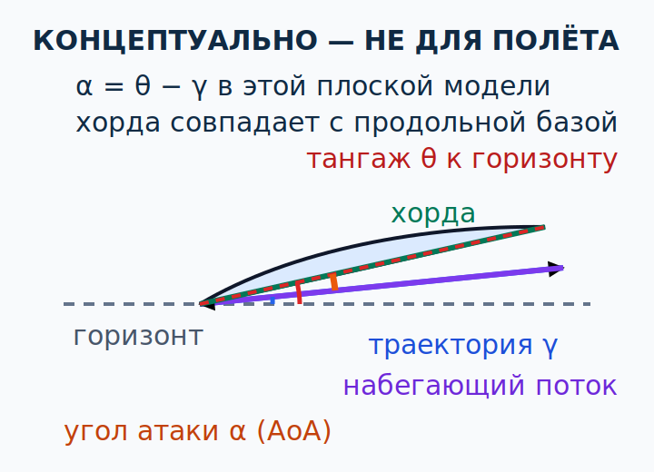
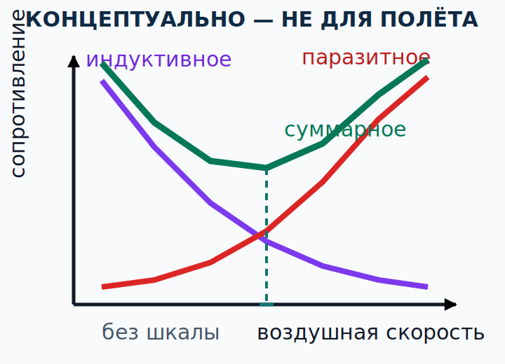

# Подъёмная сила, сопротивление и поляра {#lift-drag-polar}

## Назначение {#purpose}

Глава переводит общую картину потока в пилотские зависимости: угол атаки, коэффициент подъёмной силы, составляющие сопротивления, отношение `L/D` и планирование. Цель — видеть тенденции, не превращая уравнение или учебный график в эксплуатационные числа для [ULM](../reference/glossary.md#term-ulm)/[MAF](../reference/glossary.md#term-maf).

> **Граница главы.** Текущий [AFM](../reference/glossary.md#term-afm)/[POH](../reference/glossary.md#term-poh) и инструктор задают скорости, конфигурации и технику конкретного самолёта. Чтение теории не разрешает самостоятельно тренировать сваливание, штопор, крутые развороты или полёт у пределов.

## Результаты обучения {#outcomes}

После главы вы сможете:

1. различить угол атаки, тангаж и угол траектории;
2. прочитать уравнение подъёмной силы как карту зависимостей, а не расчёт допустимой скорости;
3. объяснить индуктивное, паразитное и суммарное сопротивление;
4. связать `L/D` с геометрией планирования в ограниченной модели;
5. объяснить, как масса и конфигурация меняют требуемую подъёмную силу и режим без универсальных чисел;
6. распознать экранный эффект как изменение вихревой системы, а не «добавочную мощность».

## Карта применимости {#applicability}

| Метка | Как использовать главу |
|---|---|
| [ULM — ОСНОВА][ulm] | Угол атаки, подъёмная сила, сопротивление и планирование для первичной подготовки [MAF](../reference/glossary.md#term-maf). |
| [ULM — ОСОБО ВАЖНО][ulm] | Не заменять [AFM](../reference/glossary.md#term-afm)/[POH](../reference/glossary.md#term-poh) учебной полярой или «лучшей скоростью» другого самолёта. |
| [PART-FCL — ОБЩЕЕ][part-fcl] | Общий предмет 081 для [LAPL(A)](../reference/glossary.md#term-lapl-a) и [PPL(A)](../reference/glossary.md#term-ppl-a). |
| [LAPL — ПЕРЕХОД] | Те же зависимости позже изучаются внутри полной программы [DTO](../reference/glossary.md#term-dto)/[ATO](../reference/glossary.md#term-ato). |
| [PPL — РАСШИРЕНИЕ] | Для [LAPL(A)](../reference/glossary.md#term-lapl-a) и [PPL(A)](../reference/glossary.md#term-ppl-a) теоретическая глубина одинакова: общий предмет 081; отдельного слоя только для PPL здесь нет. |
| [ИСПАНИЯ] | GU09 задаёт объём программы [ULM](../reference/glossary.md#term-ulm), но не эксплуатационные коэффициенты конкретного борта. |
| [БЕЗОПАСНОСТЬ] | Формула показывает тенденцию; расчётные данные для вылета берут из действующего руководства. |
| [ПРОВЕРИТЬ ПЕРЕД ПОЛЁТОМ] | Массу, центровку, поверхность, конфигурацию, ветер и действующие лётные данные. |

## Теория {#theory}

### Угол атаки, тангаж и траектория {#angle-of-attack-attitude-path}

**Угол атаки (English: [angle of attack](../reference/glossary.md#term-angle-of-attack), AoA; español: ángulo de ataque)** — угол между линией хорды профиля и локальным [набегающим потоком](../reference/glossary.md#term-relative-airflow). **Тангаж (English: pitch attitude; español: actitud de cabeceo)** — ориентация продольной оси относительно горизонта. **Угол траектории (English: flight-path angle; español: ángulo de trayectoria)** — наклон направления движения относительно горизонта.

В плоской учебной геометрии при согласованных знаках `α = θ − γ`, где `α` — угол атаки, `θ` — тангаж, `γ` — угол траектории. На схеме для наглядности хорда совпадает с продольной базовой осью самолёта; это допущение рисунка, а не свойство любого профиля или измерительной системы. Поэтому угол атаки не равен тангажу: самолёт может иметь положительный тангаж и малый угол атаки в наборе либо отрицательный тангаж и большой угол атаки в крутом снижении или выравнивании. Локальный поток у крыла дополнительно меняют скос потока, порыв и вращение.

Хорда — геометрическая линия профиля; реальный указатель угла атаки может оценивать локальный поток и иметь собственную калибровку. Его цвет или число нельзя переносить между установками. Технические основы: `SRC-FAA-PHAK-25C-CH5`, страницы 5-1–5-20; `SRC-NASA-GRC-LIFT-2024`.

### Уравнение подъёмной силы как отношение {#lift-equation}

Для выбранной опорной площади используют:

`L = ½ ρ V² S CL`,

где `ρ` — плотность воздуха, `V` — скорость относительно воздуха в согласованном определении, `S` — опорная площадь, `CL` — безразмерный коэффициент подъёмной силы. Комбинация `½ρV²` — динамическое давление.

Это уравнение **не выдаёт эксплуатационный предел само по себе**. Коэффициент `CL` не постоянен и не является константой самолёта: он зависит от угла атаки, формы, конфигурации, состояния поверхности, числа Рейнольдса, числа Маха и трёхмерной геометрии крыла. Чтобы вычислить реальную силу `L`, нужен проверенный `CL` для нужного режима; пилот обычно берёт утверждённые лётные данные и ограничения из [AFM](../reference/glossary.md#term-afm)/[POH](../reference/glossary.md#term-poh), а не рассчитывает коэффициент в кабине.

До области сваливания при прочих равных рост угла атаки обычно увеличивает `CL`. Около [критического угла атаки](../reference/glossary.md#term-critical-angle-of-attack) отрыв потока растёт, а после максимума `CL` подъёмная способность изменяется неблагоприятно. Это не означает мгновенного исчезновения подъёмной силы. Источник `SRC-NACA-TR-824` нужен здесь только для вывода: поляра профиля зависит от его формы, числа Рейнольдса, состояния поверхности и высокоподъёмных устройств. Поляра сечения не является полярой всего самолёта: конечный размах, фюзеляж, шасси, щели, винт и взаимное влияние частей добавляют свои составляющие.

### Составляющие сопротивления {#drag-components}

**Паразитное сопротивление (English: parasite [drag](../reference/glossary.md#term-drag); español: resistencia parásita)** включает сопротивление формы или давления, трения обшивки и взаимного влияния частей. При одной конфигурации его эквивалентный коэффициент и сила обычно растут с динамическим давлением; выпущенные элементы, открытые щели, загрязнение и геометрия меняют зависимость.

**Профильное сопротивление (English: profile [drag](../reference/glossary.md#term-drag); español: resistencia de perfil)** выбранной модели крыла или сечения профиля не тождественно всему паразитному сопротивлению самолёта: фюзеляж, шасси, стыки, охлаждающий поток и выступающие части также дают паразитные составляющие. Термины всегда читают вместе с определением и осями конкретной поляры.

**Индуктивное сопротивление (English: induced [drag](../reference/glossary.md#term-drag); español: resistencia inducida)** связано с созданием подъёмной силы конечным крылом, скосом потока и наклоном результирующей аэродинамической силы. Для одной массы и конфигурации в медленном режиме требуемый `CL` выше, поэтому индуктивное сопротивление обычно велико. С ростом скорости для той же требуемой силы `CL` уменьшается, и индуктивная составляющая снижается.

В одной из эквивалентных моделей подъём конечного крыла описывают через **циркуляцию потока (English: circulation; español: circulación)** вокруг сечений крыла. Изменение циркуляции по размаху связано с концевыми вихрями и скосом потока; наклон локальной аэродинамической силы назад образует индуктивное сопротивление. Это не отдельная «добавочная сила» и не утверждение, что частицы воздуха обязаны двигаться по замкнутым кругам: циркуляция — математическое описание поля скоростей. Для пилота практический вывод тот же: создание подъёмной силы конечным крылом имеет индуктивную составляющую сопротивления.

**Суммарное сопротивление (English: total [drag](../reference/glossary.md#term-drag); español: resistencia total)** — сумма выбранных составляющих модели. Качественный U-образный график зависимости от скорости полезен, но его минимум, масштаб и форма индивидуальны. Он не позволяет назвать скорость без [AFM](../reference/glossary.md#term-afm)/[POH](../reference/glossary.md#term-poh).

### CALC-PF-03 — Сумма компонентов сопротивления {#calc-pf-03}

**КОНЦЕПТУАЛЬНО — НЕ ДЛЯ ПОЛЁТА.**

**Дано:** в условной точке поляры `Dparasite = 0,28 kN`, `Dinduced = 0,12 kN`; остальные составляющие включены в первое число.

**Формула:** `Dtotal = Dparasite + Dinduced`.

**Расчёт:** `0,28 kN + 0,12 kN = 0,40 kN`.

**Результат:** условное суммарное сопротивление `0,40 kN`.

**Решение пилота:** использовать пример лишь для понимания суммы; ни составляющие, ни точка поляры не относятся к реальному [ULM](../reference/glossary.md#term-ulm) без его данных.

<!-- recompute-result: 0.400 -->

### Поляра, `L/D` и планирование {#polar-glide}

**Аэродинамическая поляра (English: aerodynamic polar; español: polar aerodinámica)** связывает коэффициенты или силы для определённой конфигурации и условий. График `CL` от `CD` и график сопротивления от скорости отвечают на разные вопросы; слово «поляра» без подписанных осей недостаточно.

[Аэродинамическое качество при планировании (English: glide ratio; español: fineza o relación de planeo)](../reference/glossary.md#term-glide-ratio) в идеализированном устойчивом прямолинейном планировании в спокойном воздухе связано с `L/D` и отношением горизонтального расстояния к потерянной высоте. Ветер не меняет аэродинамическое `L/D` крыла в равномерной воздушной массе, но меняет дальность и угол траектории **над землёй**. Повороты, турбулентность, конфигурация, сопротивление винта, нестабильность режима и маневрирование уменьшают практический запас.

«Лучшее `L/D`» и «минимальная скорость снижения» — разные цели и обычно разные режимы. Масса в одной конфигурации часто сдвигает характерные скорости, при которых достигается похожий `CL`, но не даёт права заявить, что тяжёлый самолёт всегда планирует дальше или лёгкий всегда безопаснее. Реальные данные планирования и поправку на ветер берут только из [AFM](../reference/glossary.md#term-afm)/[POH](../reference/glossary.md#term-poh).

### CALC-PF-04 — Геометрическое отношение планирования {#calc-pf-04}

**КОНЦЕПТУАЛЬНО — НЕ ДЛЯ ПОЛЁТА.**

**Дано:** синтетическая модель спокойного воздуха: горизонтальное расстояние `960 m`, потеря высоты `80 m`; ветер, развороты и запас не учитываются.

**Формула:** `отношение планирования = горизонтальное расстояние / потеря высоты`.

**Расчёт:** `960 m / 80 m = 12`.

**Результат:** условное геометрическое отношение `12:1` (безразмер).

**Решение пилота:** не планировать реальную посадочную площадку по `12:1`; взять данные своего [AFM](../reference/glossary.md#term-afm)/[POH](../reference/glossary.md#term-poh), учесть ветер, высоту, манёвр и резерв.

<!-- recompute-result: 12.000 -->

### Конфигурация и высокоподъёмные устройства {#configuration-effects}

Закрылок меняет кривизну профиля, иногда площадь и щелевое течение, поэтому может менять `CL`, `CLmax`, сопротивление и момент тангажа. Но закрылки не всегда меняют подъёмную силу, сопротивление, сваливание и тангаж в одном направлении и на одинаковую величину: результат зависит от типа устройства, положения, крыла, скорости, потока винта и этапа выпуска или уборки. Предкрылок или щель помогает поддерживать присоединённое течение на большей части диапазона углов атаки; интерцептор уменьшает подъёмную силу и увеличивает сопротивление в назначенном режиме. Наличие устройства не доказывает его функцию на конкретном борту.

Конфигурация влияет на:

- характер сваливания и предупреждение;
- требуемое триммирование и момент;
- набор высоты и сопротивление после изменения;
- возможность оставаться внутри ограничений;
- переходные процессы при выпуске или уборке.

Поэтому последовательность и ограничения берут только из [AFM](../reference/glossary.md#term-afm)/[POH](../reference/glossary.md#term-poh) и программы инструктора. Техническая база по органам управления и высокоподъёмным устройствам: `SRC-FAA-PHAK-25C-CH6`, страницы 6-2–6-12; зависимость данных от конструкции: `SRC-NACA-TR-824`.

### Экранный эффект {#ground-effect}

**Экранный эффект у поверхности (English: [ground effect](../reference/glossary.md#term-ground-effect); español: efecto suelo)** изменяет скос потока, концевую вихревую систему и индуктивное сопротивление, когда крыло близко к поверхности. При прочих равных самолёт может требовать меньше тяги для данной подъёмной силы или дольше «плыть» при посадке. Это не бесплатная подъёмная сила и не улучшение возможностей после выхода из области экранного эффекта.

Опасная ловушка: самолёт может оторваться в экранном эффекте, но не иметь требуемых возможностей набора вне него из-за массы, [барометрической высоты по плотности](../reference/glossary.md#term-density-altitude), сопротивления, конфигурации или мощности. Решение о взлёте строят по лётным данным [AFM](../reference/glossary.md#term-afm)/[POH](../reference/glossary.md#term-poh) и фактическим условиям, а не по краткому отделению колёс.

## Применение к [ULM](../reference/glossary.md#term-ulm)/[MAF](../reference/glossary.md#term-maf) {#ulm-application}

GU09 связывает подъёмную силу, сопротивление и угол атаки с разделом Principios de Vuelo, pp. 15–20, а факторы взлёта, посадки, нагрузки и лётных характеристик — с pp. 21–27 (`SRC-AESA-ULM-LEARNING-OBJECTIVES-GU09-ED01`). Эти страницы задают учебную трассировку. Коэффициенты, скорости и влияние закрылков конкретного [ULM](../reference/glossary.md#term-ulm) из GU09 не выводятся.

[ULM](../reference/glossary.md#term-ulm)-пилоту полезно отслеживать не «цифру из чужого самолёта», а цепочку: изменение угла атаки или конфигурации → изменение `CL`, сопротивления и момента → новая скорость, тяга и траектория → проверка запасов. Любая поляра в этой главе качественная и обозначена «не для полёта».

## Расширение [Part-FCL](../reference/glossary.md#term-part-fcl) {#part-fcl-extension}

Для [LAPL(A)](../reference/glossary.md#term-lapl-a) и [PPL(A)](../reference/glossary.md#term-ppl-a) общий объём предмета 081 включает течение воздуха, подъёмную силу, сопротивление, коэффициенты, поляры, сваливание и механику полёта (`SRC-EASA-AIRCREW-2026`, AMC1 FCL.115/FCL.120 и AMC1 FCL.210/FCL.215 §5.1). Дополнительная глубина здесь помогает будущему переходу, но не является зачётом [Part-FCL](../reference/glossary.md#term-part-fcl) и не заменяет программу [DTO](../reference/glossary.md#term-dto)/[ATO](../reference/glossary.md#term-ato).

## Безопасность {#safety}

- Любое число `CL`, `L/D`, лучшей скорости планирования или положения закрылка без типа, конфигурации и условий непригодно для решения о вылете.
- Равномерный ветер меняет геометрию над землёй, но не подменяет угол атаки относительно воздуха.
- Экранный эффект не доказывает способность продолжить набор.
- Текущий [AFM](../reference/glossary.md#term-afm)/[POH](../reference/glossary.md#term-poh) и инструктор имеют приоритет над качественной полярой и расчётом.
- Теория не разрешает самостоятельный поиск критического угла атаки или испытание сваливания.

## Частые ошибки {#common-errors}

1. Приравнивать угол атаки к тангажу.
2. Считать `CL` константой самолёта.
3. Читать уравнение подъёмной силы как разрешённую формулу скорости.
4. Приписывать индуктивное сопротивление только законцовкам, игнорируя требуемую подъёмную силу.
5. Считать `L/D` готовой дальностью над землёй при любом ветре.
6. Полагать, что закрылок на всех самолётах одинаково меняет подъёмную силу, сопротивление, сваливание и тангаж.
7. Считать экранный эффект запасом возможностей набора.

## Итог {#summary}

Угол атаки определяется между хордой и набегающим потоком, а не горизонтом. Уравнение подъёмной силы связывает переменные через режимный коэффициент. Суммарное сопротивление складывается из составляющих, чьи относительные величины меняются со скоростью и конфигурацией. `L/D` даёт важную, но ограниченную геометрию. Масса, поверхность и устройства сдвигают режимы; только данные конкретного [AFM](../reference/glossary.md#term-afm)/[POH](../reference/glossary.md#term-poh) превращают тенденции в числа.

## Контрольные вопросы {#review-questions}

### Q-PF-007 — Самолёт снижается с носом ниже горизонта. Может ли AoA быть большим? {#q-pf-007}

A. Нет, отрицательный тангаж всегда означает отрицательный угол атаки. 
B. Да, если угол траектории ещё более отрицателен, угол между хордой и набегающим потоком может быть большим. 
C. Нет: в снижении набегающий поток всегда параллелен продольной оси самолёта, поэтому угол атаки равен нулю. 
D. Да, но только при выпущенных закрылках; в чистой конфигурации отрицательный тангаж исключает большой угол атаки. 

**Правильный ответ:** B.

**Почему:** угол атаки определяется взаимным направлением хорды и локального набегающего потока; горизонт сам по себе его не задаёт.

**Почему главный отвлекающий вариант неверен:** A смешивает тангаж с углом атаки и игнорирует наклон траектории.

### Q-PF-008 — Почему уравнение подъёмной силы нельзя использовать как самостоятельный расчёт безопасной скорости? {#q-pf-008}

A. Потому что уравнение верно только на уровне моря и теряет смысл при изменении плотности воздуха. 
B. Потому что опорная площадь крыла каждый раз определяется его видимой проекцией и меняется с углом атаки. 
C. Потому что нужен режимный `CL` и утверждённые данные; коэффициент зависит от AoA, конфигурации и потока. 
D. Потому что квадрат скорости применим только к движению над землёй. 

**Правильный ответ:** C.

**Почему:** уравнение показывает зависимость, но без корректного коэффициента и ограничений не превращается в эксплуатационные данные.

**Почему главный отвлекающий вариант неверен:** D путает воздушную и путевую скорости; аэродинамическое уравнение относится к движению относительно воздуха.

### Q-PF-009 — В условном прямом полёте скорость уменьшается, а требуемая подъёмная сила сохраняется. Какая тенденция индуктивного сопротивления типична? {#q-pf-009}

A. Требуемый `CL` растёт, и индуктивное сопротивление обычно увеличивается. 
B. Требуемый `CL` уменьшается вместе с динамическим давлением, поэтому индуктивное сопротивление снижается. 
C. Индуктивное сопротивление уменьшается, потому что скос потока автоматически слабеет при уменьшении воздушной скорости. 
D. Индуктивное сопротивление не связано с созданием подъёмной силы и остаётся неизменным. 

**Правильный ответ:** A.

**Почему:** при меньшем динамическом давлении для прежней подъёмной силы требуется больший коэффициент, что усиливает индуктивную составляющую в этой модели.

**Почему главный отвлекающий вариант неверен:** B меняет коэффициент в неверном направлении: при снижении динамического давления сохранение подъёмной силы требует большего `CL`.

### Q-PF-010 — Что показывает отношение `12:1` в идеализированном спокойном планировании? {#q-pf-010}

A. Самолёт пройдёт 12 единиц горизонтально на одну единицу потери высоты в заданной модели. 
B. Отношение `12:1` задаёт дальность над землёй без учёта высоты, ветра и манёвров. 
C. Это отношение воздушной скорости к вертикальной скорости, поэтому оно напрямую задаёт время полёта. 
D. Самолёт теряет 12 единиц высоты на одну единицу горизонтального пути. 

**Правильный ответ:** A.

**Почему:** отношение планирования — геометрическая безразмерная величина, а не фиксированные дальность, время или предел нагрузки.

**Почему главный отвлекающий вариант неверен:** B игнорирует исходную высоту, ветер, манёвр и реальные данные [AFM](../reference/glossary.md#term-afm)/[POH](../reference/glossary.md#term-poh).

### Q-PF-011 — Как корректно описать влияние закрылка? {#q-pf-011}

A. Любой выпуск закрылков одинаково увеличивает `CLmax` и сопротивление и всегда создаёт один и тот же момент на кабрирование. 
B. Закрылок меняет аэродинамику в зависимости от конструкции и режима; подъёмную силу, сопротивление, момент и характер сваливания сверяют для конкретного самолёта. 
C. Закрылок меняет только подъёмную силу и сопротивление, но не влияет на момент тангажа и триммирование. 
D. Одинаковый угол выпуска гарантирует одинаковое изменение подъёмной силы на всех [ULM](../reference/glossary.md#term-ulm). 

**Правильный ответ:** B.

**Почему:** закрылок (English: flap; español: flap) меняет [подъёмную силу](../reference/glossary.md#term-lift), [сопротивление](../reference/glossary.md#term-drag), момент и характер [сваливания](../reference/glossary.md#term-stall) через геометрию, щель, размах, поток, скорость и компоновку самолёта.

**Почему главный отвлекающий вариант неверен:** A превращает зависимые эффекты в одну универсальную направленность и величину.

### Q-PF-012 — Что опасно заключать после раннего отрыва самолёта в [ground effect](../reference/glossary.md#term-ground-effect)? {#q-pf-012}

A. Что вне экранного эффекта обязательно имеется достаточная возможность набора. 
B. Что индуктивное сопротивление близко к поверхности могло измениться. 
C. Что ВПП, массу, высоту по плотности и конфигурацию нужно оценивать до взлёта. 
D. Что лётные данные самолёта берут из применимого [AFM](../reference/glossary.md#term-afm)/[POH](../reference/glossary.md#term-poh) для фактических условий. 

**Правильный ответ:** A.

**Почему:** отделение в экранном эффекте не доказывает запас набора после роста индуктивного сопротивления вне этой области.

**Почему главный отвлекающий вариант неверен:** B описывает механизм экранного эффекта и сам по себе не даёт опасного разрешающего вывода.

## Источники {#sources}

- `SRC-AESA-ULM-LEARNING-OBJECTIVES-GU09-ED01` — Principios de Vuelo, pp. 15–20; Performance y Planificación Vuelo, pp. 21–27.
- `SRC-EASA-AIRCREW-2026` — общая программа предмета 081 для LAPL/PPL.
- `SRC-FAA-PHAK-25C-CH5` — pp. 5-1–5-20, 5-25–5-38; stable aerodynamics only.
- `SRC-FAA-PHAK-25C-CH6` — pp. 6-2–6-12; controls/high-[lift](../reference/glossary.md#term-lift) concepts.
- `SRC-NASA-GRC-LIFT-2024` — [lift](../reference/glossary.md#term-lift) and [lift](../reference/glossary.md#term-lift)-equation dependencies.
- `SRC-NACA-TR-824` — profile/Reynolds/surface/high-[lift](../reference/glossary.md#term-lift)-device data dependence.

[ulm]: ../reference/glossary.md#term-ulm
[part-fcl]: ../reference/glossary.md#term-part-fcl
