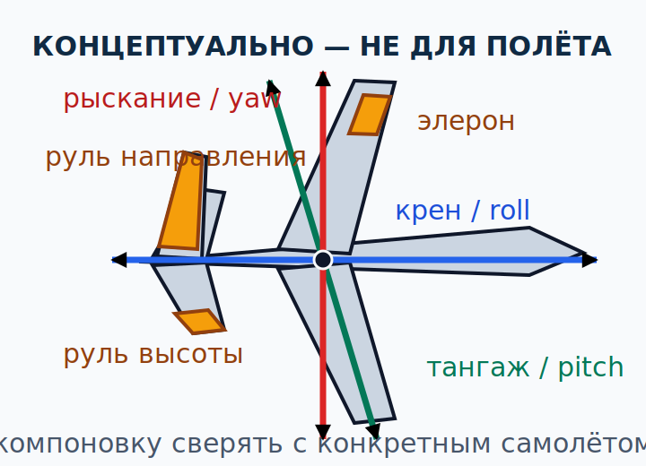

# Устойчивость и органы управления {#stability-controls}

## Назначение {#purpose}

Глава объясняет, как самолёт реагирует на возмущение и управляющее воздействие по трём осям. Для [ULM](../reference/glossary.md#term-ulm)/[MAF](../reference/glossary.md#term-maf) особенно важно не путать «устойчивый» с «послушный» и не ожидать одинаковых усилий, взаимного влияния осей или реакции на триммирование от разных лёгких самолётов.

> **Граница главы.** Текущий [AFM](../reference/glossary.md#term-afm)/[POH](../reference/glossary.md#term-poh) и инструктор определяют проверки, диапазоны, координацию и практику на конкретном самолёте. Чтение теории не разрешает самостоятельно тренировать сваливание, штопор, крутые развороты или полёт у пределов.

## Результаты обучения {#outcomes}

После главы вы сможете:

1. различить статическую и динамическую устойчивость;
2. назвать оси крена, тангажа и рыскания и основные органы управления;
3. отделить устойчивость от управляемости и усилия на органах;
4. объяснить [обратное рыскание](../reference/glossary.md#term-adverse-yaw) и вторичные эффекты органов;
5. описать триммирование как снятие устойчивого управляющего усилия, а не «автопилот»;
6. сверять закрылки, предкрылки, интерцепторы и смешанные системы по документации установленного оборудования.

## Карта применимости {#applicability}

| Метка | Как использовать главу |
|---|---|
| [ULM — ОСНОВА][ulm] | Три оси, основные органы и устойчивость для [MAF](../reference/glossary.md#term-maf). |
| [ULM — ОСОБО ВАЖНО][ulm] | Малые усилия на органах не доказывают малой аэродинамической нагрузки. |
| [PART-FCL — ОБЩЕЕ][part-fcl] | Общая теория устойчивости и управления предмета 081. |
| [LAPL — ПЕРЕХОД] | Термины общие, но [DTO](../reference/glossary.md#term-dto)/[ATO](../reference/glossary.md#term-ato) обучает на своём самолёте и по своей программе. |
| [PPL — РАСШИРЕНИЕ] | Для [LAPL(A)](../reference/glossary.md#term-lapl-a) и [PPL(A)](../reference/glossary.md#term-ppl-a) теоретическая глубина одинакова: общий предмет 081; отдельного слоя только для PPL здесь нет. |
| [ИСПАНИЯ] | GU09 Principios de Vuelo, pp. 15–20, и Conocimiento General de la Aeronave, pp. 33–39, задают объём обучения [ULM](../reference/glossary.md#term-ulm). |
| [БЕЗОПАСНОСТЬ] | Гармонию усилий и характер реакции нельзя переносить между типами. |
| [ПРОВЕРИТЬ ПЕРЕД ПОЛЁТОМ] | Свободу и правильность хода органов, положение триммера, конфигурацию и [AFM](../reference/glossary.md#term-afm)/[POH](../reference/glossary.md#term-poh). |

## Теория {#theory}

### Статическая и динамическая устойчивость {#static-dynamic-stability}

**Статическая устойчивость (English: [static stability](../reference/glossary.md#term-static-stability); español: estabilidad estática)** описывает **первоначальную** тенденцию после малого возмущения:

- положительная — начальная тенденция вернуться;
- нейтральная — остаться в новом состоянии;
- отрицательная — продолжить удаление.

См. [глоссарий](../reference/glossary.md#term-static-stability). Это не ответ на вопрос, что произойдёт через несколько колебаний.

**Динамическая устойчивость (English: [dynamic stability](../reference/glossary.md#term-dynamic-stability); español: estabilidad dinámica)** описывает развитие реакции со временем: колебания затухают, сохраняют амплитуду или нарастают. См. [глоссарий](../reference/glossary.md#term-dynamic-stability). Положительная первоначальная тенденция может сочетаться с недостаточным затуханием и растущими либо долго не затухающими колебаниями; поэтому слов «статически устойчив» недостаточно.

Устойчивость рассматривают около конкретного триммированного режима при заданных конфигурации, массе, центровке, скорости и мощности. Изменение центровки меняет плечи и баланс моментов; задняя центровка часто уменьшает запас продольного восстановления и может ухудшить характеристики выхода, но точные границы и эффекты самолёта берут только из [AFM](../reference/glossary.md#term-afm)/[POH](../reference/glossary.md#term-poh). Техническая основа: `SRC-FAA-PHAK-25C-CH5`, страницы 5-1–5-20 и 5-25–5-38.

### Устойчивость не равна управляемости {#stability-versus-controllability}

**Управляемость (English: controllability; español: controlabilidad)** — способность создать требуемое изменение движения органами управления. Самолёт может быть устойчивым, но требовать больших усилий или иметь ограниченную эффективность управления в части области допустимых режимов. Он может быстро реагировать на управление, но быть статически менее устойчивым. **Манёвренность (English: manoeuvrability; español: maniobrabilidad)** описывает способность изменять траекторию и пространственное положение; она также не тождественна устойчивости.

Усилие на органе зависит от шарнирных моментов, скорости, проводки, аэродинамической балансировки, триммирования и передаточного отношения. Малое усилие на ручке не означает малой нагрузки на конструкцию: механическая или аэродинамическая балансировка может скрывать её от руки. Большое усилие не всегда означает высокий [коэффициент перегрузки](../reference/glossary.md#term-load-factor): возможны трение, неправильное триммирование или конструктивная характеристика. Ненормальное изменение усилий сравнивают с поведением конкретного самолёта и его процедурой, а не с чужим типом.

### Три оси и основные органы {#three-axes-controls}

Оси проходят через модельный CG:

- **продольная ось (English: longitudinal axis; español: eje longitudinal)** — вращение по крену, испанский термин alabeo; основной орган — элероны;
- **поперечная ось (English: lateral axis; español: eje lateral)** — вращение по тангажу, испанский термин cabeceo; основной орган — руль высоты или цельноповоротное оперение;
- **вертикальная ось (English: vertical axis; español: eje vertical)** — вращение по рысканию, испанский термин guiñada; основной орган — руль направления.

Связка «одна ось — один орган» учебная. Реальное отклонение меняет силы и моменты по нескольким осям. Возможны интерцепторы вместо элеронов или вместе с ними, смесители V-образного оперения, элевоны, флапероны, дифференциальная проводка и электронное смешивание команд. Схема не доказывает установленную систему; её проверяют по [AFM](../reference/glossary.md#term-afm)/[POH](../reference/glossary.md#term-poh) и осмотру.

### Первичные и вторичные эффекты {#secondary-effects}

**Первичный эффект** — момент, для которого орган предназначен. **Вторичный эффект** — связанное изменение других осей/траектории.

При отклонении элеронов одно полукрыло обычно увеличивает подъёмную силу и сопротивление, другое уменьшает. Разность подъёмных сил создаёт крен; разность сопротивлений может первоначально повернуть нос против желаемого разворота — **обратное рыскание (English: [adverse yaw](../reference/glossary.md#term-adverse-yaw); español: guiñada adversa)**. См. [глоссарий](../reference/glossary.md#term-adverse-yaw). Дифференциальные элероны, геометрия Фрайза или интерцепторы могут менять эффект, но не отменяют необходимость обученной координации.

Руль направления создаёт рыскание, затем разность скорости или эффективности полукрыльев и эффект поперечного V могут вызвать крен. Руль высоты меняет момент тангажа и угол атаки; через скорость и траекторию он влияет на остальные оси. Изменение мощности может одновременно менять тягу, винтовую струю, тангаж и рыскание. Координация — управление связанной системой, а не «удержание одного шарика любой ценой» без контекста.

**Скольжение (English: sideslip; español: resbale)** означает поперечную составляющую [набегающего потока](../reference/glossary.md#term-relative-airflow). Преднамеренное скольжение, нескоординированный разворот и переходное рыскание — не одно и то же. Допустимость, ограничения, взаимодействие с закрылком и техника специфичны для самолёта.

### Продольная, поперечная и путевая устойчивость {#axis-stability}

**Продольная устойчивость** связана с реакцией момента тангажа, положением центра тяжести, геометрией крыла и хвостового оперения либо схемой «утка», скосом потока и влиянием мощности. **Поперечная устойчивость** касается реакции по крену; на неё влияют поперечное V, стреловидность, верхнее или нижнее расположение крыла и распределение массы. **Путевая устойчивость** касается реакции по рысканию; важны распределение боковой площади, вертикальное оперение и фюзеляж.

Нельзя определять устойчивость только по одному внешнему признаку. Например, высокорасположенное крыло не гарантирует заданный уровень поперечной устойчивости без учёта всей компоновки. Более крупный киль не обязательно «лучше»: он меняет моменты, нагрузки и управляемость. Пилоту важны одобренная область режимов и фактическая реакция, изученная с инструктором.

### Триммирование и балансировка {#trim-and-balance}

**Триммирование (English: trimming; español: compensación)** снимает постоянное усилие для выбранного режима. Триммер, пружинная система, переставной стабилизатор или сервотриммер достигают этого разными способами. Триммирование не удерживает автоматически высоту и курс, не восстанавливает потерянную энергию и не защищает от сваливания.

Безопасная мысленная модель:

1. установить пространственное положение, мощность и конфигурацию основным управлением;
2. стабилизировать режим;
3. убрать устойчивое усилие триммером по процедуре самолёта;
4. продолжать пилотировать и контролировать скорость и траекторию.

Эта последовательность — концепция, а не универсальная контрольная карта. Неправильное триммирование способно вызвать значительное усилие при изменении конфигурации или мощности. Перед взлётом положение триммера проверяют по контрольной карте самолёта.

### Высокоподъёмные и вспомогательные устройства {#high-lift-devices}

Закрылки, предкрылки и щели, а также интерцепторы воздействуют на поток, подъёмную силу, сопротивление и моменты. Флаперон совмещает функции закрылка и элерона; спойлерон создаёт крен изменением подъёмной силы и сопротивления. У каждого устройства есть основной и вторичные эффекты, переходный процесс и ограничения.

Закрылки не всегда меняют подъёмную силу, сопротивление, сваливание и тангаж в одном направлении и на одинаковую величину. Например, изменение кривизны может увеличить доступный `CL`, но сопротивление и момент тангажа зависят от конструкции и положения; выпуск на одном самолёте требует одной реакции триммером, на другом — иной. Уборка может уменьшить сопротивление, но одновременно уменьшить подъёмную силу при прежнем угле атаки. Поэтому команда «закрылки убрать или выпустить» без скорости, этапа и контекста руководства опасно неполна.

Технические границы: `SRC-FAA-PHAK-25C-CH6`, страницы 6-2–6-12; распределённый объём [ULM](../reference/glossary.md#term-ulm): GU09, раздел Conocimiento General de la Aeronave, страницы 33–39. Данные NACA (`SRC-NACA-TR-824`) подтверждают зависимость от конкретного профиля и устройства, но не дают универсальной процедуры в кабине.

## Применение к [ULM](../reference/glossary.md#term-ulm)/[MAF](../reference/glossary.md#term-maf) {#ulm-application}

В [ULM](../reference/glossary.md#term-ulm)/[MAF](../reference/glossary.md#term-maf) усилия на органах могут быть малы, а момент инерции — ниже, чем у более тяжёлого самолёта, но это не универсально. Пилот не переносит моторные навыки, ход триммера, поправку обратного рыскания или реакцию на закрылки без подготовки по различиям. GU09, раздел Principios de Vuelo, pp. 15–20, задаёт объём по осям и устойчивости; органы и закрылки рассмотрены в разделе Conocimiento General de la Aeronave, pp. 33–39 (`SRC-AESA-ULM-LEARNING-OBJECTIVES-GU09-ED01`).

Практическая дисциплина: свободный и правильный ход, крепления, упоры, триммер и индикацию проверяют по контрольной карте; если направление или эффект вызывает сомнение, вылет прекращают. Знание общих осей не подтверждает лётную годность.

## Расширение [Part-FCL](../reference/glossary.md#term-part-fcl) {#part-fcl-extension}

Общий предмет 081 для LAPL/PPL включает устойчивость, оси и органы управления (`SRC-EASA-AIRCREW-2026`). Для будущего перехода важно уметь объяснить реакцию, а не только назвать органы. Это остаётся теорией: [DTO](../reference/glossary.md#term-dto)/[ATO](../reference/glossary.md#term-ato) проводит полную программу и подготовку по типу или классу; совпадение с [MAF](../reference/glossary.md#term-maf) не создаёт автоматического зачёта.

## Безопасность {#safety}

- Не судить о конструкционной нагрузке по усилию на ручке.
- Не переносить реакцию на триммер или закрылок между самолётами.
- Не путать восстанавливающую тенденцию со способностью органа преодолеть возмущение.
- Любую необычную тугость, асимметрию, люфт или обратную индикацию устранять по контрольной карте и через техническое обслуживание, а не «разрабатывать» в полёте.
- [AFM](../reference/glossary.md#term-afm)/[POH](../reference/glossary.md#term-poh) и инструктор имеют приоритет; теория не разрешает самостоятельно исследовать пределы управляемости.

## Частые ошибки {#common-errors}

1. Считать положительную статическую устойчивость гарантией затухающих колебаний.
2. Называть быстро реагирующий самолёт «устойчивым» без определения.
3. Приписывать каждому органу только одну ось.
4. Забывать обратное рыскание при отклонении элеронов.
5. Использовать триммер как основной орган тангажа или автопилот.
6. Предполагать одинаковый момент тангажа от закрылка.
7. Делать вывод об устойчивости по одному внешнему признаку.

## Итог {#summary}

Статическая устойчивость отвечает за первоначальную тенденцию, динамическая — за развитие реакции. Управляемость, манёвренность и усилие на органах — другие свойства. Три оси связаны: любое воздействие может иметь вторичные эффекты. Триммер снимает постоянное усилие, но не пилотирует. Установленные органы и высокоподъёмные устройства всегда изучают по конкретному [AFM](../reference/glossary.md#term-afm)/[POH](../reference/glossary.md#term-poh) и с инструктором.

## Контрольные вопросы {#review-questions}

### Q-PF-013 — Что описывает положительная статическая устойчивость? {#q-pf-013}

A. Первоначальную тенденцию после малого возмущения возвращаться к исходному состоянию. 
B. Гарантию, что все последующие колебания обязательно быстро затухнут. 
C. Малое усилие на органах при любой скорости и конфигурации. 
D. После малого возмущения самолёт остаётся в новом состоянии без первоначальной тенденции вернуться. 

**Правильный ответ:** A.

**Почему:** положительная статическая устойчивость классифицирует первоначальную восстанавливающую тенденцию после малого возмущения, а затухание во времени относится к динамической устойчивости.

**Почему главный отвлекающий вариант неверен:** B ошибочно делает статическую устойчивость гарантией затухания всех колебаний; это отдельная динамическая характеристика.

### Q-PF-014 — Самолёт первоначально стремится вернуться, но колебания нарастают. Как это описать? {#q-pf-014}

A. Статическая устойчивость отрицательная, а динамическая положительная. 
B. Статически положительный, но динамически неустойчивый. 
C. Статически нейтральный и полностью неуправляемый. 
D. Динамически устойчивый, потому что первое движение направлено к исходному состоянию. 

**Правильный ответ:** B.

**Почему:** начальное восстанавливающее направление реакции положительно, но растущая амплитуда означает отрицательную [динамическую устойчивость](../reference/glossary.md#term-dynamic-stability).

**Почему главный отвлекающий вариант неверен:** D оценивает всю реакцию во времени только по первому движению.

### Q-PF-015 — Какой орган в обычной схеме главным образом создаёт момент крена? {#q-pf-015}

A. Элероны, хотя разность их сопротивления может одновременно создать обратное рыскание. 
B. Руль высоты, потому что изменение тангажа всегда непосредственно создаёт такой же момент крена. 
C. Интерцепторы, потому что возможность создавать крен асимметричным отклонением делает их основным органом в любой обычной схеме независимо от установленной системы. 
D. Руль направления, потому что вызванное им рыскание через поперечную устойчивость всегда является основным способом создать крен. 

**Правильный ответ:** A.

**Почему:** разность подъёмных сил от элеронов создаёт основной крен, а асимметрия сопротивления объясняет связанное рыскание.

**Почему главный отвлекающий вариант неверен:** C неправомерно превращает способность некоторых интерцепторов создавать крен в универсальное утверждение об их роли независимо от фактически установленной системы управления.

### Q-PF-016 — Почему небольшое усилие на ручке не доказывает малую нагрузку? {#q-pf-016}

A. Потому что аэродинамическая или механическая балансировка и передаточное отношение могут уменьшить ощущаемое усилие при значительном моменте. 
B. Потому что нагрузка существует только при тяжёлой ручке управления. 
C. Потому что малое усилие всегда означает малое отклонение руля, однако нагрузка на крыло определяется только массой самолёта. 
D. Потому что на [ULM](../reference/glossary.md#term-ulm) усилие уменьшается пропорционально массе, тогда как аэродинамическая нагрузка от скорости не меняется. 

**Правильный ответ:** A.

**Почему:** усилие пилота и аэродинамическая либо конструкционная нагрузка связаны компоновкой, шарнирным моментом и проводкой управления, но не тождественны.

**Почему главный отвлекающий вариант неверен:** B превращает субъективное усилие в датчик конструкционной нагрузки без основания.

### Q-PF-017 — Какова корректная роль триммера? {#q-pf-017}

A. Снять устойчивое усилие после установки и стабилизации выбранного режима. 
B. Триммер автоматически удерживает высоту и скорость после любого изменения мощности или конфигурации. 
C. Использовать триммер как основной быстрый орган тангажа при изменении траектории. 
D. После триммирования перестать контролировать скорость и траекторию, пока мощность и конфигурация не меняются. 

**Правильный ответ:** A.

**Почему:** триммер уравновешивает постоянное требование к органу управления; пилот всё равно управляет энергией, положением самолёта и траекторией.

**Почему главный отвлекающий вариант неверен:** B приписывает триммеру функции автопилота и игнорирует смену режима.

### Q-PF-018 — Что делать с реакцией на закрылки при переходе на другой [ULM](../reference/glossary.md#term-ulm)? {#q-pf-018}

A. Считать направление изменения тангажа одинаковым, если оба самолёта имеют закрылки. 
B. Определить установленную конструкцию, ограничения и процедуру по [AFM](../reference/glossary.md#term-afm)/[POH](../reference/glossary.md#term-poh) и отработать с инструктором. 
C. Перенести прежнюю последовательность, если тип закрылков и разметка рычага выглядят одинаково. 
D. Игнорировать вторичные эффекты, потому что закрылок изменяет только подъёмную силу, но не сопротивление и момент. 

**Правильный ответ:** B.

**Почему:** геометрия и компоновка закрылка определяют переходные изменения [подъёмной силы](../reference/glossary.md#term-lift), [сопротивления](../reference/glossary.md#term-drag) и момента, поэтому переносить действия только по названию устройства небезопасно.

**Почему главный отвлекающий вариант неверен:** A предполагает универсальную реакцию по тангажу, которой разные установки не гарантируют.

## Источники {#sources}

- `SRC-AESA-ULM-LEARNING-OBJECTIVES-GU09-ED01` — Principios de Vuelo, pp. 15–20; controls/flaps в Conocimiento General de la Aeronave, pp. 33–39.
- `SRC-EASA-AIRCREW-2026` — общий для LAPL/PPL объём предмета 081 по stability and controls.
- `SRC-FAA-PHAK-25C-CH5` — pp. 5-1–5-20, 5-25–5-38.
- `SRC-FAA-PHAK-25C-CH6` — pp. 6-2–6-12.
- `SRC-NACA-TR-824` — high-[lift](../reference/glossary.md#term-lift)-device/profile data dependence only.

[ulm]: ../reference/glossary.md#term-ulm
[part-fcl]: ../reference/glossary.md#term-part-fcl
