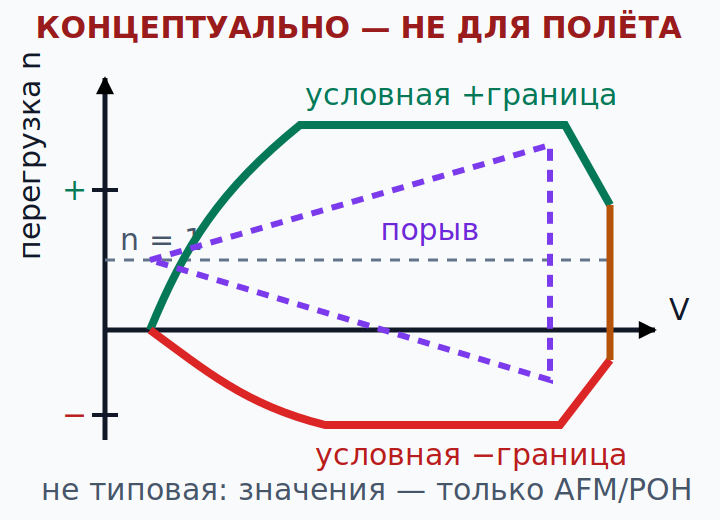

# Сваливание, распознавание штопора и коэффициент перегрузки {#stall-spin-load-factor}

## Назначение {#purpose}

Глава учит распознавать причинную цепочку: угол атаки → отрыв потока и сваливание → при рыскании или асимметрии возможна авторотационная тенденция. Одновременно геометрия разворота и порывы изменяют [коэффициент перегрузки](../reference/glossary.md#term-load-factor). Приоритет — предотвращение, координация и раннее решение, а не письменная «универсальная техника вывода».

> **Граница главы.** Текущий [AFM](../reference/glossary.md#term-afm)/[POH](../reference/glossary.md#term-poh) и инструктор определяют предупреждения, ограничения, разрешённые манёвры и обучение выводу. Чтение теории не разрешает самостоятельно тренировать сваливание, начальную стадию штопора, штопор, крутые развороты или полёт у конструкционных пределов.

## Результаты обучения {#outcomes}

После главы вы сможете:

1. объяснить сваливание через критический угол атаки, а не одну воздушную скорость;
2. распознать ускоренное сваливание и риск нескоординированного разворота с базового этапа на посадочную прямую;
3. использовать `n = 1/cos(phi)` только в ограниченной модели установившегося координированного горизонтального разворота;
4. вычислить относительное изменение скорости сваливания при перегрузке;
5. прочитать концептуальную диаграмму V-n без переноса пределов другого типа;
6. объяснить границы VA и почему теория не разрешает практику штопора.

## Карта применимости {#applicability}

| Метка | Как использовать главу |
|---|---|
| [ULM — ОСНОВА][ulm] | Критический угол атаки, распознавание сваливания, координация и коэффициент перегрузки для [MAF](../reference/glossary.md#term-maf). |
| [ULM — ОСОБО ВАЖНО][ulm] | Низкая высота в аэродромном круге оставляет мало времени: предотвращение важнее позднего вывода. |
| [PART-FCL — ОБЩЕЕ][part-fcl] | Общий объём предмета 081: сваливание, штопор, перегрузка и область режимов. |
| [LAPL — ПЕРЕХОД] | Теория общая, но практику проводит [DTO](../reference/glossary.md#term-dto)/[ATO](../reference/glossary.md#term-ato) на допущенном самолёте. |
| [PPL — РАСШИРЕНИЕ] | Для [LAPL(A)](../reference/glossary.md#term-lapl-a) и [PPL(A)](../reference/glossary.md#term-ppl-a) теоретическая глубина одинакова: общий предмет 081; отдельного слоя только для PPL здесь нет. |
| [ИСПАНИЯ] | GU09, страницы 15–20 и эксплуатационные страницы 49–58; GU05, страница 9, задаёт границу обучения под руководством инструктора. |
| [БЕЗОПАСНОСТЬ] | Здесь нет универсальной контрольной карты вывода или универсальной высоты для возврата. |
| [ПРОВЕРИТЬ ПЕРЕД ПОЛЁТОМ] | Предупреждения самолёта, массу и CG, состояние поверхности, скорости, разрешённые манёвры и задание инструктора. |

## Теория {#theory}

### Критический угол атаки и сваливание {#critical-aoa-stall}

[Аэродинамическое сваливание (English: aerodynamic stall; español: pérdida aerodinámica)](../reference/glossary.md#term-stall) возникает, когда при данных профиле, конфигурации и условиях потока крыло выходит за область [критического угла атаки](../reference/glossary.md#term-critical-angle-of-attack). Отрыв потока существенно меняет подъёмную силу, сопротивление и момент, а дальнейший рост угла атаки уже не даёт ожидаемой подъёмной силы. Сваливание не означает, что подъёмная сила мгновенно равна нулю.

[Stall](../reference/glossary.md#term-stall), то есть сваливание, — это не только низкая скорость. Оно возможно при высокой воздушной скорости, в наборе, снижении, развороте, при выводе из снижения или необычном пространственном положении, если требуемые подъёмная сила и перегрузка приводят к критическому углу атаки. Скорость — косвенный индикатор для определённых массы, перегрузки, конфигурации и условий. Поэтому нет одной неизменной скорости [stall](../reference/glossary.md#term-stall) для всех масс, кренов, нагрузок, загрязнений и конфигураций.

**Тангаж тоже не защищает.** Нос может быть ниже горизонта, а угол атаки — критическим из-за более крутой траектории или вращения. Перевёрнутое положение также не устраняет физику сваливания: знак подъёмной силы, перегрузки и геометрия изменяются, но превышение применимого критического угла атаки остаётся аэродинамической границей.

Предупреждающие признаки различаются: бафтинг, изменение реакции органов управления, звук, положение самолёта, установленная сигнализация сваливания и индикация угла атаки. Ни один признак не гарантирован в одинаковом порядке и с одинаковой интенсивностью. [AFM](../reference/glossary.md#term-afm)/[POH](../reference/glossary.md#term-poh) и задание инструктора для конкретного самолёта — единственная основа ожиданий. Технический источник: `SRC-FAA-PHAK-25C-CH5`, страницы 5-25–5-38; распознавание и предотвращение: `SRC-FAA-AFH-3C-CH5`, страницы 5-12–5-27.

### Ускоренное сваливание и требуемая перегрузка {#accelerated-stall}

**Ускоренное сваливание (English: accelerated [stall](../reference/glossary.md#term-stall); español: pérdida acelerada)** — сваливание при аэродинамической перегрузке по модулю больше базового режима 1g. Чтобы сохранить траекторию при большей кажущейся нагрузке, крыло должно создать больше подъёмной силы; при той же скорости это требует большего `CL` и угла атаки. Критический угол атаки может быть достигнут при скорости выше знакомой скорости сваливания в режиме 1g.

Крен сам по себе не вызывает [stall](../reference/glossary.md#term-stall). В свободном вращении без удержания высоты угол крена может измениться без того же требования к перегрузке. Но в установившемся координированном горизонтальном развороте вертикальная составляющая наклонённой подъёмной силы должна уравновешивать вес; полная подъёмная сила и перегрузка растут. Ошибка «один угол крена сваливает самолёт» скрывает действие взятия ручки на себя, заданной траектории и координации.

### Перегрузка в ограниченной модели разворота {#turn-load-factor}

[Коэффициент перегрузки (English: load factor; español: factor de carga)](../reference/glossary.md#term-load-factor) в этой модели равен `n = L/W`. Для **установившегося координированного горизонтального разворота** без вертикального ускорения, при пренебрежении вертикальной составляющей тяги и другими вертикальными силами:

`L cos(phi) = W`, следовательно `n = 1 / cos(phi)`,

где `phi` — угол крена. Это тригонометрическая, сильно нелинейная зависимость, стремительно растущая по мере приближения `cos(phi)` к нулю. Формула не применяется автоматически к скольжению, набору, снижению, переходному процессу, порыву или перевёрнутому полёту.

GU09 на странице 19 употребляет формулировку, эквивалентную «экспоненциальному» росту. Мы не используем её как уравнение: термин математически неточен. GU09 подтверждает объём программы по связи перегрузки и крена; физически корректная ограниченная зависимость для указанной модели — `n = 1/cos(phi)`, подтверждённая `SRC-FAA-PHAK-25C-CH5`, страницы 5-25–5-38.

### CALC-PF-05 — Перегрузка при условном крене {#calc-pf-05}

**КОНЦЕПТУАЛЬНО — НЕ ДЛЯ ПОЛЁТА.**

**Дано:** `phi = 45°`; установившийся координированный горизонтальный разворот; постоянная высота, без порыва и переходного ускорения.

**Формула:** `n = 1/cos(phi)`.

**Расчёт:** `n = 1/cos(45°) = 1/(√2/2) = √2 = 1,414`.

**Результат:** условный коэффициент перегрузки `n ≈ 1,414` (безразмер).

**Решение пилота:** не считать 45° разрешением или пределом; крен, скорость и техника определяются учебной программой, [AFM](../reference/glossary.md#term-afm)/[POH](../reference/glossary.md#term-poh) и заданием инструктора.

<!-- recompute-result: 1.414 -->

### Относительное изменение скорости сваливания {#relative-stall-speed}

В упрощённой установившейся модели при `n > 0`, одинаковых массе, конфигурации, `CLmax`, плотности воздуха и одинаковой базе скорости:

`Vs(n) / Vs(1g) = sqrt(n)`.

Это **отношение**, а не новая эксплуатационная скорость. Реальные предупреждения, загрязнение, конфигурация, динамический манёвр, обдув винтом и приборные погрешности могут изменить картину. Нельзя умножать чужую скорость или неподтверждённую оценку.

В обычном дозвуковом полёте приборная или калиброванная скорость IAS/CAS приблизительно отражает связь с динамическим давлением. Поэтому указанная IAS/CAS сваливания при одинаковых конфигурации и перегрузке обычно меняется с плотностью меньше, чем истинная скорость TAS. Но на высоте при меньшей плотности соответствующая TAS выше для похожего показания динамического давления. Поправки на прибор, положение и сжимаемость, а также точные определения [AFM](../reference/glossary.md#term-afm) сохраняются; это не делает скорость сваливания «неизменной» и не разрешает считать реальный предел по одной формуле.

### CALC-PF-06 — Относительная скорость сваливания при условной перегрузке {#calc-pf-06}

**КОНЦЕПТУАЛЬНО — НЕ ДЛЯ ПОЛЁТА.**

**Дано:** из CALC-PF-05 `n = √2 ≈ 1,414 > 0`; одинаковые масса, конфигурация, `CLmax`, плотность и база скорости; установившаяся идеализированная модель.

**Формула:** `Vs(n)/Vs(1g) = √n`.

**Расчёт:** `√1,414 = √(√2) = 2^(1/4) = 1,189`.

**Результат:** условное отношение скоростей `≈ 1,189` (безразмер), то есть около `18,9 %` выше только в этой модели.

**Решение пилота:** не вычислять скорость в аэродромном круге из процента; использовать [AFM](../reference/glossary.md#term-afm)/[POH](../reference/glossary.md#term-poh), фактические массу и конфигурацию, а также запасы, заданные инструктором.

<!-- recompute-result: 1.189 -->

### Распознавание штопора без универсальной контрольной карты {#spin-awareness}

**Штопор (English: spin; español: barrena)** — авторотационное движение после сваливания с асимметрией между крыльями и рысканием, где одно крыло обычно свалено глубже. **Начальная стадия штопора (English: incipient spin; español: barrena incipiente)** — переходная стадия; её точная граница и движение зависят от самолёта.

Риск возрастает при сочетании:

- большого угла атаки или уже начавшегося сваливания;
- рыскания либо нескоординированного управления;
- асимметрии из-за порыва, мощности, конфигурации или опускания крыла;
- задней центровки либо влияния загрузки внутри допустимого диапазона или рядом с его границей;
- малой высоты и фиксации внимания на ВПП либо развороте.

Главная теория — предотвращение: не требовать от крыла недоступной подъёмной силы, поддерживать обученную координацию, распознавать уменьшение запасов и менять план до ловушки на малой высоте. Этот текст **намеренно не содержит последовательности действий органами при выводе**: подходящая процедура зависит от допуска самолёта, [AFM](../reference/glossary.md#term-afm)/[POH](../reference/glossary.md#term-poh), стадии, загрузки и обучения с инструктором. Некоторые самолёты не допущены к преднамеренному штопору; наличие текста о выводе в иностранном руководстве не меняет допуска.

Чтение теории не разрешает и не даёт права самостоятельно практиковать сваливание или штопор. `SRC-AESA-MAF-PRACTICAL-GU05-ED01`, страница 9, помещает медленный полёт, сваливание, вывод при опускании крыла и предотвращение начального штопора в программу **лётной подготовки под руководством инструктора**. `SRC-FAA-AFH-3C-CH5`, страницы 5-12–5-27, используется только для распознавания и предотвращения, а не как испанская процедура.

**Спиральное пикирование (English: spiral dive; español: picado en espiral)** и **штопор** — разные режимы. В штопоре крыло находится в состоянии сваливания с авторотацией; при спиральном пикировании крыло обычно не свалено, скорость и перегрузка способны быстро расти. Внешне оба режима могут включать крен, снижение и вращение, поэтому различать их только по одному положению носа или виду земли нельзя. Распознавание и действия зависят от самолёта и отрабатываются только с инструктором по [AFM](../reference/glossary.md#term-afm)/[POH](../reference/glossary.md#term-poh).

### Диаграмма V-n — карта сочетаний, а не универсальный предел {#vn-envelope-concept}

**Диаграмма V-n** связывает скорость `V` и [коэффициент перегрузки](../reference/glossary.md#term-load-factor) `n` при оговорённых допущениях, массе, конфигурации и категории. Аэродинамические границы [сваливания](../reference/glossary.md#term-stall) обычно криволинейны; конструкционные манёвренные пределы и расчётные границы скорости задают другие участки. Порывная область показывает расчётную реакцию на заданные проектные порывы. Реальная утверждённая диаграмма требует точных определений.

Одна типовая или универсальная диаграмма V-n не даёт и не заменяет пределы конкретного [AFM](../reference/glossary.md#term-afm)/[POH](../reference/glossary.md#term-poh). На учебной схеме нет чисел именно потому, что:

- положительные и отрицательные пределы могут различаться;
- для конфигурации с закрылками действует своя область;
- масса меняет границу [сваливания](../reference/glossary.md#term-stall) и соответствующие скорости;
- реакция на порыв зависит от конструкции, [удельной нагрузки на крыло](../reference/glossary.md#term-wing-loading) и наклона аэродинамической характеристики;
- основание одобрения [ULM](../reference/glossary.md#term-ulm) нельзя вывести из учебной диаграммы PPL.

### VA и границы применимости {#va-boundary}

[Расчётная манёвренная скорость (English: design manoeuvring speed, VA; español: velocidad de maniobra)](../reference/glossary.md#term-manoeuvring-speed) связана с расчётным соотношением между сваливанием и предельной манёвренной перегрузкой для конкретного самолёта и условия. Ограниченное пояснение PHAK для VA относится к одному полному управляющему воздействию, выполненному один раз по одной оси в плавном, невозмущённом воздухе; даже это читается только вместе с определением для фактического самолёта. VA не является абсолютной или универсальной защитой от любого порыва, резкого воздействия, конфигурации либо превышения конструкционного предела.

FAA PHAK, страницы 5-35–5-36 (`SRC-FAA-PHAK-25C-CH5`), прямо предупреждает: для VA повторные или реверсивные полные отклонения и одновременные полные воздействия более чем по одной оси не покрываются этим ограниченным расчётным соотношением. Кроме того, опубликованная VA может зависеть от массы; точные ограничения и терминологию берут из [AFM](../reference/glossary.md#term-afm)/[POH](../reference/glossary.md#term-poh). Утверждение «ниже VA можно всё» — опасный миф.

### SCN-PF-01 — Затягивание разворота base-to-final без координации {#scn-pf-01}

**Признаки:** перелёт осевой линии, фиксация внимания на ВПП, растущий крен, попытка удержать высоту взятием ручки на себя, педаль, создающая скольжение; контекст разворота с базового этапа на посадочную прямую.

**Механизм:** при попытке удержать высоту в затягиваемом развороте растут требуемая перегрузка и AoA; нескоординированное рыскание создаёт асимметрию у границы [сваливания](../reference/glossary.md#term-stall) и повышает риск начальной стадии штопора.

**Ошибочная интуиция:** «доверну сильнее, потому что скорость ещё выше знакомой скорости сваливания при 1g».

**Граница безопасного решения:** не спасать плохую геометрию затягиванием скользящего разворота; принять ранний уход на второй круг или новый круг по местной процедуре до потери запасов.

**Приоритет:** [AFM](../reference/glossary.md#term-afm)/[POH](../reference/glossary.md#term-poh), инструктор, опубликованная аэродромная процедура и безопасное управление имеют приоритет; универсальной последовательности вывода здесь нет, и такой разворот на малой высоте не отрабатывают самостоятельно.

### SCN-PF-02 — Разворот назад (turn-back) после потери мощности как ловушка решения {#scn-pf-02}

**Признаки:** потеря мощности вскоре после взлёта, малая высота и энергия, желание немедленно вернуться к ВПП, при этом попутный ветер, рельеф и рабочая нагрузка разворота не оценены.

**Механизм:** разворот расходует высоту, удлиняет траекторию и повышает требование к перегрузке; смена направления, геометрия ветра, время реакции и выравнивание с ВПП добавляют потери энергии.

**Ошибочная интуиция:** «аэродром позади всегда безопаснее любой площадки впереди».

**Граница безопасного решения:** нет универсальной высоты для разворота назад turn-back; заранее обсуждённые рубежи решения, специфичные для самолёта, площадки и ветра, формируются с инструктором и по [AFM](../reference/glossary.md#term-afm)/[POH](../reference/glossary.md#term-poh), а не вычисляются из этой главы.

**Приоритет:** [AFM](../reference/glossary.md#term-afm)/[POH](../reference/glossary.md#term-poh), инструктор и конкретный предполётный инструктаж; эта теория не предписывает направление посадки, не даёт универсальной контрольной карты отказа двигателя и не разрешает самостоятельно экспериментировать с разворотом назад.

## Применение к [ULM](../reference/glossary.md#term-ulm)/[MAF](../reference/glossary.md#term-maf) {#ulm-application}

Объём обучения [ULM](../reference/glossary.md#term-ulm): GU09, раздел Principios de Vuelo, pp. 15–20; связи с Performance y Planificación Vuelo, pp. 21–27; граница предотвращения и вывода в Procedimientos Operacionales, pp. 49–58 (`SRC-AESA-ULM-LEARNING-OBJECTIVES-GU09-ED01`). Практический GU05, p. 9, подтверждает контекст упражнений под руководством инструктора. Наличие этих заголовков не превращает текстовый курс в разрешение на полёт.

[MAF](../reference/glossary.md#term-maf)-пилот создаёт запас до входа в аэродромный круг: стабилизированная геометрия, координация, раннее решение об уходе и отсутствие фиксации внимания на ВПП. Реальные скорости, крены и процедуры не публикуются здесь как универсальные.

## Расширение [Part-FCL](../reference/glossary.md#term-part-fcl) {#part-fcl-extension}

Общий для LAPL/PPL предмет 081 требует знания сваливания и штопора, коэффициента перегрузки, ограничений и области режимов (`SRC-EASA-AIRCREW-2026`). Формулы нужны для теоретического экзамена и рассуждений, но практическое обучение манёврам остаётся деятельностью допущенной [DTO](../reference/glossary.md#term-dto)/[ATO](../reference/glossary.md#term-ato) и инструктора. Опыт [MAF](../reference/glossary.md#term-maf) не означает автоматического зачёта теории или практики.

## Безопасность {#safety}

- Сваливание связывают с углом атаки, перегрузкой и конфигурацией, а не только со скоростью.
- Любой нескоординированный затягиваемый разворот на малой высоте — повод изменить план раньше, а не искать поздний вывод.
- VA и типовая схема V-n не дают всеобщей защиты.
- [AFM](../reference/glossary.md#term-afm)/[POH](../reference/glossary.md#term-poh) и инструктор задают предупреждения, действия и ограничения.
- Теория не разрешает самостоятельную практику у сваливания, штопора или конструкционных пределов.

## Частые ошибки {#common-errors}

1. «Быстро — значит сваливание невозможно».
2. «Нос вниз — значит AoA мал».
3. «Один только крен вызывает сваливание» без учёта перегрузки, траектории и управления.
4. Называть `1/cos(phi)` экспоненциальной зависимостью.
5. Применять формулу горизонтального разворота к скольжению, порыву или переходному процессу.
6. Считать VA абсолютной защитой.
7. Копировать универсальный вывод из штопора без допуска конкретного самолёта.

## Итог {#summary}

Сваливание начинается с превышения критического угла атаки в конкретных условиях, а не с одной скорости. Установившийся координированный горизонтальный разворот создаёт `n = 1/cos(phi)` только в ограниченной модели; отношение скоростей сваливания растёт как `sqrt(n)`. Для риска штопора нужны состояние сваливания или большой угол атаки и рыскание либо асимметрия. Диаграмма V-n и скорость VA объясняют расчётные связи, но все реальные пределы и обучение выводу остаются специфичными для самолёта.

## Контрольные вопросы {#review-questions}

### Q-PF-019 — Какое утверждение о сваливании наиболее корректно? {#q-pf-019}

A. Сваливание возможно только ниже одной неизменной приборной скорости. 
B. Сваливание связано прежде всего с превышением критического угла атаки и возможно при разных скоростях и положениях самолёта. 
C. Сваливание невозможно, пока нос находится ниже горизонта. 
D. В начале сваливания подъёмная сила всегда мгновенно становится равной нулю. 

**Правильный ответ:** B.

**Почему:** скорость и положение самолёта лишь косвенно связаны с углом атаки; аэродинамической границей является критическое состояние потока.

**Почему главный отвлекающий вариант неверен:** A сводит сваливание к одной скорости и игнорирует перегрузку, массу, конфигурацию и манёвр.

### Q-PF-020 — Почему горизонтальный разворот может повысить скорость сваливания относительно 1g? {#q-pf-020}

A. Любой крен повышает скорость сваливания одинаково, даже если пилот не удерживает высоту. 
B. Для сохранения высоты требуется большая полная подъёмная сила и перегрузка, поэтому критический `CL` достигается при большей скорости. 
C. В крене часть веса превращается в центростремительную силу, поэтому полная подъёмная сила увеличиваться не должна. 
D. В развороте критический угол атаки уменьшается строго пропорционально углу крена, даже если перегрузка не меняется. 

**Правильный ответ:** B.

**Почему:** вертикальная составляющая наклонённой подъёмной силы должна уравновешивать вес; поэтому полная требуемая подъёмная сила и `n` растут в пределах оговорённой модели.

**Почему главный отвлекающий вариант неверен:** A игнорирует требование к траектории: крен сам по себе не задаёт ту же перегрузку, если высота не удерживается.

### Q-PF-021 — Где допустима формула `n = 1/cos(phi)`? {#q-pf-021}

A. В установившемся координированном горизонтальном развороте при оговорённых допущениях. 
B. В любом неустановившемся развороте, если шарик указателя скольжения находится в центре. 
C. В наборе и снижении без поправок, если угол крена остаётся постоянным. 
D. Для определения конструкционного предела любого [ULM](../reference/glossary.md#term-ulm) только по углу крена и без данных самолёта. 

**Правильный ответ:** A.

**Почему:** формула следует из баланса вертикальной составляющей сил и требует установившегося координированного горизонтального разворота с перечисленными допущениями.

**Почему главный отвлекающий вариант неверен:** B переносит формулу `n = 1/cos(phi)` на неустановившийся разворот, игнорируя вертикальное ускорение и переходный процесс: одной координации недостаточно.

### Q-PF-022 — Какой набор условий наиболее связан с риском начального штопора? {#q-pf-022}

A. Большой угол атаки или близость сваливания вместе с рысканием либо асимметрией и малым запасом. 
B. Высокая путевая скорость при малом угле атаки и координированном полёте. 
C. Умеренный крен при достаточном запасе по углу атаки, но с небольшим изменением высоты. 
D. Любая турбулентность независимо от угла атаки, координации и реакции самолёта. 

**Правильный ответ:** A.

**Почему:** авторотационная тенденция требует сваленного или близкого к сваливанию крыла и асимметрии либо рыскания; особенно опасно такое сочетание на малой высоте.

**Почему главный отвлекающий вариант неверен:** D делает турбулентность самостоятельной причиной штопора и не учитывает аэродинамическое состояние крыла.

### Q-PF-023 — Какое утверждение о VA является корректным? {#q-pf-023}

A. Ниже VA допустимы любые повторные, реверсивные и одновременные полные отклонения органов управления. 
B. VA — расчётная связь для конкретного самолёта и условий, а не абсолютная защита от порывов и любых управляющих воздействий. 
C. VA не зависит от массы и одинакова для всех самолётов одной категории. 
D. VA — единая скорость полёта в турбулентности, ниже которой любой порыв остаётся в пределах прочности самолёта. 

**Правильный ответ:** B.

**Почему:** ограниченная концепция защиты у VA относится к конкретному самолёту и условиям; FAA PHAK pp. 5-35–5-36 и [AFM](../reference/glossary.md#term-afm)/[POH](../reference/glossary.md#term-poh) задают её применимость.

**Почему главный отвлекающий вариант неверен:** A повторяет миф об абсолютной защите и игнорирует повторные и многоосевые нагрузки.

### Q-PF-024 — Что после чтения теории сваливания и штопора пилот вправе сделать самостоятельно? {#q-pf-024}

A. Выполнить преднамеренный штопор на любом [ULM](../reference/glossary.md#term-ulm), если высота кажется достаточной. 
B. Самостоятельно проверить критический AoA, чтобы уточнить предупреждающие признаки своего самолёта. 
C. Использовать знания для предотвращения и проходить практику только в разрешённой подготовке под руководством инструктора. 
D. Заменить [AFM](../reference/glossary.md#term-afm)/[POH](../reference/glossary.md#term-poh) универсальной последовательностью вывода из иностранного пособия. 

**Правильный ответ:** C.

**Почему:** GU05 p. 9 относит соответствующие упражнения к практической подготовке с инструктором, с учётом допуска самолёта и его ограничений.

**Почему главный отвлекающий вариант неверен:** A игнорирует одобрение самолёта, его собственные характеристики штопора и границу подготовки под руководством инструктора.

## Источники {#sources}

- `SRC-AESA-ULM-LEARNING-OBJECTIVES-GU09-ED01` — Principios de Vuelo, pp. 15–20; Performance y Planificación Vuelo, pp. 21–27; Procedimientos Operacionales, pp. 49–58.
- `SRC-AESA-MAF-PRACTICAL-GU05-ED01` — p. 9 supervised practical boundary.
- `SRC-EASA-AIRCREW-2026` — общий для LAPL/PPL объём subject 081: [stall](../reference/glossary.md#term-stall)/load/envelope.
- `SRC-FAA-PHAK-25C-CH5` — pp. 5-1–5-20, 5-25–5-38; VA caution p. 5-35.
- `SRC-FAA-AFH-3C-CH5` — pp. 5-12–5-27 recognition/prevention only.

[ulm]: ../reference/glossary.md#term-ulm
[part-fcl]: ../reference/glossary.md#term-part-fcl
