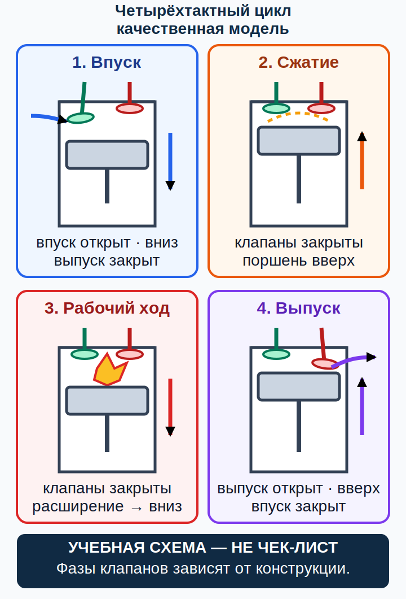

# Поршневой двигатель: цикл, мощность и аномальное сгорание {#piston-engine}

## Назначение {#purpose}

Глава даёт причинную модель поршневого двигателя без числовых лимитов и без процедуры запуска. GU09, Conocimiento General de la Aeronave, pp. 33–39, на p. 33 требует для [MAF](../reference/glossary.md#term-maf) сравнить двух- и четырёхтактный двигатель, топливо, смесеобразование, охлаждение, смазку и зажигание (`SRC-AESA-ULM-LEARNING-OBJECTIVES-GU09-ED01`). Механизмы сверены с FAA-H-8083-25C, pp. 7-1–7-19 (`SRC-FAA-PHAK-25C-CH7`).

> **УЧЕБНАЯ СХЕМА — НЕ ЧЕК-ЛИСТ.** Закон/[AIP](../reference/glossary.md#term-aip)/[NOTAM](../reference/glossary.md#term-notam)/AD → текущие [AFM](../reference/glossary.md#term-afm)/[POH](../reference/glossary.md#term-poh) как точные документы самолёта, [дополнение к руководству по лётной эксплуатации (English: aircraft flight manual supplement; español: suplemento al manual de vuelo)](../reference/glossary.md#term-aircraft-flight-manual-supplement), [эксплуатационная табличка (English: placard; español: letrero o placa)](../reference/glossary.md#term-placard) и [самолётная контрольная карта (English: aircraft checklist; español: lista de comprobación de la aeronave)](../reference/glossary.md#term-aircraft-checklist) → точные руководства двигателя, винта и оборудования, применимые [SB](../reference/glossary.md#term-service-bulletin-sb)/[SI](../reference/glossary.md#term-service-instruction-si) и область применимости (effectivity) → программа и записи технического обслуживания → общий справочник → курс. Инструктор задаёт запуск, прогрев, мощность и действия при неисправности.

## Результаты обучения {#outcomes}

- последовательно объяснять четыре такта и роль клапанов;
- различать рабочий объём, степень сжатия, мощность и крутящий момент качественно;
- сравнивать двух- и четырёхтактный циклы без обобщения конструкции;
- различать детонацию и преждевременное воспламенение;
- понимать, почему симптом не является разрешением на самостоятельную диагностику.

## Карта применимости {#applicability}

| Метка | Что изучать |
|---|---|
| [ULM — ОСНОВА][ulm] | Поршневой двигатель и двух-/четырёхтактный контраст GU09 |
| [ULM — ОСОБО ВАЖНО][ulm] | Небольшая инерция конкретного самолёта и ограниченный запас времени или высоты в конкретной ситуации могут потребовать более раннего решения |
| [PART-FCL — ОБЩЕЕ][part-fcl] | Принципы силовой установки (powerplant principles) из §§8.1–8.2 |
| [LAPL — ПЕРЕХОД] | Та же программа PPL, пройденная в [DTO](../reference/glossary.md#term-dto)/[ATO](../reference/glossary.md#term-ato) |
| [PPL — РАСШИРЕНИЕ] | Более широкий набор установок без универсальных значений |
| [ИСПАНИЯ] | Сначала [MAF](../reference/glossary.md#term-maf); эксплуатация по документам конкретного борта |
| [БЕЗОПАСНОСТЬ] | Ни одного универсального запуска, прогрева или действия по предупреждению (warning response) |
| [ПРОВЕРИТЬ ПЕРЕД ПОЛЁТОМ] | Точные тип, вариант и серийный номер; редакция документов, жидкости и таблички |

## Теория {#theory}

### Четыре такта {#four-stroke-cycle}

Четырёхтактный цикл (English: [four-stroke cycle](../reference/glossary.md#term-four-stroke-cycle); español: ciclo de cuatro tiempos) описывает:

1. **Впуск:** поршень увеличивает объём цилиндра, впускной клапан допускает заряд.
2. **Сжатие:** клапаны в упрощённой модели закрыты, объём уменьшается.
3. **Рабочий ход:** штатное воспламенение повышает давление, газ совершает работу на поршне.
4. **Выпуск:** выпускной клапан открыт, продукты сгорания удаляются.

Реальные фазы газораспределения (valve timing) перекрываются и зависят от конструкции; рисунок показывает последовательность, а не градусы, направление вращения или процедуру. Коленчатый вал преобразует возвратно-поступательное движение поршня во вращение. Крутящий момент характеризует вращающее действие, мощность — темп совершения работы; одна величина без частоты вращения не описывает другую полностью.

### Двухтактный контраст {#two-stroke-contrast}

Двухтактный двигатель объединяет процессы в меньшем числе ходов поршня и часто использует окна/продувку вместо одинаковой клапанной схемы. Это даёт иной цикл газообмена, смазки и тепловой нагрузки, но не означает автоматически меньшую надёжность или одинаковое топливо. Конкретный двигатель может иметь отдельную подачу масла или иную систему; только его руководство определяет смесь, рабочую жидкость и порядок осмотра.

### Смесь, воспламенение и тепло {#combustion-quality}

Для устойчивого сгорания нужны подходящие воздух, топливо, смешение, сжатие и искра в предусмотренное время. Слишком бедное/богатое состояние, недостаточная подача, неверное зажигание или тепловая проблема могут давать похожие признаки. Пилот наблюдает приборы и поведение, но не выводит одну причину по одному сигналу.

Детонация (English: [detonation](../reference/glossary.md#term-detonation); español: detonación) — ударное аномальное сгорание части смеси после штатной искры. Преждевременное воспламенение (English: [pre-ignition](../reference/glossary.md#term-pre-ignition); español: preencendido) начинается до предусмотренной искры от горячей точки. Это разные механизмы, хотя один способен усиливать другой. Универсального слышимого признака или пилотского «лечения» нет.

### Наддув и редуктор {#boost-reduction}

Турбокомпрессор (turbocharger) использует энергию выхлопа для повышения давления на впуске в пределах системы управления. Наличие турбокомпрессора не означает одинаковую логику перепускной заслонки и наддува (wastegate/boost logic). Редуктор позволяет коленчатому валу и винту работать с различной частотой; передаточное отношение, инерция винта и ограничения установки специфичны.

### SCN-AGK-02 — Необычная работа двигателя {#scn-agk-02}

**Признаки:** изменение звука, вибрации, мощности или сочетание отклоняющихся показаний.

**Конкурирующие объяснения:** топливо или воздух, зажигание, температура или давление, винт, датчик или показание, аэродинамическая причина.

**Граница безопасного решения:** сохранить управление самолётом, не продолжать испытание ради диагноза и применить точную процедуру борта при ненормальной или аварийной ситуации (abnormal/emergency procedure).

**Точный документ:** [AFM](../reference/glossary.md#term-afm)/[POH](../reference/glossary.md#term-poh), контрольная карта самолёта, точные руководство двигателя, его редакция и область применимости, а также инструктаж преподавателя.

**Почему это не чек-лист:** направление движения органа управления, допустимое время и приоритеты отличаются между установками.

## Применение к [ULM](../reference/glossary.md#term-ulm)/[MAF](../reference/glossary.md#term-maf) {#ulm-application}

Для [ULM](../reference/glossary.md#term-ulm) важно превратить знание цикла в распознавание цепочки «подача — смешение — воспламенение — тепло — механическая работа — винт». GU09 pp. 33–39 задаёт учебный объём, но не ограничения двигателя. Цель [MAF](../reference/glossary.md#term-maf) — заранее найти точный документ, прочитать индикаторы и прекратить полёт или подготовку по установленной границе, а не ремонтировать в кабине.

## Расширение [Part-FCL](../reference/glossary.md#term-part-fcl) {#part-fcl-extension}

LAPL использует ту же программу «Общие знания о воздушном судне» (Aircraft General Knowledge), что PPL, через AMC1 FCL.115/FCL.120 и AMC1 FCL.210/FCL.215 §§8.1–8.2 (`SRC-EASA-AIRCREW-2026`). Переход расширяет круг двигателей и систем; он не превращает значение из одного [POH](../reference/glossary.md#term-poh) в общее правило. [Part-ML](../reference/glossary.md#term-part-ml) и [Part-NCO](../reference/glossary.md#term-part-nco) зависят от самолёта и операции, не от одной лицензии.

## Безопасность {#safety}

- Частота вращения (RPM), продолжительность, холостой ход, температура, давление, топливо, масло, охлаждающая жидкость, запуск, прогрев и охлаждение не имеют универсального значения «для всех ROTAX».
- Не вращайте винт и не выполняйте опробование двигателя (engine run) по тексту курса.
- Не принимайте шум или запах за однозначный диагноз.
- Тренировка отказов проводится только инструктором и по одобренной программе.

## Частые ошибки {#common-errors}

1. Считать каждый двухтактный двигатель одинаково смазываемым.
2. Путать детонацию с преждевременным воспламенением.
3. Считать турбонаддув характеристикой каждого ROTAX.
4. Выводить исправность из одного нормального индикатора.
5. Запоминать чужую процедуру запуска вместо документа борта.

## Итог {#summary}

Рабочий цикл объясняет превращение энергии, но управление конкретным двигателем определяется точной установкой. Несколько причин могут создавать одинаковые признаки; пилот управляет риском и следует процедуре самолёта, не проводит самостоятельный эксперимент.

## Контрольные вопросы {#review-questions}

### Q-AGK-006 — Что происходит на рабочем ходе? {#q-agk-006}

A. Газ расширяется после штатного воспламенения и совершает работу на поршне. 
B. Выпускной поток всегда вращает винт напрямую без коленчатого вала. 
C. Поршень засасывает заряд через открытый выпускной клапан. 
D. Оба клапана обязательно открыты весь ход у любого двигателя.

**Правильный ответ:** A.

**Почему:** Давление продуктов сгорания действует на поршень, а кривошипный механизм передаёт вращающий момент валу.

**Почему главный отвлекающий вариант неверен:** C смешивает назначение впускного и выпускного трактов рабочего цикла.

### Q-AGK-007 — Чем мощность отличается от крутящего момента? {#q-agk-007}

A. Мощность описывает темп работы, а момент — вращающее действие силы. 
B. Мощность относится только к винту, момент — только к топливу. 
C. Это всегда одна величина с разными единицами. 
D. Момент не зависит от давления в цилиндрах.

**Правильный ответ:** A.

**Почему:** Момент и частота вращения совместно связаны с мощностью, поэтому понятия не взаимозаменяемы.

**Почему главный отвлекающий вариант неверен:** C ошибочно объявляет мощность и крутящий момент одной величиной, стирая различие вращающего действия и темпа работы.

### Q-AGK-008 — Как корректно сравнивать двух- и четырёхтактный двигатели? {#q-agk-008}

A. По циклу газообмена и точной системе конкретной модели, не по универсальному рецепту топлива. 
B. Каждый двухтактный двигатель требует одной и той же смеси масла. 
C. Каждый четырёхтактный двигатель обязательно имеет отдельный масляный бак и сухой картер. 
D. Каждый двухтактный двигатель получает масло только из предварительно смешанного топлива и не может иметь отдельной подачи.

**Правильный ответ:** A.

**Почему:** Двух- и четырёхтактные двигатели сравнивают по циклу газообмена и точной архитектуре смазки, охлаждения и подачи конкретной модели.

**Почему главный отвлекающий вариант неверен:** B переносит один способ смазки на все двухтактные конструкции.

### Q-AGK-009 — В чём различие аномального сгорания? {#q-agk-009}

A. Детонация развивается после штатной искры, а [преждевременное воспламенение](../reference/glossary.md#term-pre-ignition) начинается до неё от горячей точки. 
B. Оба термина означают только низкое давление масла. 
C. [Преждевременное воспламенение](../reference/glossary.md#term-pre-ignition) всегда безвредно, если RPM стабильно. 
D. Детонацию можно точно установить только по одному звуку в гарнитуре (headset).

**Правильный ответ:** A.

**Почему:** Момент начала относительно штатной искры различает два механизма, хотя они могут взаимодействовать.

**Почему главный отвлекающий вариант неверен:** D превращает неоднозначный звук в недопустимо уверенный диагноз сгорания.

### Q-AGK-010 — Что делать при необычной вибрации двигателя? {#q-agk-010}

A. Продолжить изменение режимов до нахождения резонанса. 
B. Управлять самолётом и применить точную процедуру, не проводя эксперимент ради диагноза. 
C. Считать причиной только свечу зажигания. 
D. Перезапускать системы по памяти от другого самолёта.

**Правильный ответ:** B.

**Почему:** Вибрация может иметь двигательную, винтовую, конструктивную или индикационную причину, поэтому важна безопасная граница.

**Почему главный отвлекающий вариант неверен:** C исключает конкурирующие причины до проверки точных данных и состояния самолёта.

## Источники {#sources}

- `SRC-AESA-ULM-LEARNING-OBJECTIVES-GU09-ED01` — Conocimiento General de la Aeronave, pp. 33–39; здесь p. 33, объём обучения, не пределы.
- `SRC-EASA-AIRCREW-2026` — §§8.1–8.2.
- `SRC-FAA-PHAK-25C-CH7` — pp. 7-1–7-19.
- `SRC-ROTAX-TECH-DOCS` — точный документ выбирается в следующей главе.

[ulm]: ../reference/glossary.md#term-ulm
[part-fcl]: ../reference/glossary.md#term-part-fcl
