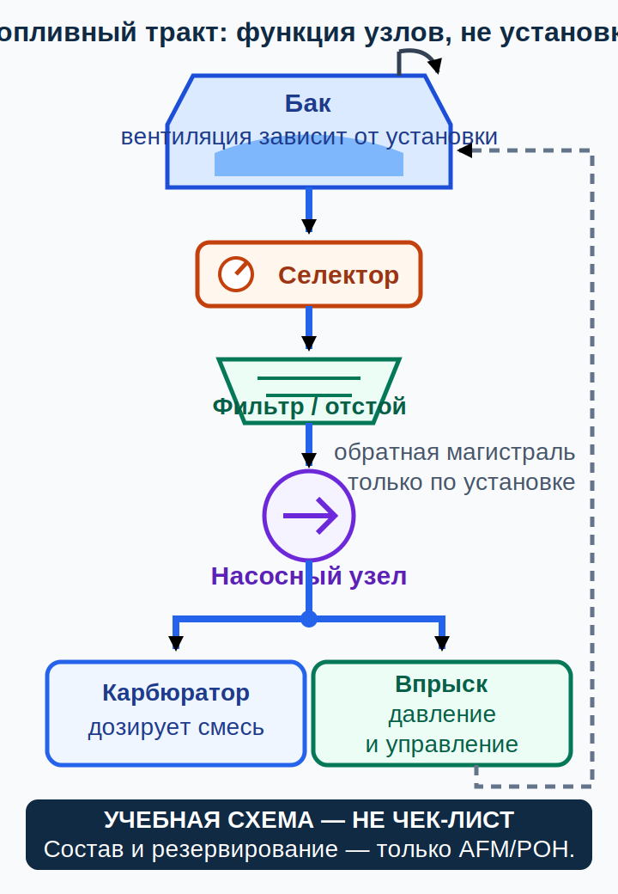

# Топливо, впуск, смазка, охлаждение и зажигание {#fuel-oil-cooling-ignition}

## Назначение {#purpose}

Глава строит функциональную цепочку от бака до цилиндра и обратно к показаниям приборов. Она не сообщает марку топлива (fuel grade), рабочую жидкость, положение крана-селектора, пределы давления и температуры или действия для конкретного самолёта. Объём: GU09, Conocimiento General de la Aeronave, pp. 33–39; здесь p. 33 (`SRC-AESA-ULM-LEARNING-OBJECTIVES-GU09-ED01`). Механизмы: FAA-H-8083-25C pp. 7-1–7-19 и 7-25–7-34 (`SRC-FAA-PHAK-25C-CH7`).

> **УЧЕБНАЯ СХЕМА — НЕ ЧЕК-ЛИСТ.** Право/[AIP](../reference/glossary.md#term-aip)/[NOTAM](../reference/glossary.md#term-notam)/AD → текущие [AFM](../reference/glossary.md#term-afm)/[POH](../reference/glossary.md#term-poh) как точные документы самолёта, [дополнение к руководству по лётной эксплуатации (English: aircraft flight manual supplement; español: suplemento al manual de vuelo)](../reference/glossary.md#term-aircraft-flight-manual-supplement), [эксплуатационная табличка (English: placard; español: letrero o placa)](../reference/glossary.md#term-placard) и [самолётная контрольная карта (English: aircraft checklist; español: lista de comprobación de la aeronave)](../reference/glossary.md#term-aircraft-checklist) → точные руководства двигателя и оборудования, применимые [SB](../reference/glossary.md#term-service-bulletin-sb)/[SI](../reference/glossary.md#term-service-instruction-si) и область применимости → программа и записи технического обслуживания → общий справочник → курс. Инструктор показывает фактическую систему.

## Результаты обучения {#outcomes}

- проследить топливо через кран-селектор, фильтр и насос к карбюратору или системе впрыска;
- различить загрязнение, расхождение показаний, образование пара и обледенение карбюратора;
- объяснить задачи систем смазки, охлаждения и зажигания;
- интерпретировать показание как признак, а не готовый диагноз;
- установить безопасную границу решения до любого действия по техническому обслуживанию.

## Карта применимости {#applicability}

| Метка | Что изучать |
|---|---|
| [ULM — ОСНОВА][ulm] | Топливо, впуск, смазка, охлаждение и зажигание по GU09 p. 33 |
| [ULM — ОСОБО ВАЖНО][ulm] | Визуальная или иная независимая проверка топлива и ранний отказ от сомнительного борта |
| [PART-FCL — ОБЩЕЕ][part-fcl] | Те же механизмы в §§8.1–8.2 |
| [LAPL — ПЕРЕХОД] | Система нового самолёта изучается заново |
| [PPL — РАСШИРЕНИЕ] | Дополнительные варианты насосов, баков, впрыска и установок с турбонаддувом |
| [ИСПАНИЯ] | Одобрение самолёта и двигателя определяет применимое топливо и действия |
| [БЕЗОПАСНОСТЬ] | Нет универсального ответа на применение обогрева карбюратора, насоса или селектора |
| [ПРОВЕРИТЬ ПЕРЕД ПОЛЁТОМ] | Количество, марка и загрязнение топлива, вентиляция, утечки и крышки по контрольной карте |

## Теория {#theory}

### Топливная цепочка {#fuel-chain}

Функционально система может содержать бак (tank), вентиляцию (vent), кран-селектор (selector), трубопроводы, слив или отстойник, фильтр, насос с приводом от двигателя и/или электрический насос, карбюратор либо компоненты впрыска, а иногда обратную магистраль. Не каждая установка имеет все блоки или ту же последовательность. Закрытая вентиляция способна ограничить подачу даже при наличии топлива; утечка может допустить воздух или создать опасность пожара.

Топливомер (fuel gauge) — лишь один входной источник информации. GU09 p. 38 отдельно связывает показание с визуальной проверкой; применимый независимый способ и его доступность задаёт документация самолёта. Показание не устраняет необходимость сравнить плановое количество, фактический способ проверки, расход и записи.

### Загрязнение и парообразование {#contamination-vapour}

Вода, частицы, неверная марка или смесь несовместимых видов топлива способны нарушить работу. Вода может распределяться неравномерно и перемещаться после движения самолёта. Цвет или запах сами по себе не доказывают марку или отсутствие загрязнения.

Паровая пробка (English: [vapour lock](../reference/glossary.md#term-vapour-lock); español: bloqueo de vapor) возникает, когда жидкое топливо образует пар в чувствительной части системы и нарушает подачу. Температура, давление, летучесть, прокладка магистралей и конфигурация насосов влияют совместно. Нет одного универсального переключения насоса или селектора для всех самолётов.

### Карбюратор, впрыск и лёд {#carburettor-injection-icing}

Карбюратор использует перепад давления и дозирующие элементы для смешения; система впрыска (fuel injection) подаёт топливо через иную архитектуру дозирования. Это не делает впрыск неуязвимым к загрязнению, парообразованию или зависимости от электропитания.

Обледенение карбюратора (English: [carburettor icing](../reference/glossary.md#term-carburettor-icing); español: engelamiento del carburador) связано с локальным охлаждением потока и влагой; оно возможно не только при внешней температуре ниже нуля. Возможные признаки — постепенная потеря мощности или неравномерная работа, но такие же признаки создают смесь, зажигание, подача топлива, винт или неисправность прибора. Наличие обогрева карбюратора, его индикация и реакция зависят от конкретной установки.

### Смазка, охлаждение и зажигание {#oil-cooling-ignition}

Масло уменьшает трение и износ, отводит тепло, очищает и помогает уплотнению; конфигурации насоса, резервуара или картера, фильтра и охладителя различаются. Сухой картер (English: [dry sump](../reference/glossary.md#term-dry-sump); español: cárter seco) хранит основной запас в отдельном баке, но процедура проверки уровня масла и любое действие, называемое «burping», не универсальны.

Воздушное, жидкостное и масляное охлаждение могут сочетаться. Показание температуры в одной точке не является температурой каждого компонента. Зажигание часто имеет резервирование, но названия переключателей, независимость контуров, разрешённые проверки, допустимые падения показаний и поведение при отказе зависят от точных двигателя и самолёта.

### SCN-AGK-04 — Показание топлива не сходится с независимой проверкой {#scn-agk-04}

**Признаки:** топливомер или сумматор расхода показывает одно, применимая визуальная или иная независимая проверка либо записи — другое.

**Конкурирующие объяснения:** неверное исходное количество, датчик или калибровка, положение самолёта, утечка, незаписанная заправка, неверный выбор бака или непонимание единиц.

**Граница безопасного решения:** не выбирать «приятное» значение; не вылетать, пока количество, состояние системы и записи не согласованы точным способом.

**Точный документ:** самолётные [AFM](../reference/glossary.md#term-afm)/[POH](../reference/glossary.md#term-poh) и контрольная карта, дополнение по топливной системе, таблички, калиброванный метод и записи технического обслуживания.

**Почему это не чек-лист:** геометрия, невырабатываемый остаток топлива, логика указателя и разрешённый независимый метод различаются.

### SCN-AGK-05 — Постепенная неравномерная работа при возможном обледенении карбюратора {#scn-agk-05}

**Признаки:** постепенное изменение мощности или равномерности работы карбюраторной установки в условиях влаги и охлаждения.

**Конкурирующие объяснения:** обледенение карбюратора, ограничение подачи или пар в топливе, зажигание, смесь, загрязнение, впуск или проблема индикации.

**Граница безопасного решения:** продолжать управлять самолётом, сохранять варианты посадки и использовать точную самолётную процедуру; не оставаться в воздухе ради доказательства диагноза.

**Точный документ:** обычная или особая процедура [AFM](../reference/glossary.md#term-afm)/[POH](../reference/glossary.md#term-poh), точное руководство системы впуска или двигателя, текущая погода и инструктаж преподавателя.

**Почему это не чек-лист:** установленный орган, задержка реакции, показания и последующие шаги не универсальны.

## Применение к [ULM](../reference/glossary.md#term-ulm)/[MAF](../reference/glossary.md#term-maf) {#ulm-application}

На [MAF](../reference/glossary.md#term-maf) ученик рисует схему потоков именно своего самолёта по одобренной документации и физически идентифицирует компоненты с инструктором. GU09 pp. 33–39 задаёт теорию для [MAF](../reference/glossary.md#term-maf), а не разрешение снять фильтр или сливную магистраль либо искать неисправность насоса. Цель — увидеть расхождение до взлёта.

## Расширение [Part-FCL](../reference/glossary.md#term-part-fcl) {#part-fcl-extension}

LAPL/PPL §§8.1–8.2 расширяют глубину изучения систем (`SRC-EASA-AIRCREW-2026`). [Part-ML](../reference/glossary.md#term-part-ml) позднее регулирует применимую поддерживаемую лётную годность (continuing airworthiness), но не следует автоматически из лицензии; [Part-NCO](../reference/glossary.md#term-part-nco) также определяется операцией и воздушным судном.

## Безопасность {#safety}

- Топливо, октановое число и этанол, масло и охлаждающая жидкость, давление и температура, конфигурация насосов никогда не универсальны.
- Не использовать цвет или показание топливомера как единственное доказательство.
- Не повторять сброс, включение автомата защиты или переключение насоса без точной процедуры.
- Не открывать систему для «быстрой проверки» без компетентности и полномочий.

## Частые ошибки {#common-errors}

1. Считать впрыск защитой от всех проблем с топливом.
2. Исключать обледенение карбюратора при положительной внешней температуре.
3. Делать «burping» любого ROTAX одинаково.
4. Считать нормальное давление масла доказательством исправности всей системы.
5. Принимать показание топливомера за независимое измерение.

## Итог {#summary}

Топливо, впуск, смазка, охлаждение и зажигание связаны. Признак сужает область внимания, но не определяет неисправный компонент. Безопасное действие пилота — управление самолётом, точная процедура и ранняя граница решения о посадке или отказе от вылета, а не обслуживание из кабины.

## Контрольные вопросы {#review-questions}

### Q-AGK-016 — Почему вентиляция бака важна для подачи топлива? {#q-agk-016}

A. Она допускает необходимое выравнивание давления в предусмотренной архитектуре бака. 
B. Она всегда создаёт положительное давление подачи независимо от установки и насосов. 
C. Она заменяет фильтр и слив. 
D. Закрытая вентиляция не может нарушить подачу, пока указатель показывает топливо.

**Правильный ответ:** A.

**Почему:** Ограниченная вентиляция способна препятствовать потоку топлива даже при заметном количестве в баке.

**Почему главный отвлекающий вариант неверен:** B приписывает вентиляции универсальное создание положительного давления независимо от насосов и установки; D смешивает наличие топлива по указателю со способностью бака принимать замещающий воздух и поддерживать поток.

### Q-AGK-017 — Что делать при расхождении указателя и независимой проверки? {#q-agk-017}

A. Использовать большее значение как более консервативное. 
B. Согласовать количество и состояние системы точным одобренным методом до полёта. 
C. Усреднить два значения для полётного журнала. 
D. Игнорировать указатель на любом [ULM](../reference/glossary.md#term-ulm).

**Правильный ответ:** B.

**Почему:** Расхождение может означать ошибку количества или индикации, утечку либо непонимание единиц и требует разрешения.

**Почему главный отвлекающий вариант неверен:** A выбирает большее количество по указателю или независимой проверке без доказательства, какое значение топлива физически достоверно.

### Q-AGK-018 — Когда возможно [обледенение карбюратора](../reference/glossary.md#term-carburettor-icing)? {#q-agk-018}

A. Только при отрицательной внешней температуре. 
B. При подходящем сочетании влаги и локального охлаждения, включая положительную внешнюю температуру. 
C. Только на двигателе с впрыском топлива. 
D. Только при пустом топливном баке.

**Правильный ответ:** B.

**Почему:** Перепад давления и испарение способны значительно охладить горловину карбюратора относительно окружающего воздуха.

**Почему главный отвлекающий вариант неверен:** A игнорирует локальное охлаждение внутри карбюратора и наличие влаги.

### Q-AGK-019 — Что означает схема с сухим картером? {#q-agk-019}

A. Основной запас масла находится в отдельном баке и циркулирует системой. 
B. Двигатель работает совсем без масла. 
C. Любой пилот должен одинаково поворачивать винт перед запуском. 
D. Охлаждение всегда только воздушное.

**Правильный ответ:** A.

**Почему:** Отдельный резервуар является архитектурным признаком, но точная процедура проверки уровня остаётся специфичной для модели.

**Почему главный отвлекающий вариант неверен:** C превращает описание схемы в опасную универсальную процедуру обращения с винтом.

### Q-AGK-020 — Почему неравномерная работа не доказывает обледенение карбюратора? {#q-agk-020}

A. Похожие признаки могут дать подача топлива, зажигание, смесь, винт и неисправности индикации. 
B. Обледенение карбюратора никогда не влияет на мощность. 
C. При наличии карбюратора такая неравномерность однозначно доказывает именно обледенение. 
D. Любой двигатель автоматически удаляет лёд.

**Правильный ответ:** A.

**Почему:** Неравномерная работа двигателя может быть вызвана обледенением карбюратора, подачей топлива, зажиганием, смесью, винтом или неисправностью индикации, поэтому нужна точная процедура.

**Почему главный отвлекающий вариант неверен:** B ошибочно отрицает влияние обледенения карбюратора на поток воздуха, смесь, равномерность работы и мощность.

## Источники {#sources}

- `SRC-AESA-ULM-LEARNING-OBJECTIVES-GU09-ED01` — Conocimiento General de la Aeronave, pp. 33–39; здесь pp. 33 и 38.
- `SRC-EASA-AIRCREW-2026` — §§8.1–8.2.
- `SRC-FAA-PHAK-25C-CH7` — pp. 7-1–7-19 and 7-25–7-34.
- `SRC-ROTAX-TECH-DOCS` — exact engine document control.
- `SRC-ROTAX-OM-912-ED4-R2`, `SRC-ROTAX-OM-912I-ED2-R2` — qualitative carburetted/injected boundary only.

[ulm]: ../reference/glossary.md#term-ulm
[part-fcl]: ../reference/glossary.md#term-part-fcl
