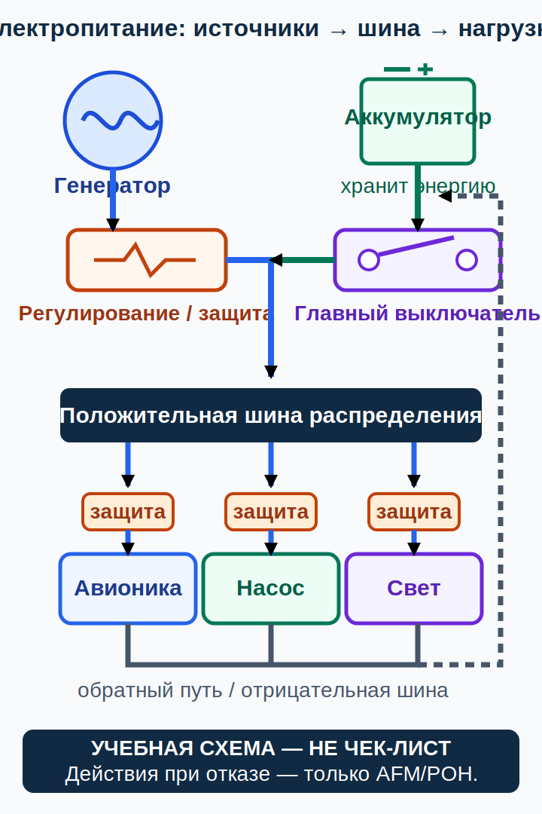

# Воздушный винт и электрическая система постоянного тока {#propeller-electrical}

## Назначение {#purpose}

Воздушный винт преобразует мощность на валу (English: shaft power) в тягу (English: thrust), а электрическая система производит, хранит, распределяет и защищает энергию. Глава объясняет потоки энергии и признаки отказа без настроек шага, пределов инерции, числовых значений напряжения или тока и без универсального перечня действий по перезапуску. Объём: GU09, Conocimiento General de la Aeronave, pp. 33–39; здесь p. 34 (`SRC-AESA-ULM-LEARNING-OBJECTIVES-GU09-ED01`). Механизмы: FAA-H-8083-25C, pp. 7-4–7-7 и 7-30–7-34 (`SRC-FAA-PHAK-25C-CH7`).

> **УЧЕБНАЯ СХЕМА — НЕ ЧЕК-ЛИСТ.** Закон/[AIP](../reference/glossary.md#term-aip)/[NOTAM](../reference/glossary.md#term-notam)/AD → самолётные [AFM](../reference/glossary.md#term-afm)/[POH](../reference/glossary.md#term-poh), [дополнение к руководству по лётной эксплуатации](../reference/glossary.md#term-aircraft-flight-manual-supplement), [эксплуатационная табличка](../reference/glossary.md#term-placard) и [самолётная контрольная карта](../reference/glossary.md#term-aircraft-checklist) → точные руководства двигателя, винта и электрооборудования, [SB](../reference/glossary.md#term-service-bulletin-sb)/[SI](../reference/glossary.md#term-service-instruction-si) и применимость → программа и записи техобслуживания → общее руководство → курс. Конкретные действия задаёт инструктор.

Точные документы [AFM](../reference/glossary.md#term-afm)/[POH](../reference/glossary.md#term-poh) и инструктор определяют действия.

## Результаты обучения {#outcomes}

- качественно объяснить угол установки лопасти, местный [угол атаки](../reference/glossary.md#term-angle-of-attack) и геометрическую крутку;
- различать винты фиксированного, наземно-регулируемого, управляемого в полёте шага и винт постоянной частоты вращения;
- проследить ток от источника или аккумулятора через шину и защиту к потребителю;
- различать напряжение, ток, запас энергии и отключение второстепенной нагрузки;
- распознать неисправность, не используя автоматический выключатель как средство диагностики и не выполняя многократных сбросов.

## Карта применимости {#applicability}

| Метка | Что изучать |
|---|---|
| [ULM — ОСНОВА][ulm] | Понятия о винте и электрической системе постоянного тока из GU09 p. 34 |
| [ULM — ОСОБО ВАЖНО][ulm] | Винт опасен даже при неподвижном самолёте; необходима осведомлённость об энергии и пожарной опасности аккумулятора |
| [PART-FCL — ОБЩЕЕ][part-fcl] | Более широкий объём по силовой установке и электрооборудованию в §§8.1–8.2 |
| [LAPL — ПЕРЕХОД] | Точное дополнение по винту и электрооборудованию нового самолёта |
| [PPL — РАСШИРЕНИЕ] | Изменяемый шаг, постоянная частота вращения и более сложные шины |
| [ИСПАНИЯ] | Требование к оборудованию воздушного пространства не изменяет физику системы |
| [БЕЗОПАСНОСТЬ] | Нет универсальных процедур проворачивания винта, сброса защиты или работы с аккумулятором |
| [ПРОВЕРИТЬ ПЕРЕД ПОЛЁТОМ] | Состояние винта и документов, сигнализация, состояние аккумулятора и источника |

## Теория {#theory}

### Лопасть как вращающееся крыло {#propeller-blade}

Каждое сечение лопасти встречает сочетание вращательного и поступательного потока. Местный [угол атаки](../reference/glossary.md#term-angle-of-attack) зависит от геометрического угла лопасти и набегающего потока; окружная скорость меняется по радиусу, поэтому крутка помогает сечениям работать в подходящих диапазонах. Шаг (English: pitch) — геометрическое и кинематическое описание, а не одна универсальная фактически пройденная в воздухе дистанция: влияют скольжение и режим работы.

У винта фиксированного шага (English: fixed-pitch propeller) геометрия задана конструкцией. Наземно-регулируемый винт (English: ground-adjustable propeller) изменяют только на земле по разрешённой процедуре. У винта управляемого в полёте шаг меняет установленная система, а регулятор винта постоянной частоты вращения изменяет угол лопасти в пределах своей конструкции, стремясь выдержать выбранный режим вращения. Термины и управление зависят от установки.

Нагрузка винта, инерция, балансировка, след лопастей и повреждения влияют на двигатель, редуктор и [планер](../reference/glossary.md#term-airframe). Маленькая забоина не становится автоматически допустимой, а эта глава не разрешает пилоту зачищать или ремонтировать лопасть. Направление вращения и вызванные им моменты рыскания и крена зависят от установки и не бывают универсальными.

### Электричество постоянного тока (DC) {#dc-basics}

Напряжение — разность электрических потенциалов, ток — движение заряда, сопротивление препятствует току, а мощность связана с напряжением и током. Аккумулятор хранит химическую энергию и может питать шину, когда отдача основного источника отсутствует или недостаточна. Генератор преобразует механическую работу, а регулятор и выпрямитель формируют пригодный выход в соответствии с устройством системы.

Главный выключатель или контактор, шины, плавкие предохранители либо автоматические выключатели, проводка, соединения с массой и потребители образуют электрические цепи. Защита предназначена для прекращения чрезмерного тока, а не для многократного применения в качестве диагностического выключателя. Повторное включение защиты способно вновь подать энергию на неисправность и вернуть пожарный риск; любое такое действие допустимо лишь по точной утверждённой процедуре.

### Источники, шины и индикация {#sources-buses-indications}

Нормальное показание напряжения не доказывает питание каждого потребителя: аккумулятор может временно скрывать отказ источника. В зависимости от шунта и логики индикации амперметр показывает заряд или разряд, нагрузку либо другую величину. Название шины «основная» или «второстепенная» само по себе не раскрывает устройство. Пилот сопоставляет сигнализацию, [динамику](../reference/glossary.md#term-trend) напряжения и тока, поведение оборудования и точную схему.

К признакам электрического пожара могут относиться запах, дым, нагрев, мерцание или срабатывание защиты; каждый признак неоднозначен, но требует срочной оценки. Химический состав аккумулятора влияет на развитие события и последующие опасности. Здесь не публикуется универсальная последовательность действий с главным выключателем, генератором, аккумулятором или вентиляцией.

### SCN-AGK-06 — Неисправность источника электроэнергии или генератора {#scn-agk-06}

**Признаки:** предупреждение об источнике, изменение [динамики](../reference/glossary.md#term-trend) напряжения или тока и неожиданное поведение одного либо нескольких потребителей.

**Конкурирующие объяснения:** генератор, привод, регулятор, проводка или масса, шина или защита, датчик или индикатор, чрезмерная нагрузка; аккумулятор способен скрывать отказ.

**Граница безопасного решения:** продолжать управлять самолётом, применять точную контрольную карту, уменьшить подверженность риску и приземлиться до возникновения неопределённости в запасе энергии или работе необходимых систем. Сброс или повторное включение не используют для диагностики и не выполняют многократно; действие допустимо только тогда, когда точная контрольная карта [AFM](../reference/glossary.md#term-afm)/[POH](../reference/glossary.md#term-poh) прямо его разрешает, и только ровно как в ней указано.

**Точный документ:** процедура электрической неисправности из [AFM](../reference/glossary.md#term-afm)/[POH](../reference/glossary.md#term-poh), точная схема и дополнение оборудования, руководства аккумулятора и источника, записи техобслуживания.

**Почему это не чек-лист:** смысл индикации, устройство шин, допустимость повторного включения и продолжительность питания различаются между самолётами.

### SCN-AGK-07 — Неисправность винта или связанной системы {#scn-agk-07}

**Признаки:** новая вибрация или шум, расхождение частоты вращения с индикацией, видимое повреждение либо неожиданная реакция на установленное управление винтом.

**Конкурирующие объяснения:** повреждение или дисбаланс винта, регулятор или управление, двигатель или редуктор, моторама или [планер](../reference/glossary.md#term-airframe), тахометр или датчик, воздушный поток.

**Граница безопасного решения:** не продолжать наземную пробу или полёт ради диагностики; выполнить точную самолётную процедуру и получить осмотр компетентным специалистом.

**Точный документ:** самолётные [AFM](../reference/glossary.md#term-afm)/[POH](../reference/glossary.md#term-poh), точные руководства винта и двигателя, ограничения, [SB](../reference/glossary.md#term-service-bulletin-sb)/AD с применимостью и записи.

**Почему это не чек-лист:** направление управления, допустимый диапазон, реакция на вибрацию и последовательность остановки или посадки зависят от конкретной установки.

## Применение к [ULM](../reference/glossary.md#term-ulm)/[MAF](../reference/glossary.md#term-maf) {#ulm-application}

GU09 p. 34 требует для [MAF](../reference/glossary.md#term-maf) понимания шага, угла атаки, материалов, типов и эффектов винта, а также основ генератора, аккумулятора, главного выключателя и защиты. Ученик должен уметь показать по самолётной схеме, что останется после потери источника, но не вычислять продолжительность питания по номинальной этикетке аккумулятора без утверждённых данных и сведений о его состоянии.

## Расширение [Part-FCL](../reference/glossary.md#term-part-fcl) {#part-fcl-extension}

[Part-FCL](../reference/glossary.md#term-part-fcl) §§8.1–8.2 охватывает более широкий круг систем винта и электрооборудования (`SRC-EASA-AIRCREW-2026`). Лицензии LAPL и PPL не определяют применимость [Part-NCO](../reference/glossary.md#term-part-nco) или [Part-ML](../reference/glossary.md#term-part-ml): её определяют самолёт и операция. При переходе на новый [SEP](../reference/glossary.md#term-sep) всё равно требуется обучение точным системам этого самолёта.

## Безопасность {#safety}

- Считайте каждый винт способным начать движение; порядок безопасности задаёт точная наземная процедура.
- Не тяните, не толкайте, не зачищайте и не измеряйте лопасть на основании этого курса.
- Не используйте сброс или повторное включение автоматического выключателя для диагностики и не повторяйте его. Действуйте только тогда, когда точная самолётная контрольная карта прямо разрешает это, и ровно как в ней указано.
- Реакция на дым, пожар и неисправность аккумулятора зависит от самолёта и химического состава батареи.
- Значения напряжения, тока и оставшегося времени берут только из утверждённых актуальных данных.

## Частые ошибки {#common-errors}

1. Считать геометрический угол лопасти равным местному углу атаки.
2. Считать наземно-регулируемый винт управляемым в полёте.
3. Делать вывод об источнике по одному мгновенному показанию напряжения.
4. Повторно включать автоматический выключатель, пока он не останется включённым.
5. Объявлять продолжительность работы аккумулятора по номинальной ёмкости без учёта нагрузки и состояния.

## Итог {#summary}

Винт и электрическая система преобразуют энергию, а их границы зависят от конкретной установки. Пилот отслеживает динамику и сохраняет варианты действий; конфигурацию и реакцию определяют точные документы.

## Контрольные вопросы {#review-questions}

### Q-AGK-021 — Почему лопасть имеет геометрическую крутку? {#q-agk-021}

A. Окружная скорость и набегающий поток меняются по радиусу, поэтому сечениям нужны разные геометрические углы. 
B. Крутка гарантирует нулевое [сопротивление](../reference/glossary.md#term-drag) при любой частоте вращения. 
C. Крутка делает направление вращения одинаковым на всех самолётах. 
D. Крутка заменяет редуктор двигателя.

**Правильный ответ:** A.

**Почему:** Изменение треугольника местных скоростей вдоль лопасти делает один постоянный геометрический угол неэффективным по всему радиусу.

**Почему главный отвлекающий вариант неверен:** B приписывает крутке невозможное устранение аэродинамического [сопротивления](../reference/glossary.md#term-drag) во всех режимах.

### Q-AGK-022 — Что означает «наземно-регулируемый винт»? {#q-agk-022}

A. Шаг меняется в полёте любым пилотом. 
B. Регулировка выполняется на земле только по разрешённой процедуре уполномоченным лицом. 
C. Регулятор автоматически выдерживает частоту вращения. 
D. Угол лопасти никогда не сверяется с документацией.

**Правильный ответ:** B.

**Почему:** Название ограничивает регулировку наземными условиями и не создаёт возможности управлять шагом в полёте.

**Почему главный отвлекающий вариант неверен:** A смешивает наземную регулировку с системой управления винтом в полёте.

### Q-AGK-023 — Какую роль выполняет аккумулятор при отказе источника? {#q-agk-023}

A. Может временно питать подключённые потребители в соответствии с устройством системы и своим состоянием. 
B. Гарантирует бесконечную работу всех потребителей. 
C. Автоматически устраняет неисправность проводки. 
D. Делает защиту цепей ненужной.

**Правильный ответ:** A.

**Почему:** Запасённая энергия конечна, а время работы зависит от фактической ёмкости, нагрузки, устройства и утверждённых данных.

**Почему главный отвлекающий вариант неверен:** B игнорирует конечный запас энергии и неопределённость состояния аккумулятора.

### Q-AGK-024 — Почему нельзя многократно включать автоматический выключатель? {#q-agk-024}

A. Повторная подача энергии на неисправность может вернуть чрезмерный ток, нагрев или пожарный риск. 
B. Если выключатель удержался после сброса, неисправность доказанно исчезла и дальнейшее наблюдение не требуется. 
C. Один сброс всегда безопасен, потому что защита успеет отключить любую неисправность до нагрева. 
D. Важность потребителя сама по себе разрешает повторные сбросы без точной контрольной карты.

**Правильный ответ:** A.

**Почему:** Срабатывание защиты может указывать на электрическую неисправность; повторная подача энергии способна усугубить её, если точная процедура не разрешает действие.

**Почему главный отвлекающий вариант неверен:** B принимает механическое удержание выключателя за доказательство устранения электрической неисправности, которого оно не даёт.

### Q-AGK-025 — Почему нормальное напряжение может скрывать отказ источника? {#q-agk-025}

A. Аккумулятор может временно поддерживать напряжение шины после потери отдачи генератора. 
B. Нормальное напряжение само по себе доказывает, что генератор питает нагрузку, независимо от тока и динамики. 
C. Одно показание амперметра всегда позволяет точно вычислить оставшееся время аккумулятора. 
D. Снятие части нагрузки само по себе подтверждает восстановление генератора.

**Правильный ответ:** A.

**Почему:** Заряженный аккумулятор способен недолго питать шину, поэтому нужно сопоставлять [динамику](../reference/glossary.md#term-trend), сигнализацию и поведение системы.

**Почему главный отвлекающий вариант неверен:** B игнорирует, что аккумулятор способен временно удерживать напряжение шины после потери отдачи генератора; D путает уменьшение нагрузки с доказательством восстановления источника.

## Источники {#sources}

- `SRC-AESA-ULM-LEARNING-OBJECTIVES-GU09-ED01` — Conocimiento General de la Aeronave, pp. 33–39; здесь p. 34.
- `SRC-EASA-AIRCREW-2026` — §§8.1–8.2.
- `SRC-FAA-PHAK-25C-CH7` — pp. 7-4–7-7 and 7-30–7-34.
- `SRC-ROTAX-TECH-DOCS`, `SRC-ROTAX-IM-MML-ROLE-2026` — exact installation/effectivity boundary.

[ulm]: ../reference/glossary.md#term-ulm
[part-fcl]: ../reference/glossary.md#term-part-fcl
