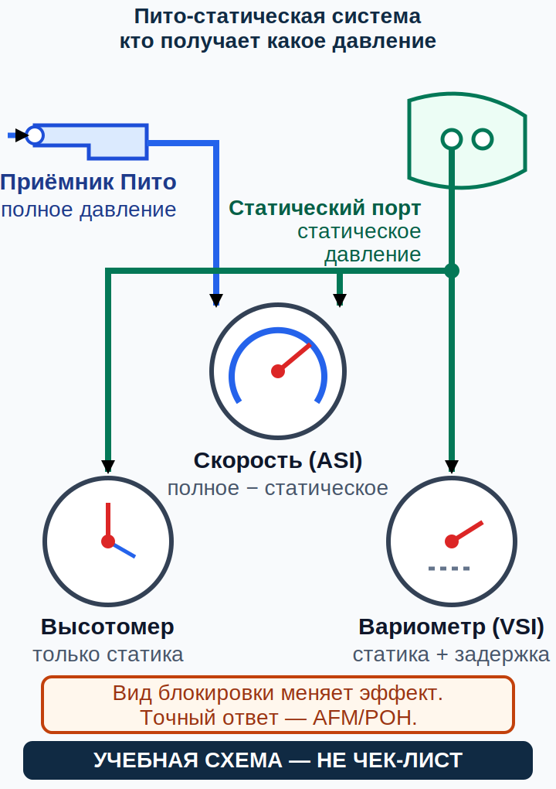

# Приёмная система полного и статического давления, приборы двигателя, компас и электронная индикация {#pitot-static-instruments}

## Назначение {#purpose}

Прибор показывает результат измерительной цепочки, а не саму реальность. Глава учит прослеживать входные данные, вычисление, индикацию и отказы общего источника. Объём: GU09, Conocimiento General de la Aeronave, pp. 33–39; здесь pp. 37–38 (`SRC-AESA-ULM-LEARNING-OBJECTIVES-GU09-ED01`). Механизмы: FAA-H-8083-25C pp. 8-1–8-28 (`SRC-FAA-PHAK-25C-CH8`).

> **УЧЕБНАЯ СХЕМА — НЕ ЧЕК-ЛИСТ.** Закон/[AIP](../reference/glossary.md#term-aip)/[NOTAM](../reference/glossary.md#term-notam)/AD → актуальные [AFM](../reference/glossary.md#term-afm)/[POH](../reference/glossary.md#term-poh), [дополнение к руководству по лётной эксплуатации](../reference/glossary.md#term-aircraft-flight-manual-supplement), [эксплуатационная табличка](../reference/glossary.md#term-placard) и [самолётная контрольная карта](../reference/glossary.md#term-aircraft-checklist) → точное руководство прибора или авионики, [SB](../reference/glossary.md#term-service-bulletin-sb)/[SI](../reference/glossary.md#term-service-instruction-si), версия программного обеспечения и применимость → программа и записи техобслуживания → общее руководство → курс. Инструктор показывает точную установленную индикацию.

## Результаты обучения {#outcomes}

- отличать полное давление приёмника Пито от статического давления;
- объяснять входные данные [указателя воздушной скорости (English: airspeed indicator; español: indicador de velocidad aerodinámica; ASI)](../reference/glossary.md#term-airspeed-indicator-asi), высотомера (English: altimeter; español: altímetro) и [вариометра (English: vertical speed indicator; español: variómetro; VSI)](../reference/glossary.md#term-vertical-speed-indicator-vsi);
- рассуждать о сочетаниях закупорки без заучивания универсального действия;
- сопоставлять индикацию двигателя, топлива, компаса, гироскопа и электронных экранов;
- распознавать отказы общего источника, [вычислителя воздушных данных](../reference/glossary.md#term-air-data-computer-adc) (ADC) или индикатора.

## Карта применимости {#applicability}

| Метка | Что изучать |
|---|---|
| [ULM — ОСНОВА][ulm] | [ASI](../reference/glossary.md#term-airspeed-indicator-asi), высотомер и [VSI](../reference/glossary.md#term-vertical-speed-indicator-vsi), метки, тахометр, моточасы, индикация топлива и двигателя |
| [ULM — ОСОБО ВАЖНО][ulm] | Сопоставление тангажа, мощности, звука и положения при сомнительном показании |
| [PART-FCL — ОБЩЕЕ][part-fcl] | Полный объём принципов и погрешностей приборов из §8.2 |
| [LAPL — ПЕРЕХОД] | Та же приборная [программа](../reference/glossary.md#term-syllabus), что у PPL, и точное ознакомление с самолётом |
| [PPL — РАСШИРЕНИЕ] | Гироскопы, ADC, электронные экраны и отказы общего источника |
| [ИСПАНИЯ] | Полёт по [VFR](../reference/glossary.md#term-vfr) не отменяет требований к приборам и их состоянию |
| [БЕЗОПАСНОСТЬ] | Нет общей процедуры перехода на резервную статику или реакции на закупорку |
| [ПРОВЕРИТЬ ПЕРЕД ПОЛЁТОМ] | Чехлы, дренажи, отверстия, настройки и самопроверка по контрольной карте |

## Теория {#theory}

### Давления и приборы {#pressure-inputs}

Приёмная система полного и статического давления (English: [pitot-static system](../reference/glossary.md#term-pitot-static-system); español: sistema pitot-estático) подаёт:

- [указателю воздушной скорости (English: airspeed indicator, ASI)](../reference/glossary.md#term-airspeed-indicator-asi) разность полного и статического давления;
- высотомеру статическое давление через анероидный механизм или ADC;
- [вариометру (English: vertical speed indicator, VSI)](../reference/glossary.md#term-vertical-speed-indicator-vsi) статическое давление с калиброванной временной характеристикой.

Динамическое давление связано с воздушной скоростью и плотностью. Показание, непосредственно считываемое с [ASI](../reference/glossary.md#term-airspeed-indicator-asi), — [приборная воздушная скорость IAS (English: indicated airspeed; español: velocidad indicada)](../reference/glossary.md#term-indicated-airspeed-ias). [Калиброванную воздушную скорость CAS (English: calibrated airspeed; español: velocidad calibrada)](../reference/glossary.md#term-calibrated-airspeed-cas) получают, вводя в [IAS](../reference/glossary.md#term-indicated-airspeed-ias) поправки на приборную и позиционную/установочную погрешности по данным конкретного самолёта. Поэтому [ASI](../reference/glossary.md#term-airspeed-indicator-asi) не следует описывать как прибор, непосредственно выдающий [CAS](../reference/glossary.md#term-calibrated-airspeed-cas). Цветные дуги и метки — ограничения и рабочие диапазоны конкретного самолёта из утверждённых данных, а не переносимые примеры.

Высотомер измеряет давление, а не непосредственно геометрическую высоту. Важны установка давления и отклонения атмосферы. [VSI](../reference/glossary.md#term-vertical-speed-indicator-vsi) с запаздыванием показывает скорость, полученную из изменения статического давления; это не первичное подтверждение положения самолёта или мгновенной вертикальной траектории.

### Логика последствий закупорки {#blockage-effects}

Если вход Пито закупорен, а его дренаж остаётся открытым, полное давление может стравливаться и показание [ASI](../reference/glossary.md#term-airspeed-indicator-asi) способно стать непригодным или заниженным. Если отверстие Пито и дренаж заперли давление, при изменении статического давления [ASI](../reference/glossary.md#term-airspeed-indicator-asi) может вести себя подобно высотомеру. Закупорка статического канала влияет на высотомер, [VSI](../reference/glossary.md#term-vertical-speed-indicator-vsi) и [ASI](../reference/glossary.md#term-airspeed-indicator-asi), потому что все они используют этот вход; точное направление погрешности зависит от давления в момент закупорки и последующего полёта. Утечки, вода, лёд, чехлы и отказы датчика или ADC создают другие сочетания.

Безопасный навык — не общая последовательность переключателей. Сопоставьте положение, мощность, звук, усилия на управлении, несколько независимых источников и ожидаемую [динамику](../reference/glossary.md#term-trend); затем применяйте точную самолётную процедуру неисправности и сохраняйте условия [VMC](../reference/glossary.md#term-vmc) и возможность посадки.

Это простая учебная модель [приёмной системы полного и статического давления (English: pitot-static system; español: sistema pitot-estático)](../reference/glossary.md#term-pitot-static-system) для понимания причинности, а не схема любого установленного самолёта. Она не показывает все варианты с ADC, резервным прибором, [резервным источником статического давления (English: alternate static source; español: fuente estática alternativa)](../reference/glossary.md#term-alternate-static-source), несколькими портами или обогревом: реальная конфигурация может отличаться, и её устанавливают только по [AFM](../reference/glossary.md#term-afm)/[POH](../reference/glossary.md#term-poh) и точному руководству оборудования.

### Индикация двигателя и топлива {#engine-fuel-indications}

Каждый канал температуры, давления, частоты вращения, количества или расхода топлива и счётчика моточасов включает датчик, проводку, обработку и индикатор. Ненормальное показание может означать реальное ухудшение, неисправность измерения, питания или индикации; нормальное показание не подтверждает исправность остальных систем. Руководства двигателя и самолёта определяют диапазоны, метки, уровни предупреждения и реакцию.

Индикацию количества топлива нужно сопоставлять с применимой визуальной или другой независимой проверкой. Сумматор топлива (English: fuel totaliser) часто вычитает измеренный или расчётный расход из введённого начального количества; он не измеряет содержимое бака, если точная конструкция прямо не говорит обратного. Сопоставляйте независимые механизмы.

Например, [OM-912 i](../reference/glossary.md#term-operators-manual-om) на PDF p. 77 указывает расчётный блоком ECU расход топлива (English: ECU-calculated fuel flow): он не является прямым измерением содержимого бака. Запас и продолжительность полёта определяют по данным производителя самолёта, допущенной установленной системе и [AFM](../reference/glossary.md#term-afm)/[POH](../reference/glossary.md#term-poh), а не по одному точному на вид числу (`SRC-ROTAX-OM-912I-ED2-R2`).

### Индикация рыскания, скольжения и заноса {#yaw-slip-skid-indication}

Рыскание (English: yaw; español: guiñada) — вращение самолёта вокруг вертикальной оси. В комбинированном приборе стрелка или символ самолёта может показывать скорость поворота, связанную с рысканием; отдельный [инклинометр (English: inclinometer; español: inclinómetro)](../reference/glossary.md#term-inclinometer), обычно в виде шарика в изогнутой трубке, показывает результат совместного действия силы тяжести и бокового ускорения. Поэтому шарик не является прямым указателем угла крена, положения педалей или причины отклонения.

В установившемся повороте шарик внутри поворота соответствует скольжению (English: slip; español: resbale), а снаружи — заносу (English: skid; español: derrape). Положение между метками соответствует координированному повороту для этой индикации. Это нужно отличать от самого направления рыскания и от показания скорости поворота: один прибор может объединять несколько чувствительных элементов, а электронный экран — вычислять их из общих датчиков. Курс не задаёт универсального движения педали или крена; пилот сопоставляет прибор с положением, потоком и точным описанием установленной системы, а исправление осваивает с инструктором.

### Компас, гироскопы и электронная кабина {#compass-gyro-glass}

На магнитный компас влияют магнитное склонение, девиация, ускорение, разворот и установка. Механические гироскопы зависят от жёсткости, прецессии, питания и системы выставления; электронные системы положения на основе MEMS имеют другие датчики и виды отказов. Электронный экран может объединять воздушные данные, положение, навигационную и двигательную информацию.

Вычислитель воздушных данных (English: [air data computer (ADC)](../reference/glossary.md#term-air-data-computer-adc); español: computador de datos del aire) может питать данными несколько экранов. Два согласующихся индикатора не являются независимыми, если используют общий канал Пито или статики, ADC, питание, антенну либо базу данных. До полёта определите устройство источников, предупреждающие флаги и резервные режимы.

### SCN-AGK-08 — Расхождение показаний полного и статического давления {#scn-agk-08}

**Признаки:** [динамика](../reference/glossary.md#term-trend) [ASI](../reference/glossary.md#term-airspeed-indicator-asi) противоречит тангажу, мощности или звуку; высотомер и [VSI](../reference/glossary.md#term-vertical-speed-indicator-vsi) могут согласовываться с ним или показывать иначе.

**Конкурирующие объяснения:** закупорка отверстия или дренажа Пито (English: Pitot), закупорка статического приёмника (English: static port), утечка, вода или лёд, отказ ADC, датчика или экрана, изменение конфигурации либо реальной траектории.

**Граница безопасного решения:** сохранять управление самолётом, условия [VMC](../reference/glossary.md#term-vmc) и возможность посадки, не пытаться следовать за одним индикатором и применять точную процедуру неисправности.

**Точный документ:** процедура приёмной системы или приборов из [AFM](../reference/glossary.md#term-afm)/[POH](../reference/glossary.md#term-poh), точное руководство экрана или ADC, схема устройства и обучение с инструктором.

**Почему это не чек-лист:** резервный источник, обогрев, дренажи, запасные приборы и поведение экрана различаются.

### SCN-AGK-09 — Пониженное или ненормальное системное показание {#scn-agk-09}

**Признаки:** одно показание давления, температуры, частоты вращения или топлива выходит из ожидаемого диапазона либо мерцает.

**Конкурирующие объяснения:** реальное ухудшение системы, датчик, проводка или масса, общее питание, ADC или экран, переходный режим либо неверное понимание диапазона.

**Граница безопасного решения:** считать показание потенциально реальным, сопоставить независимые признаки и применить точную процедуру; не продолжать сбор свидетельств при возрастающем риске.

**Точный документ:** ограничения и контрольная карта самолётных [AFM](../reference/glossary.md#term-afm)/[POH](../reference/glossary.md#term-poh), точное руководство двигателя или прибора, применимость датчика и записи техобслуживания.

**Почему это не чек-лист:** порог, допустимая продолжительность, сопоставление и реакция зависят от типа.

## Применение к [ULM](../reference/glossary.md#term-ulm)/[MAF](../reference/glossary.md#term-maf) {#ulm-application}

GU09 pp. 37–38 требует знать метки и ограничения [ASI](../reference/glossary.md#term-airspeed-indicator-asi), высотомер и [VSI](../reference/glossary.md#term-vertical-speed-indicator-vsi), закупорки и ошибки, тахометр и счётчик моточасов, индикацию двигателя, топлива, рыскания и компаса, а также электронное оборудование. Для [MAF](../reference/glossary.md#term-maf) можно под наблюдением разбирать на земле или тренажёре закрытие одной индикации, но нельзя самостоятельно имитировать закупорку системы или отказ в полёте.

## Расширение [Part-FCL](../reference/glossary.md#term-part-fcl) {#part-fcl-extension}

[Part-FCL](../reference/glossary.md#term-part-fcl) §8.2 расширяет изучение приборов и ошибок (`SRC-EASA-AIRCREW-2026`). LAPL использует [программу](../reference/glossary.md#term-syllabus) PPL. Это теория [VFR](../reference/glossary.md#term-vfr), а не обучение полётам по приборам. Применимость [Part-NCO](../reference/glossary.md#term-part-nco) задаётся операцией и воздушным судном, а не лицензией.

## Безопасность {#safety}

- Снимайте чехлы только по самолётной контрольной карте и учитывайте их.
- Никогда не прочищайте отверстия или дренажи на основании этого курса.
- Считайте предупреждение или ненормальное значение потенциально реальным до безопасного выяснения.
- Определите общие источники, прежде чем называть два экрана резервирующими друг друга.
- Используйте точные метки; не переносите общие зелёные, жёлтые или красные значения.

## Частые ошибки {#common-errors}

1. Считать, что [VSI](../reference/glossary.md#term-vertical-speed-indicator-vsi) немедленно показывает положение самолёта.
2. Заучивать одно последствие закупорки без условий о дренаже и статике.
3. Считать сумматор топлива измерителем содержимого бака.
4. Называть два экрана независимыми при общем ADC.
5. Многократно перезапускать экран вместо выполнения процедуры.

## Итог {#summary}

Каждая индикация — цепочка от физической величины через датчик или источник и обработку к экрану. Сопоставление должно искать независимое свидетельство, а не другое изображение того же отказавшего входа.

## Контрольные вопросы {#review-questions}

### Q-AGK-026 — Какие входные давления использует [ASI](../reference/glossary.md#term-airspeed-indicator-asi)? {#q-agk-026}

A. Разность полного давления Пито и статического давления. 
B. Только полное давление Пито, потому что внутри прибора всегда есть независимое опорное давление. 
C. Только статическое давление без опорного давления. 
D. Полное давление и давление в кабине независимо от устройства статического порта.

**Правильный ответ:** A.

**Почему:** [ASI](../reference/glossary.md#term-airspeed-indicator-asi) получает связанное с воздушной скоростью показание из разности полного и статического давления.

**Почему главный отвлекающий вариант неверен:** B исключает статический вход, хотя [ASI](../reference/glossary.md#term-airspeed-indicator-asi) использует разность полного и статического давления.

### Q-AGK-027 — Почему одного правила о закупорке недостаточно? {#q-agk-027}

A. Последствие зависит от того, какое отверстие, дренаж или статический канал закупорен и какое давление заперто. 
B. Последствие зависит только от высоты, но не от места закупорки и состояния дренажа. 
C. Любая закупорка Пито всегда фиксирует [ASI](../reference/glossary.md#term-airspeed-indicator-asi) на последнем показании при всех последующих режимах. 
D. ADC устраняет все ошибки источников.

**Правильный ответ:** A.

**Почему:** Разные сочетания запертого и стравливаемого давления создают разные изменения [ASI](../reference/glossary.md#term-airspeed-indicator-asi), высотомера и [VSI](../reference/glossary.md#term-vertical-speed-indicator-vsi).

**Почему главный отвлекающий вариант неверен:** D ошибочно считает, что ADC устраняет все ошибки источника давления при закупорке, и смешивает цифровую обработку с независимым измерением.

### Q-AGK-028 — Почему два индикатора могут быть зависимыми? {#q-agk-028}

A. Они могут использовать общий источник Пито или статики, ADC, питание либо базу данных. 
B. Согласие двух экранов доказывает точность данных, даже если оба используют один ADC. 
C. Раздельное электропитание гарантирует независимость, даже если оба получают давление из одного статического порта. 
D. Разные способы отображения исключают общий отказ, даже если исходный датчик один.

**Правильный ответ:** A.

**Почему:** Общие входы могут заставить несколько экранов согласованно ошибаться в одном направлении.

**Почему главный отвлекающий вариант неверен:** B принимает согласие двух выходов общего ADC за независимое подтверждение; C показывает другую ловушку: раздельное питание не устраняет общий статический источник.

### Q-AGK-029 — В чём ограничение сумматора топлива? {#q-agk-029}

A. Он может вычислять остаток из введённого начального количества и измеренного или расчётного расхода, а не измерять содержимое бака. 
B. Он всегда обнаруживает воду в каждом баке. 
C. Он заменяет применимую визуальную или независимую проверку. 
D. Он делает невырабатываемое топливо равным нулю.

**Правильный ответ:** A.

**Почему:** Ошибка исходного количества или расхода может накапливаться при точном на вид показании, поэтому остаётся необходимым независимое свидетельство количества.

**Почему главный отвлекающий вариант неверен:** C ошибочно позволяет сумматору топлива заменить визуальное или независимое сопоставление количества в баке, хотя входные данные могут расходиться.

### Q-AGK-030 — Как относиться к одному ненормальному показанию? {#q-agk-030}

A. Как к потенциально реальному: сопоставить независимые признаки и применить точную самолётную процедуру. 
B. Всегда считать отказом датчика, если двигатель звучит нормально. 
C. Игнорировать, пока не откажет второй прибор. 
D. Постучать по датчику или отключить его в полёте.

**Правильный ответ:** A.

**Почему:** Реальное ухудшение и отказ индикации могут выглядеть одинаково, поэтому сначала управляют риском, а затем диагностируют.

**Почему главный отвлекающий вариант неверен:** B переоценивает один субъективный признак и позволяет отвергнуть настоящий отказ системы.

## Источники {#sources}

- `SRC-AESA-ULM-LEARNING-OBJECTIVES-GU09-ED01` — Conocimiento General de la Aeronave, pp. 33–39; здесь pp. 37–38.
- `SRC-EASA-AIRCREW-2026` — §8.2.
- `SRC-FAA-PHAK-25C-CH8` — pp. 8-1–8-28.
- `SRC-ROTAX-TECH-DOCS` — exact engine indication meanings remain model/install specific.
- `SRC-ROTAX-OM-912I-ED2-R2` — PDF p. 77, ECU-calculated fuel-flow boundary.

[ulm]: ../reference/glossary.md#term-ulm
[part-fcl]: ../reference/glossary.md#term-part-fcl
