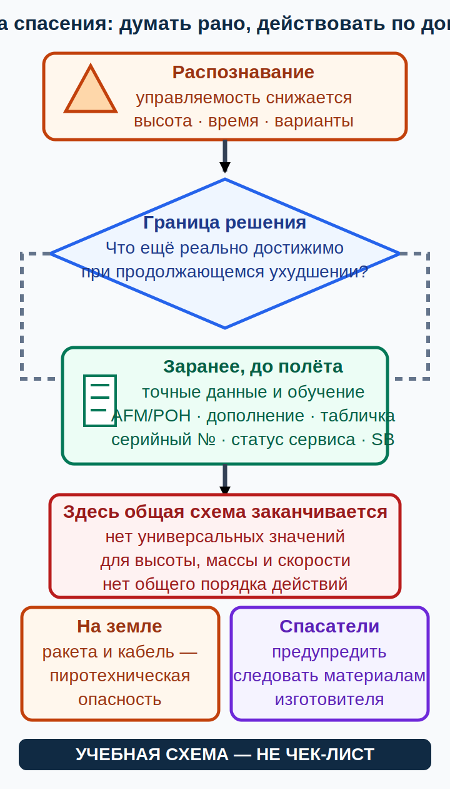

# Ответственность за лётную годность, внешний осмотр и парашютная система {#maintenance-preflight-brs}

## Назначение {#purpose}

Последняя глава разделяет три роли: пилот распознаёт отклонение и сообщает о нём; компетентный специалист по техобслуживанию оценивает и выполняет разрешённую работу; владелец или держатель управляет сохранением лётной годности по применимому режиму. Отдельно рассматривается граница решения для установленной [парашютной спасательной системы всего воздушного судна (English: whole-aircraft recovery system; español: sistema de recuperación de la aeronave completa)](../reference/glossary.md#term-whole-aircraft-recovery-system) (далее — спасательная система) без контрольной карты активации.

> **УЧЕБНАЯ СХЕМА — НЕ ЧЕК-ЛИСТ.** Применимое право, актуальные [AIP](../reference/glossary.md#term-aip)/[NOTAM](../reference/glossary.md#term-notam) и AD → актуальные [AFM](../reference/glossary.md#term-afm)/[POH](../reference/glossary.md#term-poh), утверждённое [дополнение к руководству по лётной эксплуатации](../reference/glossary.md#term-aircraft-flight-manual-supplement), [эксплуатационная табличка](../reference/glossary.md#term-placard) и [самолётная контрольная карта](../reference/glossary.md#term-aircraft-checklist) → точное руководство двигателя, винта или оборудования, [SB](../reference/glossary.md#term-service-bulletin-sb)/[SI](../reference/glossary.md#term-service-instruction-si), модель, серийный номер и применимость → утверждённая или требуемая программа техобслуживания и записи самолёта → общее официальное руководство → этот курс. Инструктор и точные документы самолёта имеют приоритет.

[AFM](../reference/glossary.md#term-afm)/[POH](../reference/glossary.md#term-poh) всегда сверяют с точным документом установленного оборудования; инструктор показывает границу учебного осмотра и реального обслуживания.

## Результаты обучения {#outcomes}

- отличать испанское право техобслуживания [ULM](../reference/glossary.md#term-ulm) от последующего режима [Part-ML](../reference/glossary.md#term-part-ml);
- объяснять ответственность владельца или держателя, не заявляя неограниченное обслуживание владельцем;
- выполнять общую логику наблюдения, привязанную к самолётной контрольной карте;
- определять документальные и сервисные условия парашютной системы всего воздушного судна;
- защищать наземный персонал и спасателей от пиротехнических опасностей.

## Карта применимости {#applicability}

| Метка | Что изучать |
|---|---|
| [ULM — ОСНОВА][ulm] | RD 141/2025 arts. 34–38, записи, точная контрольная карта и осведомлённость спасателей |
| [ULM — ОСОБО ВАЖНО][ulm] | Ответственность владельца не означает разрешения на любую работу |
| [PART-FCL — ОБЩЕЕ][part-fcl] | Отдельная последующая применимость [Part-ML](../reference/glossary.md#term-part-ml) и [Part-NCO](../reference/glossary.md#term-part-nco) |
| [LAPL — ПЕРЕХОД] | Изучить [программу технического обслуживания воздушного судна (AMP)](../reference/glossary.md#term-aircraft-maintenance-programme-amp), записи и пределы владельца-пилота на новом самолёте |
| [PPL — РАСШИРЕНИЕ] | То же юридическое разделение для более широкого круга самолётов |
| [ИСПАНИЯ] | Сначала национальный режим [ULM](../reference/glossary.md#term-ulm); [Part-ML](../reference/glossary.md#term-part-ml) его не заменяет |
| [БЕЗОПАСНОСТЬ] | Установленная спасательная система может содержать пиротехнику; нет общей последовательности выпуска или обезвреживания |
| [ПРОВЕРИТЬ ПЕРЕД ПОЛЁТОМ] | Документы, дефекты, часы и циклы, табличка, серийный номер, сервисный статус и контрольная карта |

## Теория {#theory}

### Испанский [ULM](../reference/glossary.md#term-ulm): RD 141/2025 {#spanish-ulm-maintenance}

Chapter V arts. 34–38 документа RD 141/2025 регулирует сохранение лётной годности национального [ULM](../reference/glossary.md#term-ulm) (`SRC-BOE-RD-141-2025`). Art. 34 возлагает ответственность на владельца или держателя, если она не была надлежащим образом передана, и связывает часы и циклы, предполётный осмотр, действия производителя, AD, ремонты и записи. Art. 35 требует компетентности, знания самолёта, опыта, помещений, инструментов и материалов, а также данных производителя и сохранения лётной годности. Art. 36 описывает содержание программы техобслуживания; arts. 37–38 относятся к проверке и документам.

Art. 39 отдельно определяет источники директив лётной годности (AD; español: directiva de aeronavegabilidad): орган государства, отвечающего за типовую конструкцию; [EASA](../reference/glossary.md#term-easa) для применимых компонентов и оборудования; [AESA](../reference/glossary.md#term-aesa) для случаев в её компетенции. Art. 39.4 относится к требуемому корректирующему действию. Поэтому применимость AD ищут по типу, компоненту, оборудованию и указанию применимости (English: effectivity), а не по привычному названию двигателя или самолёта.

Поэтому выражение «владелец может обслуживать» никогда не означает, что любой владелец или пилот может выполнять любую работу. Владелец не может выполнять все работы техобслуживания только по факту владения. Номинальная «50-часовая» или ежегодная работа не становится автоматически работой владельца-пилота. Её должны одновременно разрешать режим, конкретная работа и самолёт, данные, компетентность, условия, программа, а также требования к записи и оформлению допуска.

### Отдельный режим [Part-ML](../reference/glossary.md#term-part-ml) для последующих самолётов {#part-ml-boundary}

!!! info "[LAPL — ПЕРЕХОД] / [PPL — РАСШИРЕНИЕ]"
    Для последующего применимого самолёта [Part-ML](../reference/glossary.md#term-part-ml) в Regulation (EU) 1321/2014 в консолидации от 22.02.2026 использует ML.A.201, ML.A.301, ML.A.803 и Appendices II–III (`SRC-EU-1321-2014-PART-ML-2026`). Для последующего LAPL/PPL это отдельный режим, а не продолжение национального [ULM](../reference/glossary.md#term-ulm). ML.A.803 ограничивает роль владельца-пилота (English: pilot-owner): запись о допуске (English: release/log entry) содержит выполненную работу, данные техобслуживания, дату, сведения о лице, подпись и номер лицензии пилота. Лицо также должно иметь действующую лицензию пилота или эквивалент для соответствующего типа или класса и владеть самолётом единолично либо совместно. Владелец при этом является либо физическим лицом, указанным в регистрационной форме, либо членом некоммерческого рекреационного юридического лица, которое указано в регистрационном документе как владелец или эксплуатант; такой член должен прямо участвовать в принятии решений этого юридического лица и быть назначен им для выполнения ограниченного обслуживания владельцем-пилотом. Это не разрешение на любое обслуживание.

    Appendix II исключает критические работы, снятие крупных агрегатов, работы по директивам лётной годности или ограничениям лётной годности (English: airworthiness limitations items; español: elementos de limitaciones de aeronavegabilidad; AD/ALI) без прямого разрешения, применение специальных или калиброванных инструментов вне узких исключений, специальные испытания, внеплановые специальные осмотры, необходимые для IFR системы, сложную работу (English: complex maintenance task) по Appendix III или работу с компонентом по ML.A.502(a)/(b), а также совмещённый с проверкой лётной годности 100-часовой или ежегодный осмотр. Менее строгая [AMP](../reference/glossary.md#term-aircraft-maintenance-programme-amp) не может отменить эти исключения. Актуальные [AMC](../reference/glossary.md#term-amc)/GM — Issue 1 Amendment 3, введённые ED Decision 2026/002/R и официальным Annex VI (`SRC-EASA-CONTINUING-AIRWORTHINESS-2026`, `SRC-EASA-PART-ML-AMC-GM-I1-A3-2026`), а не только сборник сентября 2025 года. Соответствующие изменения Regulation (EU) 2026/100 применяются 07.08.2026: на 13.07.2026 они были будущими и требовали повторной проверки (`SRC-EURLEX-2026-0100`). Этот режим зависит от самолёта и применимости, а не только от лицензии LAPL/PPL, и не заменяет испанское право [ULM](../reference/glossary.md#term-ulm).

### Общая логика внешнего осмотра {#generic-walk-around}

Сам FAA AFH pp. 2-4–2-6 передаёт определение последовательности [AFM](../reference/glossary.md#term-afm)/[POH](../reference/glossary.md#term-poh) и контрольной карте производителя (`SRC-FAA-AFH-3C-CH2`). Безопасная учебная логика выглядит так:

1. **Идентификация и статус:** нужный самолёт, документы, открытые дефекты, часы и циклы, применимые допуски и записи.
2. **Окружение:** колодки и швартовки, люди, ветер, опасности топлива, пожара и винта.
3. **Систематическое покрытие:** следовать точному маршруту контрольной карты, чтобы не пропустить ни одной зоны.
4. **Сопоставлять, а не диагностировать:** оценивать конфигурацию, крепление, загрязнение, утечку, препятствие, повреждение и свободу только утверждённым способом.
5. **Устранить неопределённость:** остановиться, записать или сообщить и получить решение компетентного лица; никогда не «понаблюдать в этом полёте».

Это рассуждение о полноте, а не контрольная карта конкретного самолёта. Оно не говорит, где нажимать, сливать, открывать, вращать, взводить, устанавливать чеку, измерять или смазывать.

Также проверено актуальное дополнение AFH (English: current AFH Addendum): на p. 2-4 оно добавляет текст США об обслуживании LSA. Это правило США исключено из курса и не переносится в испанский [ULM](../reference/glossary.md#term-ulm); здесь остаётся только общая логика полноты осмотра (`SRC-FAA-AFH-3C-ADDENDUM-2025`).

### Назначение и пределы спасательной системы {#brs-purpose-limits}

Установленная [спасательная система](../reference/glossary.md#term-whole-aircraft-recovery-system) может дать дополнительный вариант выживания в некоторых иначе неуправляемых ситуациях. Она не устраняет опасности удара, пожара, линий электропередачи, рельефа, ветра, малой высоты, выхода за ограничения или событий после посадки. Задержка способна уменьшить варианты, но точное решение и действие принадлежат установленному дополнению [AFM](../reference/glossary.md#term-afm)/[POH](../reference/glossary.md#term-poh), руководству, табличке и обучению.

Для системы BRS — конкретного товарного обозначения BRS Aerospace, а не универсального названия всех спасательных систем — нет универсальных для всех установок высоты, массы, скорости, рукояти или последовательности. Не существует единой минимальной высоты BRS, массы или скорости, усилия и направления движения рукояти, порядка взведения и чеки, остановки двигателя, контрольной карты выпуска или действий после него, интервала переукладки или метода осмотра. Нельзя делать вывод об исправности по внешнему виду. Официальная страница Rebuild говорит, что график указан на установленной табличке данных, а при неопределённости нужно использовать серийный номер и поддержку (`SRC-BRS-REBUILD-2026`); актуальный путь к поддержке, [SB](../reference/glossary.md#term-service-bulletin-sb) и сведениям для первых спасателей — `SRC-BRS-SUPPORT-2026`.

Официальный адрес BRS-6 Owner’s Manual 020002-01 Rev.A был доступен как 96-страничный PDF 14.07.2026 (`SRC-BRS6-REV-A-HISTORICAL`). Это историческая ревизия, а её текущий статус и применимость к установленной системе не установлены. Сам факт доступности PDF не делает его актуальным руководством для конкретного борта, поэтому курс не берёт из него пределы, действия, интервалы или контрольную карту. Самовольное перерезание кабеля неизвестной системы не доказывает и не подтверждает безопасное состояние ракеты. Только точная актуальная инструкция изготовителя или материал для спасателей для идентифицированной установки может предписывать конкретное перерезание как часть процедуры; этот курс такую процедуру не воспроизводит и не разрешает пилоту либо неподготовленному лицу её выполнять. Наземный персонал и спасатели считают неизвестную, сработавшую или повреждённую систему пиротехнической опасностью, удаляют людей согласно официальным сведениям для спасателей и обращаются к компетентной аварийной или заводской поддержке.

### SCN-AGK-10 — Статус установленной спасательной системы неизвестен {#scn-agk-10}

**Признаки:** для идентифицированной установки, в том числе с товарным обозначением BRS, табличка, дата или серийный номер неясны, записи расходятся, чека, рукоять или крышка отличаются от ожидаемых либо самолётное дополнение отсутствует.

**Конкурирующие объяснения:** запаздывание документации, изменение конфигурации, просроченное или неизвестное обслуживание, неверно понятая табличка, повреждение либо неподходящее руководство.

**Граница безопасного решения:** не взводить, не трогать, не проверять и не выпускать самолёт на основании предположения; ограничить доступ и устранить неопределённость по записям самолёта, точному дополнению и через производителя или компетентное техобслуживание.

**Точный документ:** утверждённое дополнение [AFM](../reference/glossary.md#term-afm)/[POH](../reference/glossary.md#term-poh), установленная табличка данных и серийный номер, актуальная поддержка и [SB](../reference/glossary.md#term-service-bulletin-sb) производителя, записи техобслуживания самолёта.

**Почему это не чек-лист:** чека, рукоять, взведение, межсервисный интервал и безопасное наземное обращение различаются по системе, серийному номеру и применимости.

## Применение к [ULM](../reference/glossary.md#term-ulm)/[MAF](../reference/glossary.md#term-maf) {#ulm-application}

GU09 pp. 35 и 38–39 включает осведомлённость о техобслуживании, [усталости конструкции](../reference/glossary.md#term-fatigue-structure), парашютной системе и ELT; RD 141/2025 определяет ответственность за техобслуживание испанского национального [ULM](../reference/glossary.md#term-ulm). Ученик [ULM](../reference/glossary.md#term-ulm) изучает записи, передачу дефекта компетентному лицу и применение точной контрольной карты. Чтение курса не разрешает техобслуживание или обращение со спасательной системой.

## Расширение [Part-FCL](../reference/glossary.md#term-part-fcl) {#part-fcl-extension}

[Part-FCL](../reference/glossary.md#term-part-fcl) §§8.1–8.2 включает [планер](../reference/glossary.md#term-airframe), системы и аварийное оборудование в объём обучения (`SRC-EASA-AIRCREW-2026`). Применимость [Part-ML](../reference/glossary.md#term-part-ml) и [Part-NCO](../reference/glossary.md#term-part-nco) определяется самолётом и операцией, а не наличием LAPL/PPL. При переподготовке нужно изучить новые записи, [AMP](../reference/glossary.md#term-aircraft-maintenance-programme-amp), самолётные процедуры и установленное спасательное оборудование.

## Безопасность {#safety}

- Фотография на форуме или контрольная карта другого самолёта не устраняет дефект.
- Не вращайте винт, не вскрывайте систему, не включайте защиту и не работайте под панелями техобслуживания на основании курса.
- Неизвестный статус BRS — граница, за которой нельзя действовать по предположению.
- Не пытайтесь самовольно перерезать кабель активации и не приближайтесь к траектории выхода ракеты ради «обезвреживания» системы; специальные действия спасателей возможны только по точному актуальному материалу для идентифицированной установки.
- После срабатывания или удара защищайте людей и спасателей от огня, строп, топлива, аккумулятора и пиротехники по указаниям аварийных органов.

## Частые ошибки {#common-errors}

1. «Владелец может выполнить любое техобслуживание [ULM](../reference/glossary.md#term-ulm)» — неверно.
2. «Периодическая 50-часовая или ежегодная работа всегда доступна владельцу-пилоту» — неверно.
3. «Общий предполётный осмотр является самолётной контрольной картой» — неверно.
4. «У каждой спасательной системы одна минимальная высота и одно действие с рукоятью» — неверно.
5. «Самовольное перерезание кабеля неизвестной системы доказывает её безопасность» — неверно и опасно.

## Итог {#summary}

Лётной годностью управляют через применимое право, утверждённые актуальные данные, компетентность и записи. Наблюдение пилота необходимо, но имеет границы. Установленная спасательная система добавляет вариант и новые опасности; ею управляют только точные контролируемые документы и обучение.

## Контрольные вопросы {#review-questions}

### Q-AGK-036 — Что означает ответственность владельца по RD 141/2025? {#q-agk-036}

A. Владелец или держатель управляет применимыми обязанностями сохранения лётной годности, если они надлежащим образом не переданы. 
B. Каждый владелец может выполнить любую работу техобслуживания. 
C. После предполётного осмотра записи не нужны. 
D. [Part-ML](../reference/glossary.md#term-part-ml) автоматически заменяет национальное право [ULM](../reference/glossary.md#term-ulm).

**Правильный ответ:** A.

**Почему:** По RD 141/2025 ответственность владельца или держателя включает обеспечение требуемой программы, действий и записей сохранения лётной годности, а не неограниченный технический допуск.

**Почему главный отвлекающий вариант неверен:** B игнорирует ограничения компетентности, работы, данных, инструментов, условий и полномочий.

### Q-AGK-037 — Является ли 50-часовая работа автоматически обслуживанием владельца-пилота? {#q-agk-037}

A. Да, потому что периодичность определяет компетентность. 
B. Нет; допустимость определяют точная работа, режим, программа и данные, компетентность и исключения. 
C. Да, если дефект не виден. 
D. Да, на каждом испанском самолёте и самолёте [Part-ML](../reference/glossary.md#term-part-ml).

**Правильный ответ:** B.

**Почему:** Обозначение по календарю или часам само по себе не отменяет юридическую применимость, данные техобслуживания или исключения для критических работ.

**Почему главный отвлекающий вариант неверен:** A смешивает срок выполнения работы с тем, кто уполномочен и компетентен её выполнять.

### Q-AGK-038 — Каков статус общей логики внешнего осмотра? {#q-agk-038}

A. Модель полноты, которую нужно выполнять через точную самолётную контрольную карту. 
B. Универсальная утверждённая контрольная карта для всех самолётов. 
C. Разрешение исправить любое обнаруженное расхождение. 
D. Замена записей самолёта.

**Правильный ответ:** A.

**Почему:** Системное рассуждение уменьшает пропуски, но фактическая последовательность и действия остаются самолётно-специфичными.

**Почему главный отвлекающий вариант неверен:** B стирает различия компонентов, опасностей, доступа и утверждённых процедур.

### Q-AGK-039 — Как устанавливается сервисный статус BRS? {#q-agk-039}

A. По установленной табличке данных, серийному номеру, записям и актуальным документам производителя и самолёта. 
B. По одному универсальному интервалу переукладки, который помнит пилот. 
C. Слегка потянув рукоять для проверки. 
D. По названию модели системы без сверки серийного номера, таблички и установленного дополнения.

**Правильный ответ:** A.

**Почему:** Установленный серийный номер, применимость и записи связывают систему с её фактическим требованием обслуживания и поддержкой.

**Почему главный отвлекающий вариант неверен:** B выдумывает интервал, не зависящий от установленной модели, таблички и актуальных данных поддержки.

### Q-AGK-040 — Можно ли считать неизвестную спасательную систему безопасной после самовольного перерезания кабеля? {#q-agk-040}

A. Да, если визуально отделён участок оболочки кабеля. 
B. Нет; импровизированное действие не подтверждает безопасное состояние. Только точный актуальный материал изготовителя для спасателей по идентифицированной установке может предписывать специальное действие. 
C. Да, если перед этим отключено бортовое электропитание. 
D. Да, если рукоять больше не соединена с кабелем.

**Правильный ответ:** B.

**Почему:** Неизвестная или повреждённая система может сохранять опасные энергетические компоненты; импровизированное перерезание не подтверждает безопасное состояние. Курс не воспроизводит специальную процедуру для спасателей и не разрешает пилоту её выполнять.

**Почему главный отвлекающий вариант неверен:** C смешивает состояние бортовой электросистемы с состоянием отдельного пиротехнического инициатора и не доказывает обезвреживание.

## Источники {#sources}

- `SRC-BOE-RD-141-2025` — Chapter V, arts. 34–39; Spanish [ULM](../reference/glossary.md#term-ulm) responsibility, competence, programme, review/documents and AD sources.
- `SRC-FAA-AFH-3C-CH2` — pp. 2-4–2-6, generic preflight and [AFM](../reference/glossary.md#term-afm)/[POH](../reference/glossary.md#term-poh) deferral.
- `SRC-FAA-AFH-3C-ADDENDUM-2025` — p. 2-4 U.S. LSA maintenance insertion reviewed and excluded.
- `SRC-AESA-ULM-LEARNING-OBJECTIVES-GU09-ED01` — Conocimiento General de la Aeronave, pp. 33–39; здесь pp. 35 и 38–39.
- `SRC-EASA-AIRCREW-2026` — §§8.1–8.2.
- `SRC-EU-1321-2014-PART-ML-2026` — ML.A.201/.301/.803 and Appendices II–III.
- `SRC-EASA-CONTINUING-AIRWORTHINESS-2026` — ED Decision 2026/002/R, Annex VI, [Part-ML](../reference/glossary.md#term-part-ml) [AMC](../reference/glossary.md#term-amc)/GM Issue 1 Amendment 3.
- `SRC-EASA-PART-ML-AMC-GM-I1-A3-2026` — exact official Annex VI download, Issue 1 Amendment 3.
- `SRC-EURLEX-2026-0100` — relevant changes future-effective 07.08.2026.
- `SRC-BRS-REBUILD-2026`, `SRC-BRS-SUPPORT-2026` — current official status/support routes.
- `SRC-BRS6-REV-A-HISTORICAL` — доступная историческая ревизия; текущий статус и применимость не подтверждены.

[ulm]: ../reference/glossary.md#term-ulm
[part-fcl]: ../reference/glossary.md#term-part-fcl
