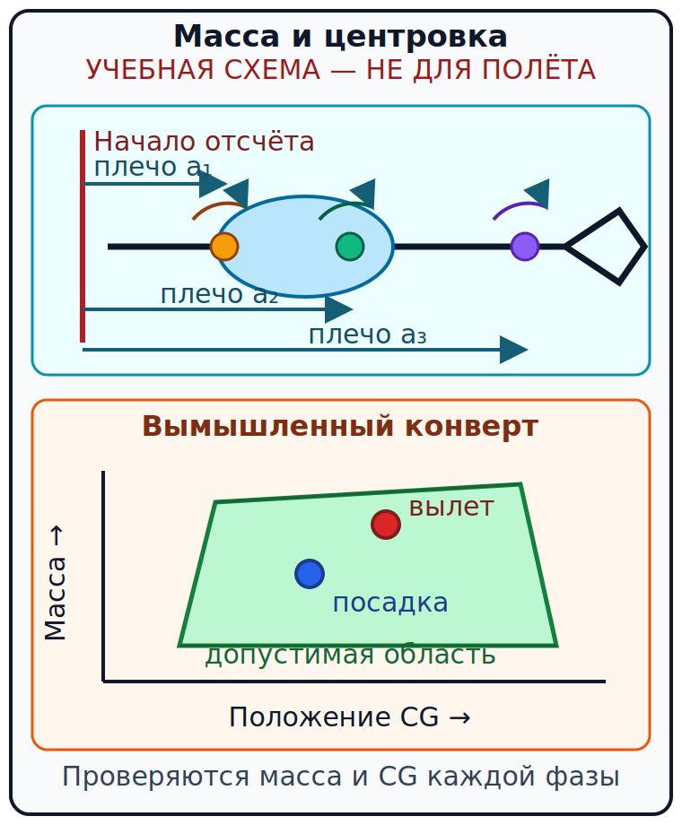

# Масса, загрузка и центровка {#mass-balance}

## Назначение {#purpose}

Глава учит доказывать допустимость каждой загрузки [ULM](../reference/glossary.md#term-ulm)/[MAF](../reference/glossary.md#term-maf) до запуска двигателя и повторять проверку для ожидаемой посадки. Основа испанской программы — GU09, Performance y Planificación Vuelo, pp. 21–27; связанные цели находятся на p. 33 §1.2 и p. 38 §§4.6, 4.8 (`SRC-AESA-ULM-LEARNING-OBJECTIVES-GU09-ED01`). Устойчивую арифметику объясняют FAA-H-8083-25C, pp. 10-1–10-6 (`SRC-FAA-PHAK-25C-CH10`) и FAA-H-8083-1B, pp. 5-1–5-4 и 7-1–7-8 (`SRC-FAA-WBH-1B`); американские нормы и типовые массы в Испанию не переносятся.

> **УЧЕБНЫЕ ДАННЫЕ — НЕ ДЛЯ ПОЛЁТА.** Реальный расчёт выполняют по текущим [AFM](../reference/glossary.md#term-afm)/[POH](../reference/glossary.md#term-poh), листу взвешивания, перечню установленного оборудования, ограничениям конкретного борта и фактической загрузке. Инструктор проверяет метод. Любая вымышленная масса, плечо или граница ниже существует только для обучения.

## Результаты обучения {#outcomes}

После главы вы сможете:

- различить конструкционную категорию, разрешённую массу конкретного борта и фактическую массу;
- вычислить статический момент, суммарную массу и центр тяжести;
- проверить точку по конверту на взлёте, в полёте и на посадке;
- пересчитать загрузку после перемещения, добавления или расхода топлива;
- остановить подготовку, если источник, ревизия или единицы не доказаны.

## Карта применимости {#applicability}

| Метка | Что изучать |
|---|---|
| [ULM — ОСНОВА][ulm] | Масса, центровка, фактическая загрузка и документы испанского [MAF](../reference/glossary.md#term-maf) |
| [ULM — ОСОБО ВАЖНО][ulm] | Небольшая полезная нагрузка делает ошибку пассажира, багажа или топлива значимой |
| [PART-FCL — ОБЩЕЕ][part-fcl] | Общая теория AMC1 FCL.210/FCL.215 §7.1 |
| [LAPL — ПЕРЕХОД] | Та же теоретическая программа [PPL(A)](../reference/glossary.md#term-ppl-a) (English: [syllabus](../reference/glossary.md#term-syllabus)), затем расчёт самолёта учебной организации [DTO](../reference/glossary.md#term-dto)/[ATO](../reference/glossary.md#term-ato) |
| [PPL — РАСШИРЕНИЕ] | Графические и табличные методы для применимого [SEP](../reference/glossary.md#term-sep) |
| [ИСПАНИЯ] | RD 765/2022 задаёт категорию, а RD 141/2025 — самолётную документацию и лётную годность |
| [БЕЗОПАСНОСТЬ] | Допустимы одновременно масса, продольная и, где установлено, поперечная центровка |
| [ПРОВЕРИТЬ ПЕРЕД ПОЛЁТОМ] | Ревизию листа взвешивания, конфигурацию, людей, багаж, полезное топливо и конверт |

## Теория {#theory}

### Три разных числа массы {#three-mass-levels}

1. **Потолок категории.** Статья 1.2 RD 765/2022 определяет границы национальной категории [ULM](../reference/glossary.md#term-ulm), включая случаи до 600 kg. Это классификационная граница, а не автоматически разрешённая максимальная взлётная масса каждого самолёта.
2. **Разрешённая масса борта.** Её находят в действующей документации конкретного самолёта с учётом варианта и конфигурации.
3. **Фактическая масса.** Это сумма текущей пустой/базовой массы, экипажа, пассажиров, багажа, топлива и прочего груза.

Миф «600 кг — разрешённая [MTOM](../reference/glossary.md#term-mtom) каждого борта» неверен: это число не является разрешённой массой каждого [ULM](../reference/glossary.md#term-ulm). Сначала доказывают индивидуальный предел борта.

В статье 1.4 RD 765/2022 топливо на один час входит в одну из формул конструкционной пустой массы. Этот одночасовой топливный член формулы RD 765/2022 не является эксплуатационным резервом и не определяет количество для вылета (`SRC-BOE-RD-765-2022`).

### Термины и геометрия {#mass-geometry}

- **Начало отсчёта** ([English: datum; español: datum de referencia](../reference/glossary.md#term-datum)) — выбранная изготовителем плоскость или линия.

- **Плечо** (English: [arm](../reference/glossary.md#term-arm); español: brazo) — подписанное расстояние от начала отсчёта до центра массы элемента.

- **Статический момент** (English: [moment](../reference/glossary.md#term-moment); español: momento) — масса, умноженная на плечо.

- **Центр тяжести** (English: [centre of gravity](../reference/glossary.md#term-centre-of-gravity); español: centro de gravedad; CG) — положение результирующей массы.

- **Допустимая область центровки** (English: CG envelope; español: envolvente del centro de gravedad) — разрешённые сочетания массы и положения CG.

Знак плеча берут строго из системы изготовителя. Нельзя молча менять метры на миллиметры или килограммы на фунты: момент сохранит ошибочный масштаб, а правдоподобная цифра CG окажется ложной.

### Какие массы могут встретиться {#mass-states}

Названия зависят от документа самолёта. Базовая пустая масса может включать или не включать эксплуатационные жидкости; нулевую топливную массу документ может вообще не публиковать. Взлётная масса (English: [take-off mass](../reference/glossary.md#term-take-off-mass); español: masa de despegue) относится к началу разбега после учтённого руления. Посадочная масса (English: [landing mass](../reference/glossary.md#term-landing-mass); español: masa de aterrizaje) относится к посадке. Используйте именно определения текущего документа, не словарь другого типа.

### Арифметический метод {#arithmetic-method}

Для каждого элемента записывают массу, плечо и момент. Затем:

\[
M_i=m_i a_i,\qquad CG=\frac{\sum M_i}{\sum m_i}.
\]

Полученную пару «масса—CG» наносят на конверт. Одна допустимая координата без второй ничего не доказывает. Если изготовитель даёт индекс, процент средней аэродинамической хорды или загрузочный график, применяют его метод и единицы.

### CALC-PERF-01 — Момент одного элемента {#calc-perf-01}

**УЧЕБНЫЕ ДАННЫЕ — НЕ ДЛЯ ПОЛЁТА.**

**Дано:** пилот 75 kg; плечо 0.75 m.

**Формула:** момент = масса × плечо. Размерность: kg × m = kg·m.

**Расчёт:** 75 kg × 0.75 m = 56.25 kg·m.

**Результат:** 56.25 kg·m. <!-- recompute-result: 56.25 -->

**Допущения:** масса и положение уже измерены в системе вымышленного самолёта; знак плеча положительный.

**Округление:** промежуточное значение не округлялось; запись до 0.01 kg·m.

**Решение пилота:** перенести 56.25 kg·m в таблицу; отдельный момент не доказывает допустимую загрузку.

### CALC-PERF-02 — Обратный расчёт массы {#calc-perf-02}

**УЧЕБНЫЕ ДАННЫЕ — НЕ ДЛЯ ПОЛЁТА.**

**Дано:** момент базового самолёта 108.8 kg·m; плечо 0.32 m.

**Формула:** масса = момент / плечо. Размерность: kg·m / m = kg.

**Расчёт:** 108.8 kg·m / 0.32 m = 340 kg.

**Результат:** 340.0 kg. <!-- recompute-result: 340.0 -->

**Допущения:** плечо не равно нулю; обе величины относятся к одной ревизии записи.

**Округление:** до 0.1 kg после проверки исходной точности.

**Решение пилота:** сравнить восстановленную массу с контролируемым листом; расхождение означает ошибку источника или единиц.

### CALC-PERF-03 — Суммарный CG на вылете {#calc-perf-03}

**УЧЕБНЫЕ ДАННЫЕ — НЕ ДЛЯ ПОЛЁТА.**

**Дано:** 340 kg/108.80 kg·m; пилот 75/56.25; пассажир 68/51.00; багаж 10/14.50; топливо 25.2/23.94.

**Формула:** CG = сумма моментов / сумма масс. Размерность: kg·m / kg = m.

**Расчёт:** масса 518.2 kg; момент 254.49 kg·m; 254.49 / 518.2 = 0.49110 m.

**Результат:** CG = 0.491 m от начала отсчёта. <!-- recompute-result: 0.491 -->

**Допущения:** вымышленный конверт при 518.2 kg допускает 0.460–0.540 m.

**Округление:** решение принимают по неокруглённому 0.49110 m; показывают 0.001 m.

**Решение пилота:** точка внутри учебного конверта, но переход к расчёту характеристик разрешён только после проверки всех масс и ревизии.

### CALC-PERF-04 — Посадочный CG после расхода топлива {#calc-perf-04}

**УЧЕБНЫЕ ДАННЫЕ — НЕ ДЛЯ ПОЛЁТА.**

**Дано:** базовый самолёт 340 kg/108.80 kg·m; пилот 75 kg/56.25 kg·m; пассажир 68 kg/51.00 kg·m; багаж 10 kg/14.50 kg·m; ожидаемое топливо 10.8 kg/10.26 kg·m (15 L × 0.72 kg/L на плече 0.95 m).

**Формула:** CG посадки = посадочный момент / посадочную массу. Размерность: kg·m / kg = m.

**Расчёт:** масса 503.8 kg; момент 240.81 kg·m; 240.81 / 503.8 = 0.4780 m.

**Результат:** посадочный CG = 0.478 m. <!-- recompute-result: 0.478 -->

**Допущения:** расходуется только полезная часть топлива из указанного бака; нет перемещения людей и багажа.

**Округление:** сравнение по полному значению, вывод до 0.001 m.

**Решение пилота:** проверить посадочную точку отдельно; CG нужен не только на взлёте, а на каждом этапе, включая ожидаемую посадку.

### CALC-PERF-05 — Снятие багажа {#calc-perf-05}

**УЧЕБНЫЕ ДАННЫЕ — НЕ ДЛЯ ПОЛЁТА.**

**Дано:** исходно 518.2 kg и 254.49 kg·m; снимают 10 kg с плеча 1.45 m.

**Формула:** новый CG = (старый момент − снятый момент) / (старая масса − снятая масса). Размерность: kg·m / kg = m.

**Расчёт:** (254.49 − 14.50) / (518.2 − 10) = 239.99 / 508.2 = 0.47224 m.

**Результат:** новая масса 508.2 kg; CG 0.472 m. <!-- recompute-result: 0.472 -->

**Допущения:** снят именно указанный элемент; остальные позиции не изменены.

**Округление:** масса до 0.1 kg, CG до 0.001 m после сравнения без округления.

**Решение пилота:** заново проверить конверт и характеристики; уменьшение массы не гарантирует приемлемую центровку.

### Поперечная загрузка и изменения {#lateral-loading-changes}

Если документ ограничивает разность топлива по крыльевым бакам или боковую загрузку, продольного CG недостаточно. Пересадка пассажира, перенос сумки, долив, слив, замена оборудования или неизвестный ремонт меняют исходные данные. RD 141/2025, arts. 2, 28, 30 и Annex §§1.1.1.1, 2.1.1, 2.2 поддерживает иерархию утверждённой конфигурации, ограничений и актуальных записей; он не выдаёт универсальную массу (`SRC-BOE-RD-141-2025`).

### SCN-PERF-01 — Перегруз после долива {#scn-perf-01}

**УЧЕБНЫЕ ДАННЫЕ — НЕ ДЛЯ ПОЛЁТА.**

**Исходные данные:** диспетчер добавил 12 L вместо 6 L; расчётная взлётная масса стала выше самолётного учебного предела.

**Проверка источника:** сверить фактический объём/массу, плотность и предел по вымышленному [AFM](../reference/glossary.md#term-afm)-T1 Rev.T.

**Расчёт или сравнение:** добавить массу топлива и его момент; не вычитать «лишнее» только из общей массы.

**Ворота решения:** масса и CG должны одновременно быть внутри пределов до запуска.

**Решение:** NO-GO; скорректировать топливо/груз предусмотренным способом и полностью пересчитать.

### SCN-PERF-02 — Неизвестная центровка после ремонта {#scn-perf-02}

**УЧЕБНЫЕ ДАННЫЕ — НЕ ДЛЯ ПОЛЁТА.**

**Исходные данные:** в самолёте появился новый аккумулятор, но актуальная запись массы и момента отсутствует.

**Проверка источника:** запросить контролируемую запись конфигурации и взвешивания, а не оценивать положение на глаз.

**Расчёт или сравнение:** арифметика невозможна без доказанных массы и плеча изменения.

**Ворота решения:** неизвестный исходный момент закрывает расчётные ворота.

**Решение:** не вылетать до оформления и проверки данных компетентным лицом.

## Применение к [ULM](../reference/glossary.md#term-ulm)/[MAF](../reference/glossary.md#term-maf) {#ulm-application}

Для испанского [MAF](../reference/glossary.md#term-maf) начинайте с самолётного листа взвешивания, а не с 600 kg. Малый остаток полезной нагрузки означает, что округление массы пассажира, забытая сумка или неверная плотность топлива может изменить и массу, и CG. GU09 требует понимать конструкционную и эксплуатационную массу, загрузку и CG; [syllabus](../reference/glossary.md#term-syllabus) не публикует предел конкретного борта.

## Расширение [Part-FCL](../reference/glossary.md#term-part-fcl) {#part-fcl-extension}

AMC1 FCL.115/FCL.120 направляет [LAPL(A)](../reference/glossary.md#term-lapl-a) к общей программе [PPL(A)](../reference/glossary.md#term-ppl-a). AMC1 FCL.210/FCL.215 §§7.1–7.3 включает массу и центровку, лётные характеристики и планирование полёта (`SRC-EASA-AIRCREW-2026`). Это общая теория, а не разрешение использовать данные сверхлёгкого самолёта для [SEP](../reference/glossary.md#term-sep). Если операция и самолёт подпадают под этот эксплуатационный режим, NCO.POL.100 требует соблюдения загрузки, массы и CG в каждой фазе, а NCO.POL.105 — установленной и документированной массы/центровки; применимость определяют операция и воздушное судно, не название лицензии (`SRC-EASA-AIR-OPS-2026`). Испанский национальный [ULM](../reference/glossary.md#term-ulm) не становится автоматически операцией [Part-NCO](../reference/glossary.md#term-part-nco).

## Безопасность {#safety}

- Верная арифметика не делает и не гарантирует полёт безопасным, если источник, ревизия, конфигурация или условия неверны.
- CG проверяют не только на взлёте: расход топлива, перемещение груза и посадочная масса могут сдвинуть точку.
- Американские стандартные массы людей или топлива не применяются в Испании как самолётные данные.
- Нельзя «исправить» перегруз переносом багажа: перенос меняет CG, но не общую массу.

## Частые ошибки {#common-errors}

1. Сложить килограммы и литры без плотности.
2. Делить момент одного элемента на общую массу.
3. Округлить CG до границы перед сравнением.
4. Использовать пустую массу старой конфигурации.
5. Проверить только взлёт и забыть посадку.

## Краткий итог {#summary}

Безопасная цепочка: доказанные документы → фактические массы → единая система плеч → моменты → общий CG → конверт каждой фазы → характеристики. Если один вход неизвестен, результат не доказан.

## Контрольные вопросы {#review-questions}

### Q-PERF-001 — Что в первую очередь определяет разрешённую [MTOM](../reference/glossary.md#term-mtom) конкретного испанского [ULM](../reference/glossary.md#term-ulm)? {#q-perf-001}

A. Только потолок категории 600 kg из RD 765/2022. 
B. Действующая документация и конфигурация конкретного борта. 
C. Старая ведомость взвешивания этого борта до изменения оборудования. 
D. Максимальная масса из рекламного листа самолёта той же модели.

**Правильный ответ:** B.

**Почему:** Категория и индивидуальный самолётный предел — разные уровни; конкретный предел доказывает документация борта.

**Почему главный отвлекающий вариант неверен:** A превращает классификационный потолок RD 765/2022 в индивидуальное разрешение, которого он не даёт.

**Опора в теории:** [Три разных числа массы](#three-mass-levels).

**Источник:** `SRC-BOE-RD-765-2022` — граница категории; `SRC-BOE-RD-141-2025` — документация конкретной конфигурации.

### Q-PERF-002 — Как вычисляется положение CG арифметическим методом? {#q-perf-002}

A. Сумма масс делится на сумму плеч. 
B. Самый большой момент делится на пустую массу. 
C. Сумма моментов делится на сумму масс. 
D. Сумма моментов делится только на базовую пустую массу.

**Правильный ответ:** C.

**Почему:** Результирующий момент равен общей массе, умноженной на положение CG.

**Почему главный отвлекающий вариант неверен:** A имеет неверную размерность и игнорирует вклад массы каждого элемента в момент.

**Опора в теории:** [Арифметический метод](#arithmetic-method).

**Источник:** `SRC-FAA-PHAK-25C-CH10` и `SRC-FAA-WBH-1B` — арифметика момента и центровки; не эксплуатационные нормы США.

### Q-PERF-003 — Почему одной допустимой взлётной точки CG недостаточно? {#q-perf-003}

A. После расхода топлива достаточно проверить только новую общую массу. 
B. Расход топлива или перемещение груза может изменить массу и CG к посадке. 
C. Меньшая посадочная масса автоматически гарантирует допустимую центровку. 
D. Если багаж не перемещали, посадочный CG всегда равен взлётному.

**Правильный ответ:** B.

**Почему:** Допустимость требуется на всём полёте, а расходуемые и перемещаемые массы меняют состояние загрузки.

**Почему главный отвлекающий вариант неверен:** C учитывает уменьшение массы, но не изменение момента топлива и поэтому не доказывает положение CG к посадке.

**Опора в теории:** [Какие массы могут встретиться](#mass-states).

**Источник:** `SRC-FAA-PHAK-25C-CH10` — изменение массы и центровки; `SRC-EASA-AIR-OPS-2026` — проверка применимых ограничений по фазам полёта.

### Q-PERF-004 — Как поступить с неизвестной массой нового оборудования? {#q-perf-004}

A. Принять массу похожего изделия из каталога. 
B. Игнорировать, если оборудование расположено рядом с пилотом. 
C. Взять массу из счёта установщика, не подтверждая плечо и конфигурацию. 
D. Остановить расчёт и получить контролируемую запись изменения.

**Правильный ответ:** D.

**Почему:** Без доказанных массы и плеча невозможно подтвердить ни общую массу, ни момент, ни CG.

**Почему главный отвлекающий вариант неверен:** A подменяет фактическую конфигурацию похожим, но не применимым источником.

**Опора в теории:** [Поперечная загрузка и изменения](#lateral-loading-changes).

**Источник:** `SRC-BOE-RD-141-2025` и `SRC-FAA-WBH-1B` — происхождение данных после изменения оборудования.

### Q-PERF-005 — Что произойдёт при снятии груза позади текущего CG? {#q-perf-005}

A. Общая масса уменьшится, а CG обычно сместится вперёд. 
B. Общая масса увеличится, а CG сместится назад. 
C. Масса уменьшится, но CG сместится назад, потому что суммарный момент тоже уменьшился. 
D. CG обязательно останется на месте.

**Правильный ответ:** A.

**Почему:** При снятии груза позади текущего CG общая масса уменьшается, а удаление заднего момента обычно смещает CG вперёд.

**Почему главный отвлекающий вариант неверен:** C замечает уменьшение момента, но игнорирует его положение позади текущего CG и неверно выбирает направление смещения.

**Опора в теории:** [Снятие багажа](#calc-perf-05).

**Источник:** `SRC-FAA-PHAK-25C-CH10` — влияние снятия массы и арифметика CG.

### Q-PERF-006 — Как трактовать одночасовой топливный член формулы RD 765/2022? {#q-perf-006}

A. Как обязательный резерв любого испанского [ULM](../reference/glossary.md#term-ulm). 
B. Как минимум топлива перед каждым запуском. 
C. Как элемент определения конструкционной пустой массы, а не эксплуатационный резерв. 
D. Как защищённый резерв, который можно сразу включить в любой план полёта.

**Правильный ответ:** C.

**Почему:** Формула категории служит конструкционному определению и не задаёт количество топлива для конкретного вылета.

**Почему главный отвлекающий вариант неверен:** A смешивает назначение конструкционной формулы с эксплуатационным планированием топлива.

**Опора в теории:** [Три разных числа массы](#three-mass-levels).

**Источник:** `SRC-BOE-RD-765-2022` — art. 1.4, конструкционная формула, а не эксплуатационный резерв.

### Q-PERF-007 — Когда следует округлять вычисленный CG? {#q-perf-007}

A. Округлять каждую строку до точности итогового CG ещё до суммирования. 
B. После сравнения неокруглённого результата с конвертом, по точности исходных данных. 
C. Всегда вниз, чтобы получить больший запас. 
D. Только если точка вышла за конверт.

**Правильный ответ:** B.

**Почему:** Раннее округление может переместить пограничную точку на безопасную сторону только на бумаге.

**Почему главный отвлекающий вариант неверен:** C задаёт направленное округление CG и не учитывает, какая граница конверта — передняя или задняя — критична.

**Опора в теории:** [Арифметический метод](#arithmetic-method).

**Источник:** `SRC-FAA-WBH-1B` — метод загрузки и сохранение согласованной точности расчёта.

## Источники {#sources}

- `SRC-AESA-ULM-LEARNING-OBJECTIVES-GU09-ED01` — Performance y Planificación Vuelo, pp. 21–27; p. 33 §1.2; p. 38 §§4.6, 4.8.
- `SRC-EASA-AIRCREW-2026` — AMC1 FCL.210/FCL.215 §§7.1–7.3; AMC1 FCL.115/FCL.120.
- `SRC-EASA-AIR-OPS-2026` — Article 5(4), Annex VII; NCO.POL.100, NCO.POL.105.
- `SRC-BOE-RD-765-2022` — arts. 1.2, 1.4, 3; категория и конструкционные определения, не самолётные данные для решения о вылете.
- `SRC-BOE-RD-141-2025` — arts. 2, 28, 30; Annex §§1.1.1.1, 2.1.1, 2.2.
- `SRC-FAA-PHAK-25C-CH10` — pp. 10-1–10-6; техническая арифметика без норм США.
- `SRC-FAA-WBH-1B` — pp. 5-1–5-4, 7-1–7-8; методы загрузки и изменения конфигурации без переноса стандартных масс США.

[ulm]: ../reference/glossary.md#term-ulm
[part-fcl]: ../reference/glossary.md#term-part-fcl
