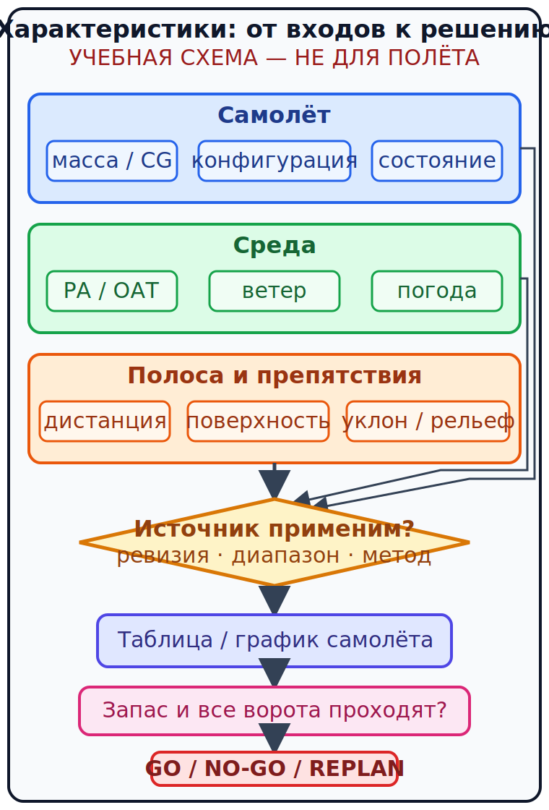

# Взлёт, набор, препятствия и посадка {#takeoff-climb-landing}

## Назначение {#purpose}

Глава превращает таблицу характеристик в решение: достаточно ли располагаемой дистанции и запаса при фактической массе, погоде, ветре, уклоне и состоянии поверхности. GU09, Performance y Planificación Vuelo, pp. 21–27 раскрывает взлёт, набор, крейсерский полёт, заход, посадку и предполётное решение (`SRC-AESA-ULM-LEARNING-OBJECTIVES-GU09-ED01`). FAA-H-8083-25C, pp. 11-1–11-34 (`SRC-FAA-PHAK-25C-CH11`) используется только для устойчивой физики и чтения графиков.

> **УЧЕБНЫЕ ДАННЫЕ — НЕ ДЛЯ ПОЛЁТА.** Ни одна дистанция, скорость, поправка или таблица в этой главе не относится к реальному типу. Используйте только текущие [AFM](../reference/glossary.md#term-afm)/[POH](../reference/glossary.md#term-poh), дополнения, опубликованные данные аэродрома, фактическую полосу/поверхность, погоду и политику школы; инструктор подтверждает метод.

## Результаты обучения {#outcomes}

После главы вы сможете:

- различить располагаемую и требуемую дистанции;
- отделить скорость набора от градиента набора;
- интерполировать только внутри явно разрешённой учебной таблицы;
- объяснить влияние массы, плотности, ветра, уклона, поверхности и техники;
- принять NO-GO при отсутствии применимых данных или эксплуатационного запаса.

## Карта применимости {#applicability}

| Метка | Что изучать |
|---|---|
| [ULM — ОСНОВА][ulm] | Требуемая/располагаемая дистанция и решение для [MAF](../reference/glossary.md#term-maf) |
| [ULM — ОСОБО ВАЖНО][ulm] | Малые колёса, малая инерция и короткая полоса не создают универсальной поправки |
| [PART-FCL — ОБЩЕЕ][part-fcl] | Общая теория AMC1 FCL.210/FCL.215 §7.2 |
| [LAPL — ПЕРЕХОД] | Работа с таблицами самолёта [DTO](../reference/glossary.md#term-dto)/[ATO](../reference/glossary.md#term-ato) |
| [PPL — РАСШИРЕНИЕ] | Связь дистанций, набора, препятствий и ухода на второй круг |
| [ИСПАНИЯ] | Используются текущие [AIP](../reference/glossary.md#term-aip)/[NOTAM](../reference/glossary.md#term-notam), данные площадки и документация [ULM](../reference/glossary.md#term-ulm) |
| [БЕЗОПАСНОСТЬ] | Не экстраполировать и не заменять самолётную таблицу эмпирическим процентом |
| [ПРОВЕРИТЬ ПЕРЕД ПОЛЁТОМ] | Массу, высоту по плотности, ветер, уклон, поверхность, препятствия и запас |

## Теория {#theory}

### Дистанции: сначала определения {#distance-definitions}

**Располагаемая дистанция** — подтверждённая длина и геометрия, доступная для конкретной операции. **Требуемая дистанция** — результат самолётного метода для заданных условий. Некоторые руководства разделяют разбег и дистанцию до заданной высоты; другие дают только определённый показатель. Не смешивайте «разбег», «до 15 m/50 ft» и полную располагаемую дистанцию.

Для посадки аналогично различают воздушный участок, пробег и полную дистанцию от указанной высоты. Точка касания дальше расчётной съедает располагаемый остаток; арифметика перед полётом не оправдывает продолжение нестабильного захода.

### Цепочка влияний {#performance-causal-chain}

- **Масса:** обычно увеличивает требуемую подъёмную силу, скорость/энергию и дистанции, но точную зависимость даёт самолётный источник.
- **Высота по плотности:** уменьшение плотности влияет одновременно на крыло, двигатель и винт.
- **Ветер:** компонент вдоль полосы меняет путевую скорость; порыв, градиент, изменчивость и ограничение зачёта берут из применимого метода.
- **Уклон и поверхность:** влияют на ускорение/торможение. Универсальный процент для травы, мокрой полосы, уклона или встречного ветра не действителен без источника конкретного самолёта.
- **Конфигурация и техника:** положение закрылков, мощность, подъём носа, скорость и торможение должны соответствовать точной процедуре.
- **Препятствие:** требует не только дистанции до его положения, но и доказанной траектории с запасом.

Правило большого пальца или эмпирическая оценка не заменяет [AFM](../reference/glossary.md#term-afm)/[POH](../reference/glossary.md#term-poh) или применимую таблицу. Компонент встречного ветра не полностью засчитывают без разрешения применимых исходных данных: его фактическое значение не гарантировано. Легче не всегда означает короче взлёт или лучше набор: результат зависит от поверхности, ветра, температуры, мощности и техники.

### Интерполяция и границы модели {#interpolation-boundary}

Линейную интерполяцию можно применять только там, где учебная или самолётная инструкция разрешает её между узлами. Нельзя:

- экстраполировать за таблицу;
- интерполировать через запрещённую область;
- складывать неутверждённые «поправки»;
- выдавать результат одной конфигурации за другую.

### CALC-PERF-09 — Двумерная учебная интерполяция взлёта {#calc-perf-09}

**УЧЕБНЫЕ ДАННЫЕ — НЕ ДЛЯ ПОЛЁТА.**

**Дано:** вымышленная таблица [ULM](../reference/glossary.md#term-ulm)-T1 до 15 m: при 500/525 kg — 320/350 m на 0 ft и 380/415 m на 2000 ft; масса 518.2 kg; барометрическая высота 1200 ft. Таблица прямо разрешает последовательную линейную интерполяцию.

**Формула:** сначала вычислить безразмерную долю по массе в двух строках, затем безразмерную долю по высоте между результатами. Размерность: первый шаг m + (kg/kg) × m = m; второй шаг m + (ft/ft) × m = m.

**Расчёт:** 0 ft: 320 + (18.2/25)×30 = 341.84 m; 2000 ft: 380 + (18.2/25)×35 = 405.48 m; 341.84 + 0.6×(405.48−341.84) = 380.024 m.

**Результат:** требуемая учебная дистанция 380.024 m. <!-- recompute-result: 380.024 -->

**Допущения:** все прочие условия совпадают с заголовком вымышленной таблицы; 1200 ft лежит внутри диапазона.

**Округление:** промежуточные значения сохранены; для решения округление вверх до целого метра.

**Решение пилота:** 381 m — только вход в следующий этап проверки запаса, не разрешение на взлёт.

### CALC-PERF-10 — Применение учебной политики запаса {#calc-perf-10}

**УЧЕБНЫЕ ДАННЫЕ — НЕ ДЛЯ ПОЛЁТА.**

**Дано:** 380.024 m; вымышленная политика школы T-SOP требует множитель 1.15; располагается 410 m.

**Формула:** дистанция решения = расчётная дистанция × множитель политики. Размерность: m × безразмерный множитель = m.

**Расчёт:** 380.024 × 1.15 = 437.0276 m; 437.0276 > 410.

**Результат:** для решения требуется 437.028 m. <!-- recompute-result: 437.028 -->

**Допущения:** множитель относится именно к этой вымышленной таблице и условиям; он не является общим правилом.

**Округление:** вверх до 438 m для сравнения.

**Решение пилота:** NO-GO: располагаемая дистанция меньше учебного требования с запасом.

### Набор: скорость и градиент {#climb-rate-gradient}

Скороподъёмность показывает высоту за время, а градиент набора (English: [climb gradient](../reference/glossary.md#term-climb-gradient); español: gradiente de ascenso) — высоту за горизонтальное расстояние. Сильный встречный ветер может увеличить градиент относительно земли при той же вертикальной скорости, но не улучшает саму аэродинамическую скороподъёмность. Vx и Vy — концепции наилучшего угла и наилучшей скороподъёмности; их значения и изменение с условиями берут из самолётной документации.

### CALC-PERF-11 — Скороподъёмность в градиент {#calc-perf-11}

**УЧЕБНЫЕ ДАННЫЕ — НЕ ДЛЯ ПОЛЁТА.**

**Дано:** 396 fpm; GS 55 kt = 55 NM/h.

**Формула:** градиент в ft/NM = fpm / (NM/min). Размерность: ft/min / NM/min = ft/NM.

**Расчёт:** 55/60 = 0.9167 NM/min; 396/0.9167 = 432 ft/NM; 432/60.76 ≈ 7.11%.

**Результат:** 432 ft/NM, примерно 7.1%. <!-- recompute-result: 432.000 -->

**Допущения:** установившийся набор, постоянные GS и вертикальная скорость; разбег и переходный участок исключены.

**Округление:** до 1 ft/NM и 0.1% только после расчёта.

**Решение пилота:** сравнить с требуемым профилем и самолётной методикой; не переносить этот градиент на взлётный переход.

### CALC-PERF-12 — Требуемый средний градиент к препятствию {#calc-perf-12}

**УЧЕБНЫЕ ДАННЫЕ — НЕ ДЛЯ ПОЛЁТА.**

**Дано:** требуется набрать 49.2 ft за 0.432 NM после условной точки начала расчёта.

**Формула:** требуемый градиент = высота / горизонтальное расстояние. Размерность: ft / NM = ft/NM.

**Расчёт:** 49.2/0.432 = 113.8889 ft/NM; 113.8889/60.76 = 1.874%.

**Результат:** средний геометрический градиент 113.889 ft/NM. <!-- recompute-result: 113.889 -->

**Допущения:** рельеф, переход, ошибки выдерживания и запас не включены; это чистая геометрия.

**Округление:** требование округляется вверх до 114 ft/NM.

**Решение пилота:** арифметическое превышение 432 над 114 не завершает анализ препятствий; нужны применимый источник траектории и запас.

### CALC-PERF-13 — Планирующая дальность в неподвижном воздухе {#calc-perf-13}

**УЧЕБНЫЕ ДАННЫЕ — НЕ ДЛЯ ПОЛЁТА.**

**Дано:** высота над выбранной площадкой 3000 ft; учебное аэродинамическое качество 8:1; 1 NM = 6076 ft.

**Формула:** дальность = высота × безразмерное качество; затем разделить число ft на 6076 ft/NM. Размерность: ft × безразмерное качество / (ft/NM) = NM.

**Расчёт:** 3000×8 = 24000 ft; 24000/6076 = 3.950 NM.

**Результат:** 3.950 NM в неподвижном воздухе. <!-- recompute-result: 3.950 -->

**Допущения:** идеальная конфигурация, скорость, отсутствие ветра и манёвра; высота полностью доступна.

**Округление:** для риска округлять консервативно только по утверждённому методу.

**Решение пилота:** реальную площадку выбирать раньше; ветер, разворот, реакция и состояние самолёта уменьшают практический запас.

### Посадка и уход на второй круг {#landing-go-around}

Посадочная проверка использует ожидаемую массу, ветер и состояние полосы ко времени прибытия. Попутный компонент и мокрая/загрязнённая поверхность могут увеличить дистанцию, но конкретная величина берётся только из применимых данных. Уход на второй круг — новый случай расчёта характеристик: конфигурация, задержка уборки, температура и масса влияют на набор. Одна «лёгкая масса» не гарантирует проход препятствия.

### SCN-PERF-03 — Мокрая трава без поправки {#scn-perf-03}

**УЧЕБНЫЕ ДАННЫЕ — НЕ ДЛЯ ПОЛЁТА.**

**Исходные данные:** полоса описана как мокрая трава; в самолётном источнике есть только сухая твёрдая поверхность.

**Проверка источника:** найти применимую таблицу/ограничение или подтверждённую процедуру школы.

**Расчёт или сравнение:** не добавлять произвольные 10%, 20% или 30%.

**Ворота решения:** без применимых данных требуемая дистанция не доказана.

**Решение:** NO-GO либо выбрать условия/площадку, покрытые документацией.

### SCN-PERF-04 — Изменившийся ветер {#scn-perf-04}

**УЧЕБНЫЕ ДАННЫЕ — НЕ ДЛЯ ПОЛЁТА.**

**Исходные данные:** план использовал встречный ветер, но наблюдение стало переменным с попутными порывами.

**Проверка источника:** обновить официальный ветер и ограничение зачёта по самолётному методу.

**Расчёт или сравнение:** пересчитать компонент; не оставлять полностью зачтённый встречный ветер.

**Ворота решения:** изменившиеся условия должны оставаться внутри таблицы и запаса.

**Решение:** пересмотр; при недостатке запаса перенести вылет или сменить полосу.

### SCN-PERF-05 — Уклон и препятствие {#scn-perf-05}

**УЧЕБНЫЕ ДАННЫЕ — НЕ ДЛЯ ПОЛЁТА.**

**Исходные данные:** используется ВПП 09 с подъёмом к востоку; ветер 270° создаёт попутный компонент на ВПП 09, а препятствие находится на продолжении полосы.

**Проверка источника:** проверить уклон, ветер, поверхность, точное положение препятствия и самолётные данные.

**Расчёт или сравнение:** уклон и ветер — независимые входы. Отдельно учесть подъём полосы по самолётному методу, отдельно вычислить компонент ветра, затем отдельно проверить дистанцию и профиль набора; один фактор не «компенсирует» другой устно.

**Ворота решения:** обе проверки с запасом должны пройти.

**Решение:** если хотя бы один источник отсутствует или ворота не проходят — не вылетать.

## Применение к [ULM](../reference/glossary.md#term-ulm)/[MAF](../reference/glossary.md#term-maf) {#ulm-application}

Для [MAF](../reference/glossary.md#term-maf) короткая опубликованная полоса не означает «[ULM](../reference/glossary.md#term-ulm) точно поместится». Нужны фактическая масса, текущая погода, поверхность, препятствия и точная таблица борта. GU09 pp. 21–25 требует объяснять эти факторы, но не публикует универсальных поправок для травы, мокрой полосы или встречного ветра.

## Расширение [Part-FCL](../reference/glossary.md#term-part-fcl) {#part-fcl-extension}

[LAPL(A)](../reference/glossary.md#term-lapl-a) использует общую программу [PPL(A)](../reference/glossary.md#term-ppl-a); AMC1 FCL.210/FCL.215 §7.2 охватывает лётные характеристики (`SRC-EASA-AIRCREW-2026`). Для операции, подпадающей под [Part-NCO](../reference/glossary.md#term-part-nco), NCO.POL.110 требует достаточных характеристик с учётом правил, ограничений и точности карт. Этот режим применяется по операции и самолёту, не потому, что пилот имеет PPL; национальный [ULM](../reference/glossary.md#term-ulm) не включается автоматически (`SRC-EASA-AIR-OPS-2026`).

## Безопасность {#safety}

- Никакой универсальный процент травы, мокрой полосы, уклона или ветра не публикуется этим курсом.
- Не экстраполируйте график за пределы массы, температуры или высоты.
- Не превращайте расчёт среднего градиента в гарантию пролёта препятствия.
- При расхождении фактического разбега с ожиданием применяйте точную процедуру борта и заранее определённые ворота прекращения.

## Частые ошибки {#common-errors}

1. Сравнивать разбег с полной длиной до 15 m.
2. Использовать [IAS](../reference/glossary.md#term-indicated-airspeed-ias) вместо GS в переводе fpm в ft/NM.
3. Зачесть весь прогнозный встречный ветер.
4. Сложить проценты из разных источников.
5. Округлить требуемую дистанцию вниз.

## Краткий итог {#summary}

Характеристики — это не одно число: входы → применимая таблица → разрешённая интерполяция → эксплуатационный запас → сравнение → решение. Отсутствие применимого источника само по себе закрывает ворота.

## Контрольные вопросы {#review-questions}

### Q-PERF-008 — Что следует сравнивать при проверке взлёта до 15 m? {#q-perf-008}

A. Требуемую дистанцию до 15 m с подтверждённой располагаемой дистанцией того же определения. 
B. Только разбег с общей длиной аэродрома. 
C. Разбег из таблицы с располагаемой дистанцией, объявленной до высоты 15 m. 
D. Дистанцию до 15 m с полной длиной площадки, включая непригодные концевые участки.

**Правильный ответ:** A.

**Почему:** Сравнение допустимо только для одинаково определённых дистанций и условий.

**Почему главный отвлекающий вариант неверен:** B смешивает разбег с полной дистанцией и может скрыть воздушный участок до препятствия.

**Опора в теории:** [Дистанции: сначала определения](#distance-definitions).

**Источник:** `SRC-AESA-ULM-LEARNING-OBJECTIVES-GU09-ED01` — Performance y Planificación Vuelo, pp. 21–27; `SRC-FAA-PHAK-25C-CH11` — различение взлётных дистанций и чтение самолётных данных.

### Q-PERF-009 — Когда допустима линейная интерполяция таблицы лётных характеристик? {#q-perf-009}

A. Всегда, включая значения за пределами таблицы. 
B. Только между узлами и способом, разрешённым применимым источником. 
C. Между ближайшими строками, даже если другая входная величина уже вне таблицы. 
D. За последним узлом, если продолжить наклон последнего табличного отрезка.

**Правильный ответ:** B.

**Почему:** Интерполяция остаётся внутри области модели; экстраполяция создаёт неподтверждённые данные.

**Почему главный отвлекающий вариант неверен:** A не различает интерполяцию и экстраполяцию за проверенный диапазон.

**Опора в теории:** [Интерполяция и границы модели](#interpolation-boundary).

**Источник:** `SRC-FAA-PHAK-25C-CH11` — чтение таблиц характеристик; конкретный самолётный источник определяет допустимый метод.

### Q-PERF-010 — Чем градиент набора отличается от скороподъёмности? {#q-perf-010}

A. Градиент — высота на расстояние, скороподъёмность — высота на время. 
B. Градиент — это вертикальная скорость, делённая только на приборную скорость без учёта ветра. 
C. Скороподъёмность всегда выражается в процентах. 
D. Между ними нет физической связи.

**Правильный ответ:** A.

**Почему:** Переход требует GS: одна и та же вертикальная скорость даёт разный градиент относительно земли.

**Почему главный отвлекающий вариант неверен:** B использует скорость относительно воздуха вместо наземного расстояния и теряет влияние ветра на градиент относительно земли.

**Опора в теории:** [Набор: скорость и градиент](#climb-rate-gradient).

**Источник:** `SRC-FAA-PHAK-25C-CH11` — различие скороподъёмности и градиента набора.

### Q-PERF-011 — Что делать, если [AFM](../reference/glossary.md#term-afm) даёт только сухую твёрдую полосу, а фактически мокрая трава? {#q-perf-011}

A. Добавить привычные 20% и вылететь. 
B. Взять поправку другого [ULM](../reference/glossary.md#term-ulm) той же массы. 
C. Не считать дистанцию доказанной без применимого источника. 
D. Оставить данные сухой твёрдой полосы, считая, что встречный ветер компенсирует мокрую траву.

**Правильный ответ:** C.

**Почему:** Если [AFM](../reference/glossary.md#term-afm) описывает только сухую твёрдую полосу, влияние фактической мокрой травы нельзя превратить в доказанную дистанцию произвольным коэффициентом без применимого источника.

**Почему главный отвлекающий вариант неверен:** A маскирует отсутствие применимых [AFM](../reference/glossary.md#term-afm)-данных для мокрой травы правдоподобным, но неподтверждённым процентом.

**Опора в теории:** [Цепочка влияний](#performance-causal-chain).

**Источник:** `SRC-AESA-ULM-LEARNING-OBJECTIVES-GU09-ED01` — Performance y Planificación Vuelo, pp. 21–27; `SRC-FAA-PHAK-25C-CH11` — влияние поверхности и границы применимости самолётных данных.

### Q-PERF-012 — Почему встречный ветер нельзя всегда зачесть полностью? {#q-perf-012}

A. Он не влияет на GS. 
B. Фактический ветер изменчив, а метод может ограничивать величину зачёта. 
C. Встречный ветер всегда увеличивает разбег. 
D. Полный прогнозный компонент можно зачесть, если сообщение аэродрома получено недавно.

**Правильный ответ:** B.

**Почему:** Решение должно учитывать порывы, градиент и ограничения применимого метода расчёта характеристик.

**Почему главный отвлекающий вариант неверен:** A неверно утверждает, что встречный ветер не влияет на GS, и противоречит ветровому треугольнику и роли компонента вдоль полосы.

**Опора в теории:** [Цепочка влияний](#performance-causal-chain).

**Источник:** `SRC-FAA-PHAK-25C-CH11` — влияние ветра; величину зачёта задают данные конкретного самолёта.

### Q-PERF-013 — Что доказывает расчёт среднего градиента до препятствия? {#q-perf-013}

A. Гарантированный пролёт препятствия при любой технике пилотирования. 
B. Только геометрическое среднее требование в заданной упрощённой модели. 
C. Разрешение продолжить график набора за проверенный диапазон. 
D. Что опубликованный градиент набора будет сохраняться в каждой точке переходного участка.

**Правильный ответ:** B.

**Почему:** Средний градиент до препятствия описывает лишь геометрию упрощённой модели; переход, реакция, точность выдерживания, рельеф и запас требуют отдельного применимого метода.

**Почему главный отвлекающий вариант неверен:** A превращает ограниченную геометрию в эксплуатационную гарантию.

**Опора в теории:** [Требуемый средний градиент к препятствию](#calc-perf-12).

**Источник:** `SRC-FAA-PHAK-25C-CH11` — техническая связь градиента и профиля; это не гарантия пролёта препятствия.

### Q-PERF-014 — Как трактовать множитель 1.15 в учебном примере? {#q-perf-014}

A. Как универсальное требование права Испании. 
B. Как коэффициент из руководства любого самолёта той же массы. 
C. Как вымышленную политику только указанного сценария. 
D. Как общий школьный коэффициент, который можно переносить между покрытиями и аэродромами.

**Правильный ответ:** C.

**Почему:** Число явно принадлежит синтетической школьной политике T-SOP, а не закону или другому самолёту.

**Почему главный отвлекающий вариант неверен:** A ошибочно повышает учебное допущение до национальной нормы.

**Опора в теории:** [Применение учебной политики запаса](#calc-perf-10).

**Источник:** множитель взят только из синтетического раздела [учебного примера](#calc-perf-10); `SRC-FAA-PHAK-25C-CH11` поддерживает метод работы с характеристиками, но не число 1.15.

## Источники {#sources}

- `SRC-AESA-ULM-LEARNING-OBJECTIVES-GU09-ED01` — Performance y Planificación Vuelo, pp. 21–27.
- `SRC-EASA-AIRCREW-2026` — AMC1 FCL.210/FCL.215 §§7.1–7.3, здесь §7.2.
- `SRC-EASA-AIR-OPS-2026` — Article 5(4), Annex VII; NCO.POL.110; применимость определяется операцией.
- `SRC-FAA-PHAK-25C-CH11` — pp. 11-1–11-34; стабильная техническая педагогика, не нормы США.
- `SRC-EASA-SERA-2025` — [SERA](../reference/glossary.md#term-sera).2010(b): предполётная информация и альтернативный образ действий.

[ulm]: ../reference/glossary.md#term-ulm
[part-fcl]: ../reference/glossary.md#term-part-fcl
