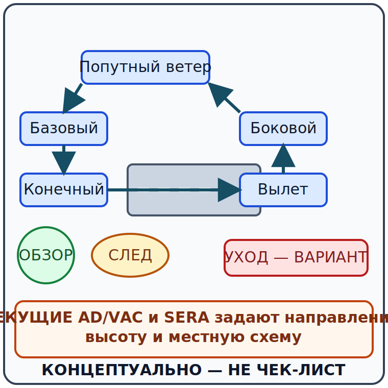

# Наземное движение, аэродромный трафик и следовая турбулентность {#taxi-circuit-wake}

## Назначение {#purpose}

Глава связывает наземное движение, [аэродромный круг](../reference/glossary.md#term-aerodrome-traffic-circuit), визуальную осмотрительность и [следовую турбулентность](../reference/glossary.md#term-wake-turbulence) с решением продолжать, ожидать или [уйти на второй круг](../reference/glossary.md#term-go-around). Испанские правовые опоры — [SERA](../reference/glossary.md#term-sera).3210, [SERA](../reference/glossary.md#term-sera).3225 и [SERA](../reference/glossary.md#term-sera).8012 (`SRC-EASA-SERA-2025`); раздел GU09 «Procedimientos Operacionales», pp. 49–58 определяет объём [MAF](../reference/glossary.md#term-maf) (`SRC-AESA-ULM-LEARNING-OBJECTIVES-GU09-ED01`). Текущие AD/VAC, [AIP](../reference/glossary.md#term-aip)/[NOTAM](../reference/glossary.md#term-notam) и указания ATS определяют опубликованные или предписанные исключения из левого направления по умолчанию, высоту, точки доклада и движение; местная [SOP](../reference/glossary.md#term-standard-operating-procedure-sop) должна им соответствовать.

Точные действия руления, полёта по кругу и ухода, их последовательность, скорости и конфигурацию конкретного самолёта задают [AFM](../reference/glossary.md#term-afm)/[POH](../reference/glossary.md#term-poh) и самолётная контрольная карта; инструктор отрабатывает их на типе.

## Результаты обучения {#outcomes}

- называть участки круга без назначения универсального входа или высоты;
- разделять правила приоритета, местную процедуру и технику самолёта;
- оценивать lookout, интервал, направление ветра и запас для ухода;
- объяснять механизм следовой турбулентности и неопределённость её положения;
- выбирать ожидание или уход до потери безопасного интервала;
- использовать текущие AD/VAC/[NOTAM](../reference/glossary.md#term-notam)/SOP вместо памяти о знакомом аэродроме.

Точные действия руления, полёта по кругу и ухода, их последовательность, скорости и конфигурацию конкретного самолёта задают [AFM](../reference/glossary.md#term-afm)/[POH](../reference/glossary.md#term-poh) и контрольная карта; инструктор обучает им в подготовке.

## Карта применимости {#applicability}

| Метка | Что изучать |
|---|---|
| [ULM — ОСНОВА] | Руление, участки круга, lookout, приоритет, интервал, wake и [go-around](../reference/glossary.md#term-go-around) |
| [ULM — ОСОБО ВАЖНО] | Небольшая инерция и сопротивление могут менять реакцию конкретного [ULM](../reference/glossary.md#term-ulm) на ветер |
| [PART-FCL — ОБЩЕЕ] | Те же устойчивые понятия; operation-based [Part-NCO](../reference/glossary.md#term-part-nco) отдельно |
| [LAPL — ПЕРЕХОД] | Круг и SOP нового аэродрома и самолёта [DTO](../reference/glossary.md#term-dto)/[ATO](../reference/glossary.md#term-ato) |
| [PPL — РАСШИРЕНИЕ] | Работа в более сложном движении без отказа от визуальной ответственности |
| [ИСПАНИЯ] | [SERA](../reference/glossary.md#term-sera) плюс текущие [AIP](../reference/glossary.md#term-aip) España, AD/VAC, [NOTAM](../reference/glossary.md#term-notam) и разрешение ATC |
| [БЕЗОПАСНОСТЬ] | Уход на второй круг — нормальный вариант, а не ошибка пилота |
| [ПРОВЕРИТЬ ПЕРЕД ПОЛЁТОМ] | Направление и высоту круга, поверхность, частоту, работы, ограничения и активность |

Точные действия руления, полёта по кругу и ухода, их последовательность и конфигурацию конкретного самолёта задают [AFM](../reference/glossary.md#term-afm)/[POH](../reference/glossary.md#term-poh) и контрольная карта; инструктор подтверждает местную подготовку.

## Теория {#theory}

### Руление и осмотрительность {#taxi-lookout}

Руление — управляемое движение в среде с людьми, техникой, препятствиями, воздушным потоком и другими воздушными судами. Скорость должна оставлять возможность выполнить точную процедуру остановки в доступном пространстве, но курс не задаёт числовое значение. Ветер, уклон, покрытие, радиус разворота и обзор меняют запас.

Визуальный осмотр не заменяется разрешением или радиосвязью. Неясная разметка, потеря положения, пересечение stop bar или конфликт движения являются воротами остановки и уточнения, а не поводом двигаться вслед за другим бортом.

Точные действия руления и торможения, их последовательность, скорости и конфигурацию конкретного самолёта задают [AFM](../reference/glossary.md#term-afm)/[POH](../reference/glossary.md#term-poh) и контрольная карта; инструктор отрабатывает их в местной подготовке.

### Участки аэродромного круга {#circuit-legs}

Аэродромный круг полётов (English: [aerodrome traffic circuit](../reference/glossary.md#term-aerodrome-traffic-circuit); español: circuito de tránsito de aeródromo) можно описывать участками: вылет/против ветра, боковой ветер, попутный ветер, базовый и конечный. Эти названия помогают понимать относительное положение, но не назначают точку входа, высоту или траекторию конкретного аэродрома.

[SERA](../reference/glossary.md#term-sera).3225(c) устанавливает исходное правило: если иное не указано либо не предписано ATC, повороты при заходе на посадку и после взлёта выполняются влево. Текущие AD/VAC/[NOTAM](../reference/glossary.md#term-notam) и указания ATS определяют опубликованное или предписанное исключение и местную реализацию. [SERA](../reference/glossary.md#term-sera).3210 отдельно регулирует предотвращение столкновений и приоритеты (`SRC-EASA-SERA-2025`). FAA-H-8083-3C ch. 8, pp. 8-1–8-7 используется только для устойчивых понятий участков и spacing; американские вход, высота и радиоисходные не переносятся (`SRC-FAA-AFH-3C-CH8`).

Точные действия на кругу, их последовательность, скорости, высоты и конфигурацию конкретного самолёта задают [AFM](../reference/glossary.md#term-afm)/[POH](../reference/glossary.md#term-poh), текущие AD/VAC и контрольная карта; инструктор обучает местной процедуре.

### Lookout, интервал и приоритет {#lookout-spacing-priority}

Право преимущественного пути не создаёт права на столкновение. Пилот формирует картину по внешнему обзору, сообщениям, положению, скорости сближения и возможным нерадиофицированным участникам. Радиовызов — источник информации, а не доказательство свободного пути.

Интервал должен оставлять место для непредвиденного изменения, ухода другого борта и собственного [go-around](../reference/glossary.md#term-go-around). Когда картина неоднозначна, безопасная стратегия расширяет интервал или прекращает сближение, а не требует от другого пилота сохранить прогнозируемую траекторию.

Точные действия полёта по кругу и ухода, их последовательность, скорости и конфигурацию конкретного самолёта задают [AFM](../reference/glossary.md#term-afm)/[POH](../reference/glossary.md#term-poh) и контрольная карта; инструктор развивает lookout и spacing в полётной подготовке.

### Следовая турбулентность {#wake-turbulence}

Следовая турбулентность (English: [wake turbulence](../reference/glossary.md#term-wake-turbulence); español: turbulencia de estela) связана прежде всего с вихрями, создаваемыми подъёмной силой. Интенсивность и движение зависят от создающего борта, конфигурации, массы, скорости, ветра, времени и близости поверхности. Видимый самолёт не показывает точное положение невидимого вихря.

ATC не гарантирует разделение спутного следа во всяком [VFR](../reference/glossary.md#term-vfr)-контексте. [SERA](../reference/glossary.md#term-sera) и текущая услуга определяют обязанности, а пилот сохраняет оценку угрозы. [EASA](../reference/glossary.md#term-easa) SIB 2017-10R1 — advisory для en-route wake и не является процедурой аэродромного круга (`SRC-EASA-SIB-2017-10R1`). Курс не публикует универсальный временной интервал или траекторию уклонения.

Точные действия при угрозе спутного следа, последовательность, скорость и конфигурацию конкретного самолёта задают [AFM](../reference/glossary.md#term-afm)/[POH](../reference/glossary.md#term-poh) и контрольная карта; инструктор обучает оценке и местным вариантам.

### Стабильность захода и [go-around](../reference/glossary.md#term-go-around) {#stabilised-go-around}

Стабилизированный заход (English: stabilised approach; español: aproximación estabilizada) оценивается по критериям конкретного самолёта и организации: траектория, энергия, конфигурация, workload и возможность посадки. Курс не задаёт универсальную высоту проверки или скорость.

Уход на второй круг (English: [go-around](../reference/glossary.md#term-go-around); español: motor y al aire) — нормальный вариант безопасности при нестабильности, конфликте, wake, изменении полосы или утрате запаса. Решение принимают рано; точная техника принадлежит самолётной документации и подготовке.

Точные действия ухода на второй круг, их последовательность, скорости и конфигурацию конкретного самолёта задают [AFM](../reference/glossary.md#term-afm)/[POH](../reference/glossary.md#term-poh) и контрольная карта; инструктор отрабатывает их на типе.

### SCN-OPS-03 — Конфликт на конечном участке и нестабильный заход {#scn-ops-03}

**Сигналы:** на конечном участке местного круга впереди появляется более медленный борт, а собственная траектория и энергия перестают соответствовать критериям подготовки.

**Применимый источник:** `SRC-EASA-SERA-2025`, текущие AD/VAC, [AFM](../reference/glossary.md#term-afm)/[POH](../reference/glossary.md#term-poh), checklist и SOP.

**Варианты:** продолжить и рассчитывать на освобождение; уменьшить интервал ниже привычного; выполнить предусмотренный уход.

**Решение:** **УХОД на второй круг**; сохранить интервал и не превращать посадку в обязательную цель.

**Граница AFM/чек-листа/инструктора:** точные действия ухода, последовательность, скорости и конфигурацию конкретного самолёта задают [AFM](../reference/glossary.md#term-afm)/[POH](../reference/glossary.md#term-poh) и контрольная карта; инструктор отрабатывает их на типе.

**AIP AIRAC/WEF:** `[ВСТАВИТЬ текущий AIRAC/WEF; учебный снимок 09.07.2026]`.

**AD/VAC:** `[ВСТАВИТЬ текущую VAC, направление и местную высоту круга]`.

**NOTAM/PIB:** `[ВСТАВИТЬ время PIB/NOTAM UTC и состояние ВПП]`.

**Метеобрифинг:** `[ВСТАВИТЬ время briefing, ветер и порывы]`.

**Ревизия AFM/чек-листа:** `[ВСТАВИТЬ AFM/POH и go-around checklist revision]`.

**Время решения:** `[ВСТАВИТЬ дату и UTC до утраты безопасного интервала]`.

### SCN-OPS-04 — Неопределённое положение спутного следа {#scn-ops-04}

**Сигналы:** впереди взлетает более тяжёлый самолёт, ветер слабый и переменный, а точная геометрия вихрей и безопасный интервал не доказаны.

**Применимый источник:** `SRC-EASA-SERA-2025`, `SRC-EASA-SIB-2017-10R1` только как advisory, текущие ATC/AD/VAC и exact aircraft documents.

**Варианты:** вылететь по одному запомненному времени; ожидать/изменить план; считать разрешение гарантией отсутствия wake.

**Решение:** **СТОП / ожидать либо УХОД**, пока выбранный вариант не восстановит доказанный запас; универсальный таймер не применяется.

**Граница AFM/чек-листа/инструктора:** точные действия, последовательность, скорости и конфигурацию конкретного самолёта задают [AFM](../reference/glossary.md#term-afm)/[POH](../reference/glossary.md#term-poh) и контрольная карта; инструктор обучает местной оценке wake.

**AIP AIRAC/WEF:** `[ВСТАВИТЬ текущий AIRAC/WEF; учебный снимок 09.07.2026]`.

**AD/VAC:** `[ВСТАВИТЬ текущую AD/VAC и используемую ВПП]`.

**NOTAM/PIB:** `[ВСТАВИТЬ время PIB/NOTAM UTC]`.

**Метеобрифинг:** `[ВСТАВИТЬ время briefing и наблюдаемый ветер]`.

**Ревизия AFM/чек-листа:** `[ВСТАВИТЬ AFM/POH и checklist revision]`.

**Время решения:** `[ВСТАВИТЬ дату и UTC до начала разбега или на заходе]`.

## Применение к [ULM](../reference/glossary.md#term-ulm)/[MAF](../reference/glossary.md#term-maf) {#ulm-application}

Для испанского [MAF](../reference/glossary.md#term-maf) местная знакомость не заменяет текущие AD/VAC/[NOTAM](../reference/glossary.md#term-notam). Чувствительность конкретного [ULM](../reference/glossary.md#term-ulm) к порывам и wake зависит от массы, инерции, сопротивления, [wing loading](../reference/glossary.md#term-wing-loading) и конфигурации; она не одинакова для всех лёгких самолётов.

Точные действия руления, полёта по кругу и ухода, их последовательность, скорости и конфигурацию конкретного [ULM](../reference/glossary.md#term-ulm) задают [AFM](../reference/glossary.md#term-afm)/[POH](../reference/glossary.md#term-poh) и контрольная карта; инструктор обучает им на этом типе.

## Расширение [Part-FCL](../reference/glossary.md#term-part-fcl) {#part-fcl-extension}

В последующей применимой операции [Part-NCO](../reference/glossary.md#term-part-nco) правила [PIC](../reference/glossary.md#term-pic) и условий взлёта рассматриваются отдельно; наличие LAPL/PPL само не определяет режим. NCO.GEN.105 не заменяет [SERA](../reference/glossary.md#term-sera) или текущие аэродромные данные (`SRC-EASA-AIR-OPS-2026`).

Точные действия руления, полёта по кругу, посадки и ухода, их последовательность и конфигурацию конкретного самолёта задают [AFM](../reference/glossary.md#term-afm)/[POH](../reference/glossary.md#term-poh) и контрольная карта; инструктор [DTO](../reference/glossary.md#term-dto)/[ATO](../reference/glossary.md#term-ato) отрабатывает их на типе.

## Безопасность {#safety}

- Текущие AD/VAC определяют местную схему; рисунок курса не задаёт вход или высоту.
- Внешний обзор остаётся необходимым при радио, ATC и traffic display.
- Право преимущественного пути не разрешает продолжать к конфликту.
- Wake невидим и перемещается; универсального интервала курса нет.
- [Go-around](../reference/glossary.md#term-go-around) сохраняет варианты и не является провалом.

Точные действия полёта по кругу, посадки и ухода, их последовательность, скорости и конфигурацию конкретного самолёта задают [AFM](../reference/glossary.md#term-afm)/[POH](../reference/glossary.md#term-poh) и контрольная карта; инструктор обучает им.

## Частые ошибки {#common-errors}

1. Переносить высоту и сторону круга с другого аэродрома.
2. Считать радиомолчание доказательством отсутствия движения.
3. Полагаться на ATC как на универсальную гарантию wake separation.
4. Использовать один запомненный временной интервал.
5. Продолжать нестабильный заход, чтобы не выполнять [go-around](../reference/glossary.md#term-go-around).

Точные действия на кругу и при уходе, последовательность, скорости и конфигурацию конкретного самолёта задают [AFM](../reference/glossary.md#term-afm)/[POH](../reference/glossary.md#term-poh) и контрольная карта; инструктор исправляет эти ошибки в подготовке.

## Итог {#summary}

Круг — динамическая общая задача пространства, движения, ветра и энергии. Текущие AD/VAC и [SERA](../reference/glossary.md#term-sera) формируют рамку, а точные действия руления, посадки и ухода определяют [AFM](../reference/glossary.md#term-afm)/[POH](../reference/glossary.md#term-poh), контрольная карта и инструкторская подготовка на типе.

## Контрольные вопросы {#review-questions}

### Q-OPS-006 — Как определить сторону и высоту круга реального аэродрома? {#q-ops-006}

A. Универсальная схема из любого учебника. 
B. Для стороны сначала применить левое направление по умолчанию из [SERA](../reference/glossary.md#term-sera).3225(c), затем проверить иное указание AD/VAC/[NOTAM](../reference/glossary.md#term-notam) или ATS; высоту и местную схему взять из текущих данных аэродрома. 
C. Направление круга на ближайшем аэродроме. 
D. Только положение ветроуказателя без документов.

**Правильный ответ:** B.

**Почему:** [SERA](../reference/glossary.md#term-sera).3225(c) даёт левое направление по умолчанию, но публикация или ATC могут установить иное; высота и остальные местные ограничения берутся из текущих данных конкретного аэродрома.

**Почему главный отвлекающий вариант неверен:** A превращает концептуальный рисунок участков в универсальную местную процедуру.

**Опора в теории:** [Участки аэродромного круга](#circuit-legs).

**Источник:** `SRC-EASA-SERA-2025`, `SRC-FAA-AFH-3C-CH8`.

### Q-OPS-007 — Что означает преимущество одного борта в движении? {#q-ops-007}

A. Возможность продолжать, даже если столкновение становится вероятным. 
B. Освобождение от визуальной осмотрительности при радиообмене. 
C. Правило приоритета, которое не отменяет действий по предотвращению столкновения. 
D. Гарантированный интервал со стороны ATC на любом аэродроме.

**Правильный ответ:** C.

**Почему:** [SERA](../reference/glossary.md#term-sera) сохраняет обязанность предотвращать столкновение независимо от формального преимущества.

**Почему главный отвлекающий вариант неверен:** A ошибочно превращает преимущество в право продолжать к опасному сближению.

**Опора в теории:** [Lookout, интервал и приоритет](#lookout-spacing-priority).

**Источник:** `SRC-EASA-SERA-2025`.

### Q-OPS-008 — Почему один временной интервал не описывает wake? {#q-ops-008}

A. Потому что движение вихрей зависит от создающего борта, ветра, времени и поверхности. 
B. Потому что вихри остаются неподвижными в центре ВПП. 
C. Потому что разрешение ATC всегда устраняет следовую турбулентность. 
D. Потому что wake существует только при отсутствии ветра.

**Правильный ответ:** A.

**Почему:** Геометрия и интенсивность wake изменяются с несколькими условиями, поэтому универсальный таймер не доказывает запас.

**Почему главный отвлекающий вариант неверен:** C смешивает разрешение движения с физическим устранением вихрей, которого ATC обеспечить не может.

**Опора в теории:** [Следовая турбулентность](#wake-turbulence).

**Источник:** `SRC-EASA-SIB-2017-10R1`, `SRC-EASA-SERA-2025`.

### Q-OPS-009 — Какова роль [go-around](../reference/glossary.md#term-go-around) при нестабильном заходе? {#q-ops-009}

A. Это нормальный вариант сохранения запаса до небезопасного продолжения. 
B. Это признание нарушения, поэтому его следует избегать. 
C. Он допустим только после касания ВПП. 
D. Он заменяет проверку движения и wake.

**Правильный ответ:** A.

**Почему:** Ранний [go-around](../reference/glossary.md#term-go-around) прекращает сближение с посадкой, когда критерии или интервал уже не доказаны.

**Почему главный отвлекающий вариант неверен:** B создаёт давление продолжения и ошибочно называет нормальное решение безопасности неудачей.

**Опора в теории:** [Стабильность захода и решение об уходе](#stabilised-go-around).

**Источник:** `SRC-FAA-AFH-3C-CH9`.

### Q-OPS-010 — Что следует сделать при потере положения во время руления? {#q-ops-010}

A. Следовать за ближайшим самолётом без подтверждения маршрута. 
B. Продолжить до пересечения и уточнить после него. 
C. Остановиться в применимо безопасном месте и уточнить положение и разрешение. 
D. Перейти на частоту другого аэродрома для сравнения.

**Правильный ответ:** C.

**Почему:** Продолжение при неизвестном положении увеличивает риск неправильного выезда или конфликта; остановка сохраняет варианты.

**Почему главный отвлекающий вариант неверен:** A предполагает, что другой борт следует тому же разрешению и маршруту, чего наблюдение не доказывает.

**Опора в теории:** [Руление и осмотрительность](#taxi-lookout).

**Источник:** `SRC-EASA-SERA-2025`, `SRC-FAA-AFH-3C-CH2`.

## Источники {#sources}

- `SRC-AESA-ULM-LEARNING-OBJECTIVES-GU09-ED01` — «Procedimientos Operacionales», pp. 49–58: круг, движение, след и посадка.
- `SRC-EASA-SERA-2025` — [SERA](../reference/glossary.md#term-sera).3210, [SERA](../reference/glossary.md#term-sera).3225 и [SERA](../reference/glossary.md#term-sera).8012.
- `SRC-FAA-AFH-3C-CH8` — pp. 8-1–8-7, conceptual traffic-pattern material; US entry/altitude/radio excluded.
- `SRC-FAA-AFH-3C-CH9` — ch. 9, включая pp. 9-20–9-24, stabilised approach and [go-around](../reference/glossary.md#term-go-around) concepts; exact technique excluded.
- `SRC-EASA-SIB-2017-10R1` — en-route wake advisory, не circuit procedure.
- `SRC-EASA-AIR-OPS-2026` — граница применимости [Part-NCO](../reference/glossary.md#term-part-nco) по операции.
