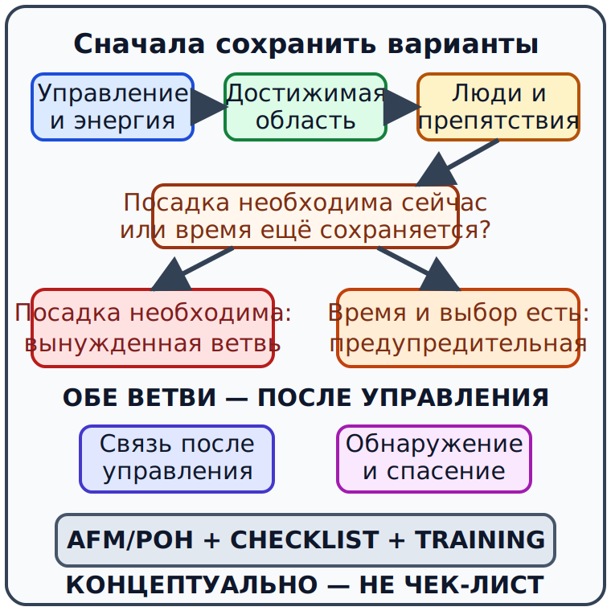

# Аварийное управление энергией и выбор безопасной области {#engine-failure-forced-landing}

## Назначение {#purpose}

Глава формирует причинную модель решения при уменьшении или потере тяги, не публикуя схему действий в кабине (English: cockpit flow), высоту разворота назад или последовательность выключателей. Раздел GU09 «Procedimientos Operacionales», pp. 49–58 включает потерю мощности (English: power loss), предупредительную посадку (English: [precautionary landing](../reference/glossary.md#term-precautionary-landing); español: aterrizaje de precaución), вынужденную посадку (English: [forced landing](../reference/glossary.md#term-forced-landing); español: aterrizaje forzoso) и аварийные приоритеты (English: emergency priorities) (`SRC-AESA-ULM-LEARNING-OBJECTIVES-GU09-ED01`); FAA-H-8083-3C ch. 18, pp. 18-1–18-23 поддерживает устойчивые понятия, но не является источником испанского права или процедуры типа (`SRC-FAA-AFH-3C-CH18`).

Точные действия при потере мощности и посадке, их последовательность, скорости и конфигурацию конкретного самолёта задают [AFM](../reference/glossary.md#term-afm)/[POH](../reference/glossary.md#term-poh) и самолётная контрольная карта; инструктор отрабатывает их на типе.

## Результаты обучения {#outcomes}

- применять приоритет «управлять — ориентироваться — связываться» без универсальной панели действий;
- отличать предупредительную посадку от вынужденной;
- оценивать энергию, достижимую область, ветер, препятствия и людей;
- объяснять различия потери мощности по фазам;
- отвергать универсальную turn-back altitude;
- использовать связь и спасательные возможности после сохранения управления.

Точные действия при потере мощности и посадке, их последовательность, скорости и конфигурацию конкретного самолёта задают [AFM](../reference/glossary.md#term-afm)/[POH](../reference/glossary.md#term-poh) и контрольная карта; инструктор обучает им в полёте и на тренажёре по утверждённой программе.

## Карта применимости {#applicability}

| Метка | Что изучать |
|---|---|
| [ULM — ОСНОВА] | Управление энергией, выбор достижимой области, раннее решение и связь |
| [ULM — ОСОБО ВАЖНО] | Запас времени конкретного [ULM](../reference/glossary.md#term-ulm) зависит от высоты, энергии, сопротивления, ветра и местности |
| [PART-FCL — ОБЩЕЕ] | Те же emergency concepts для последующего самолёта; exact procedure новая |
| [LAPL — ПЕРЕХОД] | Отработка emergency procedures на самолёте [DTO](../reference/glossary.md#term-dto)/[ATO](../reference/glossary.md#term-ato) |
| [PPL — РАСШИРЕНИЕ] | Более широкий набор систем и маршрутов без универсальных действий |
| [ИСПАНИЯ] | [SERA](../reference/glossary.md#term-sera), текущие [AIP](../reference/glossary.md#term-aip)/[NOTAM](../reference/glossary.md#term-notam), местность и emergency services |
| [БЕЗОПАСНОСТЬ] | Управление и достижимая область важнее диагностики |
| [ПРОВЕРИТЬ ПЕРЕД ПОЛЁТОМ] | Emergency checklist, best-glide data, restraint/rescue equipment и пригодные варианты маршрута |

Точные действия при потере мощности и посадке, их последовательность, скорости и конфигурацию конкретного самолёта задают [AFM](../reference/glossary.md#term-afm)/[POH](../reference/glossary.md#term-poh) и контрольная карта; инструктор подтверждает их на типе.

## Теория {#theory}

### Управлять — ориентироваться — связываться {#aviate-navigate-communicate-priority}

Приоритет [AVIATE–NAVIGATE–COMMUNICATE](../reference/glossary.md#term-aviate-navigate-communicate) означает сначала сохранять управляемое состояние и энергию, затем выбирать достижимую траекторию и область, после чего использовать связь в пределах времени и workload. Это приоритет внимания, а не универсальная последовательность органов управления.

Диагностика имеет смысл только пока не отнимает запас у управления и выбора области. Один звук, RPM или положение органа не доказывают причину. Если тяга не подтверждается, решение строят для доступной энергии, а не для желаемого восстановления.

Точные действия при потере мощности и посадке, последовательность, скорости и конфигурацию конкретного самолёта задают [AFM](../reference/glossary.md#term-afm)/[POH](../reference/glossary.md#term-poh) и контрольная карта; инструктор отрабатывает распределение внимания на типе.

### Энергия и достижимая область {#energy-landing-area}

Высота, скорость, ветер, масса, конфигурация, сопротивление и манёвр определяют множество достижимых точек. Это не круг фиксированного радиуса. Поворот, попытка растянуть планирование или длительный поиск причины расходуют энергию и могут убрать более безопасную область.

Кандидат оценивают по размеру, направлению, уклону, поверхности, препятствиям, людям, проводам, ветру и последствиям после касания. «Ближе» не всегда значит «лучше», а «аэродром» не всегда остаётся достижимым.

Точные действия планирования и посадки, их последовательность, скорости и конфигурацию конкретного самолёта задают [AFM](../reference/glossary.md#term-afm)/[POH](../reference/glossary.md#term-poh) и контрольная карта; инструктор обучает оценке области в безопасной подготовке.

### Фаза события и разворот назад {#phase-and-turnback}

На земле, разбеге, сразу после отрыва, на кругу и на маршруте доступны разные энергия, пространство и время. Универсальной высоты разворота назад не существует. Возможность зависит от самолёта, фактической энергии, ветра, положения, времени распознавания, техники и предварительной подготовки; импровизированная попытка может привести к потере управления.

До полёта instructor-led briefing связывает фазы с exact aircraft options. В событии пилот применяет подготовленную процедуру, а не число из чужого отчёта.

Точные действия при потере мощности после взлёта и возможной посадке, последовательность, скорости и конфигурацию конкретного самолёта задают [AFM](../reference/glossary.md#term-afm)/[POH](../reference/glossary.md#term-poh) и контрольная карта; инструктор отрабатывает phase-specific решения на типе.

### Предупредительная и вынужденная посадка {#precautionary-versus-forced}

Предупредительная посадка (English: [precautionary landing](../reference/glossary.md#term-precautionary-landing); español: aterrizaje de precaución) выбирается, когда самолёт ещё управляем и время позволяет прекратить ухудшающуюся операцию до полной потери вариантов. Вынужденная посадка (English: [forced landing](../reference/glossary.md#term-forced-landing); español: aterrizaje forzoso) происходит, когда продолжение обычного полёта невозможно и посадка необходима.

Ранний divert или [precautionary landing](../reference/glossary.md#term-precautionary-landing) при ухудшении погоды, топлива, двигателя или пилота может сохранить аэродром, daylight и помощь. Ожидание полного отказа превращает управляемое решение в срочное событие.

Точные действия предупредительной или вынужденной посадки, последовательность, скорости и конфигурацию конкретного самолёта задают [AFM](../reference/glossary.md#term-afm)/[POH](../reference/glossary.md#term-poh) и контрольная карта; инструктор обучает различию и процедурам на типе.

### Люди, связь и спасение {#occupants-communication-rescue}

После сохранения управления пилот использует доступное время для связи, подготовки людей и повышения обнаруживаемости согласно exact checklist. [Urgency](../reference/glossary.md#term-urgency)/[distress](../reference/glossary.md#term-distress) выбирают по фактической угрозе; не нужно ждать полной уверенности в исходе. Связь не должна вытеснять управление и достижимую область.

Установленная парашютная система всего самолёта — отдельная возможность, а не универсальная ветвь. Высота, envelope, рукоять, чека и последовательность принадлежат точному supplement и подготовке. Курс не задаёт BRS action sequence.

Точные действия при посадке, связи и использовании спасательного оборудования, последовательность и конфигурацию конкретного самолёта задают [AFM](../reference/glossary.md#term-afm)/[POH](../reference/glossary.md#term-poh) и контрольная карта; инструктор обучает им на установленной системе.

### SCN-OPS-07 — Потеря мощности после отрыва {#scn-ops-07}

**Сигналы:** после отрыва уменьшается тяга, высота и время ограничены, а возвращение на ВПП потребовало бы неподготовленного разворота.

**Применимый источник:** `SRC-FAA-AFH-3C-CH18` только для общей модели; exact [AFM](../reference/glossary.md#term-afm)/[POH](../reference/glossary.md#term-poh) emergency checklist, preflight briefing и [SERA](../reference/glossary.md#term-sera) имеют приоритет.

**Варианты:** диагностировать до выбора области; пытаться вернуться по чужой высоте; сохранить управление и выбрать подготовленную достижимую область.

**Решение:** **САДИТЬСЯ в наиболее безопасной достижимой области** по точной процедуре; универсальный turn-back не применяется.

**Граница AFM/чек-листа/инструктора:** точные действия при потере мощности и посадке, последовательность, скорости и конфигурацию конкретного самолёта задают [AFM](../reference/glossary.md#term-afm)/[POH](../reference/glossary.md#term-poh) и checklist; инструктор отрабатывает phase-specific варианты.

**AIP AIRAC/WEF:** `[ВСТАВИТЬ текущий AIRAC/WEF; учебный снимок 09.07.2026]`.

**AD/VAC:** `[ВСТАВИТЬ ревизию AD/VAC, ВПП и местную геометрию]`.

**NOTAM/PIB:** `[ВСТАВИТЬ время PIB/NOTAM UTC и закрытые поверхности]`.

**Метеобрифинг:** `[ВСТАВИТЬ время briefing, ветер и порывы]`.

**Ревизия AFM/чек-листа:** `[ВСТАВИТЬ emergency AFM/POH и checklist revision]`.

**Время решения:** `[ВСТАВИТЬ дату и UTC немедленно после распознавания]`.

### SCN-OPS-08 — Ухудшение двигателя на маршруте {#scn-ops-08}

**Сигналы:** на внутреннем испанском маршруте мощность или двигатель показывают неблагоприятную тенденцию, но самолёт ещё управляем и несколько аэродромов достижимы.

**Применимый источник:** `SRC-AESA-ULM-LEARNING-OBJECTIVES-GU09-ED01` — «Procedimientos Operacionales», pp. 49–58; exact [AFM](../reference/glossary.md#term-afm)/[POH](../reference/glossary.md#term-poh)/checklist, текущие [AIP](../reference/glossary.md#term-aip)/[NOTAM](../reference/glossary.md#term-notam) и официальная погода.

**Варианты:** продолжать к плановому назначению; ранний DIVERT; ждать полного отказа для подтверждения причины.

**Решение:** **DIVERT / предупредительная ПОСАДКА** на раннем подходящем варианте до потери управляемого выбора.

**Граница AFM/чек-листа/инструктора:** точные действия при снижении мощности и посадке, последовательность, скорости и конфигурацию конкретного самолёта задают [AFM](../reference/glossary.md#term-afm)/[POH](../reference/glossary.md#term-poh) и checklist; инструктор обучает раннему решению.

**AIP AIRAC/WEF:** `[ВСТАВИТЬ текущий AIRAC/WEF; учебный снимок 09.07.2026]`.

**AD/VAC:** `[ВСТАВИТЬ ревизии AD/VAC маршрута и вариантов]`.

**NOTAM/PIB:** `[ВСТАВИТЬ время PIB/NOTAM UTC для маршрута и diversion]`.

**Метеобрифинг:** `[ВСТАВИТЬ время briefing и погоду вариантов]`.

**Ревизия AFM/чек-листа:** `[ВСТАВИТЬ AFM/POH abnormal checklist revision]`.

**Время решения:** `[ВСТАВИТЬ дату и UTC до уменьшения достижимой области]`.

## Применение к [ULM](../reference/glossary.md#term-ulm)/[MAF](../reference/glossary.md#term-maf) {#ulm-application}

Для [MAF](../reference/glossary.md#term-maf) нельзя предполагать одинаковый glide, inertia или response всех [ULM](../reference/glossary.md#term-ulm). Подготовка связывает конкретный борт, местный рельеф и варианты сразу после отрыва. Национальная лицензия не заменяет training на типе.

Точные действия при потере мощности и посадке, последовательность, скорости и конфигурацию конкретного [ULM](../reference/glossary.md#term-ulm) задают [AFM](../reference/glossary.md#term-afm)/[POH](../reference/glossary.md#term-poh) и контрольная карта; инструктор обучает им на этом борту.

## Расширение [Part-FCL](../reference/glossary.md#term-part-fcl) {#part-fcl-extension}

LAPL/PPL изучает те же понятия, но осваивает emergency procedures нового самолёта заново. Если операция подпадает под [Part-NCO](../reference/glossary.md#term-part-nco), NCO.GEN.105 и NCO.OP.135/.160/.185 применяются по aircraft/operation, а не только по лицензии (`SRC-EASA-AIR-OPS-2026`).

Точные действия при отказе, потере мощности и посадке, последовательность и конфигурацию конкретного самолёта задают [AFM](../reference/glossary.md#term-afm)/[POH](../reference/glossary.md#term-poh) и контрольная карта; инструктор [DTO](../reference/glossary.md#term-dto)/[ATO](../reference/glossary.md#term-ato) отрабатывает их на типе.

## Безопасность {#safety}

- Сначала управление и достижимая область, затем диагностика и связь.
- Универсальной turn-back altitude нет.
- Не растягивайте планирование ради недостижимой точки.
- Ранний divert может предотвратить вынужденную посадку.
- BRS используется только по exact installed documents и training.

Точные действия при потере мощности и посадке, последовательность, скорости и конфигурацию конкретного самолёта задают [AFM](../reference/glossary.md#term-afm)/[POH](../reference/glossary.md#term-poh) и контрольная карта; инструктор обучает им.

## Частые ошибки {#common-errors}

1. Искать причину до выбора достижимой области.
2. Использовать универсальную высоту разворота назад.
3. Считать ближайшую точку автоматически лучшей.
4. Откладывать [urgency](../reference/glossary.md#term-urgency)/[distress](../reference/glossary.md#term-distress) до полной уверенности.
5. Ждать полного отказа вместо раннего [precautionary landing](../reference/glossary.md#term-precautionary-landing).

Точные действия при потере мощности, связи и посадке, последовательность, скорости и конфигурацию конкретного самолёта задают [AFM](../reference/glossary.md#term-afm)/[POH](../reference/glossary.md#term-poh) и контрольная карта; инструктор исправляет эти ошибки в подготовке.

## Итог {#summary}

Энергия и достижимая область задают реальный выбор. Предупредительная посадка сохраняет варианты до вынужденной. Точные действия, скорости и конфигурацию определяют [AFM](../reference/glossary.md#term-afm)/[POH](../reference/glossary.md#term-poh), самолётная контрольная карта и инструкторская подготовка на типе.

## Контрольные вопросы {#review-questions}

### Q-OPS-016 — Что означает [AVIATE](../reference/glossary.md#term-aviate-navigate-communicate) в начале потери мощности? {#q-ops-016}

A. Сохранить управляемое состояние и энергию до углублённой диагностики. 
B. Немедленно настроить все доступные частоты. 
C. Сначала определить юридический статус площадки. 
D. Продолжать маршрут до подтверждения полного отказа.

**Правильный ответ:** A.

**Почему:** Управляемое состояние и энергия необходимы для любого последующего выбора области, связи или попытки восстановления.

**Почему главный отвлекающий вариант неверен:** B переносит внимание на связь до обеспечения управления и достижимой траектории.

**Опора в теории:** [Управлять — ориентироваться — связываться](#aviate-navigate-communicate-priority).

**Источник:** `SRC-FAA-AFH-3C-CH18`.

### Q-OPS-017 — Чем предупредительная посадка отличается от вынужденной? {#q-ops-017}

A. Предупредительная выбирается раньше при сохраняющемся управлении и времени; вынужденная становится необходимой. 
B. Предупредительная всегда выполняется вне аэродрома. 
C. Вынужденная возможна только после полного разрушения двигателя. 
D. Различие определяется наличием поданного FPL.

**Правильный ответ:** A.

**Почему:** Главное различие — сохранённая возможность раннего контролируемого выбора против необходимости посадки.

**Почему главный отвлекающий вариант неверен:** B ошибочно связывает классификацию с местом, хотя предупредительный вариант может быть аэродромом.

**Опора в теории:** [Предупредительная и вынужденная посадка](#precautionary-versus-forced).

**Источник:** `SRC-FAA-AFH-3C-CH18`.

### Q-OPS-018 — Почему универсальная turn-back altitude небезопасна? {#q-ops-018}

A. Она не учитывает самолёт, энергию, ветер, положение, распознавание и подготовку. 
B. Она всегда выше высоты аэродромного круга. 
C. Она зависит только от выбранной радиочастоты. 
D. Она применима только при наличии BRS.

**Правильный ответ:** A.

**Почему:** Возможность возврата формируется многими переменными конкретного события и не сводится к одному числу.

**Почему главный отвлекающий вариант неверен:** B сравнивает число с локальной высотой круга, но не оценивает энергию и геометрию возврата.

**Опора в теории:** [Фаза события и разворот назад](#phase-and-turnback).

**Источник:** `SRC-FAA-AFH-3C-CH18`.

### Q-OPS-019 — Как выбирать достижимую область посадки? {#q-ops-019}

A. Только по минимальному расстоянию до самолёта. 
B. По достижимости, ветру, размеру, поверхности, уклону, препятствиям и людям. 
C. Только по наличию асфальта. 
D. По точке, уже введённой в навигационное приложение.

**Правильный ответ:** B.

**Почему:** Безопасность области определяется сочетанием энергетической достижимости и последствий на земле.

**Почему главный отвлекающий вариант неверен:** A игнорирует качество поверхности, препятствия, ветер и людей ради одного расстояния.

**Опора в теории:** [Энергия и достижимая область](#energy-landing-area).

**Источник:** `SRC-FAA-AFH-3C-CH18`.

### Q-OPS-020 — Когда использовать связь при срочной посадке? {#q-ops-020}

A. После сохранения управления и в пределах доступного времени и workload. 
B. До выбора достижимой области независимо от потери управления. 
C. Только после касания земли. 
D. Только если FPL был подан до вылета.

**Правильный ответ:** A.

**Почему:** Связь помогает спасению, но не должна отнимать управление и энергию у первичного решения.

**Почему главный отвлекающий вариант неверен:** B делает передачу важнее управляемой траектории и может лишить пилота области посадки.

**Опора в теории:** [Люди, связь и спасение](#occupants-communication-rescue).

**Источник:** `SRC-AESA-ULM-LEARNING-OBJECTIVES-GU09-ED01` — «Procedimientos Operacionales», pp. 49–58; `SRC-EASA-SERA-2025`.

## Источники {#sources}

- `SRC-AESA-ULM-LEARNING-OBJECTIVES-GU09-ED01` — «Procedimientos Operacionales», pp. 49–58: аварийные приоритеты и посадка.
- `SRC-FAA-AFH-3C-CH18` — pp. 18-1–18-23, conceptual forced/precautionary/emergency material; exact actions excluded.
- `SRC-EASA-SERA-2025` — [SERA](../reference/glossary.md#term-sera).2010 and applicable [urgency](../reference/glossary.md#term-urgency)/[distress](../reference/glossary.md#term-distress)/rules framework.
- `SRC-EASA-AIR-OPS-2026` — operation-based NCO.GEN.105, NCO.OP.135/.160/.185 boundary.
