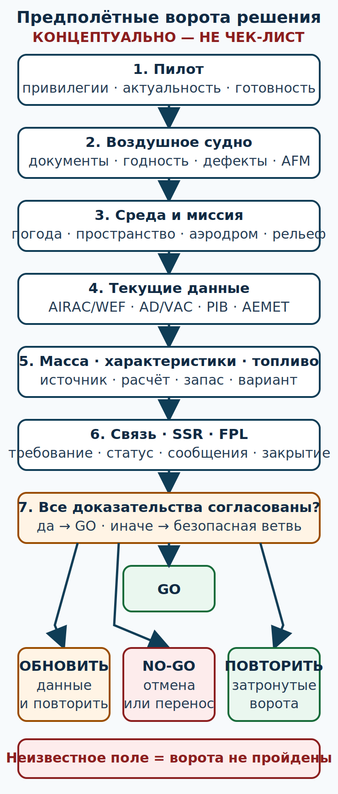

# Ворота «пилот — воздушное судно — среда» {#pilot-aircraft-environment}

## Назначение {#purpose}

Эта глава превращает предполётную подготовку в последовательность доказуемых ворот. Для каждого вывода пилот записывает источник, редакцию или время получения и решение. Основной слой — испанский национальный [ULM](../reference/glossary.md#term-ulm) с отметкой [MAF](../reference/glossary.md#term-maf) внутри Испании. Более поздний слой [Part-NCO](../reference/glossary.md#term-part-nco) отмечен отдельно и применяется по воздушному судну и операции, а не потому, что у пилота есть [LAPL(A)](../reference/glossary.md#term-lapl-a) или [PPL(A)](../reference/glossary.md#term-ppl-a).

**Проверочный лист планирования** (English: planning verification worksheet; español: hoja de verificación de planificación) из [справочника](../reference/checklists-flight.md) не является кабинным чек-листом и не задаёт действий с органами управления.

## Результаты обучения {#outcomes}

После главы вы сможете:

- доказать наличие нужных привилегий, актуальности и личной готовности;
- проверить документарный и технический статус конкретного [ULM](../reference/glossary.md#term-ulm) без выполнения неразрешённого обслуживания;
- собрать погодные, пространственные, аэродромные и рельефные ограничения;
- отделить испанские правила [ULM](../reference/glossary.md#term-ulm) от более позднего эксплуатационного слоя [Part-NCO](../reference/glossary.md#term-part-nco);
- остановить подготовку при конфликте источников или неполном доказательстве.

## Карта применимости {#applicability}

| Метка | Что означает |
|---|---|
| [ULM — ОСНОВА](../reference/glossary.md#term-ulm) | Лицензия [ULM](../reference/glossary.md#term-ulm), отметка [MAF](../reference/glossary.md#term-maf), актуальность, RTC при необходимости и эксплуатация внутри Испании |
| [ULM — ОСОБО ВАЖНО](../reference/glossary.md#term-ulm) | Небольшой запас массы, топлива и характеристик требует раннего решения NO-GO |
| [PART-FCL — ОБЩЕЕ](../reference/glossary.md#term-part-fcl) | Только помеченные блоки для операции по приложению VII [Part-NCO](../reference/glossary.md#term-part-nco) |
| [LAPL — ПЕРЕХОД](../reference/glossary.md#term-lapl-a) | Та же дисциплина доказательств переносится в обучение [LAPL(A)](../reference/glossary.md#term-lapl-a) |
| [PPL — РАСШИРЕНИЕ](../reference/glossary.md#term-ppl-a) | Более широкий опыт не отменяет ограничения конкретного воздушного судна и операции |
| [ИСПАНИЯ] | Текущие BOE, [AIP](../reference/glossary.md#term-aip) España, [NOTAM](../reference/glossary.md#term-notam)/PIB, AEMET и местные данные |
| [БЕЗОПАСНОСТЬ] | Неизвестное или противоречивое поле закрывает ворота |
| [ПРОВЕРИТЬ ПЕРЕД ПОЛЁТОМ] | Время, редакция и область каждого использованного источника |

## Теория {#theory}

### Иерархия источников {#source-hierarchy}

При подготовке действует следующий порядок:

1. закон, текущие [AIP](../reference/glossary.md#term-aip)/[NOTAM](../reference/glossary.md#term-notam) и разрешение ATC;
2. актуальные [AFM](../reference/glossary.md#term-afm)/[POH](../reference/glossary.md#term-poh), лётное руководство, ограничения, дополнения и таблички конкретного борта;
3. актуальный самолётный чек-лист, выведенный из этих документов;
4. совместимые с верхними уровнями SOP аэродрома, оператора или клуба и указания инструктора;
5. этот учебный курс.

Инструктор не отменяет и не переопределяет закон, [AFM](../reference/glossary.md#term-afm) или [POH](../reference/glossary.md#term-poh). Этот курс не отменяет самолётный чек-лист. Конфликт — это стоп: не лететь, пока противоречие не разрешено владельцем документа, инструктором и, когда требуется, компетентным органом.

### Ворота пилота {#pilot-gate}

Проверьте не только наличие пластика, но и область привилегий:

1. национальная лицензия [ULM](../reference/glossary.md#term-ulm) действительна;
2. отметка [MAF](../reference/glossary.md#term-maf) соответствует самолёту;
3. выполнены требования актуальности и медицинской пригодности;
4. для радиосвязи в требуемом пространстве есть действующая RTC и языковые возможности;
5. личная готовность проверена по сну, болезни, лекарствам, стрессу, алкоголю, питанию и внешнему давлению;
6. опыт пилота соответствует ветру, полосе, рельефу и сложности маршрута; правовая привилегия сама по себе не доказывает готовность.

`SRC-BOE-RD-123-2015` задаёт лицензионные ворота [ULM](../reference/glossary.md#term-ulm)/[MAF](../reference/glossary.md#term-maf) и RTC. GU09 требует оценивать обязанности [PIC](../reference/glossary.md#term-pic), подготовку и безопасное решение (`SRC-AESA-ULM-LEARNING-OBJECTIVES-GU09-ED01`, Procedimientos Operacionales, pp. 49–58).

### Ворота воздушного судна {#aircraft-gate}

Для конкретного регистрационного знака запишите:

- документы, требуемые для воздушного судна и полёта;
- статус лётной годности, техобслуживания и осмотра;
- открытые дефекты и ограничения их допуска;
- установленное и работоспособное оборудование для фактической операции;
- редакции [AFM](../reference/glossary.md#term-afm)/лётного руководства, дополнений, табличек и чек-листа;
- массу, центровку, характеристики, полезное топливо и эксплуатационные ограничения.

RD 141/2025, статьи 30 и 34–37 и существенное требование 2.1.5 приложения, связывают полётные и эксплуатационные ограничения, актуальные инструкции изготовителя, обслуживание, записи и проверку лётной годности (`SRC-BOE-RD-141-2025`). Пилот проверяет статус, выполняет разрешённые предполётные проверки и сообщает дефект; эта глава не разрешает ремонт или обслуживание вне компетенции и полномочий.

### Ворота среды {#environment-gate}

Среда проверяется как система, а не как один символ погоды:

- текущая и прогнозная погода на вылет, маршрут, назначение и варианты;
- ветер, порывы, видимость, облака, осадки, грозы, обледенение, турбулентность и освещение;
- класс и вертикальные/горизонтальные границы пространства, временные зоны, ограничения и требуемая связь/SSR;
- текущие AD/VAC, направление круга, поверхность и состояние ВПП, часы, PPR и приём [ULM](../reference/glossary.md#term-ulm);
- рельеф, препятствия, безопасные варианты ухода и места вынужденной посадки;
- влияние температуры, высоты, ветра, поверхности и массы на характеристики.

Официальные данные получают через текущие AIS/[AIP](../reference/glossary.md#term-aip)/[NOTAM](../reference/glossary.md#term-notam)/PIB [ENAIRE](../reference/glossary.md#term-enaire) и авиационные продукты AEMET. Потребительское навигационное приложение не заменяет AIS, PIB или AEMET.

### Точные национальные границы в 2026 году {#ulm-2026-boundaries}

После вступивших в силу 01.04.2026 изменений нельзя пользоваться старой фразой «каждый [ULM](../reference/glossary.md#term-ulm) всегда ограничен 10 000 ft». В текущем RD 765/2022 art. 4.1(c) для [ULM](../reference/glossary.md#term-ulm) действует условие, связанное с кислородом; правило 10 000 ft сохранилось для другой исключённой категории DA4. Поэтому старый универсальный потолок [ULM](../reference/glossary.md#term-ulm) не является текущим правилом (`SRC-BOE-RD-765-2022`).

Не существует и универсального предела «300 m AGL для каждого [ULM](../reference/glossary.md#term-ulm)». Фактические высоты определяются действующими правилами, пространством, [VFR](../reference/glossary.md#term-vfr)-минимумами, аэродромными процедурами, рельефом и ограничениями борта.

Узкие исключения для контролируемого воздушного пространства требуют подходящего оборудования [ULM](../reference/glossary.md#term-ulm) и действующих эквивалентных [Part-FCL](../reference/glossary.md#term-part-fcl) привилегий соответствующей категории и класса. Ночной [VFR](../reference/glossary.md#term-vfr) требует подходящего оборудования и действующей ночной привилегии [Part-FCL](../reference/glossary.md#term-part-fcl). Одна лицензия [ULM](../reference/glossary.md#term-ulm) не даёт и не открывает эти исключения. Наличие PPL не превращает испанскую национальную операцию [ULM](../reference/glossary.md#term-ulm) в [Part-NCO](../reference/glossary.md#term-part-nco).

Перед использованием любого исключения перепроверьте текущий консолидированный текст, фактическое пространство/[AIP](../reference/glossary.md#term-aip)/[NOTAM](../reference/glossary.md#term-notam), разрешение ATC, оборудование и все привилегии. Не выводите право из краткого пересказа этой главы.

### Ворота миссии {#mission-gate}

Сформулируйте цель без давления «обязательно долететь». Укажите:

- самый поздний безопасный момент отмены;
- условия, при которых маршрут сокращается или меняется;
- варианты возврата, посадки, ожидания на земле и переноса;
- кого уведомить о задержке, не подменяя этим ATS или официальные обязанности;
- какие данные должны быть обновлены непосредственно перед вылетом.

Ворота проходят только при положительном доказательстве. Отсутствие запрета не равно подтверждению пригодности.

### Эксплуатационный слой по операции {#part-nco-extension}

> [PART-FCL — ОБЩЕЕ](../reference/glossary.md#term-part-fcl) Regulation (EU) 965/2012 Article 5(4), Annex VII задаёт [Part-NCO](../reference/glossary.md#term-part-nco) для подпадающих операций. Область определяется воздушным судном и операцией, а не наличием лицензии. Испанский национальный [ULM](../reference/glossary.md#term-ulm) даже при наличии PPL не становится автоматически [Part-NCO](../reference/glossary.md#term-part-nco).
>
> Для применимой операции NCO.GEN.105 и AMC1 связывают ответственность [PIC](../reference/glossary.md#term-pic), начало/продолжение/уход и использование последнего чек-листа изготовителя. В общей цепочке подготовки также проверяются NCO.OP.125, NCO.OP.130, NCO.OP.135, NCO.OP.145, NCO.OP.160, NCO.OP.165, NCO.OP.175 и NCO.OP.185 (`SRC-EASA-AIR-OPS-2026`).
>
> **[[PART-FCL — ОБЩЕЕ]](../reference/glossary.md#term-part-fcl)** Значения 10, 30 и 45 минут относятся к строго ограниченным случаям AMC1 NCO.OP.125 и не являются правилами испанского [ULM](../reference/glossary.md#term-ulm). 10 — дневной [VFR](../reference/glossary.md#term-vfr) с взлётом и посадкой на том же постоянно видимом месте; 30 — обычный дневной [VFR](../reference/glossary.md#term-vfr); 45 — ночной [VFR](../reference/glossary.md#term-vfr)/IFR. Это не универсальный «резерв PPL».

## Применение к сверхлёгкому самолёту {#ulm-application}

Соберите одну строку решения по каждому вороту: `ДОКАЗАТЕЛЬСТВО — ИСТОЧНИК/РЕДАКЦИЯ — РЕШЕНИЕ — ВРЕМЯ`. Если хотя бы одно обязательное поле пусто, общий результат остаётся NO-GO. Для [ULM](../reference/glossary.md#term-ulm) особенно важны фактическая полезная нагрузка, малая топливная ёмкость, чувствительность к порывам и ограниченный запас характеристик; это проверяется по конкретному борту, а не приписывается всей категории.

### SCN-OPS-13 — Дефект и давление пассажира {#scn-ops-13}

**Сигналы:** В записи борта есть неясный открытый дефект; пассажир торопит пилота, а копия допуска дефекта не найдена.

**Применимый источник:** `SRC-BOE-RD-141-2025`, текущие документы борта, [AFM](../reference/glossary.md#term-afm)/[POH](../reference/glossary.md#term-poh) и чек-лист; GU09 pp. 49–58.

**Варианты:** считать устное заверение достаточным; самостоятельно «исправить» запись; остановить подготовку и получить документированное решение уполномоченного лица.

**Решение:** NO-GO до документированного подтверждения статуса и допустимости; давление расписания не меняет ворота.

**Граница AFM/чек-листа/инструктора:** точные проверки и допустимость задают документы борта и уполномоченный персонал; инструктор помогает интерпретировать, но не отменяет норму.

**AIP AIRAC/WEF:** [ВНЕСТИ текущую AMDT/AIRAC и WEF; если для наземного решения не применимо — обосновать].

**AD/VAC:** [ВНЕСТИ текущую редакцию AD/VAC аэродрома].

**NOTAM/PIB:** [ВНЕСТИ время получения и охват PIB].

**Метеобрифинг:** [ВНЕСТИ UTC-время получения официальных продуктов].

**Ревизия AFM/чек-листа:** [ВНЕСТИ номер и дату обеих редакций].

**Время решения:** [ВНЕСТИ UTC-время NO-GO].

## Расширение европейской подготовки {#part-fcl-extension}

При переходе к LAPL/PPL повторите те же ворота с [DTO](../reference/glossary.md#term-dto)/[ATO](../reference/glossary.md#term-ato) и инструктором. Не переносите национальную [ULM](../reference/glossary.md#term-ulm)-практику автоматически на [SEP](../reference/glossary.md#term-sep) и не переносите [Part-NCO](../reference/glossary.md#term-part-nco) автоматически на национальный [ULM](../reference/glossary.md#term-ulm). Сначала установите применимый правовой режим конкретной операции.

## Безопасность {#safety}

- Не «закрывайте» неизвестное поле предположением.
- Не продолжайте при конфликте редакций документов.
- Не считайте наличие привилегии доказательством личной готовности.
- Не выполняйте техническую работу за пределами компетенции.
- Отмена или перенос — нормальный результат работы ворот.

## Типичные ошибки {#common-errors}

- проверять только срок лицензии, забывая [MAF](../reference/glossary.md#term-maf), RTC и актуальность;
- считать отсутствие записи о дефекте доказательством исправности;
- брать статус ВПП или приём [ULM](../reference/glossary.md#term-ulm) из старого сайта;
- применять старый универсальный потолок 10 000 ft после 01.04.2026;
- полагать, что PPL автоматически включает [Part-NCO](../reference/glossary.md#term-part-nco) для национального [ULM](../reference/glossary.md#term-ulm);
- начинать расчёты при неизвестной ревизии [AFM](../reference/glossary.md#term-afm).

## Итог {#summary}

Подготовка начинается не с маршрута, а с доказательства: пилот вправе и готов; воздушное судно допустимо и пригодно; среда и миссия имеют безопасный выход. Неизвестное, противоречивое или неподтверждённое поле закрывает ворота.

## Контрольные вопросы {#review-questions}

### Q-OPS-031 — Что делать при противоречии между учебным курсом и актуальным лётным руководством конкретного борта? {#q-ops-031}

A. Следовать курсу, если его текст новее даты выпуска самолёта. 
B. Остановить подготовку и разрешить конфликт; применимый [AFM](../reference/glossary.md#term-afm) выше учебного курса. 
C. Усреднить обе инструкции и записать компромисс. 
D. Использовать старую контрольную карту похожего самолёта, если её действия привычнее.

**Правильный ответ:** B.

**Почему:** Иерархия источников ставит закон и документы конкретного борта выше общего учебного материала; конфликт является стоп-воротами.

**Почему главный отвлекающий вариант неверен:** A смешивает дату публикации общего курса с юридической и технической применимостью [AFM](../reference/glossary.md#term-afm).

**Опора в теории:** [Иерархия источников](#source-hierarchy).

**Источник:** `SRC-BOE-RD-141-2025` — статьи 30, 34–37 и приложение 2.1.5; актуальные руководства и ограничения.

### Q-OPS-032 — Даёт ли одна действующая национальная лицензия сверхлёгкого пилота доступ к ночному полёту по визуальным правилам на оборудованном сверхлёгком самолёте? {#q-ops-032}

A. Да, если полёт остаётся внутри Испании. 
B. Да, когда у аэродрома есть огни ВПП. 
C. Нет; узкое исключение требует подходящего оборудования и действующей ночной привилегии [Part-FCL](../reference/glossary.md#term-part-fcl). 
D. Нет только для пассажирского полёта.

**Правильный ответ:** C.

**Почему:** Текущая граница RD 765/2022 связывает исключение с оборудованием и соответствующей [Part-FCL](../reference/glossary.md#term-part-fcl) привилегией, а не только с [ULM](../reference/glossary.md#term-ulm)-лицензией.

**Почему главный отвлекающий вариант неверен:** A превращает географическую границу курса в дополнительную правовую привилегию.

**Опора в теории:** [Точные национальные границы](#ulm-2026-boundaries).

**Источник:** `SRC-BOE-RD-765-2022` — art. 4, консолидированный режим после 01.04.2026.

### Q-OPS-033 — Как трактовать неясный открытый дефект перед вылетом? {#q-ops-033}

A. Как допустимый, пока двигатель запускается нормально. 
B. Как закрывающий ворота до документированного решения по применимым данным. 
C. Как вопрос только следующего планового обслуживания. 
D. Как допустимый до следующего обслуживания, если наземный запуск прошёл без нового признака.

**Правильный ответ:** B.

**Почему:** Пилот должен установить документированный статус; работоспособность одного узла не доказывает допустимость воздушного судна.

**Почему главный отвлекающий вариант неверен:** A игнорирует открытый дефект и подменяет документированную проверку его статуса единичным наблюдением запуска.

**Опора в теории:** [Ворота воздушного судна](#aircraft-gate).

**Источник:** `SRC-BOE-RD-141-2025` — документы, ограничения, текущие инструкции, записи и лётная годность.

### Q-OPS-034 — Почему наличие PPL не делает полёт на испанском сверхлёгком самолёте эксплуатацией по приложению VII? {#q-ops-034}

A. Потому что [Part-NCO](../reference/glossary.md#term-part-nco) определяется только числом пассажиров. 
B. Потому что применимость определяется воздушным судном и операцией, а не названием лицензии пилота. 
C. Потому что PPL применяется только ночью. 
D. Потому что [Part-NCO](../reference/glossary.md#term-part-nco) действует исключительно вне Испании.

**Правильный ответ:** B.

**Почему:** Article 5(4) и Annex VII устанавливают эксплуатационную область; лицензия подтверждает привилегии, но не меняет категорию операции.

**Почему главный отвлекающий вариант неверен:** A выбирает один фактор и игнорирует применимый правовой режим воздушного судна.

**Опора в теории:** [Эксплуатационный слой](#part-nco-extension).

**Источник:** `SRC-EASA-AIR-OPS-2026` — Article 5(4), Annex VII и NCO.GEN.105.

### Q-OPS-035 — Когда общая цепочка предполётных ворот считается пройденной? {#q-ops-035}

A. Когда не найден явный запрет. 
B. Когда заполнены и подтверждены все обязательные доказательства, а для каждого риска есть допустимое решение и выход. 
C. Когда прогноз назначения выше личного минимума. 
D. Когда инструктор сообщил, что обычно этот маршрут выполняют.

**Правильный ответ:** B.

**Почему:** Положительное решение строится на полном наборе пилотских, самолётных, средовых и миссионных доказательств.

**Почему главный отвлекающий вариант неверен:** A ошибочно принимает отсутствие найденного запрета за подтверждение пригодности.

**Опора в теории:** [Ворота миссии](#mission-gate).

**Источник:** `SRC-EASA-SERA-2025` — [SERA](../reference/glossary.md#term-sera).2010(a)/(b); `SRC-AESA-ULM-LEARNING-OBJECTIVES-GU09-ED01` — Procedimientos Operacionales, pp. 49–58.

## Источники {#sources}

- `SRC-AESA-ULM-LEARNING-OBJECTIVES-GU09-ED01` — Procedimientos Operacionales, pp. 49–58; Performance y Planificación Vuelo, pp. 21–27: p. 26 §§8.1–8.7 и p. 27 §8.8.
- `SRC-BOE-RD-123-2015` — лицензия [ULM](../reference/glossary.md#term-ulm), [MAF](../reference/glossary.md#term-maf), актуальность и RTC.
- `SRC-BOE-RD-765-2022` — текущие эксплуатационные границы [ULM](../reference/glossary.md#term-ulm), art. 4, изменения с 01.04.2026.
- `SRC-BOE-RD-141-2025` — статьи 30, 34–37 и приложение 2.1.5.
- `SRC-EASA-SERA-2025` — [SERA](../reference/glossary.md#term-sera).2010(a)/(b), предполётная ответственность [PIC](../reference/glossary.md#term-pic).
- `SRC-EASA-AIR-OPS-2026` — Article 5(4), Annex VII; NCO.GEN.105 и NCO.OP.125/.130/.135/.145/.160/.165/.175/.185.
- `SRC-ENAIRE-AIP-GEN-3-1-2026` — текущая структура AIS, [NOTAM](../reference/glossary.md#term-notam) и PIB.
- `SRC-AEMET-GUIA-MET-2025` — AU-GUI-0102, официальные авиационные метеопродукты; примеры не являются текущей погодой.
