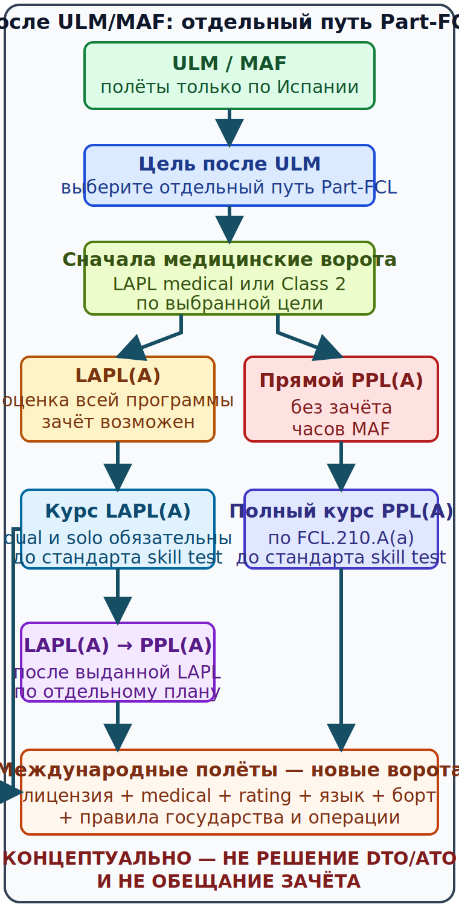

# Как выбрать [LAPL(A)][z08] или [PPL(A)][z13] после [ULM][z20]/[MAF][z10] {#choose-lapl-or-ppl}

## Назначение {#purpose}

Эта глава помогает выбрать следующий **отдельный** курс после испанской национальной лицензии [ULM][z20] с квалификационной отметкой [MAF][z10]. Слово «переподготовка» здесь означает новый путь [Part-FCL][z11], а не автоматическую конверсию документа. Эксплуатационный этап [ULM][z20] этого курса остаётся ограничен полётами только по Испании; для будущей европейской цели рассматриваются [LAPL(A)][z08] и [PPL(A)][z13].

Зачёт предыдущего опыта ([training credit][z19]; español: crédito por experiencia previa) и предварительная лётная оценка ([pre-entry flight assessment][z14]; español: evaluación de vuelo previa al ingreso) относятся только к тем элементам и условиям, которые прямо допускает действующее правило. Они не являются обещанием школы.

## Результаты обучения {#learning-outcomes}

После главы вы сможете:

- отделить испанские полномочия [ULM][z20]/[MAF][z10] от нового курса [Part-FCL][z11];
- сравнить правовой статус, самолёты, пассажиров, медицинские условия и поддержание полномочий [LAPL(A)][z08]/[PPL(A)][z13];
- объяснить, почему «дешевле по минимуму часов» не является достаточным критерием;
- выбрать прямой [PPL(A)][z13] либо этап [LAPL(A)][z08] на основании цели, а не рекламы;
- сформулировать вопросы [DTO][z05]/[ATO][z03] и авиационному медицинскому эксперту ([aeromedical examiner (AME)][z01]; español: médico examinador aéreo);
- записать решение вместе с допущениями, источниками и датой повторной проверки.

## Карта применимости {#applicability}

| Метка | Как использовать главу |
|---|---|
| [ULM — ОСНОВА][z20] | Сначала получить и безопасно использовать [ULM][z20]/[MAF][z10] в Испании, сохраняя отдельную лётную книжку. |
| [ULM — ОСОБО ВАЖНО][z20] | Национальный экзамен и налёт не превращаются сами по себе в [Part-FCL][z11] training или exam [credit][credit]. |
| [PART-FCL — ОБЩЕЕ][z11] | Оба следующих маршрута требуют применимой теоретической и лётной подготовки, медицинского свидетельства, экзаменов и проверки навыков. |
| [LAPL — ПЕРЕХОД][z08] | Возможен индивидуально определяемый [зачёт предыдущего опыта][credit] для документированного [MAF][z10] [PIC][z12] после полной оценки. |
| [PPL — РАСШИРЕНИЕ][z13] | Прямой курс планируется без зачёта часов [MAF][z10] при первоначальной выдаче. |
| [ИСПАНИЯ] | Школа, экзаменационная процедура, медицинские условия и заявление проверяются по текущим данным [AESA][z02]. |
| [БЕЗОПАСНОСТЬ] | Юридический минимум часов не гарантирует готовность к [skill test][z17] или самостоятельной эксплуатации. |
| [ПРОВЕРИТЬ ПЕРЕД ПОЛЁТОМ] | Лицензия, полномочия, rating, медицинское свидетельство, [recency][z15], язык, борт и операция проверяются совместно. |

## Теория {#theory}

### Две новые лицензии, а не конверсия [ULM][z20] {#norm-separate-part-fcl}

Испанская [ULM][z20]/[MAF][z10] регулируется национальным режимом. После получения [ULM][z20]/[MAF][z10] кандидат поступает в [DTO][z05] или [ATO][z03] на отдельное обучение [LAPL(A)][z08] либо [PPL(A)][z13]. Совпадение или общность предметов и учебной программы ([syllabus][z18]) помогает не учить физику дважды, но не создаёт юридический или экзаменационный зачёт национальной теории [ULM][z20].

[ULM][z20]/[MAF][z10] не становится [Part-FCL][z11] благодаря налёту, покупке самолёта или сдаче национального экзамена. Национальная [ULM][z20]-лицензия также не является автоматическим международным правом для полётов за пределами Испании, во Францию или Португалию. Курс не содержит зарубежной процедуры [ULM][z20]. Источники: `SRC-BOE-RD-765-2022`, `SRC-BOE-RD-182-2026`, `SRC-EASA-AIRCREW-2026` (проверено 13.07.2026).

### Контроль редакции 2026 года {#norm-source-date}

Используемая Easy Access Rules for Aircrew опубликована 24.02.2026 и включает применимые на контрольную дату изменения. Regulation (EU) 2026/781 в основной части применяется с 30.04.2028; его изменения требований LAPL/PPL относятся к вертолётам и на 13.07.2026 не изменяют перечисленные здесь правила [LAPL(A)][z08] или [PPL(A)][z13]. Это не повод игнорировать следующую редакцию: перед договором школу просят показать применяемую консолидацию. Источники: `SRC-EASA-AIRCREW-2026`, `SRC-EURLEX-2025-0134`, `SRC-EURLEX-2026-0781` (проверено 13.07.2026).

### Матрица выбора {#choice-matrix}

| Критерий | [LAPL(A)][z08] | [PPL(A)][z13] | Что проверить письменно |
|---|---|---|---|
| Правовой статус | Признаётся государствами — членами [EASA][z06], но не является лицензией стандарта Приложения 1 [ICAO][z07] (non-[ICAO][z07]). | [Part-FCL][z11] licence с [ICAO][z07]-compliant основой; фактическое использование всё равно зависит от rating, медицинского свидетельства, борта, государства и операции. | Нужные государства, регистрация самолёта и тип операции. |
| Базовые полномочия | [PIC][z12] без вознаграждения в применимых некоммерческих операциях. | [PIC][z12] или co-pilot без вознаграждения в применимых некоммерческих операциях. | Class/type rating и ограничения licence. |
| Самолёт и пассажиры | [LAPL(A)][z08]: [SEP][z16](land), [SEP][z16](sea) или [TMG][tmg] до 2 000 kg; максимум 3 пассажира и всего 4 человека на борту. | Пределы следуют из ratings, самолёта и операции, а не из такого общего лимита LAPL. | Фактический [SEP][z16]/[TMG][tmg] и варианты. |
| Первый пассажир | После выдачи [LAPL(A)][z08] нужны 10 часов [PIC][z12] до первой перевозки пассажиров; затем одновременно действует FCL.060 — пассажирская недавность за 90 дней. | Действует FCL.060 и применимые rating/operational gates. | Лётная книжка, даты, type/class. |
| Медицинское свидетельство | MED.A.030: минимум [медицинское свидетельство LAPL][z09] для LAPL. | MED.A.030: минимум [медицинское свидетельство Class 2][z04] для PPL. | Индивидуальные ограничения и срок. |
| Предыдущий [MAF][z10] [PIC][z12] | Возможен [credit][credit] только после полной оценки по FCL.110.A(c); потолок не равен обещанию. | [AESA][z02] не признаёт часы [MAF][z10] для первоначальной выдачи прямого [PPL(A)][z13]. | Решение [DTO][z05]/[ATO][z03] с нормативной ссылкой. |
| Поддержание | FCL.140.A использует скользящее ([rolling][rolling]) окно 2 лет и альтернативу proficiency check. | FCL.740.A для [SEP][z16]/[TMG][tmg] использует срок rating и продление, обычно в двухлетнем цикле. | Конкретные даты и выполненные события. |
| Дальнейший путь | Возможен отдельный [LAPL(A)][z08] → [PPL(A)][z13] по актуальному FCL.210.A(b). | Промежуточный переход не нужен. | Совокупные часы, упражнения и теория. |

Нормативная основа таблицы: FCL.100, FCL.105, FCL.105.A, FCL.140.A, FCL.200, FCL.205.A, FCL.740.A и MED.A.030. Источники: `SRC-EASA-AIRCREW-2026`, `SRC-EURLEX-1178-2011`, `SRC-EURLEX-2024-2076`, `SRC-AESA-RD182-FAQ-2026` (проверено 13.07.2026).

### Решение по цели, а не по одному числу {#decision-sequence}

1. **Опишите миссию.** Какие государства, самолёты, пассажиры и будущие ratings реально нужны в ближайшие годы?
2. **Проверьте географию.** [LAPL(A)][z08] работает в системе взаимного признания [EASA][z06], но non-[ICAO][z07]; [PPL(A)][z13] даёт [ICAO][z07]-compliant основу, а не универсальное разрешение «летать везде».
3. **Проверьте медицинские условия заранее.** Если PPL вероятен скоро, обсудите [Class 2][class-2] с [AME][ame] до крупных расходов. Результат медицинского освидетельствования не обещается курсом или школой.
4. **Получите две письменные сметы.** Для LAPL — только после [предварительной лётной оценки][assessment]; для прямого PPL — без вычитания часов [MAF][z10].
5. **Сравните не только часы.** Включите теорию, экзамены, самолёт, инструктора, посадочные сборы, examiner, дополнительные часы до стандарта, язык и документы.
6. **Проверьте дальнейшее поддержание.** Учтите пассажирские ворота, [recency][z15]/rating и стоимость реального доступа к борту.
7. **Назначьте дату пересмотра.** Любая смена цели, медицинского статуса, редакции нормы или предложения школы запускает решение заново.

### SCN-TRANS-01 — Выбор при цели «Португалия позже» {#scn-trans-01}

**Исходные данные:** пилот только завершил [ULM][z20]/[MAF][z10], летает в Испании и предполагает через два года арендовать [SEP][z16] для поездок по государствам [EASA][z06]; конкретного самолёта и [Class 2][class-2] ещё нет.

**Ошибочный короткий вывод:** курс не описывает международную эксплуатацию [ULM][z20], поэтому неверны оба сокращения: «LAPL дешевле, значит он автоматически достаточен» и «PPL разрешает любой международный полёт».

**Рабочее решение:** получить консультацию [AME][ame], описать географию/самолёт/пассажиров, запросить у [DTO][z05]/[ATO][z03] две сопоставимые письменные программы и проверить требования будущей операции. Если PPL нужен в коротком горизонте и [Class 2][class-2] реалистичен, прямой PPL может исключить промежуточную административную ступень. Если текущая цель укладывается в LAPL и индивидуальный [credit][credit] полезен, LAPL может быть самостоятельной конечной лицензией с опциональным дальнейшим переходом.

**Стоп-условие:** не подписывать договор, пока школа не отделила нормативный минимум от фактической подготовки до стандарта и не указала, что включено в цену.

Источники решения: `SRC-EASA-AIRCREW-2026`, `SRC-EURLEX-2024-2076`, `SRC-AESA-RD182-FAQ-2026` (проверено 13.07.2026).

## Применение к [ULM][z20]/[MAF][z10] {#ulm-application}

Текущая эксплуатационная цель [ULM][z20]/[MAF][z10] в этом курсе — Испания. До начала [Part-FCL][z11] этапа сохраняйте оригинальную [ULM][z20]-лицензию, [MAF][z10], медицинское свидетельство и отдельную лётную книжку с точными ролями [PIC][z12]/[dual][dual]/solo. Не переписывайте [ULM][z20]-время как [Part-FCL][z11] training. Эта глава не описывает международный полёт [ULM][z20].

## Расширение [Part-FCL][z11] {#part-fcl-extension}

После выбора откройте только свою ветвь:

- для первого европейского шага после [ULM][z20]/[MAF][z10] — [маршрут к лицензии](02-ulm-to-lapl.md) [LAPL(A)][z08];
- для прямой цели после [ULM][z20]/[MAF][z10] — [прямой маршрут](03-ulm-to-ppl.md) к [PPL(A)][z13];
- только после фактической выдачи [LAPL(A)][z08] — [отдельное дополнение](04-lapl-to-ppl.md) до [PPL(A)][z13].

Затем для выбранной ветви пройдите [общие медицинские и экзаменационные ворота, включая проверку практических навыков](05-medical-exams-skill-test.md), и заполните [чек-лист предложения](06-dto-ato-pre-entry-checklist.md) [DTO][z05]/[ATO][z03]. Главы 02 и 03 — альтернативы, а не последовательные ступени. Общая теоретическая база курса остаётся полезной для обоих путей, но рекомендация школы, экзамен [AESA][z02] и учебные записи оформляются по выбранному процессу.

## Безопасность {#safety}

- Не выбирайте лицензию только по рекламному минимуму часов.
- Не откладывайте медицинское освидетельствование до момента большого невозвратного платежа.
- Не путайте законное полномочие с готовностью на новом [SEP][z16], аэродроме или в новом пространстве.
- Не считайте [ICAO][z07]-compliant основу PPL универсальным разрешением государства или владельца самолёта.
- Не используйте LAPL как «обязательную ступень»: это самостоятельная лицензия и один из вариантов.

## Типичные ошибки {#common-errors}

1. Принять национальную лицензию за европейскую: [ULM][z20] не конвертируется в [Part-FCL][z11].
2. Считать максимально возможный [credit][credit] гарантированным сокращением цены.
3. Вычесть [MAF][z10] hours из прямых 45 часов PPL.
4. Считать LAPL недействительной в [EASA][z06] Member States из-за non-[ICAO][z07] статуса.
5. Считать PPL достаточным для любой операции без проверки rating, медицинского свидетельства, борта и применимых правил.
6. Смешать [rolling][rolling] [recency][z15] LAPL и expiry/revalidation [SEP][z16] при PPL.

## Итог {#summary}

[LAPL(A)][z08] и [PPL(A)][z13] — два самостоятельных [Part-FCL][z11] результата после испанского [ULM][z20]/[MAF][z10]. LAPL может использовать индивидуально оценённый [зачёт предыдущего опыта][credit] для документированного [MAF][z10] [PIC][z12] и имеет ограничения по самолёту/пассажирам; прямой PPL планируется без зачёта [MAF][z10] и создаёт более широкую [ICAO][z07]-compliant основу. Выбор делается по миссии, медицинским условиям, полной письменной стоимости и дальнейшему поддержанию полномочий.

## Контрольные вопросы {#review-questions}

### Q-TRANS-001 — Как корректно описать правовой переход после испанской [ULM][z20]/[MAF][z10]? {#q-trans-001}

A. Автоматическая замена [ULM][z20] на LAPL после накопления часов. 
B. Международное расширение национальной лицензии без новой подготовки. 
C. Автоматическая выдача PPL после теории [ULM][z20]. 
D. Поступление на отдельный курс [Part-FCL][z11] [LAPL(A)][z08] или [PPL(A)][z13] с применением только прямо предусмотренного [credit][credit]. 

**Правильный ответ:** D.

**Почему:** новый документ требует собственного [Part-FCL][z11] процесса; прошлый опыт учитывается лишь по конкретной норме.

**Почему главный отвлекающий вариант неверен:** A подменяет индивидуальный [credit][credit] конверсией лицензии.

**Опора в теории:** [Две новые лицензии, а не национальная конверсия](#norm-separate-part-fcl).

**Источник:** `SRC-BOE-RD-765-2022`, `SRC-EASA-AIRCREW-2026`.

### Q-TRANS-002 — Какие два пассажирских условия должен различать новый обладатель [LAPL(A)][z08]? {#q-trans-002}

A. Только согласие владельца самолёта и топливный план. 
B. Только действующее медицинское свидетельство без проверки полётов. 
C. Только общий предел четырёх человек на борту. 
D. Первые 10 часов [PIC][z12] после выдачи до перевозки пассажиров и общее условие FCL.060 за 90 дней.

**Правильный ответ:** D.

**Почему:** специальный первоначальный барьер LAPL и общее passenger-[recency][z15] условие действуют совместно.

**Почему главный отвлекающий вариант неверен:** C учитывает только предел четырёх человек на борту, но не доказывает 10 часов [PIC][z12] после выдачи и условие FCL.060 за 90 дней.

**Опора в теории:** [Матрица выбора](#choice-matrix).

**Источник:** `SRC-EASA-AIRCREW-2026` — FCL.105.A(b), FCL.060.

### Q-TRANS-003 — Когда прямой [PPL(A)][z13] заслуживает отдельного расчёта вместо промежуточной [LAPL(A)][z08]? {#q-trans-003}

A. Когда близкая цель уже требует PPL-базы, [Class 2][class-2] реалистичен и школа даёт полную сопоставимую программу. 
B. Всегда, потому что PPL автоматически разрешает любой самолёт. 
C. Только если часы [MAF][z10] вычитаются из 45 часов. 
D. Когда медицинское свидетельство планируется получить после [skill test][z17].

**Правильный ответ:** A.

**Почему:** короткий горизонт PPL может сделать промежуточный этап невыгодным, но решение требует проверки медицинских условий, ratings и стоимости.

**Почему главный отвлекающий вариант неверен:** C противоречит позиции [AESA][z02] об initial PPL [credit][credit] часов [MAF][z10].

**Опора в теории:** [Решение по цели, а не по одному числу](#decision-sequence).

**Источник:** `SRC-AESA-RD182-FAQ-2026`, `SRC-EASA-AIRCREW-2026`.

### Q-TRANS-004 — Почему максимальные 15 часов LAPL-credit нельзя использовать как готовую цену курса? {#q-trans-004}

A. Потому что [credit][credit] запрещён для любого Annex I aircraft. 
B. Потому что часы [PIC][z12] не записываются в лётную книжку. 
C. Потому что [DTO][z05]/[ATO][z03] всегда обязана дать нулевой [credit][credit]. 
D. Потому что это только нормативный потолок; фактическое решение следует после полной оценки и не отменяет обязательные подпункты.

**Правильный ответ:** D.

**Почему:** потолок ограничивает решение организации, но не предсказывает компетентность, остаток упражнений или дополнительные часы до стандарта.

**Почему главный отвлекающий вариант неверен:** A игнорирует прямое условие FCL.110.A(c) для соответствующей категории.

**Опора в теории:** [Матрица выбора](#choice-matrix).

**Источник:** `SRC-EURLEX-2024-2076` — FCL.110.A(c).

### Q-TRANS-005 — Какое медицинское свидетельство разумно обсудить до крупных расходов, если PPL нужен вскоре после LAPL? {#q-trans-005}

A. Только национальный документ [ULM][z20], потому что он автоматически становится [Class 2][class-2]. 
B. Медицинское свидетельство только после выдачи PPL.
C. Любой сертификат клуба без срока. 
D. [Class 2][class-2] с актуальным [AME][ame], поскольку [LAPL medical][lapl-medical] сам по себе не позволяет использовать PPL privileges. 

**Правильный ответ:** D.

**Почему:** MED.A.030 разделяет минимальные медицинские требования для LAPL и PPL; ранняя консультация уменьшает финансовую неопределённость.

**Почему главный отвлекающий вариант неверен:** A придумывает автоматическое преобразование национального документа.

**Опора в теории:** [Решение по цели, а не по одному числу](#decision-sequence).

**Источник:** `SRC-EASA-AIRCREW-2026`, `SRC-EURLEX-2025-0134` — MED.A.030.

### Q-TRANS-006 — Какое различие поддержания полномочий должно попасть в долгосрочный бюджет? {#q-trans-006}

A. LAPL использует rolling-условия FCL.140.A, а PPL с [SEP][z16]/[TMG][tmg] — expiry/revalidation режима FCL.740.A. 
B. Обе лицензии поддерживаются только оплатой ежегодного сбора. 
C. LAPL всегда имеет двухлетний class rating [SEP][z16]. 
D. PPL не требует поддерживать class rating.

**Правильный ответ:** A.

**Почему:** механизмы и контрольные даты различаются, поэтому одинаковая запись «12 часов» не означает одинаковую систему.

**Почему главный отвлекающий вариант неверен:** C переносит режим class-rating PPL на [rolling][rolling] privileges LAPL.

**Опора в теории:** [Матрица выбора](#choice-matrix).

**Источник:** `SRC-EURLEX-2024-2076` — FCL.140.A, FCL.740.A.

## Источники {#sources}

- `SRC-EASA-AIRCREW-2026`, `SRC-EURLEX-1178-2011` — статус, privileges, training, медицинские условия, passengers и maintaining privileges.
- `SRC-EURLEX-2024-2076` — актуальные FCL.110.A, FCL.140.A, FCL.210.A и FCL.740.A.
- `SRC-EURLEX-2025-0134` — применимые с 18.02.2026 изменения Aircrew/[Part-MED][part-med].
- `SRC-EURLEX-2026-0781` — контроль будущей поправки и её неприменимость к текущим airplane-требованиям этой главы.
- `SRC-BOE-RD-765-2022`, `SRC-BOE-RD-182-2026` — национальная граница [ULM][z20] и действующая испанская редакция.
- `SRC-AESA-RD182-FAQ-2026` — позиция [AESA][z02] по часам [MAF][z10] для LAPL, но не initial PPL.

Нормативные утверждения проверены 13.07.2026; перед договором и полётом используйте текущие официальные редакции.

[credit]: ../reference/glossary.md#term-training-credit
[assessment]: ../reference/glossary.md#term-pre-entry-flight-assessment
[dual]: ../reference/glossary.md#term-dual-flight-instruction
[rolling]: ../reference/glossary.md#term-recency
[tmg]: ../reference/glossary.md#term-tmg
[lapl-medical]: ../reference/glossary.md#term-lapl-medical-certificate
[class-2]: ../reference/glossary.md#term-class-2-medical-certificate
[part-med]: ../reference/glossary.md#term-part-med
[ame]: ../reference/glossary.md#term-aeromedical-examiner-ame

[z01]: ../reference/glossary.md#term-aeromedical-examiner-ame
[z02]: ../reference/glossary.md#term-aesa
[z03]: ../reference/glossary.md#term-ato
[z04]: ../reference/glossary.md#term-class-2-medical-certificate
[z05]: ../reference/glossary.md#term-dto
[z06]: ../reference/glossary.md#term-easa
[z07]: ../reference/glossary.md#term-icao
[z08]: ../reference/glossary.md#term-lapl-a
[z09]: ../reference/glossary.md#term-lapl-medical-certificate
[z10]: ../reference/glossary.md#term-maf
[z11]: ../reference/glossary.md#term-part-fcl
[z12]: ../reference/glossary.md#term-pic
[z13]: ../reference/glossary.md#term-ppl-a
[z14]: ../reference/glossary.md#term-pre-entry-flight-assessment
[z15]: ../reference/glossary.md#term-recency
[z16]: ../reference/glossary.md#term-sep
[z17]: ../reference/glossary.md#term-skill-test
[z18]: ../reference/glossary.md#term-syllabus
[z19]: ../reference/glossary.md#term-training-credit
[z20]: ../reference/glossary.md#term-ulm
